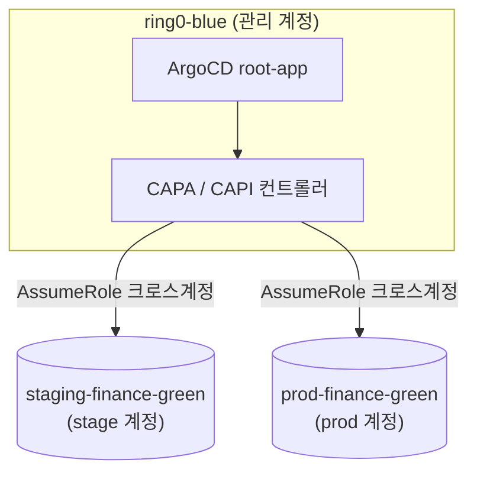

# 배경 — 왜 CAPI in-place를 버리고 blue-green인가

이 페이지는 finance EKS 클러스터가 원래 어떻게 관리되도록 설계됐는지, 그리고 그 설계가 왜 조사 시점(2026-07)에는 이미 반쯤 무너져 있었는지를 다룬다. 최초 계획은 CAPI GitOps in-place 업그레이드였으나 조사 과정에서 진단이 두 번 뒤집혔고, 최종적으로 **신규 blue 클러스터를 Terraform으로 생성하는 blue-green**으로 방향이 굳었다. [랜딩]()이 요약한 이 전환의 근거를 네 포인트로 풀어낸다.


**한눈에**
- 원래는 허브(ring0-blue)의 CAPA가 크로스계정으로 워크로드 클러스터를 reconcile하고, 버전 SSOT는 CAPI 스펙(`clusterapi.yaml`의 `k8sVersion`)이었다.
- 그러나 **CAPA는 2025-10-21부터 죽어 있었다** — 워크로드 계정의 크로스계정 롤이 삭제돼 `AssumeRole`이 실패하고 있었다.
- 롤을 되살려도 CAPA v2.6.1은 addon의 **config-only 변경을 반영하지 않아**(공개 이슈 #4226) addon SSOT로 부적합했다.
- 결론: 어차피 카펜터 포함 전 컴포넌트를 대점프해야 하므로, in-place 대신 **신규 blue를 Terraform으로** 짓는다.


## 기존 구조 — 허브-스포크 GitOps + CAPI

finance EKS는 관리(hub) 클러스터 1개와 워크로드(spoke) 클러스터 2개로 구성된 허브-스포크 구조다. 허브인 **ring0-blue**에서 ArgoCD와 CAPA(Cluster API Provider AWS) 컨트롤러가 함께 돌며, ArgoCD의 `ApplicationSet`이 CAPI 커스텀 리소스를 생성하고 CAPA가 그 스펙을 워크로드 계정의 EKS 클러스터로 reconcile한다. 세 클러스터는 각각 별도 AWS 계정(관리·stage·prod)에 있고, 이 3계정 분리가 아키텍처의 보안 경계다.

즉 버전 변경의 "정상 경로"는 항상 **ring0의 YAML 수정 → ArgoCD sync → CAPA가 AssumeRole해 워크로드 계정에 반영**이라는 크로스계정 경로를 거치도록 설계돼 있었고, 클러스터 버전의 SSOT는 CAPI 스펙이었다. ArgoCD 3-tier 부트스트랩 체인과 3레포 구조의 상세는 [부트스트랩]()이 이어받는다.

## 문제 — CAPA가 2025-10-21부터 죽어 있었다

`clusterapi.yaml`의 `k8sVersion`을 bump해 in-place 업그레이드를 시도하려던 시점에, 실측 진단으로 **CAPA가 이미 죽어 있다**는 사실이 드러났다. CAPA가 워크로드 계정을 조작하려면 각 계정에 크로스계정 신뢰 관계를 가진 IAM 롤(`controllers.cluster-api-provider-aws.sigs.k8s.io`, clusterawsadm 표준 롤명)이 있어야 하는데, stage·prod 양쪽 모두 이 롤이 삭제돼 있었다(`iam get-role` → `NoSuchEntity`). 그 결과 CAPA 컨트롤러 로그에는 `sts:AssumeRole AccessDenied`가 반복됐고, Cluster 리소스의 condition은 양쪽 다 `Ready=False (VpcReconciliationFailed)`, 마지막 전환 시각이 **2025-10-21**에 멈춰 있었다.

이 롤은 IaC로 관리된 적이 없어(clusterawsadm이 최초 생성한 CloudFormation 산물이라 레포에 흔적이 없다) 코드 이력만으로는 소실 경위를 알 수 없었고, 진단은 한동안 "복구 불가능한 장애"와 "복구 가능한 장애" 사이를 오갔다. 결국 롤을 재생성하자 reconcile 자체는 정상 재개됐다 — 즉 **CAPA 사망은 복구 가능한 장애였다.** "CAPA가 고장 나서 blue-green으로 갔다"는 단순화는 틀렸고, 진짜 문제는 그다음 단계에서 드러났다.

## 구조적 결함 — config는 CAPA를 못 넘는다

롤을 되살려 reconcile을 재개한 뒤에도 남는 문제가 있었다. CAPA v2.6.1의 addon 비교 로직(`EKSAddon.IsEqual()`)은 **버전 문자열·SA 롤 ARN·태그만 비교**하고 **`Configuration`(addon 세부 설정값)은 비교하지 않는다**(공개 이슈 #4226). 그 결과 addon 버전을 그대로 둔 채 설정값만 바꾼 변경은 CAPA가 절대 반영하지 않는다 — `clusterapi.yaml`을 아무리 고쳐도 UpdateAddon 호출 자체가 나가지 않는다.

여기에 "Synced 착시"가 겹친다. `clusterapi` ApplicationSet은 ring0 in-cluster의 CAPI 커스텀 리소스만 갱신하고 실제 EKS 반영은 CAPA의 크로스계정 호출에 위임돼 있어서, 롤이 죽어 있던 기간에도 ArgoCD 화면에는 **Synced로 보였지만 실제 클러스터에는 아무 변경도 가지 않았다.** 두 함정을 합치면 결론은 하나다 — **CAPA v2.6.1은 addon 설정의 SSOT로 쓰기에 구조적으로 부적합하다.** 클러스터 버전 자체는 CAPA가 문제없이 처리하지만, 버전과 함께 계속 바뀌어야 하는 addon 세부 설정을 맡기면 "config-only 무시"와 "Synced 착시"가 상시 운영 리스크로 남는다.

## 결정 — 신규 blue를 Terraform으로

CAPI 복구는 "해결"이 아니라 "새로운 종류의 리스크로 갈아탄 것"이었다. 롤은 되살아났지만 addon config 변경마다 수동 개입과 git-라이브 동기화 확인이 필요하다는 운영 부담이 그대로 남았다. 여기에 별도로, 카펜터 컨트롤러(0.36.2)가 EKS 1.33+에서 더는 공식 지원되지 않아 이번 업그레이드는 어차피 카펜터를 포함한 거의 모든 컴포넌트를 큰 폭으로 올려야 하는 대규모 마이그레이션이 될 참이었다.

판단은 이렇다 — **어차피 전 컴포넌트를 대점프해야 한다면, green을 in-place로 조금씩 고치는 대신 신규 blue 클러스터를 깨끗하게 짓는 편이 낫다.** 그리고 그 클러스터는 CAPA가 아니라 **Terraform으로 생성**해 addon config SSOT 문제를 CAPA 밖으로 완전히 들어낸다. 목표 버전 판정은 [01 목표버전](), Fargate+karpenter 토폴로지와 Terraform 리소스는 [02 클러스터 설정](), 부트스트랩 순서는 [04 부트스트랩]()이 이어받는다.
