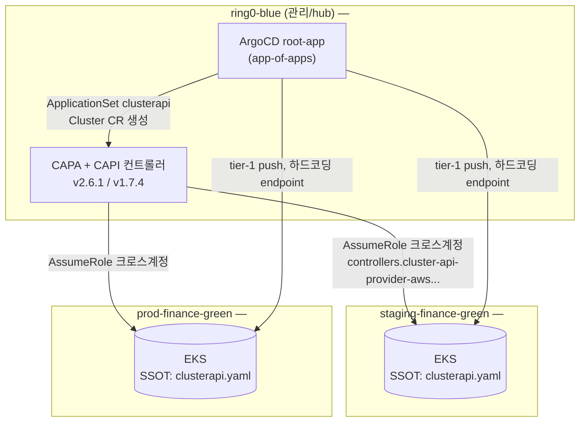

# 아키텍처와 CAPI 진단 — 허브-스포크, 3레포, 그리고 죽어 있던 컨트롤러

이 페이지는 finance EKS 클러스터가 원래 어떻게 관리되도록 설계됐는지, 그리고 그 설계가 왜 조사 시점(2026-07)에는 이미 반쯤 무너져 있었는지를 다룬다. [_index]()가 요약한 3단계 변천 서사 중 **1기(CAPI in-place 시도)가 왜 좌초했고 2기(CAPI 복구)가 왜 근본 해법이 못 됐는지**를 실측 증거로 풀어낸다. 결론부터 말하면, 이 페이지의 진단이 3기(blue-green Terraform, )의 직접적인 근거다.


**한눈에**
- ring0-blue(허브 클러스터)가 **Cluster API(CAPA)** 로 워크로드 클러스터를 생성·관리하고, **ArgoCD app-of-apps**가 전 구성을 GitOps 배포한다. 클러스터 버전의 SSOT는 `finance-yo-charts`의 `clusterapi.yaml` `k8sVersion`이다 `✓`.
- **CAPA는 2025-10-21부터 죽어 있었다** — 워크로드 계정의 크로스계정 컨트롤러 롤이 삭제돼 `AssumeRole`이 실패하고, 모든 reconcile이 초기 단계에서 멈춰 있었다 `✓`.
- CAPA v2.6.1은 addon의 **config-only 변경을 영원히 반영하지 않는다**(버전 문자열만 비교하고 설정값은 비교 안 함, 공개 이슈 #4226) → addon 설정의 SSOT로 부적합하다 `✓`.
- ArgoCD는 워크로드 클러스터가 아니라 **ring0의 CAPI 커스텀 리소스만 갱신**하므로, 실제로는 아무것도 반영되지 않은 변경이 대시보드에는 **Synced로 착시**된다 `✓`.


## 1. 허브-스포크 아키텍처 — GitOps(ArgoCD) + Cluster API(CAPA)

finance EKS는 관리(hub) 클러스터 1개와 워크로드(spoke) 클러스터 2개로 구성된 허브-스포크 구조다. 허브인 **ring0-blue**에서 ArgoCD와 CAPA(Cluster API Provider AWS) 컨트롤러가 함께 돌며, ArgoCD의 `ApplicationSet`이 CAPI 커스텀 리소스를 생성하고 CAPA가 그 스펙을 실제 AWS 계정에 있는 EKS 클러스터로 reconcile한다. 즉 **버전 변경은 항상 "ring0의 YAML 수정 → ArgoCD sync → CAPA가 AssumeRole해서 워크로드 계정에 반영"이라는 크로스계정 경로를 거치도록 설계돼 있다.**



세 클러스터는 각각 별도 AWS 계정에 있다 — 관리(management), stage, prod 3계정 분리가 이 아키텍처의 보안 경계다. 계정 ID·VPC ID 자체는 지식 가치가 없으므로 마스킹하고, 분리 구조만 남긴다.

| 클러스터 | 역할 | 계정 | k8s 버전(조사 시점) |
|---|---|---|---|
| ring0-blue | 관리(hub) — CAPA+ArgoCD 구동 | `<mgmt-account>` | v1.33.12 (2025-12-18 in-place 완료) |
| staging-finance-green | 워크로드(stage) | `<stage-account>` | v1.30.14 |
| prod-finance-green | 워크로드(prod) | `<prod-account>` | v1.30.14(추정, 레포와 동일) |

CAPA가 워크로드 계정의 리소스를 조작하려면 각 워크로드 계정에 **크로스계정 신뢰 관계를 가진 IAM 롤** `controllers.cluster-api-provider-aws.sigs.k8s.io`(clusterawsadm 표준 롤명, CAPA 공개 규약)가 있어야 하고, ring0의 CAPA가 이 롤을 `sts:AssumeRole`한다. 이 롤이 §4에서 다루는 사고의 핵심이다.

## 2. ArgoCD 3-tier 부트스트랩 체인

전 구성은 ArgoCD의 `root-app`(app-of-apps)에서 시작해 3단계로 부채살처럼 퍼진다.

```
root-app (Application, platform/platform)
├── clusterapi (ApplicationSet)         → CAPI Cluster 리소스 생성 (ring0, ns clusters-{env})
├── cluster-bootstrap (App + AppSet)    → ring0 + 워크로드 공통 플랫폼 컴포넌트
├── argocd (ApplicationSet)             → 각 워크로드 클러스터에 argocd(spoke) 설치
├── app-root (ApplicationSet)           → root-chain-{env} → platform/{env}
│      └── root-{env}                  → datadog/victoria-metrics/service/…
├── karpenter / keda / istio / keycloak / node-local-dns / actions-runner …
```

이 체인은 **"어디서 reconcile되는가"** 기준으로 3계층으로 나뉜다.

- **tier-1(허브 push)**: ring0의 ArgoCD가 워크로드 클러스터의 API 엔드포인트를 **하드코딩한 destination**으로 직접 push한다. `cluster-bootstrap-v2`·`karpenter-v2`·`argocd(spoke)`·`node-local-dns` 등이 여기 속한다. 클러스터를 재생성하면 이 하드코딩된 엔드포인트를 전부 갱신해야 한다(에서 8파일 19곳을 다룬다).
- **tier-2**: `app-root` ApplicationSet이 워크로드 클러스터 안에 `root-{env}` 앱을 심어 tier-3로 넘긴다.
- **tier-3(워크로드 로컬)**: 워크로드 클러스터 자신의 ArgoCD가 `kubernetes.default.svc`(in-cluster)로 reconcile한다. datadog·descheduler·victoria-metrics 스택 등 대부분의 관측성 컴포넌트가 여기 속한다.

**클러스터 버전(CAPI Cluster 리소스)만은 이 체인에서 예외적으로 취급된다.** `clusterapi` ApplicationSet은 워크로드 클러스터가 아니라 **ring0 in-cluster에 CAPI 커스텀 리소스를 갱신**할 뿐이고, 실제 EKS 변경은 CAPA 컨트롤러가 별도로 수행하는 크로스계정 API 호출이다. 이 한 단계 차이가 §5의 "Synced 착시"를 만든다.

## 3. 3레포 역할과 버전 SSOT

구성 코드는 3개 레포에 나뉘어 있고, 역할이 명확히 분리돼 있다.

| 레포 | 역할 | 버전 업그레이드 관점 |
|---|---|---|
| `sre-finance-terraform` | AWS 리소스(IAM/IRSA/VPC/RDS/LB/backup) 관리, 클러스터 레지스트리 정의 | 클러스터 생성 모듈(`modules/clusters/eks`)은 **호출처가 없는 dead code** — 실제로는 주변 리소스만 관리한다 |
| `finance-yoboard-charts` | ArgoCD 매니페스트(app-of-apps 전체) | control plane 버전은 정의하지 않는다. 대신 워크로드 클러스터 endpoint가 **8파일 19곳에 하드코딩**돼 있다 |
| `finance-yo-charts` | Helm values 소스 | ⭐ **`platform/values/{prod,stage}/clusterapi.yaml`의 `k8sVersion`이 클러스터 버전의 SSOT** |

즉 워크로드 클러스터를 업그레이드하는 "정상 경로"는 `finance-yo-charts`의 `clusterapi.yaml`을 고치고 ArgoCD sync를 트리거하는 것뿐이다. 이 경로가 실제로는 작동하지 않고 있었다는 게 §4의 발견이다.

## 4. CAPA 단절 진단 — 2025-10-21부터 죽어 있었다

1기(2026-07-01~02)에서 `clusterapi.yaml`의 `k8sVersion`을 bump해 1.30→1.33 in-place 업그레이드를 시도하려던 시점에, 실측 진단으로 CAPA가 이미 죽어 있다는 사실이 드러났다. 증거 체인은 다음과 같다.

1. ring0의 CAPI는 stage/prod 워크로드 클러스터 2개를 관리 대상으로 갖고 있다(Cluster 리소스 존재 확인).
2. 그러나 **CAPA가 assume해야 할 stage·prod 계정의 `controllers.cluster-api-provider-aws.sigs.k8s.io` 롤이 양쪽 모두 존재하지 않았다**(`iam get-role` → `NoSuchEntity`).
3. CAPA 컨트롤러 로그에는 두 계정 모두 `sts:AssumeRole AccessDenied`가 반복되고 있었다.
4. Cluster 리소스의 condition은 양쪽 다 **`Ready=False (VpcReconciliationFailed)`**, 마지막 전환 시각이 **2025-10-21**이었다.
5. 노드그룹은 이미 CAPI 스펙 밖(콘솔)에서 교체돼 있었다 — 실제 노드그룹 이름이 CAPI 스펙에 정의된 이름과 달랐다. control plane 버전이 스펙과 일치했던 것도 CAPI가 실제로 관리해서가 아니라, 클러스터 생성 이후 CAPI 경로로 업그레이드를 시도한 적 자체가 없었기 때문이다.

당시(2026-07-02)로서는 롤이 언제 왜 사라졌는지 확정할 수 없었다. 코드 이력을 전수 조사해도 이 롤이 Infrastructure-as-Code로 관리된 적이 없다는 것만 확인됐다 — clusterawsadm이 최초 생성한 CloudFormation 스택 산물이라 레포에 흔적이 없었다.

닷새 뒤(2기, 2026-07-07) 보안팀 로그 아카이브를 대조해 경위가 확정됐다: **롤은 2025-10-21 콘솔에서 수동으로 삭제**됐다. 추정 동기는 콘솔로 직접 설치한 CloudWatch observability addon을 CAPA가 스펙에 없다는 이유로 계속 삭제하려 들자, 담당자가 CAPA의 개입 자체를 막으려고 연결 고리인 롤을 지운 것으로 보인다(원본 CloudFormation 스택과 정책은 살아 있었다) `≈`. 이 경위가 확정되면서 방향이 "복구 불가능한 장애"에서 "복구 가능한 장애"로 바뀌었고, 실제로 롤을 재생성하는 작업이 진행됐다.

## 5. CAPA v2.6.1의 함정 — config는 절대 안 밀린다

롤을 재생성해 CAPA reconcile을 되살린 뒤에도 완전히 해결되지 않는 문제가 하나 더 있었다. CAPA v2.6.1의 addon 비교 로직 `EKSAddon.IsEqual()`은 **버전 문자열과 서비스어카운트 롤 ARN, 태그만 비교**하고 **`Configuration`(addon 세부 설정값)은 비교하지 않는다**(공개 이슈 GitHub #4226). 그 결과:

- **addon 버전을 그대로 두고 설정값만 바꾼 변경은 CAPA가 절대 반영하지 않는다.** `clusterapi.yaml`을 아무리 정확히 고쳐도 UpdateAddon 호출 자체가 나가지 않는다.
- 설정값은 **버전이 함께 바뀔 때만** CAPA가 같이 실어 보낸다. 즉 config-only 변경을 반영하려면 `aws eks update-addon`을 수동으로 호출하는 수밖에 없다.
- 역설적으로 이 결함 덕분에, 수동으로 넣은 config를 CAPA가 되돌리는 일은 없다(버전이 그대로면). 하지만 다음 버전업이 CAPA를 거쳐 나가는 순간 `clusterapi.yaml`의 config로 덮어써지므로, **git의 값과 실제 라이브 값을 항상 동기화해 둬야 한다**는 운영 부담이 남는다.
- CAPA의 reconcile 순서(Network → SecurityGroup → ControlPlane[IAM롤→클러스터버전→**addon**→OIDC] → CNI → kube-proxy → **IAMAuthenticator(aws-auth)**)에서 addon 갱신은 워크로드 API 인증(aws-auth)보다 앞선 단계다. 즉 **`Ready` 조건이 `False`여도 addon·버전 변경 자체는 반영될 수 있다** — `Ready`와 addon reconcile은 서로 독립적이다.

여기에 §2에서 짚은 **"Synced 착시"**가 겹친다. `clusterapi` ApplicationSet은 ring0 in-cluster의 CAPI 커스텀 리소스만 갱신하고, 실제 EKS 반영은 CAPA의 크로스계정 호출에 위임돼 있다. 롤이 죽어 있던 기간에는 ArgoCD 화면에서 `clusterapi-stage` 앱이 **Synced로 보였지만, 실제 EKS 클러스터에는 아무 변경도 가지 않고 있었다.** CAPA가 정상화된 뒤에도 이 착시 자체는 구조적으로 남는다 — CAPI 경로로는 "git이 실제 상태와 같다"는 확신을 ArgoCD 화면만으로 얻을 수 없고, `describe-addon` 같은 EKS 쪽 실측이 항상 필요하다.

이 두 함정을 합치면 결론은 하나다. **CAPA v2.6.1은 addon 설정의 SSOT로 쓰기에 구조적으로 부적합하다.** 클러스터 버전 자체는 CAPA가 문제없이 처리하지만, 그 버전과 함께 계속 바뀌어야 하는 addon 세부 설정을 CAPA에 맡기면 "config-only 변경 무시"와 "Synced 착시"가 상시적인 운영 리스크로 남는다.

## 6. 그래서 왜 blue-green Terraform인가

§4·§5를 종합하면 CAPI 복구가 "해결"이 아니라 "새로운 종류의 리스크로 갈아탄 것"이었다는 게 드러난다. 롤을 재생성해 reconcile은 되살아났지만, addon config 변경마다 수동 개입과 git-라이브 동기화 확인이 필요하다는 운영 부담은 그대로 남았다. 여기에 별도로, 카펜터 컨트롤러(0.36.2)가 EKS 1.33 이상 버전에서 더는 공식 지원되지 않아 이번 업그레이드 자체가 어차피 대규모 마이그레이션이 될 참이었다.

3기의 판단은 이렇다 — **어차피 카펜터를 포함해 거의 모든 컴포넌트를 큰 폭으로 올려야 한다면, 기존 green을 in-place로 조금씩 고치는 대신 신규 blue 클러스터를 깨끗하게 만드는 편이 낫다.** 그리고 그 신규 클러스터는 CAPA가 아니라 **Terraform으로 생성**한다 — addon config의 SSOT 문제를 CAPA 밖으로 완전히 들어내는 선택이다. 흥미롭게도 §4의 사고 원인이었던 "죽어 있는 CAPA 롤"은 이 전환 국면에서 오히려 유용해진다: CAPA가 여전히 워크로드 계정을 조작할 수 없는 상태이므로, blue-green 이관 작업 중 실수로 CAPA가 기존 green 클러스터를 건드릴 위험 자체가 없다 — **롤을 굳이 복구하지 않고 두는 것이 green 오삭제 방지 안전판**이 된다.

목표 버전을 1.33에서 1.35로 다시 상향한 판단, Fargate+karpenter 토폴로지, Terraform 생성의 구체적 내용은 각각 ··에서 이어받는다.
