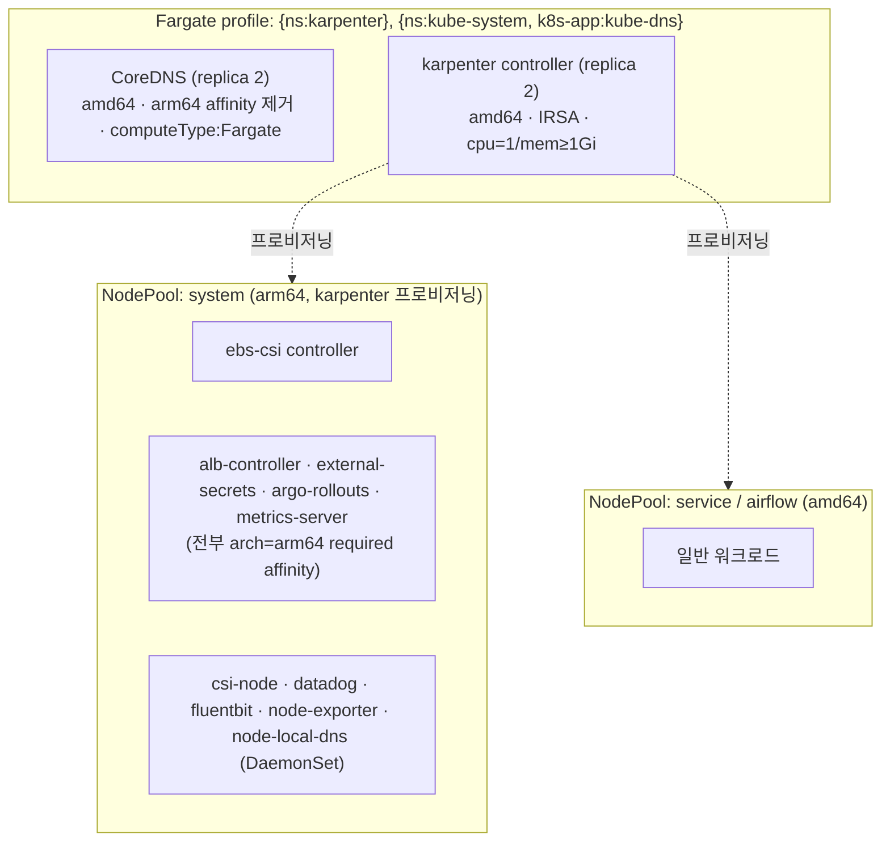

# 클러스터 설정 — Fargate+karpenter 토폴로지와 Terraform 리소스


**한눈에**
- **managed nodegroup은 0개.** Fargate가 **CoreDNS + karpenter 컨트롤러만** 호스팅하고, 나머지는 전부 **karpenter NodePool**(system 풀 포함)이 프로비저닝한다.
- Fargate 3제약이 토폴로지를 지배한다 — **amd64 전용 · DaemonSet 미부착 · 동적 EBS 불가.**
- Terraform 최대 리스크 둘: **OIDC 이중등록**(빠뜨리면 external-secrets 포함 cross-account IRSA 전체가 조용히 깨진다)과 **ebs-csi IRSA 롤**(스펙에 필드 자체가 없어 놓치기 쉽다).
- **karpenter 인프라 전체(IRSA·노드 롤·interruption·discovery 태그)는 이 레포에 전무**해 처음부터 짜야 한다.


이 페이지는 [배경]()의 결정과 [목표버전]() 1.35 위에서, 클러스터가 **무엇인가**(토폴로지 + Terraform 리소스)를 다룬다. "어떤 순서로 올리나"는 [04 부트스트랩]()이, EKS managed addon 버전·설정은 [03 managed addon]()이 이어받는다.

## 1. 목표 토폴로지

Karpenter를 Fargate 위에서 돌리는 것은 karpenter 공식 getting-started가 정식으로 제공하는 옵션("managedNodeGroups 대신 fargateProfiles 사용")이다. 이 프로젝트는 그 옵션 위에 CoreDNS까지 얹어 **managed nodegroup을 아예 두지 않는** 형태로 간다.



managed nodegroup이 없으므로 **첫 EC2 노드는 karpenter 자신이 만든다.** CoreDNS와 karpenter는 EC2 노드 없이 Fargate에서 뜰 수 있는 유일한 두 컴포넌트이고, 그 둘이 살아나야 나머지(ebs-csi·ALB controller·external-secrets 등)가 착지할 EC2 노드가 생긴다 — 이 "노드 없이 뜨는 2컴포넌트가 나머지의 착지장을 만든다"는 것이 토폴로지의 구조적 핵심이다. 단계별 부트스트랩 순서(닭-달걀 풀기)는 [04 부트스트랩]()이 다룬다. arm64 required affinity를 가진 플랫폼 컴포넌트는 arm64 풀이 system 하나뿐이라 전부 거기로 몰리므로, system 풀 사이징은 이 컴포넌트 총합을 수용해야 한다(§3).

## 2. Fargate 3대 물리 제약

EKS 공식 문서 기준 아래 세 가지가 설계 전체를 지배한다.

1. **amd64 전용(Arm 미지원).** CoreDNS·karpenter가 원래 갖고 있던 arm64 required nodeAffinity·toleration을 반드시 제거해야 한다. 지우지 않으면 Fargate 스케줄러가 배치를 시도조차 하지 않아 **영구 Pending**이 된다.
2. **DaemonSet 미지원.** Fargate는 파드 하나에 전용 micro-VM 하나를 붙이는 구조라 "노드" 개념이 없고, 노드 기반 DaemonSet이 존재할 자리가 없다. csi-node·datadog·fluentbit·node-exporter·node-local-dns·kube-proxy·aws-node 어느 것도 Fargate 파드에는 안 붙는다(§4).
3. **동적 EBS 마운트 불가.** EBS CSI 컨트롤러 자체는 Fargate에서 돌 수 있지만, 실제 볼륨을 붙이는 csi-node DaemonSet은 EC2 전용이다. 그래서 Fargate 파드는 동적 프로비저닝 EBS PV를 쓸 수 없다(EFS 정적 프로비저닝은 예외적으로 가능하나 finance는 EFS를 쓰지 않아 무관).

세 제약 모두 CoreDNS·karpenter에는 문제가 되지 않는다 — 둘 다 EBS가 불필요하고 arm64 고정만 풀면 amd64로 문제없이 뜬다. 제약이 실질적으로 부딪히는 지점은 **DaemonSet 공백**(§4)이다.

## 3. 컴포넌트 배치 매트릭스

배치처는 네 가지다 — **Fargate**(amd64 micro-VM), **system pool**(arm64 EC2), **workload pool**(amd64 EC2), **DaemonSet**(전 EC2 노드).

| 컴포넌트 | 배치처 | arch | 필요 조치 |
|---|---|---|---|
| **CoreDNS** | Fargate | amd64 | arm64/system-primary required affinity·toleration 전부 제거 + `computeType: Fargate` 추가 |
| **karpenter controller** | Fargate | amd64 | arm64 affinity·toleration 제거, IRSA 유지, `cpu=1/mem≥1Gi`로 리소스 상향 |
| **ebs-csi controller** | system pool | arm64 | nodegroup 셀렉터를 system 풀 라벨로 재타깃, `arch=arm64` toleration 유지 |
| **ebs-csi node(csi-node)** | DaemonSet(EC2 전용) | 노드 arch | 변경 없음 — Fargate에는 원천적으로 안 붙는다 |
| **metrics-server** | system pool | arm64 | 변경 불요 — arm64 유일 풀이 system이라 자동 착지 |
| **ALB controller** | system pool | arm64 | 자동 착지. 옛 nodegroup 셀렉터 toleration은 무해한 잔재라 정리 권장 |
| **external-secrets(+cert+webhook)** | system pool | arm64 | 변경 불요 |
| **argo-rollouts(+dashboard)** | system pool | arm64 | 변경 불요 |
| **datadog agent** | DaemonSet(EC2 전용) | 노드 arch | Fargate에는 안 붙는다(§4) |
| **fluentbit** | DaemonSet(EC2 전용) | 노드 arch | Fargate에는 안 붙는다(§4) |
| **node-exporter** | DaemonSet(EC2 전용) | 노드 arch | Fargate VM의 호스트 메트릭은 원천적으로 없다(§4) |
| **node-local-dns** | DaemonSet(EC2 전용) | 노드 arch | Fargate 파드에는 적용되지 않는다(§4) |
| **kube-proxy / aws-node** | DaemonSet | 노드 arch | Fargate 노드는 자체 VPC CNI 내장, kube-proxy 불요(정상) |
| **일반 워크로드** | workload pool | amd64 | service/airflow 풀 |

## 4. DaemonSet 공백과 대안

Fargate 파드(CoreDNS, karpenter)에는 노드 DaemonSet이 붙지 않으므로, 노드 기반 로그·메트릭 수집기가 이 두 파드를 놓친다.

| DaemonSet | Fargate 공백 | 대안 |
|---|---|---|
| **fluentbit**(컨테이너 로그) | CoreDNS/karpenter stdout 미수집 | **Fargate 내장 로그 라우터** — ns `aws-observability`(label `aws-observability: enabled`) + ConfigMap `aws-logging`으로 output을 지정하면 AWS가 대신 Fluent Bit를 구동한다. **단 pod-execution-role에 로깅 IAM 정책(`logs:CreateLogStream`/`CreateLogGroup`/`PutLogEvents`)을 별도 부착해야** 동작한다 — 기본 정책엔 없다 |
| **datadog agent**(노드 메트릭·APM) | CoreDNS/karpenter 메트릭 미수집 | Fargate에서는 **파드별 사이드카**로만 수집 가능. CoreDNS/karpenter에 사이드카는 과하므로 karpenter `/metrics`는 Prometheus 계열 스크레이퍼로 직접 긁는다 |
| **node-exporter**(호스트 메트릭) | Fargate micro-VM 호스트 메트릭 없음 | 설계상 호스트 접근 불가. kubelet 파드 지표(cAdvisor)로 대체하고 대시보드는 Fargate 노드 제외 필터를 쓴다 |
| **node-local-dns**(노드별 DNS 캐시) | Fargate 파드는 로컬 캐시 미사용 | EC2 노드 DaemonSet(iptables 인터셉트) 기반이라 Fargate엔 셋업 자체가 없다 — 클러스터 CoreDNS 서비스로 직접 질의(로컬 캐시만 스킵). CoreDNS는 캐시 불요, karpenter는 조회량이 적어 영향 미미 |
| **csi-node** | Fargate 파드는 동적 EBS PV 불가 | EBS가 필요한 워크로드는 반드시 EC2 풀로 보낸다 |
| **kube-proxy / aws-node** | — | Fargate 노드는 자체 VPC CNI 내장, kube-proxy 불요(공백이 아니라 정상) |

## 5. CoreDNS·ebs-csi·karpenter config 변경

이 세 컴포넌트는 기존 값(system-primary 노드그룹·arm64 고정)을 그대로 두면 새 토폴로지에서 동작하지 않는다. Fargate가 강제하는 config 값 변경만 정리한다.

### 5.1 CoreDNS addon config

| 항목 | 기존 | 신규 | 이유 |
|---|---|---|---|
| `computeType` | (없음) | **`Fargate`** 추가 | `eks.amazonaws.com/compute-type: ec2` annotation을 없애야 Fargate 스케줄러가 잡는다 |
| nodeAffinity(arm64 + system-primary) | required | **전부 제거** | Fargate는 amd64 전용 — arm64 required가 남으면 영구 Pending |
| toleration(system-primary/arch=arm64) | 有 | 제거 | Fargate엔 taint 자체가 없어 무의미 |
| `replicaCount: 2` | 有 | 유지 | Fargate micro-VM 2개로 그대로 뜬다 |
| topologySpreadConstraints(zone, `DoNotSchedule`) | 有 | 유지하되 주의 | profile subnet이 2 AZ 이상이면 분산되지만, `DoNotSchedule`이라 한 AZ만 여유가 있으면 두 번째 replica가 Pending될 수 있다 |

### 5.2 ebs-csi addon config

| 항목 | 기존 | 신규 | 이유 |
|---|---|---|---|
| controller nodeAffinity(`nodegroup=system-primary`) | required | **system 풀 라벨로 변경** | managed nodegroup 폐지 → karpenter system 풀 라벨에 맞춘다 |
| controller nodeAffinity(arm64) | required | 유지 | system 풀 자체가 arm64 |
| controller toleration(system-primary) | 有 | 제거(무해한 잔재) | system 풀엔 `arch=arm64` taint만 있고 nodegroup taint는 없다 |
| **IRSA 롤** | **스펙에 없음** ⚠️ | 이 페이지 §7·§10에서 **Terraform으로 롤 자체를 신규 생성**한다 | 미해결 최대 리스크. 롤이 addon에 실제로 **연결**되는지·PVC가 붙는지 검증은 [03 managed addon]() |

### 5.3 karpenter values

| 항목 | 조치 | 이유 |
|---|---|---|
| 컨트롤러 `affinity.nodeAffinity`(arm64 + system-primary) | **제거** | Fargate는 amd64 전용 |
| 컨트롤러 `tolerations`(arch/nodegroup/spot) | **제거** | Fargate엔 taint가 없다 |
| `controller.resources` | **`cpu: 1` / `mem ≥ 1Gi`(requests=limits) 명시** | Fargate는 requests로 micro-VM 크기를 정한다. 기본값(0.25 vCPU/256Mi)이면 CPU 기아로 리더 election이 반복 유실되는 사고가 사내에서 실제로 있었다 |
| `featureGates.drift` | 제거(v1에서 무효) | karpenter v1에서 drift가 GA돼 feature gate가 사라졌다 |
| `provisioner:` → `nodePool:` 구조 | **v1 NodePool/EC2NodeClass로 재작성**, **system arm64 풀 반드시 포함** | system 풀이 빠지면 arm64 플랫폼 컴포넌트가 전부 Pending |

> karpenter 0.36.2→1.14.0 버전 업그레이드 자체(CRD v1beta1→v1·IAM·배포 절차)는 [컴포넌트별 마이그레이션 — karpenter]()가 이어받는다.

## 6. 기존 Terraform 자산 실사 — 무엇을 재활용하고 무엇을 버리나

IaC 레포에는 EKS 클러스터를 만드는 모듈이 이미 존재하지만 실제로 쓰이는 것은 거의 없다. 호출 여부(참조 카운트)를 기준으로 재활용 판정을 내린다.

| 모듈 | 무엇을 만드나 | 호출처 | 판정 |
|---|---|---|---|
| `modules/clusters/eks` | `aws_eks_cluster` + `aws_eks_node_group`(관리형, **`AL2_ARM_64` 하드코딩**) + 런치템플릿 + OIDC provider | **0건** | **부분 재활용** — 클러스터 셸은 유효하나 `access_config`·`encryption_config` 필드가 없어 추가 필요. 노드그룹·런치템플릿은 **삭제**(Fargate-only와 충돌 + AL2는 1.33+ 신규 노드그룹에 선택 불가) |
| `modules/clusters/addons` | `aws_eks_addon` 4종 generic for_each + config JSON `file()` 주입 | **0건** | **구조 재활용 가치 높음** — 버전 문자열만 1.35로. ⚠️ ebs-csi 전용 블록엔 `service_account_role_arn` 인자가 없어 IRSA 롤은 generic 블록 경유 주입 |
| `modules/clusters/security_groups` | cluster SG에 ALB→8080/15021 ingress 등 SG 규칙만 | 0건 | 재활용 가능. SG 리소스 정의는 여전히 이 레포 밖 |
| `modules/clusters/sqs` | 범용 앱 DLQ(main+dead-letter, redrive, `prevent_destroy`) | 0건 | ❌ **karpenter interruption 큐로 재활용 불가** — EventBridge 배선·큐 정책 없음. §8에서 전용 신규 작성 |
| `modules/irsa` | IRSA 롤 팩토리 — 트러스트가 `data.aws_eks_cluster[name].identity[0].oidc.issuer`로 **동적 바인딩** | 실사용(다수) | 재활용 — §10 재바인딩 메커니즘 자체 |

**dead code의 시대감각**: `modules/clusters/eks`의 `eks_version` 기본값이 관리형 노드그룹이 표준이던 시절 값이다. Fargate-only·karpenter-only가 확정된 지금은 "그대로 재활용"이 아니라 **골격 참조 후 재작성**이 현실적이다.

### 이미 존재하는 Fargate 프로토타입 (stage)

"Fargate로 coredns+karpenter만" 패턴은 사실 stage에 이미 Terraform으로 작성돼 있다(ring0-blue의 Fargate 패턴을 따랐다는 주석이 남아 있다).

| 리소스 | 정의 |
|---|---|
| Fargate pod-exec **trust** | `eks-fargate-pods.amazonaws.com`, `aws:SourceArn = fargateprofile/${cluster_name}/*`로 스코핑 |
| Fargate pod-exec **role** | `${cluster_name}-fargate-role` + `AmazonEKSFargatePodExecutionRolePolicy` |
| `aws_eks_fargate_profile` | `${cluster_name}-fargate`, subnet = green private only, selector 2종 |
| selector | `{ns: karpenter}` + `{ns: kube-system, labels:{k8s-app: kube-dns}}` |

재활용 판정은 높다. `cluster_name`을 blue 이름으로, subnet 필터를 blue private subnet으로만 바꾸면 그대로 동작한다(stage blue subnet은 이미 선provisioned 상태다). 다만 ⚠️ **prod에는 이 Fargate 스택 자체가 없어** stage 패턴을 복제해 신규 작성해야 하고, ⚠️ **prod blue 클러스터용 subnet이 아직 어디에도 정의돼 있지 않아** prod 재구축 전에 subnet 확보가 선행돼야 한다. 또 selector는 파드 생성 시점에만 평가되므로 프로필 생성 후 대상 워크로드를 rollout restart해야 하고, coredns의 arm64 nodeAffinity를 먼저 제거해야 한다(§2).

### kube-proxy addon mode 변수화 — nftables opt-in 준비

`modules/clusters/addons`는 `configuration_values`를 정적 JSON으로 주입하는 구조라 kube-proxy `mode`도 코드에 박혀 있다. 이번 이관은 `iptables`를 유지하되(정정 상세는 [03 managed addon]()), 향후 전환을 한 줄 변경으로 끝내기 위해 kube-proxy 블록만 변수화해 둔다.

```hcl
variable "kube_proxy_mode" {
  description = "kube-proxy 프록시 모드. EKS addon 기본값은 iptables이며, addon v1.31+ 계열부터 nftables opt-in 가능(ipvs는 1.35 deprecated, 코드 삭제는 KEP-5495 기준 ~v1.43 예정)."
  type        = string
  default     = "iptables"
  validation {
    condition     = contains(["iptables", "nftables"], var.kube_proxy_mode)
    error_message = "kube_proxy_mode는 iptables 또는 nftables만 허용한다."
  }
}
```

기본값은 `iptables`로 두고, 전환 시 `kube_proxy_mode = "nftables"`로 apply한 뒤 `kubectl -n kube-system rollout restart ds kube-proxy`로 기존 규칙셋을 정리한다.

## 7. CAPA → Terraform 매핑

CAPI 스펙(`clusterapi.yaml`)이 만들던 것을 Terraform 리소스로 1:1 대응시킨다.

| # | CAPA가 하던 것 | Terraform 대체 | 비고 |
|---|---|---|---|
| 1 | 클러스터 IAM role | `aws_iam_role` + `AmazonEKSClusterPolicy`(신규) | 기존 모듈은 `role_arn`을 입력만 받아 롤 자체는 신규 작성 |
| 2 | `aws_eks_cluster`(버전·VPC·endpoint·로깅·태그) | 모듈 골격 재사용 — `version`=1.35, blue subnet, `endpoint_private_access=true`/`public_access=false`, `enabled_cluster_log_types=["audit"]` | |
| 3 | OIDC provider(워크로드 계정에만) | `aws_iam_openid_connect_provider` — **워크로드 + management 양쪽** | §10 |
| 4 | 인증/roleMapping | `access_config { authentication_mode = "API_AND_CONFIG_MAP" }` + `aws_eks_access_entry` | §9 |
| 5 | managed addon 4종 | `aws_eks_addon` ×4(addons 모듈, 버전 1.35) | [03]()이 상세 |
| 6 | ebs-csi SA-role(스펙에 없어 위태로움) | `modules/irsa`로 `ebs-csi-controller-sa` IRSA + `AmazonEBSCSIDriverPolicyV2`(신규) | 최우선 리스크(§10) |
| 7 | Fargate 프로필 2셀렉터 | `aws_eks_fargate_profile` + pod-exec role(§6 프로토타입 재활용) | |
| 8 | 부트스트랩 관리형 노드그룹 | **없음(삭제)** — Fargate가 coredns+karpenter, karpenter가 나머지 | Fargate-only의 직접 결과 |
| 9 | securityGroupOverrides | `vpc_config.security_group_ids` + `security_groups` 모듈 | 전용 SG 정의는 여전히 이 레포 밖 |
| 10 | additionalControlPlaneIngressRules | `aws_security_group_rule`(cluster SG ingress) | |
| 11 | secrets KMS 암호화(현재 미설정) | (선택) `encryption_config` + `aws_kms_key` | 신규 클러스터 보안 baseline으로 권장 |
| 12 | bastion | **해당 없음** | 클러스터 bastion은 CAPI 스펙에 없음 |

## 8. karpenter 인프라 신규 작성 — 레포에 전무한 부분

컨트롤러 IRSA·노드 롤·interruption SQS·discovery 태그 어느 것도 이 레포에 존재하지 않는다. karpenter 공식 CloudFormation 레퍼런스와 getting-started를 근거로 전부 신규 작성한다.

### 8.1 컨트롤러 IRSA role

karpenter 컨트롤러를 **Fargate**로 호스팅하므로 인증 경로는 **IRSA(OIDC)** 다 — Pod Identity는 DaemonSet 기반 Agent가 필요해 Fargate를 지원하지 않는다. 트러스트는 신규 OIDC issuer + `system:serviceaccount:karpenter:karpenter`로 `modules/irsa` 동적 바인딩 패턴 그대로 작성한다. karpenter 1.14 기준 컨트롤러 정책은 6묶음이다.

```
NodeLifecyclePolicy       # RunInstances/CreateFleet/CreateLaunchTemplate/TerminateInstances (태그 스코핑)
IAMIntegrationPolicy      # PassRole(노드 롤), CreateInstanceProfile/AddRoleToInstanceProfile — 클러스터명 스코핑
EKSIntegrationPolicy      # eks:DescribeCluster
InterruptionPolicy        # sqs:DeleteMessage/GetQueueUrl/ReceiveMessage
ZonalShiftPolicy          # arc-zonal-shift:GetManagedResource
ResourceDiscoveryPolicy   # ec2:Describe*, ssm:GetParameter, pricing:GetProducts, iam:ListInstanceProfiles(v1.7+)
```

v1.11+에서 `ec2:DescribePlacementGroups`, v1.12+에서 `ec2:DescribeInstanceStatus`가 추가로 필요하다.

### 8.2 노드 IAM role + instance profile

EC2 trust `aws_iam_role` + managed policy 4종: `AmazonEKSWorkerNodePolicy`, `AmazonEKS_CNI_Policy`, **`AmazonEC2ContainerRegistryPullOnly`**(구 ReadOnly 대체), `AmazonSSMManagedInstanceCore`. instance profile은 karpenter v1.7+가 자동 관리 가능하나 finance는 정적 instance profile 참조 방식을 유지한다. vpc-cni가 스펙에 SA-role이 없는 구조라 노드 롤에는 `AmazonEKS_CNI_Policy`를 유지하는 편이 안전하다.

### 8.3 Interruption SQS + EventBridge

`aws_sqs_queue`(이름은 차트 `settings.interruptionQueue` 값과 정확히 일치해야 소비된다) + `aws_sqs_queue_policy`(principal `events.amazonaws.com`+`sqs.amazonaws.com`, `sqs:SendMessage`, `aws:SecureTransport:false` deny). `aws_cloudwatch_event_rule`+target 5종을 큐로 연결한다.

| 규칙 | source | detail-type |
|---|---|---|
| ScheduledChange | `aws.health` | `AWS Health Event` |
| SpotInterruption | `aws.ec2` | `EC2 Spot Instance Interruption Warning` |
| Rebalance | `aws.ec2` | `EC2 Instance Rebalance Recommendation` |
| InstanceStateChange | `aws.ec2` | `EC2 Instance State-change Notification` |
| CapacityReservationInterruption | `aws.ec2` | `EC2 Capacity Reservation Instance Interruption Warning` |

### 8.4 subnet / SG의 discovery 태그

karpenter는 subnet·SG의 `karpenter.sh/discovery: ${CLUSTER_NAME}` 태그로 프로비저닝 대상을 발견한다(EC2NodeClass의 selectorTerms). 이 태그는 현재 TF에 0건이라 blue subnet·SG에 신규 부착해야 karpenter가 노드를 띄운다. 내부 ALB 전제라 ALB용 `kubernetes.io/role/internal-elb=1` 태그도 같은 subnet에 함께 붙인다.

### 8.5 karpenter 노드 롤의 클러스터 접근

access entries를 채택하면(§9) 노드 롤은 **`aws_eks_access_entry(type=EC2_LINUX)`**로 조인시킨다. 관리형 노드그룹·Fargate profile 롤은 EKS가 access entry를 자동 생성하지만 **karpenter가 띄우는 노드는 self-managed 취급**이라 이 access entry만은 명시 작성해야 조인한다.

## 9. 인증 모드 — access entries

CAPA를 쓰지 않으므로 `IAMAuthenticator`(aws-auth) 강제가 사라진다. AWS는 access entries를 권장 방법으로 명시하고 aws-auth는 deprecated로 표기한다. 신규 클러스터는 **`authentication_mode = API_AND_CONFIG_MAP`**로 만들고 주체를 access entry로 등록한다.

| 대상 | 리소스 | type | 비고 |
|---|---|---|---|
| 클러스터 인증 모드 | `access_config { authentication_mode = "API_AND_CONFIG_MAP" }` | — | access entry + aws-auth 병행(안전한 전환) |
| karpenter 노드 롤 | `aws_eks_access_entry` | **EC2_LINUX** | 노드 join 자동 권한. `kubernetes_groups`·access policy 지정 불가 |
| CI/admin 롤 | `aws_eks_access_entry` + `access_policy_association` | **STANDARD** | `AmazonEKSClusterAdminPolicy` 등. cross-account ARN은 STANDARD만 허용 |
| 개발자 조회 | `aws_eks_access_entry`(STANDARD) + policy assoc | STANDARD | `AmazonEKSViewPolicy`, namespace scope 가능 |

Fargate pod-exec role은 별도 조치가 필요 없다 — Fargate profile 롤은 access entry가 자동 생성되므로 karpenter 노드 롤(EC2_LINUX)만 명시 작성하면 된다. `bootstrapClusterCreatorAdminPermissions`는 기본 true라, 감사성 측면에서는 false로 두고 생성 principal을 access entry로 별도 등록하는 편이 낫다.

## 10. OIDC 이중등록과 IRSA 재바인딩

신규 blue 클러스터는 신규 OIDC issuer URL + provider ARN을 갖는다. 여기가 이 프로젝트에서 가장 파급이 큰 함정이다.

기존 IRSA 롤들은 `data.aws_eks_cluster[name].identity[0].oidc.issuer`로 동적 바인딩돼 있어 클러스터 이름이 같으면 `apply`만으로 갱신되지만, **OIDC provider lookup은 항상 management 계정에서 수행**된다(실사용 IRSA 스택 데이터 소스에 명시). 반면 CAPA가 수행하던 `associateOIDCProvider`는 **워크로드 계정에만** provider를 등록해왔다. 따라서 신규 blue 클러스터는 **워크로드 계정 + management 계정 양쪽에 `aws_iam_openid_connect_provider`를 등록**해야 external-secrets 포함 IRSA 전체가 붙는다. 이름이 다른 신규 클러스터(green→blue)라면 클러스터 registry에 신규 이름을 추가해야 재바인딩이 트리거된다.

재바인딩 대상:

- **Terraform 관리(동적, `apply`만으로)**: 워크로드·management 양쪽의 시크릿 관리용 IRSA 롤 — registry에 신규 클러스터명만 추가하면 자동.
- **Terraform 레포 밖(외부 관리, 별도 재발급 경로 확인)**: karpenter 컨트롤러 IRSA, ALB controller IRSA, argo-rollouts IRSA, fluentbit·datadog·cloudwatch-agent IRSA, 그리고 **ebs-csi IRSA**(스펙에 SA-Role이 없어 신규 OIDC로 wiring됐는지부터 확인). **ebs-csi IRSA는 이 프로젝트의 최대 리스크** — 롤 자체를 이 페이지에서 신규 생성하되, addon 연결·PVC 검증은 [03 managed addon]()에서 확인한다.
- **ArgoCD**: 신규 blue API endpoint로 클러스터 등록 secret을 새로 발급한다(정적 SA bearerToken). tier-1 허브 push 앱은 하드코딩 endpoint 교체가 선행돼야 한다 → [04 부트스트랩]().

## 11. amiType·IMDS

**amiType — AL2_ARM_64에서 AL2023_ARM_64_STANDARD로(필수, blocking).** EKS는 AL2 AMI 발행을 중단했고 1.32가 AL2 AMI의 마지막 버전이라 1.33+ 신규 관리형 노드그룹에 AL2 amiType을 아예 선택할 수 없다. karpenter EC2NodeClass는 이미 AL2023 amiFamily라 마이너별 AMI 핀만 목표 버전용으로 갱신한다. 라이브 노드는 이미 AL2023으로 교체가 끝나 OS 리스크는 낮고, 스펙-라이브 정합 문제로만 남는다.

**IMDS hop limit = 2(필수).** AL2023 신규 노드는 hop limit이 1이면 IRSA 토큰 취득이 실패해 vpc-cni·ebs-csi가 함께 깨진다. 신규 노드그룹/런치템플릿 생성 시 반드시 2로 설정한다.

워크로드 API endpoint가 ArgoCD app-of-apps 레포에 다수 하드코딩돼 있어 클러스터를 세울 때마다 재바인딩해야 하는데, 파일별 분포·정확한 목록·교체 절차는 [04 부트스트랩]()이 다룬다.

## 12. Terraform 체크리스트

**클러스터 코어**
- [ ] `aws_iam_role`(클러스터) + `AmazonEKSClusterPolicy` — CAPA 롤 대체
- [ ] `aws_eks_cluster` — version 1.35, vpc_config(blue subnet + endpoint private-only), `enabled_cluster_log_types=["audit"]`, 노드그룹/런치템플릿 제거
- [ ] `access_config { authentication_mode = "API_AND_CONFIG_MAP" }`
- [ ] (선택) `encryption_config` + `aws_kms_key`
- [ ] `aws_iam_openid_connect_provider` **×2**(워크로드 + management)

**Fargate(coredns + karpenter 호스팅)**
- [ ] `aws_iam_role`(pod-exec) + `AmazonEKSFargatePodExecutionRolePolicy` — stage 프로토타입 재활용
- [ ] `aws_eks_fargate_profile` — selector 2종, blue private subnet
- [ ] **prod Fargate 스택 신규 작성** + **prod blue subnet 신규 확보**(둘 다 현재 부재)

**managed addon 4종 + SA-role**
- [ ] `aws_eks_addon` ×4 — addons 모듈 재활용, 버전 1.35, coredns/ebs-csi config 재전달
- [ ] `modules/irsa` → `ebs-csi-controller-sa` + `AmazonEBSCSIDriverPolicyV2`, addon `service_account_role_arn`에 주입
- [ ] kube-proxy `configuration_values.mode` 변수화(기본 `iptables`)

**karpenter 인프라(전부 신규)**
- [ ] 컨트롤러 IRSA(v1 6정책, 클러스터명 스코핑)
- [ ] 노드 IAM role + 4 managed policy + instance profile
- [ ] interruption SQS + queue policy + EventBridge 규칙 ×5
- [ ] subnet/SG `karpenter.sh/discovery=<cluster>` 태그
- [ ] `aws_eks_access_entry(type=EC2_LINUX)` 노드 롤

**인증/접근**
- [ ] `aws_eks_access_entry(STANDARD)` + policy association — CI/admin/개발자
- [ ] 클러스터 registry에 신규 클러스터명 추가 → IRSA 재바인딩 트리거

**SG/네트워크**
- [ ] `vpc_config.security_group_ids` 결정(전용 SG vs 기본)
- [ ] `security_groups` 모듈 — ALB→cluster ingress 규칙
- [ ] additionalControlPlaneIngressRules 재현(VPC간 CIDR)
- [ ] ALB subnet 태그 `kubernetes.io/role/elb`·`internal-elb`

**클러스터 밖(Terraform 아님 — [04 부트스트랩]()이 다룸)**
- [ ] ArgoCD cluster 등록(정적 SA 토큰), 하드코딩 endpoint 교체, CAPA ApplicationSet에서 finance 분리, green 클러스터 통제 삭제

## 우리 케이스에서는

Terraform으로 신규 blue 클러스터를 세우는 작업은 "새로 만드는 것"보다 **"CAPA가 암묵적으로 해오던 12가지를 명시적으로 재현하는 것"**에 가깝다. 클러스터 셸·addon 스키마·Fargate 프로필은 기존 자산을 재활용할 수 있지만, **karpenter 인프라 전체는 레포에 전무해 처음부터 짜야 한다.** 가장 위험한 두 지점은 성격이 다르다 — **OIDC 이중등록**은 빠뜨리면 cross-account IRSA 전체가 조용히 깨지는 blocking 이슈이고, **ebs-csi IRSA 롤**은 스펙에 필드가 없어 존재 자체를 놓치기 쉬운 최대 리스크다. 여기에 **prod Fargate 스택·prod blue subnet이 아직 없다**는 사실까지 더하면, prod 이관은 stage 검증 후에도 별도 신규 작성이 남는다.
