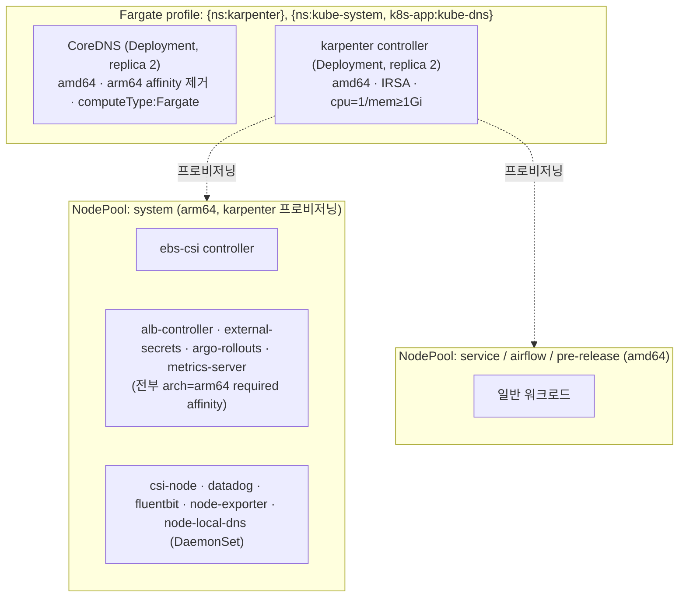

# Fargate + karpenter 토폴로지 — managed nodegroup 없는 클러스터


**한눈에**
- **managed nodegroup은 0개.** Fargate가 **CoreDNS + karpenter 컨트롤러만** 호스팅하고, 나머지 EC2 워크로드는 전부 **karpenter NodePool**(system 풀 포함)이 프로비저닝한다 `✓`
- **Fargate = amd64 전용** — CoreDNS/karpenter가 갖고 있던 arm64 required affinity를 지우지 않으면 **영구 Pending**이다 `✓`
- **DaemonSet은 Fargate에 안 붙는다** — datadog·fluentbit·node-exporter·node-local-dns 어느 것도 CoreDNS/karpenter Fargate 파드를 못 잡는다. 로그는 Fargate 내장 라우터로 대체한다 `✓`
- **Fargate 파드는 동적 EBS를 못 붙인다** — ebs-csi controller는 karpenter **system 풀**로 재타깃한다 `✓`


이 페이지는 [이관 전략과 목표 버전]()에서 확정한 **"managed nodegroup 없이 Fargate(CoreDNS+karpenter) + karpenter system nodepool"** 결정을, 실제로 어떤 배치·순서·config로 구현하는지 다룬다. Terraform으로 이 인프라를 어떻게 짓는지는 [Terraform 생성 & 클러스터 설정]()이, 컴포넌트별 버전 업그레이드 세부는 `components/` 하위 섹션이 이어받는다.

## 1. 목표 토폴로지

Karpenter를 Fargate 위에서 돌리는 것은 karpenter 공식 getting-started가 정식으로 제공하는 옵션이다("managedNodeGroups 대신 fargateProfiles 사용"). 이 프로젝트는 그 옵션 위에 CoreDNS까지 얹어, **managed nodegroup을 아예 두지 않는** 형태로 간다.

managed nodegroup이 없으므로 **첫 EC2 노드는 karpenter 자신이 만든다.** CoreDNS와 karpenter는 둘 다 EC2 노드 없이 Fargate에서 뜰 수 있는 유일한 두 컴포넌트이고, 그 둘이 살아나야 나머지 전부(ebs-csi·ALB controller·external-secrets 등)가 착지할 EC2 노드가 생긴다는 점이 이 토폴로지의 구조적 핵심이다.

arm64 required affinity를 가진 플랫폼 컴포넌트(ebs-csi·ALB controller·external-secrets·argo-rollouts·metrics-server)는 **arm64 풀이 system 풀 하나뿐**이라 전부 거기로 몰린다. system 풀 사이징은 이 컴포넌트 총합을 수용할 수 있어야 한다(§6).

## 2. Fargate 3대 물리 제약

Fargate는 EKS 공식 문서 기준 아래 세 가지가 이 토폴로지 설계를 지배한다.

1. **amd64 전용(Arm 미지원).** CoreDNS·karpenter가 원래 갖고 있던 arm64 required nodeAffinity·toleration을 반드시 제거해야 한다. 지우지 않으면 Fargate 스케줄러가 애초에 배치를 시도하지 않아 **영구 Pending**이 된다.
2. **DaemonSet 미지원.** Fargate는 파드 하나에 전용 micro-VM 하나를 붙이는 구조라 "노드"라는 개념이 없고, 따라서 노드 기반 DaemonSet이 존재할 자리가 없다. csi-node·datadog·fluentbit·node-exporter·node-local-dns·kube-proxy·aws-node 어느 것도 Fargate 파드에는 안 붙는다(§5).
3. **동적 EBS 마운트 불가.** EBS CSI의 컨트롤러 자체는 Fargate에서 돌 수 있지만, 실제로 볼륨을 붙이는 csi-node DaemonSet은 EC2 전용이다. 그래서 Fargate 파드는 동적 프로비저닝 EBS PV를 쓸 수 없다(EFS 정적 프로비저닝은 예외적으로 가능하나 finance는 EFS를 쓰지 않아 무관하다).

세 제약 모두 CoreDNS·karpenter에는 문제가 되지 않는다 — 둘 다 EBS가 필요 없고, arm64 고정만 풀면 amd64로 문제없이 뜬다. 제약이 실질적으로 부딪히는 지점은 **DaemonSet 공백**(§5)이다.

## 3. 부트스트랩 순서 — 닭과 달걀 풀기

managed nodegroup이 없어 "첫 EC2 노드가 어떻게 생기는가"라는 순환 의존을 풀어야 한다. 답은 **CoreDNS와 karpenter만 Fargate로 노드 없이 띄우고, 그 둘이 나머지의 착지장을 만들게 하는 것**이다.

| # | 단계 | 노드 필요? | 이유 / 함정 |
|---|---|---|---|
| 0 | Fargate pod-execution-role 생성 | — | `AmazonEKSFargatePodExecutionRolePolicy` 부착이 Fargate 파드 스케줄의 전제. 로그를 CloudWatch로 보내려면 로깅 IAM 정책도 별도로 부착해야 한다(§5) |
| 1 | Fargate profile 생성: selector `{ns: karpenter}` + `{ns: kube-system, k8s-app: kube-dns}`(private subnet 전용) | — | selector는 **파드 생성 시점에만** 평가된다 — profile이 먼저 있어야 CoreDNS/karpenter가 Fargate로 붙는다. 없으면 파드가 그냥 `Pending`으로 남는다 |
| 2 | vpc-cni addon 등록 | 노드 없어도 OK | Fargate 노드는 VPC CNI를 자체 내장하므로 이 addon과 무관하다. 다만 첫 EC2 노드 join의 필수 선행 조건이라 미리 등록해 둔다 |
| 3 | kube-proxy addon 등록 | 노드 없어도 OK | DaemonSet이라 노드가 생기면 자동 배치된다. Fargate 파드는 kube-proxy가 필요 없다 |
| 4 | CoreDNS addon 설치(`computeType: Fargate` + arm64 affinity 제거) | 아니오 → Fargate | profile(#1)과 `computeType:Fargate` 없이 addon만 먼저 설치하면 파드가 Pending에 걸려 addon 자체가 degraded 상태(`InsufficientNumberOfReplicas`)로 빠진다. 설치 후 `kubectl rollout restart -n kube-system deployment coredns`로 재스케줄한다 |
| 5 | karpenter 컨트롤러 설치(Fargate, IRSA) | 아니오 → Fargate | CoreDNS가 먼저 Ready여야 karpenter가 AWS API(EC2/SQS) 엔드포인트를 DNS로 풀 수 있다. Fargate에는 IMDS가 없어 **IRSA가 필수**이고, 컨트롤러 리소스는 `cpu=1/mem≥1Gi`로 잡아야 한다(§6) |
| 6 | NodePool / EC2NodeClass(v1) CR 적용 | — | karpenter v1 CRD를 먼저 적용해야 한다. `amiSelectorTerms`는 v1에서 필수(`alias: al2023@latest` 등) |
| 7 | 첫 system EC2 노드 탄생(arm64) | — | karpenter가 #8의 pending 파드를 보고 system 풀 노드를 provision한다 |
| 8 | ebs-csi controller(system 풀 재타깃) + csi-node DaemonSet | 예 → system 풀 | controller는 이론상 Fargate에도 놓을 수 있지만 이 프로젝트는 **system 풀 채택**을 확정했다. csi-node DaemonSet은 애초에 EC2에만 붙는다. IRSA 롤 wiring이 빠지면 동적 프로비저닝이 전면 실패하므로 반드시 확인한다 |
| 9 | ALB controller / external-secrets / argo-rollouts / metrics-server | 예 → system 풀(arm64) | 전부 `arch=arm64` required affinity라 system 풀에 착지한다 |
| 10 | 나머지 워크로드(amd64) | 예 → service/airflow 풀 | karpenter가 수요에 따라 amd64 노드를 provision한다 |

요약하면 순서는 **role → profile → vpc-cni/kube-proxy → CoreDNS(Fargate) → karpenter(Fargate) → NodePool CR → 첫 system 노드 → ebs-csi/플랫폼 컴포넌트(system 풀) → 워크로드**다. 노드 없이 뜨는 건 CoreDNS·karpenter뿐이고, 그 둘이 나머지 전부의 EC2 착지장을 만든다.

## 4. 컴포넌트 배치 매트릭스

배치처는 네 가지로 나뉜다 — **Fargate**(amd64 전용 micro-VM), **system pool**(arm64 EC2, karpenter 프로비저닝), **workload pool**(amd64 EC2), **DaemonSet**(전 EC2 노드).

| 컴포넌트 | 배치처 | arch | 필요 조치 |
|---|---|---|---|
| **CoreDNS** | Fargate | amd64 | arm64/system-primary required affinity·toleration 전부 제거 + `computeType: Fargate` 추가 |
| **karpenter controller** | Fargate | amd64 | arm64 affinity·toleration 제거, IRSA 유지, `cpu=1/mem≥1Gi`로 리소스 상향 |
| **ebs-csi controller** | system pool(또는 Fargate 가능하나 이 프로젝트는 system 채택) | arm64 | nodegroup 셀렉터를 system 풀 라벨로 재타깃, arch=arm64 toleration 유지 |
| **ebs-csi node(csi-node)** | DaemonSet(EC2 전용) | 노드 arch | 변경 없음 — Fargate에는 원천적으로 안 붙는다 |
| **metrics-server** | system pool | arm64 | 변경 불요 — arm64 유일 풀이 system이라 자동 착지 |
| **ALB controller** | system pool | arm64 | arch=arm64로 자동 착지. 옛 nodegroup 셀렉터 toleration은 무해한 잔재라 정리 권장 |
| **external-secrets(+cert+webhook)** | system pool | arm64 | 변경 불요 |
| **argo-rollouts(+dashboard)** | system pool | arm64 | 변경 불요 |
| **datadog agent** | DaemonSet(EC2 전용) | 노드 arch | Fargate에는 안 붙는다(§5) |
| **fluentbit** | DaemonSet(EC2 전용) | 노드 arch | Fargate에는 안 붙는다(§5) |
| **node-exporter** | DaemonSet(EC2 전용) | 노드 arch | Fargate VM의 호스트 메트릭은 원천적으로 없다(§5) |
| **node-local-dns** | DaemonSet(EC2 전용) | 노드 arch | Fargate 파드에는 적용되지 않는다(§5) |
| **kube-proxy / aws-node** | DaemonSet | 노드 arch | Fargate 노드는 자체 VPC CNI 내장, kube-proxy 불요(정상) |
| **일반 워크로드** | workload pool | amd64 | service/airflow 풀 |

## 5. DaemonSet 공백과 대안

Fargate 파드(CoreDNS, karpenter)에는 노드 DaemonSet이 붙지 않으므로, 노드 기반 로그·메트릭 수집기가 이 두 파드를 놓친다. 컴포넌트별 대안은 다음과 같다.

| DaemonSet | Fargate 공백 | 대안 |
|---|---|---|
| **fluentbit**(컨테이너 로그) | CoreDNS/karpenter stdout 로그 미수집 | **Fargate 내장 로그 라우터** — 네임스페이스 `aws-observability`(label `aws-observability: enabled`) + ConfigMap `aws-logging`으로 CloudWatch Logs/Firehose/Kinesis/ES 중 하나로 output을 지정하면 AWS가 대신 Fluent Bit를 구동한다(사이드카·DaemonSet 불요). **단 pod-execution-role에 로깅 IAM 정책(`logs:CreateLogStream`/`CreateLogGroup`/`PutLogEvents` 등)을 별도로 부착해야** 동작한다 — Fargate pod-execution-role 기본 정책에는 포함돼 있지 않다 |
| **datadog agent**(노드 메트릭·APM) | CoreDNS/karpenter datadog 메트릭 미수집 | Datadog은 Fargate에서 **파드별 사이드카**로만 수집 가능하다(노드 DaemonSet은 Fargate 파드에 접근할 수 없다). CoreDNS/karpenter에 사이드카를 붙이는 건 과하므로, karpenter의 `/metrics` 엔드포인트는 Prometheus 계열 스크레이퍼로 직접 긁는 방식을 권장한다 |
| **node-exporter**(호스트 메트릭) | Fargate micro-VM의 호스트 메트릭 없음 | Fargate는 설계상 호스트 접근이 불가하다. 대신 kubelet의 파드 지표(cAdvisor)로 대체하고, 대시보드 쿼리는 Fargate 노드를 제외하는 필터를 쓴다 |
| **node-local-dns**(노드별 DNS 캐시) | CoreDNS/karpenter Fargate 파드는 로컬 캐시 미사용 | node-local-dns는 EC2 노드 DaemonSet(iptables 인터셉트) 기반이라 Fargate 파드에는 셋업 자체가 없다 — **클러스터 CoreDNS 서비스로 직접** 질의가 간다(로컬 캐시만 스킵되는 것이지 DNS 조회 자체가 안 되는 건 아니다). CoreDNS 자신은 캐시가 필요 없고, karpenter는 조회량이 적어 영향이 미미하다 |
| **csi-node** | Fargate 파드는 동적 EBS PV 불가 | EBS CSI node DaemonSet은 EC2 전용이다. EBS가 필요한 워크로드는 반드시 EC2 풀로 보낸다 |
| **kube-proxy / aws-node** | — | Fargate 노드는 자체 VPC CNI를 내장하고 kube-proxy가 필요 없다(공백이 아니라 정상 동작) |

## 6. CoreDNS / ebs-csi / karpenter config 변경 목록

이 세 컴포넌트는 기존 값(system-primary 노드그룹·arm64 고정)을 그대로 두면 새 토폴로지에서 동작하지 않는다. 바뀌어야 하는 값만 정리한다.

### 6.1 CoreDNS addon config

| 항목 | 기존 | 신규 토폴로지 | 이유 |
|---|---|---|---|
| `computeType` | (없음) | **`Fargate`** 추가 | `eks.amazonaws.com/compute-type: ec2` annotation을 없애야 Fargate 스케줄러가 잡는다. 미설정이면 CoreDNS가 EC2 고정으로 남는다 |
| nodeAffinity(arm64 + system-primary) | required | **전부 제거** | Fargate는 amd64 전용 — arm64 required가 남아 있으면 영구 Pending |
| toleration(system-primary/arch=arm64) | 有 | 제거 | Fargate에는 taint 자체가 없어 남겨도 무해하지만 의미가 없다 |
| `replicaCount: 2` | 有 | 유지 | Fargate micro-VM 2개로 그대로 뜬다 |
| topologySpreadConstraints(zone, `DoNotSchedule`) | 有 | 유지하되 주의 | Fargate 파드도 AZ 라벨을 갖는다. profile subnet이 AZ 2개 이상이면 분산되지만, `DoNotSchedule`이라 한 AZ만 여유가 있으면 두 번째 replica가 Pending에 걸릴 수 있다 |

### 6.2 ebs-csi addon config

| 항목 | 기존 | 신규 토폴로지 | 이유 |
|---|---|---|---|
| controller nodeAffinity(`nodegroup=system-primary`) | required | **system 풀 라벨로 변경** | managed nodegroup 폐지 → karpenter system 풀 라벨에 맞춘다 |
| controller nodeAffinity(arm64) | required | 유지 | system 풀 자체가 arm64다 |
| controller toleration(system-primary) | 有 | 제거(무해한 잔재) | system 풀에는 `arch=arm64` taint만 있고 nodegroup taint는 없다 — arch toleration이 실제로 필요한 값이다 |
| **IRSA 롤** | **스펙에 없음** ⚠️ | `--service-account-role-arn` + 적절한 EBS CSI IAM 정책 부착 **필수** | 이 프로젝트에서 미해결 최대 리스크 중 하나 — wiring을 빠뜨리면 동적 볼륨 프로비저닝이 전면 실패한다 |

### 6.3 karpenter values

| 항목 | 조치 | 이유 |
|---|---|---|
| 컨트롤러 `affinity.nodeAffinity`(arm64 + system-primary) | **제거** | Fargate는 amd64 전용 |
| 컨트롤러 `tolerations`(arch/nodegroup/spot 등) | **제거** | Fargate에는 taint가 없다 |
| `controller.resources` | **`cpu: 1` / `mem ≥ 1Gi`(requests=limits)로 명시** | Fargate는 requests 값으로 micro-VM 크기를 정한다. 기존 기본값(0.25 vCPU/256Mi) 수준으로 두면 CPU 기아로 리더 election이 반복 유실되는 사고가 사내에서 실제로 있었다 |
| `featureGates.drift` | 제거(v1에서는 무효) | karpenter v1에서 drift가 GA돼 feature gate 자체가 사라졌다 |
| `provisioner:` → `nodePool:` 구조 | **v1 NodePool/EC2NodeClass로 재작성**, **system arm64 풀 반드시 포함** | 구 karpenter(v1beta1 이전)의 `provisioner` 구조는 v1에서 통째로 바뀐다. system 풀이 빠지면 arm64 플랫폼 컴포넌트가 전부 Pending에 걸린다 |

> karpenter 0.36.2→1.14.0 버전 업그레이드 자체(CRD v1beta1→v1 마이그레이션·IAM 정책·배포 절차)는 [컴포넌트별 마이그레이션 — karpenter]()가 이어받는다.

## 7. 리스크 체크리스트

- ⚠️ **amd64 고정 누락**: CoreDNS/karpenter의 arm64 required affinity를 지우지 않으면 영구 Pending.
- ⚠️ **부트스트랩 순서 위반**: profile 없이(또는 `computeType:Fargate` 없이) CoreDNS addon부터 설치하면 addon이 degraded 상태로 빠진다.
- ⚠️ **ebs-csi IRSA 롤 누락**: 스펙에 SA-Role이 없는 상태 — wiring 안 하면 동적 프로비저닝 전면 실패.
- ⚠️ **system 풀 용량**: arm64 required affinity 컴포넌트(ebs-csi·ALB controller·external-secrets·argo-rollouts·metrics-server)가 전부 system 풀 하나에 몰린다 — 인스턴스 사이징이 총합을 못 받으면 일부가 Pending에 걸린다.
- ⚠️ **system 풀 taint 설계**: system 풀에는 `arch=arm64:NoSchedule`만 자동으로 붙고, 전용 nodegroup taint는 없다. arm64를 toleration하는 아무 arm64 파드나 system 풀에 올 수 있다는 뜻이라, 하드 격리(오직 시스템 컴포넌트만)를 원하면 별도 taint 설계가 필요하다.
- ⚠️ **CoreDNS replica 공백 가능성**: replicaCount 2 + Fargate cold-start 지연 + PDB(`maxUnavailable: 1`) 조합에서, Fargate의 OS 패칭이 파드를 삭제할 수 있어 순간적으로 replica 1개만 남는 구간이 생길 수 있다. PDB와 2-AZ topologySpread 유지로 완화하되, `DoNotSchedule` 설정 시 한 AZ만 여유가 있으면 두 번째 replica가 못 뜨는 점을 주의한다.
- ⚠️ **Fargate 로깅 IAM 미부착**: 내장 로그 라우터를 쓰려면 pod-execution-role에 로깅 정책을 추가해야 하는데, 현재 인프라 코드에는 아직 없다. 부착하지 않으면 CoreDNS/karpenter 로그가 CloudWatch로 안 간다.
- ⚠️ **karpenter 컨트롤러 리소스 과소 설정**: Fargate는 requests로 micro-VM을 사이징하므로, 기본값 수준(0.25 vCPU/256Mi)으로 두면 CPU 기아로 리더 election이 반복 유실된다. `cpu=1/mem≥1Gi`를 명시한다.
- **Fargate/karpenter AZ 정합**: Fargate profile의 subnet AZ 집합과 karpenter NodePool의 zone 설정이 동일해야 CoreDNS topologySpread·노드 provision이 정합적으로 동작한다. Fargate는 private subnet만 지원한다.
- **Pod Identity 불가**: Pod Identity Agent는 DaemonSet이라 Fargate에서 동작하지 않는다 — Fargate 파드에는 IMDS도 없으므로 크리덴셜은 **IRSA로만** 조달한다.

## 우리 케이스에서는

신규 blue 클러스터는 managed nodegroup을 아예 두지 않는다. Fargate profile 하나(selector `{ns: karpenter}` + `{ns: kube-system, k8s-app: kube-dns}`)로 CoreDNS와 karpenter 컨트롤러만 노드 없이 띄우고, 그 둘이 살아난 뒤 karpenter가 system(arm64)·service/airflow(amd64) 풀을 프로비저닝하는 순서로 부트스트랩한다. CoreDNS·karpenter·ebs-csi가 물려받았던 arm64/system-primary 고정값은 전부 걷어내고, ebs-csi controller와 arm64 플랫폼 컴포넌트 일체는 system 풀로 재타깃한다. DaemonSet 기반 로그·메트릭 수집기가 CoreDNS/karpenter를 놓치는 구조적 공백은 Fargate 내장 로그 라우터(로깅 IAM 정책 신규 부착 필요)와 컨트롤러 `/metrics` 직접 스크레이핑으로 메운다. 이 인프라를 실제 Terraform 리소스로 어떻게 짓는지는 [Terraform 생성 & 클러스터 설정]()이 이어받는다.
