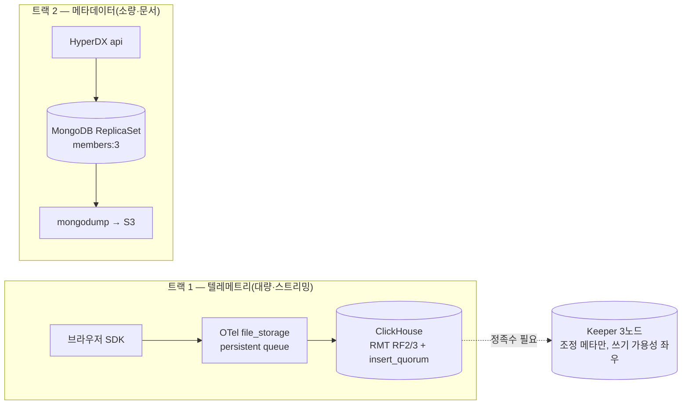

# 컴포넌트별 가용성 — blast radius와 무손실 2트랙


**한눈에**
- 어느 하나의 다운도 "전체 관측 정지"를 뜻하지 않는다 `Σ` — app/api 다운은 UI·쿼리만, Collector 다운은 신규 ingest만(퍼시스턴트 큐가 완충), MongoDB 다운은 설정·알럿·UI만 멈춘다.
- 광범위한 정지는 **ClickHouse 전체 다운**(저장·쿼리 원천)과 **Keeper 정족수 상실**(쓰기 경로) 둘뿐이다 `Σ`.
- 무손실 방어는 성격이 다른 **두 트랙**으로 갈린다: 트랙1(텔레메트리)=OTel `file_storage` 퍼시스턴트 큐 + RMT 복제(+`insert_quorum`), 트랙2(메타데이터)=MongoDB ReplicaSet + `mongodump`.
- **Keeper는 durable queue가 아니다** — 이벤트 데이터를 보관하지 않고, 트랙1의 **쓰기 가용성**만 좌우한다 `✓`.


이 페이지는 [스택 토폴로지]() §7("컴포넌트별 가용성")에서 분기했다. §7은 배치·데이터 흐름 서술 중간에 묻혀 있던 가용성 종합이며, **§7 자체는 정본으로 유지**한다 — 이 페이지는 운영 트랙의 독립 페이지로 그 골격을 자기완결적으로 실체화하고, 개별 메커니즘의 근거·매니페스트는 [Keeper]()·[복제·failover]()·[MongoDB 최소 배포]()로 위임한다.

## 1. 컴포넌트별 매트릭스 — 역할·다운타임·HA·무손실

전제는 [스택 토폴로지]()와 동일하다: RUM-only 월 0.7TB, EBS(gp3)-first, BYO(`clickhouse.enabled:false`) + Altinity CHI/CHK, 1 shard × RF2(2 AZ), Keeper 3노드(gp3·3 AZ), MongoDB 메타데이터 전용.

| 컴포넌트 | (a) 역할 | (b) 죽으면 무엇이 멈추나 | (c) HA·스케일 | (d) 무손실 방법 |
|---|---|---|---|---|
| **HyperDX app/api** | 조회 UI(Next.js) + 백엔드(Node.js: 쿼리 오케스트레이션·알럿 평가·OpAMP 서버) | **UI·쿼리만** — 브라우저→Collector→CH 적재 경로는 그대로 흐른다(조회 대면일 뿐 ingest 경로 밖) `✓` | 무상태, Service 뒤 replica 2+ 수평 확장 | 상태 없음(메타=Mongo, 텔레메트리=CH) → 자체 유실 개념 없음 `✓` |
| **OTel Collector** | RUM ingest 수집·배치·CH export(4318 인입) | 신규 ingest 정지 → `file_storage` 큐가 있으면 in-flight를 디스크에 붙잡고 복귀 후 재개, **큐 없으면 in-flight 유실** `✓/≈` | 준무상태(+디스크 큐), deployment ≥2 replica 수평 확장 | persistent queue(at-least-once) + `memory_limiter` 백프레셔 + 클라 재시도 `✓/≈` |
| **ClickHouse** | 모든 텔레메트리 저장·쿼리 원천 | replica 1대 소실은 나머지가 read+write 계속(**승격 없음**) · **전체 다운만** 조회+수집 동시 정지 `✓` | RMT 멀티마스터, RF2/3 · 2~3 AZ 분산 | RF 복제 + `insert_quorum` + clickhouse-backup `✓` |
| **ClickHouse Keeper** | 복제 조정 메타(로그·part 참조·dedup·DDL 큐) | **정족수 상실 → 쓰기(INSERT/DDL/머지) 정지, 읽기는 계속** — 데이터 노드가 멀쩡해도 쓰기가 멎는 유일 지점 `✓` | 3노드 정족수(1대 손실 허용), 3 AZ 분산 | 사용자 데이터 아님 · gp3 영속(Raft 메타 생존) · 3노드 정족수 `✓` |
| **MongoDB** | 앱 메타데이터(대시보드·알럿·유저·소스) | **설정·알럿 평가·UI만** — 이미 적재 중인 관측 데이터와 무관 `✓` | ReplicaSet `members:3`(또는 Atlas), 부하∝설정 수라 스케일 자체가 불필요 `✓` | ReplicaSet 복제 + `mongodump` CronJob(S3) `✓` |

## 2. blast radius — 어디까지 번지나

핵심 판단은 하나다: **관측 스택은 컴포넌트 하나가 죽어도 전체가 멎지 않도록 경계가 나뉘어 있다.**

- **app/api 다운** → UI·쿼리만. 브라우저 → Collector → CH 적재 경로는 그대로 흐른다.
- **OTel Collector 다운** → 신규 ingest만 정지. `file_storage` 퍼시스턴트 큐가 있으면 in-flight를 디스크에 붙잡고 복귀 후 재개, 큐가 없으면 그 구간만 유실.
- **MongoDB 다운** → 설정·알럿 평가·UI만. 이미 적재된 관측 데이터는 무관.
- **ClickHouse 전체 다운** → 조회 + 수집 **둘 다** 정지 — 저장·쿼리 원천이라 가장 광범위. replica 1대만 죽으면 나머지가 계속 서빙한다.
- **Keeper 정족수 상실** → 쓰기(INSERT/DDL/머지) 정지, 읽기는 계속. 조정 계층 과반 상실만으로 쓰기가 멎는 유일한 지점이다.


광범위 정지는 이 둘뿐이다 `Σ`: **CH 전체 다운**(저장 원천)과 **Keeper 정족수 상실**(쓰기 경로). app/api·Collector·MongoDB 다운은 조회·수집 일부 또는 설정에 국한된다 — "하나가 죽으면 관측 전체가 멎는다"는 통념은 이 두 지점에만 해당한다.


## 3. 무손실은 두 트랙 — 텔레메트리 vs 메타데이터

무손실 방어는 한 메커니즘이 아니라 **성격이 다른 두 트랙**이다. 뭉뚱그리면 "Keeper가 데이터를 지킨다" 같은 오해가 생긴다.



### 트랙 1 — 텔레메트리(대량·스트리밍)

경로는 브라우저 SDK → OTel Collector → ClickHouse이고, 방어선은 이어붙인 두 겹이다.

1. **Collector 앞단**: `sending_queue`는 기본 인메모리라 파드가 죽으면 in-flight가 소실된다 `✓`. `file_storage` extension을 붙이면 디스크 WAL이 되어 재시작 후에도 큐를 이어 처리한다(배포 Collector 빌드에 기본 포함되는지는 도입 시 재확인) `✓/≈`.

   ```yaml
   exporters:
     clickhouse:
       sending_queue:
         enabled: true
         storage: file_storage/otc   # 메모리 → 디스크 WAL
         block_on_overflow: true     # 가득 차면 드롭 대신 블록
   ```

2. **CH 내부**: RMT 복제(RF2/3)가 노드 손실을 흡수하고, 신뢰가 더 필요한 경로만 `insert_quorum`으로 확정 강도를 올린다. 재시도가 중복을 안 만드는 건 블록 dedup 덕분이다(at-least-once → 사실상 exactly-once) `✓`.

Keeper는 이 트랙 어디에도 이벤트 데이터를 들고 있지 않다 — **정족수를 잃으면 쓰기 자체가 막힐 뿐**, "Keeper가 데이터를 붙잡고 있다가 재개"하는 동작은 없다 `✓`. Kafka와의 구분·async_insert 세만틱·유실 지점 표는 [Keeper]()가, 멀티마스터·승격 없는 failover·split-brain 방지는 [복제·failover]()가 정본이다.

### 트랙 2 — 메타데이터(소량·문서)

경로는 HyperDX api ↔ MongoDB다. 적재량과 무관하게 사용자·대시보드·알럿 설정만 지키면 되므로, 스트리밍 큐 같은 장치가 필요 없다.

- **ReplicaSet `members:3`**: Primary + Secondary×2, 자동 failover(선출 수 초). `members:1`은 파드 재시작엔 버티지만 노드/AZ 상실·PVC 손상엔 메타 유실이다 `✓`.
- **`mongodump` CronJob → S3**: MCK(Community Operator)에는 내장 백업이 없다 — Ops Manager PITR은 Enterprise 전용이라 self-host면 덤프를 직접 짠다(메타 소용량이라 수 초·수 MB) `✓`.

메타 데이터셋 자체가 작아 `members:3`의 절대 비용은 미미하다("값싼 보험") — 최소 형상 매니페스트·Atlas 위임 비교는 [MongoDB 최소 배포]()가 정본이다.

**두 트랙의 내구성 메커니즘은 완전히 다르다** `Σ`: 트랙 1은 스트리밍 파이프라인의 **큐 퍼시스턴스 + part 복제**로, 트랙 2는 소량 문서 스토어의 **ReplicaSet 복제 + 덤프**로 지킨다. Keeper 정족수는 트랙 1의 **쓰기 가용성**을 좌우할 뿐, 그 자체가 이벤트 데이터를 보관하지는 않는다.

## 4. 스케일 축 — 처리량 vs 가용성

컴포넌트마다 스케일이 사는 이유가 다르다 `Σ`.

| 축 | 대상 | 늘리면 얻는 것 |
|---|---|---|
| 수평 replica(처리량) | app/api, Collector — 무상태 | 동시 요청·ingest 처리량 |
| 복제(가용성) | CH replica, Keeper, MongoDB — 스테이트풀 | 고장 도메인 방어(승격·failover 절차 아님) |
| shard(용량) | CH만, **이 규모에선 불필요** | 데이터·쓰기 병렬 — 0.7TB/월엔 오히려 부채 |

즉 이 스케일에서 늘려야 할 것은 가용성용 replica이지 용량용 shard가 아니다. 각 컴포넌트를 실제로 **어떤 옵션으로 프로비저닝하나**(EBS hot/cold 스토리지, operator 노브, block-only 튜닝)는 이 페이지가 세운 가용성 전제 위에서 [operator 토폴로지·다운타임]()·[hot 스토리지]()·[S3 cold]()가 잇는다.

## 우리 케이스에서는

가용성 설계는 두 갈래로 나눠 판단한다. **blast radius**는 "무엇이 죽으면 무엇이 멈추나"의 지도다 — app/api·Collector·MongoDB 다운은 조회·설정에 국한되므로 알럿 대응 우선순위에서 CH 전체 다운·Keeper 정족수 상실보다 급을 낮춰도 된다. **무손실 2트랙**은 "무엇을 지켜야 하나"의 지도다 — 텔레메트리는 OTel `file_storage` 큐 + RF 복제로, 메타데이터는 MongoDB ReplicaSet + `mongodump`로 별도로 지킨다. Keeper를 "죽어도 데이터가 안전한 큐"로 착각하지 않는 것이 이 설계의 출발점이다: Keeper는 CHK 3노드(gp3 영속·3 AZ 분산)로 **쓰기 가용성만** 좌우하고, 이벤트 데이터의 내구성은 트랙 1의 큐·복제 층위에서 별도로 만든다.

운영 우선순위로 정리하면 — Keeper 정족수 감시(3노드 중 1대 손실까지 정상, 2대째부터 쓰기 정지)와 CH replica 헬스가 최우선 경보 대상이고, app/api·Collector·MongoDB 다운은 사용자 영향은 있어도 관측 데이터 자체를 위협하지 않는 2차 경보로 분리한다. 시점 기준 2026-07.
