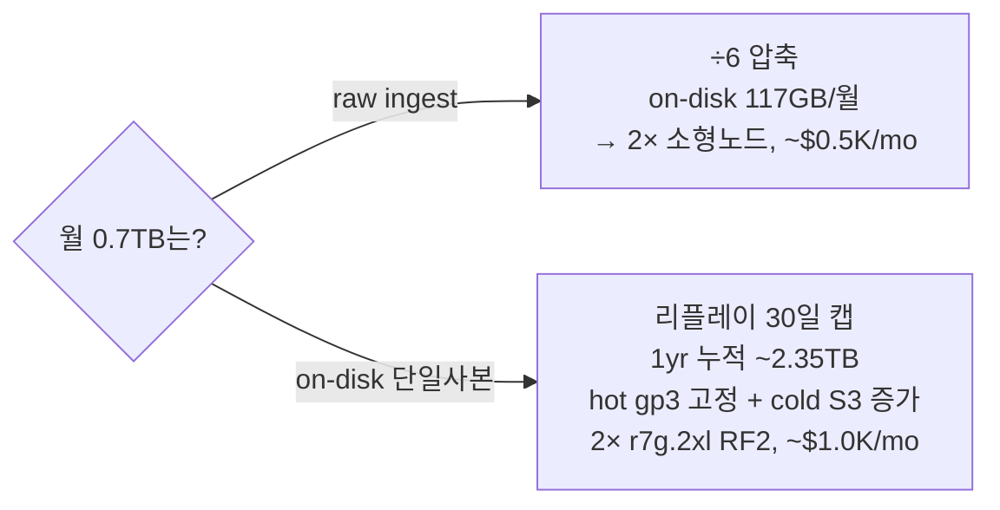

# 규모 산정 — 월 0.7TB 워크드 모델


**한눈에**
- 캐파의 첫 갈림길은 **"월 0.7TB가 raw ingest냐 on-disk(압축 후)냐"** — 해석에 따라 배포 규모·비용이 2~3배 갈린다. 본 페이지는 **on-disk 해석 B를 1차 모델**로 쓰고, 배포 후 `system.parts` **1회 실측**으로 확정한다. `≈`
- 시그널별 압축비를 raw 구성비로 가중한 **블렌디드 압축비 ~6x**를 산식으로 노출한다 — 재계산 가능해야 실측 후 그대로 밴드를 좁힐 수 있다. `≈`
- **최대 지렛대**: 세션 리플레이가 on-disk의 ~78%를 차지하지만 hot 30일 후 **S3로 안 내리고 DELETE**돼 누적되지 않는다 — "0.7TB×12=8.4TB" 순진한 누적은 틀리고, 1년 실 누적(단일사본)은 **~2.35TB**. `≈`
- **hot·컴퓨트는 보관 지평과 무관하게 고정**(hot gp3 ~2TB, 2× r7g.2xlarge) — 3→12개월 증분은 거의 전부 싼 S3 cold다. `≈`
- 인제스트 피크 ~8MB/s로 **1 shard × RF2가 1년+ 충분**, 샤딩은 이 규모에서 부채. prod 월 **~$1.0K**(us-east-1, RF3 ~$1.5K, 서울 +10~15%). `≈`


이 페이지는 [운영 로드맵]() 5부(규모 산정)를 실체화한 것이다. 산식 유도·민감도 밴드·대조 시나리오 전문은 [용량 산정]()이 정본이며, TTL 정책 자체의 정본은 [S3 콜드 티어링]()·[데이터 티어링]()이다. 이 페이지는 "얼마나 쌓이고 얼마나 드는가"라는 캐파 판단에 필요한 표·산식·결론만 압축한다.

## 1. 첫 갈림길 — "0.7TB"는 어디서 잰 바이트인가

사용자 입력 "prod 세션 샘플링 100%, 월 0.7TB"는 어느 지점의 바이트인지 불명하다. 캐파 산정의 대상은 결국 디스크에 실제로 쌓이는 양이므로, 본 페이지는 **해석 B(on-disk 단일사본 0.7TB/월)를 1차 모델**로 삼는다.

| | 해석 A — raw ingest | 해석 B — on-disk(압축 후, 단일사본) |
|---|---|---|
| 0.7TB의 의미 | collector 인입 바이트/월(압축 전) | CH가 디스크에 쓰는 압축 후 바이트/월(`bytes_on_disk`) |
| 변환(블렌디드 ~6x, §2) | on-disk ≈ 0.7TB÷6 ≈ **117GB/월** | raw ≈ 0.7TB×6 ≈ **4.2TB/월** |
| 배포 규모 | 아주 작음 → 2× 소형 노드, ~$0.5K/mo | 중소 → 2× r7g.2xlarge, ~$1.0K/mo |
| 캐파 적합성 | 사이징엔 과소 | **디스크를 직접 결정 → 사이징의 정본** |

`≈` — 두 해석 모두 세션 수 역산으로 내부 정합은 확인되지만(해석 B ≈22M 세션/월, 해석 A ≈3M 세션/월), 서로 다른 크기의 자산을 기술할 뿐이라 어느 쪽인지는 실측으로만 갈린다.


**배포 후 반드시 1회 실측 — 두 해석의 배포 규모·비용이 2~3배 차이 난다.**
```sql
SELECT table,
       formatReadableSize(sum(bytes_on_disk))           AS on_disk,
       formatReadableSize(sum(data_uncompressed_bytes))  AS uncompressed,
       round(sum(data_uncompressed_bytes)/sum(bytes_on_disk),1) AS ratio
FROM system.parts WHERE active AND database='default'
GROUP BY table ORDER BY sum(bytes_on_disk) DESC;
```
`ratio`가 시그널별 실제 압축비, `on_disk`의 월 증가분이 해석 B의 실측값이다. 이 한 번의 실측이 아래 `≈`을 `✓`으로 바꾼다.


## 2. 압축비 산식 — 블렌디드 ~6x, on-disk는 리플레이가 지배

| 시그널 | 압축비(raw→on-disk) | 근거 |
|---|---|---|
| 세션 리플레이(rrweb) | **~5x**(밴드 4~6x) | `≈` — 공개 실측 부재, 고엔트로피 DOM |
| 로그·트레이스 | **~10x** | `✓` — ZSTD 10~14x 일상적 |
| 메트릭 | ~8x | `≈` |

raw 구성비(리플레이 65% / 로그 20% / 트레이스 13% / 메트릭 2% `≈`)를 압축비로 가중하면:

```
on-disk 분율 = 0.65/5 + 0.20/10 + 0.13/10 + 0.02/8 = 0.1655
블렌디드 압축비 = 1 / 0.1655 ≈ 6.0x   (밴드 5x 보수 ~ 8x 낙관)
```

압축이 안 되는 리플레이는 **on-disk 상에서 raw보다 비중이 더 커진다**:

| 시그널 | raw 구성비 | on-disk 구성비 | on-disk 생성/월(단일) |
|---|---|---|---|
| 리플레이 `hyperdx_sessions` | 65% | **78.5%** | ~0.55TB |
| 로그 `otel_logs` | 20% | 12.1% | ~0.085TB |
| 트레이스 `otel_traces` | 13% | 7.9% | ~0.055TB |
| 메트릭 `otel_metrics_*` | 2% | 1.5% | ~0.010TB |

`≈` — 이 표가 §3·§4 전체 산정의 입력이며, staging 실측(§1 콜아웃)으로 밴드를 좁혀야 한다.

## 3. 최대 지렛대 — 리플레이는 "안 쌓인다"

TTL 정책([S3 콜드 티어링]() 정본)의 핵심: `hyperdx_sessions`는 hot(gp3)만, **S3로 내리지 않고** 30일 후 **DELETE**. `otel_logs`/`otel_traces`는 hot 14일 → S3 → 지평별 DELETE. `otel_metrics_*`는 hot 30일 → S3 → 지평별 DELETE.

on-disk의 78.5%를 차지하는 리플레이가 30일 상한으로 잘리고 S3로도 안 가면 **누적되지 않는다**(steady-state ~0.55TB 단일). 누적을 만드는 건 나머지 ~22%(로그+트레이스+메트릭 ≈0.15TB/월)뿐이다.


**"0.7TB × 12개월 = 8.4TB" 순진한 누적은 틀리다.** 리플레이는 30일 DELETE라 steady-state에 머문다. 실제 1년 누적(단일사본)은 리플레이 고정분 ~0.55TB + 누적분(로그/트레이스/메트릭) ~1.8TB ≈ **~2.35TB**. 차이 ~6TB가 전부 "안 쌓이는 리플레이"다. 리플레이 TTL을 로그/트레이스와 분리해 짧게 잡는 것이 캐파·비용의 단일 최대 절감 노브다. `≈`


## 4. 보관 지평별 산정 — 3/6/12개월 (해석 B)

리플레이 hot 고정분(~0.55TB)에 로그/트레이스·메트릭 hot 잔량(~0.076TB)을 더해 **hot 단일 ≈0.63TB(지평 무관 고정)**. cold는 로그/트레이스/메트릭이 hot 창을 지나 DELETE 지평까지 쌓인 양이다(cold도 replica마다 사본이라 ×RF, UltraWarm식 단일사본 절감 없음).

| 지평 | 누적 on-disk(단일) | ×RF2 | hot gp3 물리(×RF2,+40%헤드룸) | cold S3 물리(×RF2) |
|---|---|---|---|---|
| **3개월**(90일) | ~1.0 TB | ~2.0 TB | **~2.0 TB** | ~0.74 TB |
| **6개월**(180일) | ~1.45 TB | ~2.9 TB | **~2.0 TB**(고정) | ~1.64 TB |
| **12개월**(365일) | ~2.35 TB | ~4.7 TB | **~2.0 TB**(고정) | ~3.44 TB |

`≈` — **hot gp3는 지평과 무관하게 ~2TB로 고정**(노드당 ~1TB, gp3 단일 볼륨 상한 64TiB에 여유). 지평을 늘려도 커지는 건 오직 싼 cold S3뿐이다. 백업(리플레이 제외, Glacier IR)은 3개월 ~0.45TB → 12개월 ~1.8TB.

## 5. 노드·샤드·레플리카 — 왜 1 shard × RF2로 충분한가

hot 물리 ~2TB, raw ingest ~4.2TB/월(해석 B 역산) ≈ 평균 1.6 MB/s, 피크 ×5 ≈ **8 MB/s**. ClickStack "10 MB/s당 1 vCPU" `Ⓥ` 기준 피크 인제스트는 **<1 vCPU** — 무시 수준. 쿼리는 RUM 대시보드·세션 검색 위주 light~moderate, page cache가 hot을 흡수한다. `≈`

| 컴포넌트 | 권장(prod) | 사양 | 비고 |
|---|---|---|---|
| ClickHouse 데이터 노드 | **2× r7g.2xlarge**(RF2), +1대(RF3) | 8 vCPU / 64 GB / gp3 ~1TB | 인제스트·쿼리 여유 `≈` |
| ClickHouse Keeper | 3× t4g.medium | 2 vCPU / 4 GB / gp3 20GB | 정족수 3, 데이터량과 무관 `✓` |
| MongoDB | 3-member t4g.small(또는 Atlas) | 2 vCPU / 2 GB / gp3 10GB | 메타데이터 전용, 수 GB `✓` |
| OTel Collector | gateway 2 replica(HPA) | 각 1~2 vCPU | 변환 CPU 여유 |

**결론: 1 shard × 2 replica(RF2)로 1년+ 충분, 샤딩은 불필요**(조기 수평 확장은 이 규모에서 부채)하다. `≈` Keeper·MongoDB는 INSERT 빈도·설정 수에 비례할 뿐 데이터 보관량과 무관해 지평이 늘어도 커지지 않는다 `✓`. RF3는 임의 2대 동시 유실 방어가 필요할 때만 승급한다.

gp3면 이 규모(hot ~2TB, 피크 8MB/s)의 baseline(3,000 IOPS/125 MiB/s)으로 대부분 커버되고, io2 전환 트리거(단일 볼륨 >2,000 MiB/s 지속·>80,000 IOPS/vol·볼륨 자체 99.999% 규제)는 셋 다 도달하지 않는다 — **io2 채택 근거 없음**([데이터 티어링]() §1). `≈`

## 6. 월 비용 산정 (us-east-1, on-demand)

단가 `✓`: gp3 $0.08/GB-mo, S3 Standard $0.023/GB-mo, Glacier IR $0.004/GB-mo. 인스턴스 시급은 `≈`(AWS Calculator로 확정 권장).

```
고정(지평 무관): 컴퓨트 2× r7g.2xlarge ≈$626 + Keeper ≈$79 + Mongo ≈$39 + hot gp3 2TB ≈$160
              ≈ $904/mo
```

| 지평(RF2) | cold S3 | 백업(Glacier IR) | cross-AZ 전송 | **월 총계** | 1yr SP 적용* |
|---|---|---|---|---|---|
| 3개월 | $17+PUT $8 | $2 | ~$40 | **~$971/mo** | ~$720/mo |
| 6개월 | $38+PUT $10 | $4 | ~$45 | **~$1,001/mo** | ~$750/mo |
| 12개월 | $79+PUT $12 | $7 | ~$50 | **~$1,052/mo** | ~$800/mo |

*1yr Savings Plan은 컴퓨트에만 ~40% 적용, 스토리지·S3·전송은 정가. `≈` **RF3(12개월)**: 컴퓨트 3대 + hot 3TB + cold S3 ×RF3 ≈ **~$1,500/mo**(on-demand), 1yr SP ~$1,150/mo `≈`.

**읽는 법**: hot gp3·컴퓨트·Keeper·Mongo는 지평 무관 고정 $904. 3→12개월 확장 비용은 거의 전부 S3 cold($9→$79 증가) — 긴 보관이 싼 이유는 EBS가 아니라 S3에 쌓이고, 볼륨 지배자인 리플레이가 30일에 잘리기 때문이다. **서울(ap-northeast-2)은 인스턴스·EBS·S3가 ~10~15% 비싸다** — RF2 12개월 서울 ≈ ~$1.2K/mo. `≈` [RUM 문서]() 기준 Datadog RUM으로 같은 규모(≈월 22M 세션)를 태우면 연 수만~십수만 $대 — self-host(연 ~$12K)는 수 배~10배 절감이나 people TCO는 별도다([managed vs self-host]()). `≈`



{}
| 지평(RF2) | 누적 단일 | hot gp3(×RF2,+40%) | cold S3(×RF2) | 노드 | 월 총계 |
|---|---|---|---|---|---|
| 3개월 | ~0.17TB | ~0.33TB → $26 | ~0.06TB → $3 | 2× r7g.xlarge | **~$430/mo** |
| 12개월 | ~0.4TB | ~0.33TB → $26 | ~0.3TB → $14 | 2× r7g.xlarge | **~$500/mo** |

해석 A면 배포는 매우 작다 — hot이 수백 GB라 gp3 볼륨 하나로 끝나고, "staging 확대판" 수준이다. 어느 해석인지 확인(§1 콜아웃)이 사이징의 전부다. `≈`
{}

## 우리 케이스에서는

**해석 B(on-disk 0.7TB/월)를 1차 모델**로 잡되, 배포 후 `system.parts`로 1회 실측해 raw인지 on-disk인지, 시그널별 실제 압축비를 확정하는 것이 사이징의 전부다 — 이 한 번의 실측이 배포 규모·비용의 2~3배 불확실성을 없앤다. 실측 전까지는 **1 shard × RF2, 2× r7g.2xlarge, hot gp3 노드당 ~1TB, Keeper 3 / MongoDB 3멤버**로 시작한다. 이 구성은 3개월이든 1년이든 hot·컴퓨트가 고정이고 늘어나는 건 싼 S3 cold뿐이라(RF2 us-east-1 ~$1.0K/mo, 서울 +10~15%) 보관 지평 결정을 미뤄도 손해가 없다.

가장 크게 못박을 한 가지는 **리플레이 TTL 분리**다. on-disk의 ~78%를 먹지만 가치는 급감하므로 hot 30일 + S3 미이동 + 30일 DELETE로 잘라 누적에서 빼낸다 — 이걸 안 하면 "0.7TB×12=8.4TB"의 함정에 빠져 gp3·S3·백업을 모두 3~4배로 과산정한다. io2·RF3·샤딩은 실제 트리거를 넘길 때만 승급한다. 압축비 5x·구성비 65/20/13/2는 전부 `≈`이니 staging 실측으로 승격하는 것을 배포 체크리스트 1번에 둔다. 시점 기준 2026-07.
