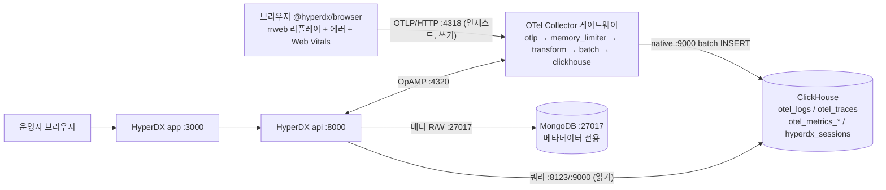
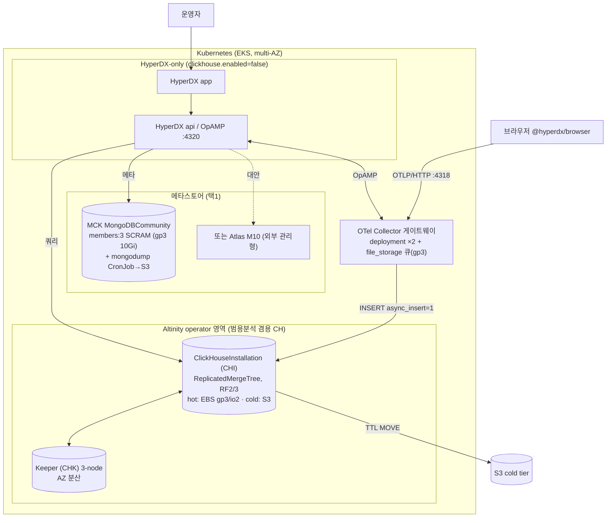

# 스택 토폴로지 — 4컴포넌트 배치·데이터 흐름·MongoDB 최소 배포


**한눈에**
- ClickStack은 **HyperDX(app+api) · OTel Collector · ClickHouse · MongoDB** 4컴포넌트를 **2개 Helm 차트**(`clickstack-operators` → `clickstack`)로 얹는다. 차트 기본은 모든 스테이트풀 컴포넌트가 **단일 인스턴스(PoC용)** 이지 HA가 아니다 `[확인됨]`.
- **operator 분기(중요)**: 표준 차트가 딸려오는 ClickHouse operator는 **ClickHouse Inc. 공식 operator**(`ClickHouseCluster`/`KeeperCluster` CRD)다. 우리는 이걸 그대로 쓰지 않고 `clickhouse.enabled: false`(BYO)로 CH/Keeper를 **Altinity CHI/CHK로 분리 운영**한다 → .
- **RUM 인제스트 경로에 MongoDB는 없다.** 브라우저 → OTLP/HTTP `:4318` → Collector → ClickHouse. MongoDB는 UI에서 대시보드/알럿/소스를 만들 때만 쓰인다 — 이게 "MongoDB를 아주 작게 돌려도 되는" 구조적 근거다.
- **MongoDB 최소 배포 형상**: 메타데이터 전용이라 단일 멤버 실효 바닥 **~0.4 vCPU / 0.75~1.25Gi / gp3 10Gi**. 다만 prod는 `members:3`(≈1.2 vCPU/3Gi, 값싼 보험)에 SCRAM + `mongodump` CronJob이 실전 권고다.


이 페이지는 HyperDX ClickStack을 **실제 K8s에 조립하는 배치 청사진**을 다룬다. 4컴포넌트의 정체성·배포 6모드·BYO("HyperDX-only") 개념은 [HyperDX / ClickStack 심층 분석]()이, 로그 스토어로서의 요약 판단은 [로깅 챕터]()가 이미 다뤘으므로 재나열하지 않는다. 여기서는 **각 컴포넌트를 어느 파드로 어디에 얹고, 데이터가 어디로 흐르며, MongoDB를 얼마나 작게 배포할 수 있는지**에 집중한다.

## 1. 배포 토폴로지 개관 — 2 Helm 차트, 그리고 operator 분기

ClickStack 공식 Helm 경로(v2.x)는 **순서가 있는 2개 차트**로 나뉜다 `[확인됨]`. operator/CRD를 먼저 깔고, operator가 Ready된 뒤 본체를 올린다.

| 차트 | 설치물 | 비고 |
|---|---|---|
| **`clickstack-operators`** | MongoDB Kubernetes Operator(MCK) + ClickHouse Operator 컨트롤러/CRD | 먼저 설치 필수. CRD: `MongoDBCommunity`, `ClickHouseCluster`, `KeeperCluster` `[확인됨]` |
| **`clickstack`** | HyperDX(UI+API), OTel Collector(공식 OTel Helm 차트를 subchart로), 위 operator가 소비할 CR | operator Ready 이후 설치 `[확인됨]` |

차트 기본값의 핵심 관찰은 **모든 스테이트풀 컴포넌트가 단일 인스턴스**라는 것이다 — CH `replicas:1`, Keeper `replicas:1`, MongoDB `members:1`(2026-07 시점 main 브랜치 기준) `[확인됨]`. 즉 차트 기본은 **PoC/단일노드형이지 HA가 아니다.** ([rum/07]()이 짚은 "Helm 기본이 이미 multi-node HA"라는 통념 기각과 정합.) 프로덕션은 스테이트풀 3종을 전부 수동으로 올려야 한다. `helm uninstall` 시 operator가 만든 PVC는 삭제되지 않으므로(데이터 유실 방지 설계) 제거는 역순 + PVC 수동 정리다 `[확인됨]`.

### operator 분기 — "표준 install ≠ Altinity"

여기서 이 카테고리 전체를 관통하는 분기를 못박는다. **표준 ClickStack 차트가 쓰는 ClickHouse operator는 Altinity operator(`ClickHouseInstallation`/CHI)가 아니라 ClickHouse Inc.의 신규 공식 operator(`ClickHouseCluster`/`KeeperCluster` CRD)다** `[확인됨]`. 우리 카테고리는 EBS-first + 범용분석 CH 일원화 + 7년+ 트랙레코드의 Altinity operator를 전제하므로([operator 선택 근거]() 참조), 실제 배치는 표준 차트를 그대로 쓰지 않는다.

```yaml
# clickstack 차트 values — 우리 케이스: CH/Keeper를 차트 밖으로 분리(BYO)
clickhouse:
  enabled: false      # ★ 표준 공식 operator를 쓰지 않음. Altinity CHI로 외부 운영
otel-collector:
  enabled: true       # 게이트웨이는 차트로 유지(또는 별도 관리)
# hyperdx api는 MONGO_URI / CLICKHOUSE_* 시크릿으로 외부 CH·Mongo를 참조
```

`clickhouse.enabled: false`로 두면 HyperDX는 `CLICKHOUSE_*`·`MONGO_URI` 시크릿으로 **외부 CH/Mongo를 참조**만 하고, ClickHouse/Keeper는 Altinity CHI/CHK로 별도 운영한다. 이 분기를 흐리면 독자가 "표준 install = Altinity"로 오해해 뒤 페이지의 CHI 매니페스트와 어긋난다. CHI/CHK 매니페스트·다운타임 시나리오는 , hot 스토리지는 , S3 cold는 , Keeper 상세는 에서 이어진다.

> 왜 표준 차트를 안 쓰나: 공식 operator를 쓰면 우리 클러스터에 CH operator 2종(공식 + Altinity)이 공존하게 되고, 범용분석용으로 이미 운영 중인 Altinity CH와 관측성용 CH의 운영 표면이 갈라진다. `enabled:false`로 CH를 하나의 Altinity 운영 체계로 일원화하는 편이 운영 부담이 낮다 `[추정]`.

## 2. 컴포넌트 역할·포트·의존

| 컴포넌트 | 프로세스/역할 | 리슨 포트 | 의존 방향 | 스테이트 |
|---|---|---|---|---|
| **HyperDX app** | Next.js UI(브라우저 대면) | 3000(내부; local/compose는 8080) | → api | 무상태 |
| **HyperDX api** | Node.js 백엔드(쿼리 오케스트레이션·알럿 평가·OpAMP 서버) | 8000, **OpAMP 4320** | → CH(쿼리), → Mongo(메타), ← Collector(OpAMP) | 무상태 |
| **OTel Collector** | 인제스트 게이트웨이(OTLP 수신 → CH export) | **4317**(gRPC), **4318**(HTTP), 13133(health), 8888(metrics) | → CH(insert), ← api(OpAMP 4320) | 무상태(단, in-flight 배치는 메모리 큐) |
| **ClickHouse** | 모든 텔레메트리 저장·쿼리 원천 | 8123(HTTP), 9000(native), 9009(interserver) | ← Collector, ← api, ↔ Keeper | **스테이트풀(EBS)** |
| **Keeper** | 복제 메타데이터 합의(ZooKeeper 대체) | 9181(client), 9234(raft) | ↔ ClickHouse | **스테이트풀(gp3)** —  |
| **MongoDB** | 앱 메타데이터(user/team/dashboard/alert/source…) | 27017 | ← HyperDX api | **스테이트풀(gp3, 소용량)** |

- HyperDX는 **app(UI) + api(백엔드) 2 프로세스**다. local/all-in-one은 단일 컨테이너에 함께 패키징되지만, Helm에서는 app/api 포트가 분리 노출된다 `[확인됨]`.
- **OpAMP(4320)**: HyperDX api가 OpAMP 서버로 동작해 Collector 파이프라인 설정을 원격 관리한다. Collector는 `OPAMP_SERVER_URL`로 api의 `/v1/opamp`에 붙는다 `[확인됨]`. 커스텀 Collector config는 `CUSTOM_OTELCOL_CONFIG_FILE`로 **베이스에 병합**되며 신규 receiver/processor 추가만 되고 기존 오버라이드는 안 된다(상세는 rum/01 위임).

## 3. 데이터 흐름 — RUM은 MongoDB를 거치지 않는다



핵심 팩트(집필 시 강조점):

- 브라우저 RUM SDK는 **HyperDX api가 아니라 OTel Collector(4318)로 직접** 텔레메트리를 보낸다 `[확인됨]`. 세션 리플레이(rrweb)는 ClickHouse `hyperdx_sessions` 테이블로 적재된다 — "MongoDB에 세션이 저장된다"는 통념은 rum/07에서 이미 기각.
- 즉 **RUM 인제스트 경로에 MongoDB는 전혀 없다.** MongoDB는 사용자가 UI에서 대시보드/알럿/소스를 만들 때만 쓰인다. 이것이 MongoDB를 아주 작게 돌려도 되는 구조적 근거다.
- **쓰기 경로(Collector → CH)와 읽기 경로(api → CH)가 분리**된다. 인제스트 부하와 쿼리 부하가 같은 CH 클러스터를 공유하므로, 대시보드 쿼리 폭주가 인제스트를 밀어낼 수 있다는 점은 캐파 산정()에서 다룬다.

## 4. 우리 케이스 K8s 배치 (mermaid)

표준 차트가 아니라 §1의 분기를 반영한 실제 청사진이다: ClickHouse/Keeper는 Altinity operator 영역(범용분석 겸용), HyperDX는 `clickhouse.enabled:false`로 BYO, MongoDB만 MCK(또는 Atlas 위임).



## 5. OTel Collector 배치·사이징

### 5.1 Agent vs Gateway — RUM-only는 게이트웨이만으로 충분

공식 문서는 2역할 패턴을 규정한다 `[확인됨]`. **Agent**(edge/sidecar/**daemonset**)는 노드·호스트에서 로그/메트릭을 긁고, **Gateway**(standalone **deployment**, 클러스터/리전당 1)는 단일 OTLP 엔드포인트로 수신해 변환·배치를 담당한다. ClickStack 배포판은 기본 **게이트웨이 역할(mode: deployment)** 이다.

RUM-only 워크로드는 **브라우저 SDK가 게이트웨이 Service로 직접** OTLP를 쏘는 구조라, 노드 로그를 긁는 **daemonset agent가 필수가 아니다** `[추정]`. 게이트웨이 deployment(2 replica + Service) 하나면 RUM 인제스트가 성립한다. 서버측 앱 트레이스/로그까지 내재화하는 시점에 daemonset을 추가하면 된다.

### 5.2 사이징 — 단위는 MB/s (events/s 환산은 추정)

사이징 기준 단위는 **처리량(MB/s)** 으로 잡는다. 공식 벤더 사이징은 events/s 단위로 "게이트웨이 ~60,000 events/s = **3 core / 12GB**" `[벤더]`이지만, 이벤트당 평균 크기(특히 rrweb 리플레이는 이벤트가 크다)가 미지라 events/s ↔ MB/s ↔ 우리 볼륨 환산은 `[추정]` 이상 못 된다.

우리 스케일 감(대략): 월 0.7TB를 **인제스트 raw 바이트로 보면** 평균 ≈ 0.27 MB/s, 압축 후 on-disk로 보면 raw는 ~수 배(예 6x면 ~1.6 MB/s)다 — 이 raw/on-disk 해석 자체가 미해결이라 정확한 값은 에서 두 해석 병기 + 실측으로 확정한다 `[추정]`. 어느 해석이든 **게이트웨이 1대(1~2 core)면 충분한 저볼륨 구간**이고, **Collector는 이 스케일에서 병목이 아니다** `[추정]`. 병목/유실은 처리량이 아니라 아래 큐·백프레셔 설계 실수에서 온다.

### 5.3 큐·백프레셔·유실 지점 — "durable queue가 기본 존재하지 않는다"

```yaml
processors:
  memory_limiter: { check_interval: 1s, limit_mib: 2048, spike_limit_mib: 256 }
  batch: { timeout: 1s, send_batch_size: 10000 }   # CH는 큰 배치 선호(≥1,000행)
exporters:
  clickhouse: {}   # 저볼륨이면 연결문자열에 async_insert=1 (+wait_for_async_insert=1)
```

- Collector의 `sending_queue`는 **기본 인메모리**다. 파드가 죽으면 **in-flight 배치는 소실**된다. 디스크 큐잉을 하려면 `file_storage` extension을 붙여 퍼시스턴트 큐로 만들어야 한다 `[확인됨/추정]`. ClickStack 배포판 베이스 config에 `file_storage`가 기본 탑재인지 커스텀 병합으로만 붙는지는 배포 시 실물 config로 확인한다 `[미확인]`.
- 이 유실 지점은 의 "CH가 죽어도 Keeper가 큐잉하지 않는다"와 **같은 층위**다: **인제스트 파이프라인 어디에도 durable queue가 기본 존재하지 않는다.** CH가 잠깐 죽으면 exporter retry → 큐 적체 → `memory_limiter`가 유입 refuse(백프레셔) → 브라우저 SDK 재시도/드롭 순으로 이어지고, 장시간 CH 다운은 RUM 이벤트 유실이다.
- **멱등 재시도 안전장치** `[확인됨]`: 재시도 INSERT가 동일 데이터·동일 순서면 ClickHouse가 중복을 자동 무시한다 → at-least-once 재시도가 중복 폭증을 만들지 않는다.

> 설계 권고(원료): 게이트웨이 **2 replica + `memory_limiter` + `file_storage` 퍼시스턴트 큐(gp3 소량) + async_insert**. RUM 버스트(세션 리플레이는 이벤트가 크고 몰림)를 흡수하는 건 처리량 여유가 아니라 큐 퍼시스턴스 + replica HA다.

## 6. MongoDB 최소 규모 배포 (사용자 핵심 질문 — 정면 답)

MongoDB **부하는 데이터 적재량이 아니라 사용자·설정 수에 비례**한다(모델 전수·부하 프로파일·무인증 실사고는 [rum/07]()에 위임). RUM을 수년 적재해도 MongoDB는 안 커지고 데이터셋은 수백 MB~수 GB다 `[확인됨/추정]`. 이 페이지는 그 위에서 **"실제로 어느 최소 형상으로 배포하나"** 에만 답한다.

### 6.1 얼마나 작게? — "0.2 CPU/200M"은 함정

MCK 공식 샘플(`specify_pod_resources`)은 mongod·agent 각각 **cpu 0.2 / mem 200~250M**를 쓰지만 이건 **데모용 극소값**이다 `[확인됨]`. WiredTiger 최소 캐시가 256MB라 200M limit는 실사용에서 OOM 위험이다. WiredTiger 기본 캐시 = `max(0.5 × (RAM − 1GB), 256MB)`, 하한 256MB `[확인됨]` — 1GB RAM이면 산식상 256MB지만 OS·연결·집계 오버헤드로 위태롭다. mongo 5.0.x는 cgroup 메모리 리밋을 인식하나, 컨테이너에선 `storage.wiredTiger.engineConfig.cacheSizeGB`를 **명시 고정**하는 게 안전하다 `[확인됨]`(버전별 cgroup v2 인식 회귀 여부는 재확인 여지 `[미확인]`).

| 항목 | 데모 극소(비권장) | **실전 최소 권고** |
|---|---|---|
| mongod requests | 0.2 CPU / 200Mi | **250m / 512Mi** |
| mongod limits | 0.2 CPU / 250Mi | **1 CPU / 1Gi** |
| `wiredTigerCacheSizeGB` | (미설정) | **0.25~0.5 명시** |
| mongodb-agent 사이드카 | 0.2 / 200Mi | **100~200m / 128~256Mi** |
| 스토리지(PVC, gp3) | — | **10Gi**(차트 기본; oplog 여유) |

MCK 파드는 **mongod + mongodb-agent 사이드카 + init 컨테이너** 구조라 파드 총합이 mongod 단독보다 크다. 단일 멤버 파드 실효 바닥 ≈ **~0.4 vCPU / ~0.75~1.25Gi / gp3 10Gi** `[추정]`. 즉 "0.5~1 vCPU, 1~2GB면 되나"라는 감은 정확하다 — 단 200M 데모값은 쓰지 않는다.

### 6.2 members 1 vs 3 — 무엇이 달라지나

| | `members: 1` (차트 기본) | `members: 3` (prod 권고) |
|---|---|---|
| 복제 | 없음(단일 mongod) | Primary + Secondary×2, 자동 failover |
| 장애 | 파드 재시작=짧은 다운(EBS 재부착으로 데이터 생존), **노드/AZ 상실·PVC 손상=메타 유실** | 1 파드/노드/AZ 상실 견딤(정족수 2/3) |
| HyperDX 영향 | api 메타 연결 상실 → UI 오류·**알럿 평가 중단**·대시보드 조회 불가(단 CH 인제스트는 계속) | 무중단(선출 수 초) |
| 비용 | 1× (~0.4 vCPU/1Gi/10Gi) | 3× (~1.2 vCPU/3Gi/30Gi) — 절대값 소액 |

메타 데이터셋이 워낙 작아 `members:3`의 절대 비용이 미미하다(≈1.2 vCPU/3Gi). "메타 유실 = 팀·대시보드·알럿 전면 재구성"이라는 손실이 크므로 **3멤버는 값싼 보험**이다. 단일 멤버는 staging이나 "백업으로만 지키는" 경우에 한정한다. 그리고 **MongoDB 장애는 인제스트가 아니라 설정·알럿·UI를 멈춘다** — CH HA와 별개 축("가용성·백업" 문제)으로 다뤄야 우선순위가 선다.

### 6.3 최소 배포 형상 — MongoDBCommunity CR

prod 기준 `members:3` + SCRAM + WiredTiger 캐시 고정 + gp3 10Gi + AZ 분산 anti-affinity를 담은 실전 최소 매니페스트다(필드 기준) `[확인됨]`(operator/mongod 실이미지 태그는 배포 시 `helm template`로 확인 `[미확인]`).

```yaml
apiVersion: mongodbcommunity.mongodb.com/v1
kind: MongoDBCommunity
metadata:
  name: hyperdx-meta
  namespace: hyperdx
spec:
  members: 3
  type: ReplicaSet
  version: "5.0.32"               # ClickStack Helm 관찰값 (mongo 5.0.x)
  security:
    authentication:
      modes: ["SCRAM"]            # SCRAM 기본 활성 — 기본 비번은 반드시 교체
  users:
    - name: hyperdx
      db: hyperdx
      passwordSecretRef: { name: hyperdx-mongo-password }
      roles:
        - { name: dbOwner, db: hyperdx }
        - { name: clusterMonitor, db: admin }
      scramCredentialsSecretName: hyperdx-scram
  additionalMongodConfig:
    storage.wiredTiger.engineConfig.cacheSizeGB: 0.5   # ★ 컨테이너에선 명시 고정
  statefulSet:
    spec:
      template:
        spec:
          affinity:              # AZ 분산: 멤버가 한 AZ에 몰리면 members:3 무의미
            podAntiAffinity:
              requiredDuringSchedulingIgnoredDuringExecution:
                - labelSelector:
                    matchExpressions:
                      - { key: app, operator: In, values: [hyperdx-meta-svc] }
                  topologyKey: topology.kubernetes.io/zone
          containers:
            - name: mongod
              resources:
                requests: { cpu: "250m", memory: "512Mi" }
                limits:   { cpu: "1",    memory: "1Gi" }
            - name: mongodb-agent
              resources:
                requests: { cpu: "100m", memory: "128Mi" }
                limits:   { cpu: "250m", memory: "256Mi" }
      volumeClaimTemplates:
        - metadata: { name: data-volume }
          spec:
            accessModes: ["ReadWriteOnce"]
            storageClassName: gp3
            resources: { requests: { storage: 10Gi } }
```

### 6.4 인증·백업·버전

- **SCRAM 기본 활성** `[확인됨]`: `hyperdx` 앱 유저가 `hyperdx` DB에 dbOwner, `admin` DB에 clusterMonitor. 기본 비번(`hyperdx`)은 placeholder이므로 `clickstack-secret`의 `MONGODB_PASSWORD`로 반드시 교체한다.
- **백업 = mongodump 자력** `[확인됨]`: **MCK(Community Operator)에는 내장 백업이 없다.** Ops Manager 연동 백업·PITR은 Enterprise 전용이다. 따라서 self-host면 **`mongodump` CronJob → S3**를 직접 짜는 게 표준이다(메타 소용량이라 덤프 수 초·수 MB). EBS snapshot도 대안이다.
- **버전 mongo 5.0.32**(Helm values 기준) `[확인됨]`: docker-compose(rum/07)도 `mongo:5.0.32-focal`로 동일. MCK operator는 구 `mongodb-kubernetes-operator` → 신 `mongodb/mongodb-kubernetes`(community+enterprise 통합)로 리네임됐다 — ClickStack이 어느 시점 operator/mongod 태그를 고정하는지는 배포 시 확인이 필요하다 `[미확인]`.

{}
HyperDX는 **`MONGO_URI` 하나만** 있으면 되므로 Atlas(SRV 연결문자열)도 그대로 붙는다 `[확인됨]`.

| 방식 | 장점 | 트레이드오프 |
|---|---|---|
| **자체 MCK(in-cluster)** | 클러스터 내부·egress 없음·비용 최소 | HA·백업 자력(mongodump CronJob), operator 운영 부담 |
| **Atlas M0(free, 512MB)** | 무료·zero-ops, staging에 이상적 | shared 티어 제약, prod 부적합 |
| **Atlas M10(dedicated, ≈$57/mo `[추정]`, 10GB)** | 자동 백업·PITR·멀티AZ turnkey — Community Operator 백업 공백 제거 | 외부 의존, VPC peering/PrivateLink 필요, 월비용 |

메타데이터는 **소용량 + 지연 무관(인제스트 hot path 아님)** 이라 Atlas 위임의 마찰이 작다. "HA·백업을 직접 짜기 싫다"면 Atlas M10이 self-host의 백업 공백을 가장 깔끔히 메운다 `[추정]`(정가는 리전·시점 의존, ap-northeast-2 기준 재확인).
{}

## 우리 케이스에서는

**배치**: 표준 2-차트를 그대로 쓰지 않는다. `clickhouse.enabled: false`(+ 필요시 `otel-collector.enabled: false`)로 ClickHouse/Keeper를 차트 밖 **Altinity CHI/CHK로 분리**하고 HyperDX는 BYO로 붙인다. 표준 차트의 공식 CH operator를 끌어들이지 않아 범용분석 CH와 운영 체계를 하나로 일원화한다. CHI 매니페스트·다운타임은 에서 이어받는다.

**Collector**: RUM-only라 daemonset은 불필요하고 **게이트웨이 deployment 2 replica + `file_storage` 퍼시스턴트 큐(gp3 소량) + async_insert**로 간다. 0.7TB/월은 1~2 core로 충분해 처리량은 병목이 아니다 — 유실 방어의 핵심은 큐 퍼시스턴스와 replica HA다.

**MongoDB**: 물리적으로는 단일 멤버 ~0.4 vCPU/0.75~1.25Gi/gp3 10Gi로 돌아간다. 그러나 prod는 **`members:3`(≈1.2 vCPU/3Gi, 값싼 보험) + SCRAM + WiredTiger 캐시 0.25~0.5 고정 + mongodump CronJob(S3) + AZ anti-affinity**, 또는 Atlas M10 위임으로 간다. staging은 `members:1` 또는 Atlas M0. **MongoDB 장애는 관측(인제스트)을 멈추는 게 아니라 설정·알럿·UI를 멈춘다** — CH HA와 다른 축의 "가용성·백업" 문제로 우선순위를 잡는다. 시점 기준 2026-07.
