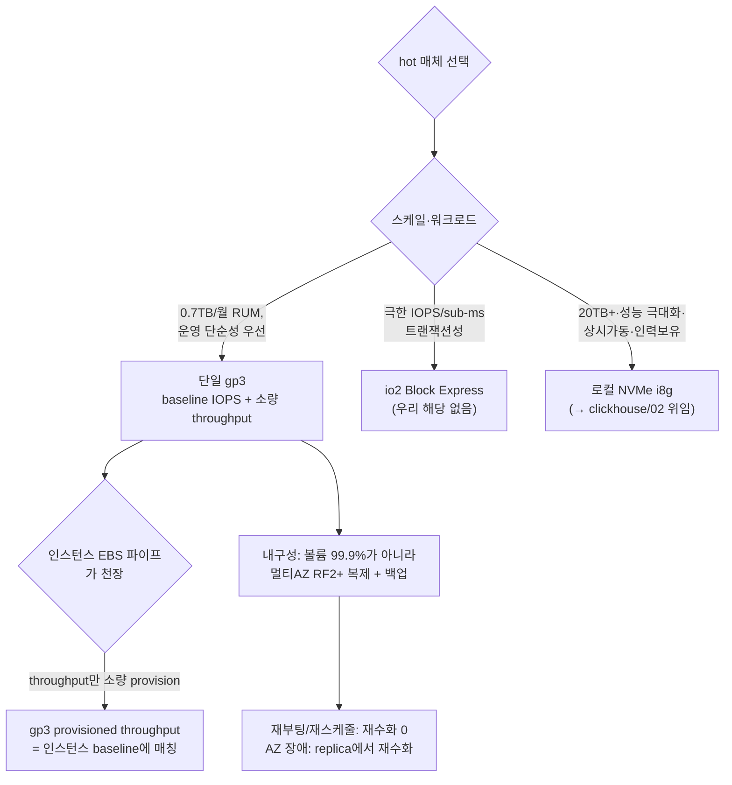

# hot 스토리지 — EBS gp3 / io2 실전 (로컬 NVMe는 옵셔널)


**한눈에**

- hot 데이터의 정답은 **노드당 단일 gp3 볼륨 + 인스턴스 baseline에 맞춘 소량 provisioned throughput**이다. 0.7TB/월 RUM 스케일에서 gp3를 80,000 IOPS/2,000 MiB/s까지 올릴 이유도, 여러 개 스트라이핑할 이유도 없다.
- ClickHouse는 대형 순차 머지가 지배적인 **throughput-bound** 워크로드이고, **인스턴스 EBS 파이프(mid-size는 baseline 수백 MB/s)가 볼륨보다 먼저 병목**이다 — 볼륨을 더 붙여도 인스턴스 파이프 이상은 못 낸다.
- io2 / io2 Block Express(256,000 IOPS·4,000 MiB/s·99.999%·<500µs)는 이 스케일엔 과잉이다. 극한 IOPS·sub-ms·볼륨 단위 초고내구성이 걸릴 때만 각주.
- EBS-first의 진짜 값어치는 성능이 아니라 **재부팅·재스케줄 시 재수화 불필요**(볼륨 detach/attach)라는 운영 단순성·내구성이다. 로컬 NVMe와 근본적으로 다른 다운타임 프로파일은 에서 이어받는다.
- operator 연동은 **gp3 StorageClass(EBS CSI) + volumeClaimTemplate `reclaimPolicy: Retain` + `allowVolumeExpansion`(온라인 확장)** 세 축이다.


이 카테고리는 **EBS(gp3/io2) 1차** 전제다. 로컬 NVMe(i7i/i8g) 1차 전제와 스토리지 4전략·EBS 대역 한계·재수화 위험 창·티어링≠내구성은 가 정본이므로 여기서 반복하지 않고, 이 페이지는 **왜 우리 스케일에선 EBS가 1차인지**와 **gp3/io2를 operator에 어떻게 얹는지**만 실전 관점으로 깊게 판다. cold 티어링(S3)은 , hot 창별 캐파 산정은 가 전담한다.

## 1. gp3 상세 — 2025-09 상향으로 스트라이핑이 필요 없어졌다

### 1.1 현행 스펙 (2026-07, AWS EBS User Guide) `[확인됨]`

gp3는 EBS SSD 중 최저가이며 **성능을 용량과 독립적으로** 프로비저닝한다. 이것이 로그·트레이스처럼 "용량은 큰데 성능 요구는 순차 throughput 위주"인 워크로드에 정확히 맞는다.

| 항목 | 값 | 비고 |
|---|---|---|
| **baseline IOPS** | **3,000** (무료, 스토리지 가격에 포함) | 버스트 아님 — 무기한 지속 |
| **baseline throughput** | **125 MiB/s** (무료) | 버스트 아님 |
| **최대 IOPS/볼륨** | **80,000** (Nitro 전제) | 500 IOPS/GiB 비율 → 160 GiB 이상에서 도달. 비-Nitro는 §1.2 |
| **최대 throughput/볼륨** | **2,000 MiB/s** (≈2,097 MB/s) | 0.25 MiB/s per provisioned IOPS → 8,000 IOPS 이상 & 16 GiB 이상에서 도달 |
| **볼륨 크기** | **1 GiB ~ 64 TiB** | |
| **볼륨 내구성** | **99.8~99.9%** (AFR ≤0.2%) | 볼륨 단위 — 데이터 내구성(복제+백업)과 별개(§5.2) |
| **지연** | single-digit ms | sub-ms가 필요하면 io2 BE |
| **버스트 여부** | **없음** — provisioned 성능을 무기한 지속 | gp2와 결정적 차이 |

- 비율 제약 두 가지: **IOPS ≤ 500 × 볼륨GiB**, **throughput(MiB/s) ≤ 0.25 × provisioned IOPS**. 즉 2,000 MiB/s를 쓰려면 IOPS를 8,000 이상, 80,000 IOPS를 쓰려면 볼륨을 160 GiB 이상 프로비저닝해야 한다 `[확인됨]`.
- gp2 대비 **GiB당 20% 저렴**하고 성능이 크기와 분리돼 예측 가능 `[확인됨]`.
- **최대치를 읽는 I/O 크기 주의**: gp3의 최대 IOPS(80,000)와 최대 throughput(2,000 MiB/s)을 **동시에** 달성하는 지점의 I/O 크기는 `2,000 MiB/s ÷ 80,000 = 25.6 KiB`다 — AWS가 gp3 Max IOPS를 명시할 때 기준으로 삼는 I/O 크기가 25.6 KiB라는 뜻이다 `[확인됨]`. ClickHouse 머지의 순차 read/write는 이보다 훨씬 큰 블록이라, 실전에서 우리를 제약하는 축은 IOPS가 아니라 throughput이다(§3).

### 1.2 통념 정정 — "gp3 최대 16,000 IOPS / 1,000 MiB/s / 16 TiB"는 상향 이전 값 `[확인됨]`


**정정**: 흔히 인용되는 "gp3 볼륨당 최대 16,000 IOPS · 1,000 MiB/s · 16 TiB"는 **2020-12 출시 시점 스펙**이다. AWS는 **2025-09-26** 리전 gp3의 상한을 **80,000 IOPS(5배) / 2,000 MiB/s(2배) / 64 TiB(4배)** 로 올렸고, 이 상향은 **전 상용 리전 + GovCloud**(서울 `ap-northeast-2` 포함)에 적용된다 `[확인됨]`.

- **80,000 IOPS는 Nitro 인스턴스 전제**다. 비-Nitro 인스턴스에 붙인 gp3는 여전히 **최대 64,000 IOPS까지만 프로비저닝**되고, 실제 달성 상한은 **32,000 IOPS**로 잘린다 `[확인됨]`. 우리 데이터 노드는 Graviton(전부 Nitro)이라 80,000까지 열리지만, 어차피 인스턴스 EBS 파이프에서 먼저 잘린다(§1.4·§3).
- **AWS Outposts는 예외**로 종전 상한(16 TiB / 16,000 IOPS / 1,000 MiB/s)이 그대로 남아 있다 `[확인됨]`. "16,000/1,000"을 보면 출시 시점 문서이거나 Outposts를 참조한 것이다.


이 상향이 ClickHouse 운영에 주는 실전 함의는 **스트라이핑이 대부분 불필요해졌다**는 점이다 `[추정]`:

- 과거엔 2,000 MiB/s 이상을 원하면 gp3 여러 개를 RAID0로 묶어야 했다. 이제 단일 gp3가 80,000 IOPS / 2,000 MiB/s / 64 TiB를 커버한다.
- RAID0는 **볼륨 하나만 죽어도 배열 전체가 죽어** 실효 내구성이 떨어진다. AWS는 상향의 이점을 "복잡한 다중 볼륨 스트라이핑을 단일 볼륨으로 대체해 개별 볼륨의 99.9% 내구성을 온전히 유지"라고 명시한다 `[벤더]`. → **단일 gp3가 스트라이핑보다 단순하고 내구성도 높다**(§3.3).
- 요금은 상향 후에도 모든 차원(크기·IOPS·throughput)에서 동일 `[확인됨]`.

### 1.3 gp3 요금 3분해 (us-east-1, 2026-07) `[확인됨]`

| 차원 | 무료 포함분 | 초과분 요금 |
|---|---|---|
| 스토리지 | — | **$0.08 / GB-월** |
| provisioned IOPS | 3,000 IOPS | **$0.005 / provisioned IOPS-월** (3,000 초과분) |
| provisioned throughput | 125 MiB/s | **$0.04 / provisioned MiB/s-월** (125 초과분) |

- 과금은 초 단위(60초 최소) `[확인됨]`. gp3의 provisioned IOPS/throughput 요금은 **단일 구간(tier 없음)** — io2와 달리 계단식이 아니다 `[확인됨]`.
- **서울(`ap-northeast-2`)은 us-east-1 대비 대략 10~15% 비싸다** `[추정]` — 실 배포 리전 단가는 AWS Pricing Calculator로 확정한다. 달러 워크드 모델·3개월/1년 비용은 가 전담하고, 여기선 단가 rate만 제공한다.

### 1.4 언제 baseline로 충분한가 — 인스턴스 EBS 파이프에 묶어 판정 (핵심)

gp3 볼륨 성능을 아무리 올려도 **인스턴스 EBS 대역폭이 먼저 천장**이다. 판정 기준은 "IOPS를 얼마나 사느냐"가 아니라 "인스턴스가 sustain하는 throughput이 얼마냐"다. 데이터 노드는 EBS 기반 Graviton **메모리 최적화 r7g**(ClickHouse의 8GB:1core 궁합)를 기준으로 본다 `[확인됨]` (AWS EBS-optimized 표):

| 인스턴스 | baseline throughput | **burst 최대 throughput** | baseline / 최대 EBS IOPS |
|---|---|---|---|
| r7g.xlarge (4 vCPU/32 GiB) | **156 MB/s** | 1,250 MB/s | 6,000 / 40,000 |
| r7g.2xlarge (8 vCPU/64 GiB) | **312 MB/s** | 1,250 MB/s | 12,000 / 40,000 |
| r7g.4xlarge (16 vCPU/128 GiB) | **625 MB/s** | 1,250 MB/s | 20,000 / 40,000 |
| r7g.8xlarge (32 vCPU/256 GiB) | **1,250 MB/s** | 2,500 MB/s | 40,000 / 80,000 |

*(r7g는 ≤4xlarge에서 baseline이 크기 비례로 오르고 burst 최대는 10 Gbps/1,250 MB/s로 공통, 8xlarge에서 baseline이 10 Gbps로 점프한다. baseline은 무기한 지속, burst는 24h 중 일부만. r8g(Graviton4)는 같은 크기에서 대역이 대체로 상향이나 이 카테고리 기준은 r7g다.)* `[확인됨]`

**판정**(수치는 `[확인됨]`, 결론은 `[추정]`):

- r7g.2xlarge는 **baseline 312 MB/s만 무기한 지속**하고 1,250 MB/s로는 일부만 버스트한다. gp3 무료 baseline(125 MiB/s ≈ 131 MB/s)은 인스턴스 baseline보다 낮으므로, **throughput만 소량 provision해 인스턴스 baseline에 맞추면**(예: 300 MiB/s ⇒ 175 MiB/s 초과분 × $0.04 ≈ 월 $7) 되고, **IOPS는 baseline 3,000으로 충분**하다(인스턴스 EBS IOPS 자체가 12,000이 상한).
- gp3를 80,000 IOPS / 2,000 MiB/s로 올려도 r7g ≤4xlarge에선 **인스턴스가 40,000 IOPS / 1,250 MB/s(버스트)에서 잘라먹어 돈만 버린다**. 2,000 MiB/s gp3는 r7g.8xlarge(burst 2,500 MB/s)에서야 의미가 생긴다.
- 즉 우리 스케일의 sweet spot은 **baseline IOPS + 인스턴스 baseline에 맞춘 소량 provisioned throughput**이다. Altinity의 "7,000 IOPS + 1,000 MiB/s가 safe"는 상한 가이드일 뿐, 0.7TB/월엔 그보다 낮게 시작해 `system.asynchronous_metrics`·EBS 대역 지표로 모니터링하며 올린다.

## 2. io2 / io2 Block Express 상세 — 우리 스케일엔 과잉, 그러나 정확히 알아둔다

### 2.1 현행 스펙 (2026-07) `[확인됨]`

기존 io2 볼륨은 io2 Block Express 아키텍처로 통합돼, 사실상 "io2 = io2 Block Express"로 봐도 된다. io1은 남아있지만 io2 BE 대비 이점이 없다.

| 항목 | io2 Block Express | io1 (구형) |
|---|---|---|
| 최대 IOPS/볼륨 | **256,000** | 64,000 |
| 최대 throughput/볼륨 | **4,000 MiB/s** | **1,000 MiB/s** |
| 최대 크기 | 64 TiB | 16 TiB |
| 볼륨 내구성 | **99.999%** (AFR 0.001%) | 99.8~99.9% |
| 지연 | **16 KiB I/O 평균 <500 µs** | single-digit ms |
| 최대 IOPS:GiB | **1,000 IOPS/GiB** | 50 |
| Multi-attach / NVMe reservation | **지원**(동일 AZ 다중 인스턴스 공유·예약) | 제한적 |
| 지원 인스턴스 | **모든 Nitro 기반 EC2** | — |

io1 대비 io2 BE는 throughput이 4배(1,000→4,000 MiB/s), IOPS:GiB가 20배(50→1,000), 내구성이 두 자릿수 나인 더 높다. **가끔 인용되는 "io2 max 500 MiB/s"는 Block Express 이전 구 io2 수치이며 현행은 4,000 MiB/s다** — 결론(ClickHouse엔 io2 불필요)은 옳지만 근거로 "throughput이 낮아서"를 대면 낡은 근거다(진짜 이유는 §2.3) `[확인됨]`.

### 2.2 io2 tiered IOPS 요금 (us-east-1) `[확인됨]`

| 차원 | 요금 |
|---|---|
| 스토리지 | **$0.125 / GB-월** (gp3의 ~1.56배) |
| IOPS ≤ 32,000 | $0.065 / provisioned IOPS-월 |
| IOPS 32,001 ~ 64,000 | $0.046 / provisioned IOPS-월 |
| IOPS > 64,000 | $0.032 / provisioned IOPS-월 |

- IOPS를 많이 살수록 한계단가가 내려가는 **계단식** — 단일 볼륨에 IOPS를 몰아줄 때 유리하게 설계됐다 `[확인됨]`.
- io2는 **throughput 요금이 별도로 없다**(IOPS에 비례해 throughput이 따라옴). gp3처럼 throughput만 싸게 살 수 없다 — throughput-bound인 ClickHouse엔 요금 구조부터 불리하다 `[확인됨]`.

### 2.3 io2가 gp3 대비 정당화되는 조건 — 우리는 해당 없음 `[추정]`

io2 BE가 gp3를 이기는 축은 셋뿐이고, 셋 다 RUM 분석엔 무관하다:

1. **극한 IOPS**(단일 볼륨 80,000 초과, 최대 256,000) — OLTP·초고QPS 랜덤 액세스. ClickHouse는 throughput-bound라 무관.
2. **볼륨 내구성 99.999%**(gp3의 100배) — 그러나 ClickHouse 데이터 내구성은 **복제(RF)+백업**이 담당하지 단일 볼륨 내구성이 아니다( "티어링≠내구성"). RF2+ 위에서 gp3 99.9%와 io2 99.999%의 실차이는 미미하다.
3. **sub-ms 저지연**(<500 µs) — 지연에 극도로 민감한 트랜잭션 DB. 관측성/RUM 분석 쿼리는 single-digit ms로 충분하다.

→ **0.7TB/월 RUM에서 io2는 GiB당 1.56배 + 비싼 IOPS를 내면서 얻는 게 없다.** io2는 "미래에 초저지연 SLA가 걸린 트랜잭션성 워크로드를 얹을 때"의 옵션으로만 각주 처리하고, hot = gp3로 간다.

## 3. ClickHouse I/O 특성 — throughput-bound, 볼륨 개수보다 인스턴스 파이프

- Altinity는 ClickHouse를 *"limited by throughput of volumes"* 로 규정하고 gp3/gp2가 *"the most native choice"* 라고 명시한다. **IOPS는 일정 수준을 넘으면 성능 차이를 거의 안 만든다** `[벤더]`.
- 구조적 이유 `[추정]`: MergeTree는 컬럼을 큰 파트로 순차 저장하고, 백그라운드 머지가 대형 순차 read+write다. 랜덤 소액 I/O(IOPS 바운드)가 아니라 **대역폭(순차 throughput) 바운드**이며, 압축·페이지 캐시가 랜덤성을 더 줄인다.
- Altinity 볼륨 개수 권고: *"no reason to have more than 1–3 gp3 volume per node."* EBS 대역 <10 Gbps 노드(≤32 vCPU)는 **gp3 단일 볼륨**을 권한다 `[벤더]`. 2025-09 상향으로 단일 gp3가 80,000 IOPS/2,000 MiB/s까지 커버하므로 이 권고는 더 강해진다.

### 3.1 단일 gp3 vs 다중 gp3 스트라이핑 — 우리 판정 `[추정]`

| | 단일 gp3 | 다중 gp3 RAID0 |
|---|---|---|
| 성능 상한 | 80,000 IOPS / 2,000 MiB/s (**인스턴스 파이프에 재차 제한**) | 볼륨 수배 (단, **인스턴스 EBS 대역이 총합 상한**) |
| 실효 내구성 | **99.9%** | **낮아짐** (볼륨 1개 실패 → 배열 전체 손실) |
| 운영 복잡도 | 낮음(EBS CSI 단일 PVC) | 높음(RAID 구성·복구·확장) |
| 온라인 확장 | `allowVolumeExpansion`로 단순 | RAID 재구성 필요 |
| 우리 스케일 적합 | **✅ 정답** | ❌ 불필요 |

**핵심**: 인스턴스 EBS 파이프가 어차피 총 throughput의 천장이므로, 볼륨을 여러 개 붙여도 인스턴스 대역 이상은 못 낸다(§1.4). 우리 스케일에선 **단일 gp3**가 성능·내구성·운영 모두에서 우위다. 인스턴스 EBS 대역 한계 자체의 상세는 가 정본이다.

## 4. 로컬 NVMe — 옵셔널 업그레이드 경로 (relref)

로컬 NVMe(i7i/i8g)는 **성능 극대화·대규모(20TB+)·상시 가동** 전제에서 EBS로는 물리적으로 불가능한 수 GB/s·수십만 IOPS를 스토리지 한계비용 $0에 준다. 그러나 그 대가는 **휘발성 → 재수화 위험 창 + Karpenter 길들이기 + local PV 특수 운영 + Spot 금지**이며, 이는 0.7TB/월 RUM에는 과한 복잡도다.

로컬 NVMe는 "우리 CH에 범용 대규모 분석이 얹혀 hot 데이터가 수 TB/노드로 커지고 저지연 대규모 스캔이 SLA가 될 때"의 **업그레이드 경로**로만 열어둔다. 인스턴스 선택(i8g 우선)·내구성 3종 세트·재수화·Karpenter·local PV provisioner 상세는 전부 가 정본이다 — 이 페이지는 그 문을 가리키기만 한다.

## 5. 왜 우리 스케일(0.7TB/월 RUM)에선 EBS-first인가

### 5.1 EBS-first의 진짜 이점은 성능이 아니라 **재수화 불필요** (핵심)

로컬 NVMe 전략의 가장 큰 운영 리스크는 **노드 소실 = 데이터 소실 → 재수화 위험 창**이다(). EBS는 볼륨이 노드와 독립적으로 살아남아 이 창을 대부분 없앤다:

| 이벤트 | 로컬 NVMe | EBS gp3 |
|---|---|---|
| **노드 재부팅** | 소실 → healthy replica에서 전량 재수화(수 시간) | **볼륨 그대로 재부팅, 재수화 0** `[추정]` |
| **pod 재스케줄(같은 AZ)** | 소실 → 재수화 | **EBS detach → 새 노드에 attach, 데이터 보존** `[확인됨]` |
| **인스턴스 교체(같은 AZ)** | 소실 → 재수화 | 볼륨 재부착, 재수화 0 `[추정]` |
| **AZ 장애** | 소실 → 타 AZ replica에서 재수화 | **재수화 필요**(EBS는 AZ 종속, 타 AZ 재부착 불가) — replica가 방어 |
| **볼륨 자체 장애(연 ≤0.2%)** | (해당 없음) | replica에서 재수화 |

- **핵심**: EBS는 재부팅/재스케줄/인스턴스 교체(모두 같은 AZ)에서 재수화가 필요 없어, 로컬 NVMe 대비 **재수화 위험 창을 근본적으로 짧게** 만든다. 창이 없으면 그 사이 2차 장애로 데이터를 잃을 확률도 없다. detach → 재attach 실소요 시간(재스케줄 지연 등)은 배포 후 실측이 필요하다 `[미확인]`.
- **단, EBS는 AZ 종속**이다. 볼륨은 생성된 AZ를 벗어나 attach될 수 없으므로 **AZ 전체 장애 시에는 여전히 타 AZ replica에서 재수화**한다. 즉 EBS는 "노드 레벨 재수화"를 없애지 "AZ 레벨 재수화"를 없애지 않는다. 그래서 **멀티 AZ RF2+ 복제는 EBS에서도 여전히 필수**다. 다운타임 시나리오(rolling restart·reconcile·PDB·노드 재부팅·AZ 장애)의 상세 프로파일은 가 이어받는다.

### 5.2 내구성 계층 정리 `[확인됨]`

EBS-first에서도 "볼륨 내구성 ≠ 데이터 내구성"은 그대로다:

- **볼륨 단위**: gp3 99.8~99.9%(AFR ≤0.2%), io2 99.999%. 이건 EBS가 볼륨을 안 잃을 확률이지 우리 데이터 안전이 아니다.
- **데이터 내구성/가용성**: **멀티 AZ RF2~3 ReplicatedMergeTree**(SharedMergeTree는 Cloud 전용이라 self-host는 RMT 강제) + **clickhouse-backup → S3**. RF 선택 확률·insert_quorum·쓰기 내구성 노브는 가 정본이다.
- **비용 관점**: EBS도 RF배수로 사본을 낸다(RF2면 hot EBS도 2벌). "EBS라 싸다"가 아니라 "재수화가 없어 운영이 싸다"가 EBS-first의 논지다.

### 5.3 hot 매체 4자 비교 (2026-07)

| 지표 | gp3 (단일) | io2 Block Express | 로컬 NVMe (i8g) | S3 (참고: cold 전용) |
|---|---|---|---|---|
| 최대 IOPS/볼륨 | 80,000 `[확인됨]` | **256,000** `[확인됨]` | 인스턴스 물리한계 | — |
| 최대 throughput/볼륨 | 2,000 MiB/s `[확인됨]` | **4,000 MiB/s** `[확인됨]` | 수 GB/s(RAID로↑) | S3 대역 |
| 실효 천장 | **인스턴스 EBS 파이프** | 인스턴스 EBS 파이프 | 인스턴스 물리 NVMe | 네트워크 |
| 지연 | single-digit ms | **<500 µs** | µs 단위 | 수십~수백 ms |
| 볼륨 내구성 | 99.8~99.9% | **99.999%** | 없음(휘발성) | 11 nines |
| GB당 요금(us-east-1) | **$0.08** | $0.125 + 비싼 IOPS | 인스턴스가에 포함 | ~$0.023 |
| 노드 재부팅 시 데이터 | **보존(재수화 0)** | 보존 | **소실→재수화** | 보존 |
| AZ 장애 시 | 재수화(AZ 종속) | 재수화 | 재수화 | 보존 |
| 운영 복잡도 | **낮음** | 낮음 | 높음(RAID·재수화·Karpenter) | 중간 |
| 0.7TB/월 RUM 적합 | **✅ 정답** | ❌ 과잉 | ❌ 과한 복잡도 | (cold 티어로만) |



## 6. Altinity operator 연동 — gp3 StorageClass + volumeClaimTemplate

### 6.1 gp3 StorageClass (EBS CSI 드라이버) `[확인됨]`

```yaml
apiVersion: storage.k8s.io/v1
kind: StorageClass
metadata:
  name: clickhouse-gp3
provisioner: ebs.csi.aws.com            # AWS EBS CSI 드라이버 (별도 설치 필요)
parameters:
  type: gp3
  iops: "3000"                          # baseline (무료). 필요 시 상향
  throughput: "300"                     # MiB/s. 인스턴스 baseline에 맞춰 조정 (§1.4)
  fsType: ext4                          # 또는 xfs
  encrypted: "true"                     # KMS 저장 암호화 권장
allowVolumeExpansion: true              # ★ 온라인 확장 활성화 (필수)
volumeBindingMode: WaitForFirstConsumer # pod 스케줄 후 바인딩 → AZ 정합성 확보
reclaimPolicy: Retain                   # StorageClass 레벨 (아래 operator 레벨과 이중 방어)
```

- `iops`/`throughput`은 StorageClass에 박거나 생략하고 나중에 EBS Elastic Volumes로 조정할 수 있다 `[확인됨]`.
- `volumeBindingMode: WaitForFirstConsumer`는 **pod가 스케줄된 AZ에 볼륨을 만들도록** 지연 바인딩한다 — 멀티 AZ에서 volume/pod AZ 불일치를 막는 필수 설정이다(EBS는 AZ 종속, §5.1) `[확인됨]`.
- `encrypted: "true"` + KMS 키로 저장 암호화 `[확인됨]`.

### 6.2 ClickHouseInstallation volumeClaimTemplate + reclaimPolicy: Retain `[확인됨]`

operator의 volumeClaimTemplate은 StorageClass의 reclaimPolicy와 별개로 **operator 레벨 `reclaimPolicy` 필드**를 갖는다. `Retain`이면 **CHI/클러스터를 지워도 PVC가 살아남는다** — EBS-first에서 실수로 데이터 볼륨이 증발하는 것을 막는 안전장치다.

```yaml
apiVersion: "clickhouse.altinity.com/v1"
kind: "ClickHouseInstallation"
metadata:
  name: rum-hyperdx
  namespace: clickhouse
spec:
  configuration:
    clusters:
      - name: rum
        layout:
          shardsCount: 1
          replicasCount: 2            # 멀티 AZ RF2 (기본); RF3 결정은 04·06
  templates:
    podTemplates:
      - name: ch-pod
        podDistribution:
          - type: ClickHouseAntiAffinity           # replica를 다른 노드로
          - type: ReplicaAntiAffinity
            topologyKey: topology.kubernetes.io/zone   # 다른 AZ로 (AZ 장애 방어)
        spec:
          containers:
            - name: clickhouse
              image: "clickhouse/clickhouse-server:24.8"   # ClickStack 24.8+ 요구
    volumeClaimTemplates:
      - name: data-volume
        reclaimPolicy: Retain          # ★ operator 레벨 — CHI 삭제 시에도 PVC 보존
        spec:
          storageClassName: clickhouse-gp3
          accessModes:
            - ReadWriteOnce
          resources:
            requests:
              storage: 1000Gi         # prod 노드당 hot 창 산정치 — 06 워크드 모델 정합
                                       # 스테이징은 소규모(예: 100Gi)로 시작
    # 위 volumeClaimTemplate을 pod의 /var/lib/clickhouse에 마운트
```

- `reclaimPolicy: Retain`은 **`spec:`과 같은 레벨**에 둬야 하며, 위치가 틀리면 operator가 무시한다 `[확인됨]`. operator는 PVC에 커스텀 라벨을 붙여 Retain을 구현하므로 **라벨이 제거되면 보호가 풀린다**. 완전 삭제는 CHI 삭제 후 `kubectl delete pvc`로 **수동** 처리한다 `[확인됨]`.
- PVC 크기는 hot 창(로그·트레이스 14일, 메트릭·세션 30일)으로 산정한 prod 노드당 order ~1TB를 기준으로 하고, 실제 산정 워크드와 스테이징 대비 prod 비례는 가 전담한다. 03/04와 임의로 다른 크기를 쓰지 않는다.

### 6.3 온라인 볼륨 확장 (allowVolumeExpansion) `[확인됨]`

- StorageClass에 `allowVolumeExpansion: true`가 있으면, **PVC의 `resources.requests.storage`를 키우는 것만으로** EBS 볼륨이 온라인 확장된다(EBS Elastic Volumes). ClickHouse 재시작이 필요 없다 `[확인됨]`.
- 이것이 EBS-first의 성장 대응 축이다: 0.7TB/월로 시작해 hot 창이 커지면 볼륨을 다운타임 없이 늘린다.


**운영 함정 2건** `[확인됨]`:

1. **reclaimPolicy: Retain 미준수 버그** — operator issue #1619에서 CHI/CHK에 Retain을 걸어도 클러스터 삭제 시 볼륨이 지워진 사례가 보고됐다. 기준 버전 0.27.1에서 수정됐는지는 릴리스 노트로 확인하고 `[미확인]`, 그 전까지는 **StorageClass `reclaimPolicy: Retain`도 이중으로** 걸어 방어한다. 생성 후 실제 PV 정책을 반드시 확인한다.
2. **PVC 볼륨 템플릿 확장 시 데이터 손실** — issue #1385에서 volumeClaimTemplate의 storage를 키우는 방식이 데이터 손실을 유발한 사례가 있다. 확장은 **PVC를 직접 수정**하는 경로로 하고, **스테이징에서 리허설한 뒤** 프로덕션에 적용하며, 확장 전 백업은 필수다.


## 우리 케이스에서는

- **hot = 노드당 단일 gp3, baseline IOPS(3,000) + 인스턴스 baseline에 맞춘 소량 provisioned throughput(예: 300 MiB/s).** ClickHouse는 throughput-bound이고 인스턴스 EBS 파이프가 먼저 천장이라, 0.7TB/월엔 gp3를 80,000 IOPS/2,000 MiB/s까지 올릴 이유도, 여러 개 스트라이핑할 이유도 없다. mid-size Graviton **r7g**(메모리 최적화)에 gp3 단일 볼륨으로 시작하고, 필요 시 r8g로 올린다.
- **io2 / io2 BE는 각주.** 극한 IOPS·sub-ms·볼륨 단위 99.999% 내구성이 필요할 때만. RUM 분석엔 gp3 99.9% + 멀티 AZ RF 복제로 충분하고, io2는 GiB 1.56배 + 비싼 IOPS만 낸다. io1은 검토 대상 자체가 아니다(throughput 1,000 MiB/s).
- **EBS-first의 값어치는 성능이 아니라 재수화 불필요.** 노드 재부팅·재스케줄·인스턴스 교체(같은 AZ)에서 볼륨 detach/attach로 데이터가 보존돼 재수화 위험 창이 근본적으로 짧다. 단 EBS는 AZ 종속이라 **멀티 AZ RF2+ 복제는 여전히 필수**이고(AZ 장애 방어), 다운타임 프로파일은 에서 이어받는다.
- **operator는 gp3 StorageClass(EBS CSI, `WaitForFirstConsumer`) + volumeClaimTemplate `reclaimPolicy: Retain` + `allowVolumeExpansion`.** 성장은 온라인 볼륨 확장으로 흡수하고, reclaimPolicy 미준수 버그(#1619)·PVC 확장 데이터 손실(#1385)은 StorageClass 이중 Retain + 스테이징 리허설 + 백업으로 방어한다.
- **로컬 NVMe는 업그레이드 경로로만** 열어두고 상세는 에 위임한다. 시점 기준 2026-07.
