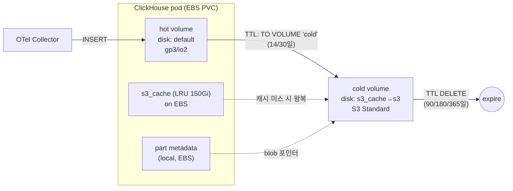

# S3 콜드 티어링 — storage_configuration·TTL·IRSA worked example


**한눈에**
- **hot = EBS `default` 디스크**(gp3/io2), **cold = S3 Standard + `cache` 디스크**(EBS 위 LRU, `max_size` 150Gi). [로컬 NVMe 예제]()의 hot 자리를 EBS로 계승할 뿐, cold(S3) 조립은 동일하다.
- **storage_configuration 기준 문서**: 내장 `default` + `s3`(신문법 `object_storage`) + `cache`. 정책 `rum_hot_cold`는 `move_factor=0.1`(안전판만), `prefer_not_to_merge` 미설정(기본 false 유지).
- **이 페이지가 TTL 단일 기준 문서다**([06 용량 산정]()이 이 표를 relref): `otel_logs`/`otel_traces` hot **14일**→S3→DELETE(지평 90/180/365), `otel_metrics_*` hot **30일**→S3→DELETE(180/365), **`hyperdx_sessions`는 S3에 안 내리고 hot만·DELETE 30일**.
- **인증 = IRSA**(정적 키 금지) + `use_environment_credentials=1` + `region` 명시 + `{replica}` 경로 분리(shared-nothing 필수). **주입 = CHI `files`의 `config.d/storage_configuration.xml`**.
- **함정**: part 메타데이터·cache가 EBS를 먹는다(사이징 반영) · S3 lifecycle→Glacier **금지** · zero-copy **금지** · cold=캐시 미스 지연.


[로컬 NVMe 스토리지]()가 hot을 로컬 NVMe로 두는 전제였다면, 이 카테고리는 **hot = EBS(gp3/io2)** 전제다(). 티어링의 골격 — TTL로 오래된 part를 S3로 밀고 최근 데이터만 로컬에 둔다 — 은 같지만, ClickHouse `storage_configuration`에서 hot 볼륨의 disk가 로컬 SC PVC가 아니라 **내장 `default` 디스크(=`/var/lib/clickhouse` = gp3/io2 PVC)** 라는 점만 다르다. 이 페이지는 그 hot=EBS 전제로 **복붙 가능한 storage XML·CHI 매니페스트·TTL DDL**을 조립하고, HyperDX/ClickStack이 자동 생성하는 관리 테이블(`otel_*`/`hyperdx_sessions`)에 실제로 티어링을 얹는다. **티어링 ≠ 내구성**·zero-copy 금지·S3 lifecycle 함정의 *배경*은 이미 [클릭하우스 챕터]()가 깊게 다뤘으므로 여기선 relref로 위임하고, EBS-first worked example의 새 각도만 판다.

> 이 매니페스트들은 표준 ClickStack Helm 2차트가 쓰는 ClickHouse Inc. 공식 operator(ClickHouseCluster CRD)가 아니라, `clickhouse.enabled: false`(자체(self-hosted) ClickHouse에 연결하는 'HyperDX Only')로 CH/Keeper를 **Altinity CHI/CHK로 분리 운영**하는 전제로 쓰였다. 이 분기의 배경은 [스택 토폴로지]()·[operator·다운타임]() 참조. `✓`



## 1. `storage_configuration` 기준 문서 — hot=EBS `default` / cold=S3+cache

정책은 hot 볼륨 하나(내장 `default`) + cold 볼륨 하나(`cache`로 감싼 S3)로 구성한다. disk를 세 개(`default`는 내장이라 선언 불필요 → 실제 선언은 `s3` + `cache` 둘) 정의하고, 볼륨 순서로 이동 우선순위를 잡는다.

### 1.1 disk 정의 — 신문법 `object_storage`(24.1+) `✓`

ClickStack은 24.8 LTS+를 요구하므로 신문법을 쓴다. operator 공식 tiered-s3 예제·Altinity KB는 아직 구문법 `type: s3`를 쓰는데, 24.8에서는 둘 다 동작한다(신문법 `type: s3`는 `object_storage`+`s3`의 축약 alias) `≈`.

```xml
<clickhouse>
  <storage_configuration>
    <disks>
      <!-- S3 오브젝트 스토리지 disk. {replica} 매크로로 replica마다 경로 분리(shared-nothing) -->
      <s3_disk>
        <type>object_storage</type>
        <object_storage_type>s3</object_storage_type>
        <metadata_type>local</metadata_type>   <!-- part 매핑 메타데이터는 로컬(EBS)에 상주 → §5.1 -->
        <endpoint>https://rum-clickhouse-cold.s3.ap-northeast-2.amazonaws.com/s3_disk/{replica}/</endpoint>
        <use_environment_credentials>1</use_environment_credentials>  <!-- IRSA(§3) -->
        <region>ap-northeast-2</region>
        <metadata_path>/var/lib/clickhouse/disks/s3_disk/</metadata_path>
      </s3_disk>
      <!-- S3 disk 위에 로컬(EBS) LRU 캐시를 얹는다. cold 쿼리 지연 방어의 핵심 -->
      <s3_cache>
        <type>cache</type>
        <disk>s3_disk</disk>
        <path>/var/lib/clickhouse/disks/s3_cache/</path>
        <max_size>150Gi</max_size>                          <!-- LRU 상한. EBS 소비항(§5.1). 실값은 스테이징 튜닝 -->
        <cache_on_write_operations>1</cache_on_write_operations>  <!-- TTL MOVE 시점에 프리페치 → 첫 조회 완화 -->
      </s3_cache>
    </disks>
    ...
  </storage_configuration>
</clickhouse>
```

주요 필드(공통) `✓`:

| 필드 | 기본 | 의미 (우리 값) |
|---|---|---|
| `endpoint` | — | 버킷 + 루트경로 + **`{replica}`**. 리전 도메인 포함 권장 |
| `use_environment_credentials` | false | **1 → AWS SDK 기본 자격증명 체인**(IRSA web identity 토큰 픽업). §3 |
| `region` | — | **명시 필수 권장**(STS regional endpoint·서명). IRSA에서 특히 |
| `metadata_type` | local | `local`=part 매핑 파일이 로컬 상주 + replica별 독립(shared-nothing) → `{replica}` 필수 |
| `metadata_path` | `/var/lib/clickhouse/disks/<name>/` | 로컬 메타데이터 위치(**EBS 위**) |
| `request_timeout_ms` | 5000 | cold full-scan 많으면 상향(예 60000) `≈` |
| `support_batch_delete` | true | **GCS면 false**(S3는 기본 유지) |

cache disk 필드 `✓`:

| 필드 | 기본 | 의미 |
|---|---|---|
| `disk` | — | 캐시 대상 하위 disk(`s3_disk`) |
| `path` | — | 캐시 실체 로컬 경로(**EBS 용량 소비** → §5.1) |
| `max_size` | — | LRU 상한(`150Gi` 또는 바이트). 초과 시 LRU 축출. 최적값은 cold working set 대비 hit rate로 튜닝 `?` |
| `cache_on_write_operations` | false | **1이면 TTL MOVE로 cold에 쓸 때도 로컬 캐시에 적재** → 갓 내려간 데이터 첫 조회가 빠름 |
| `enable_cache_hits_threshold` | false | N회 읽힌 뒤에만 캐싱(핫셋만) |

> **cache는 `filesystem_cache`(쿼리 레벨 원격 읽기 캐시)와 별개인 disk 레벨 LRU 캐시**다. 관측성 티어링의 정석은 disk 레벨 `cache` disk로 cold 볼륨을 감싸는 것. `✓`

### 1.2 storage_policy — hot=`default`(EBS) / cold=`s3_cache`

```xml
    <policies>
      <rum_hot_cold>
        <volumes>
          <hot>
            <disk>default</disk>          <!-- = /var/lib/clickhouse = gp3/io2 PVC(내장 disk, 선언 불필요) -->
          </hot>
          <cold>
            <disk>s3_cache</disk>         <!-- cache로 감싼 S3 -->
          </cold>
        </volumes>
        <move_factor>0.1</move_factor>    <!-- 안전판(여유<10%=~90% 찼을 때만 개입). 주 이동은 시간 TTL. §1.3 -->
        <!-- prefer_not_to_merge 미설정(기본 false 유지): S3 위 작은 part 폭증 방지 -->
      </rum_hot_cold>
    </policies>
```

- **볼륨 순서 = 이동 우선순위**(hot=index0 → cold=index1). TTL `TO VOLUME 'cold'`가 hot→cold로 민다. `✓`
- **`prefer_not_to_merge`는 설정하지 않는다(기본 false).** true면 S3 위 작은 part가 폭증해 `TOO_MANY_PARTS`로 파국 — 병합은 hot(EBS)에서 끝내고 이동한다. `✓`
- hot 볼륨의 `default` 디스크는 데이터 VCT(gp3/io2 PVC)에 매핑되는 내장 디스크라 **별도 선언·별도 로컬 provisioner 계층이 불필요**하다. 이것이 로컬 NVMe 예제(별도 로컬 SC·StatefulSet 고정)와의 실질 차이다. `✓`

### 1.3 정정 — `move_factor`는 "여유 공간 임계"다 `✓`

`move_factor`는 **"여유 공간이 `move_factor × 볼륨크기` 아래로 떨어지면 다음 볼륨으로 이동 시작"**이다(기본 0.1). 즉 **여유 공간 임계 비율**이지 "사용률"이 아니다.

| move_factor | 이동 개시 조건 | 사용률 환산 | 성격 |
|---|---|---|---|
| **0.1**(기본) | 여유 < 10% | **~90% 찼을 때** | 진짜 "가득 차기 직전 안전판" |
| 0.2 | 여유 < 20% | ~80% 찼을 때 | 약간 이른 안전판 |
| **0.9** | 여유 < 90% | **~10%만 차도** | 거의 즉시·공격적 이동 |


"move_factor **0.9**를 안전판으로 둔다"는 흔한 서술은 **값–설명 불일치**다. `0.9`는 "여유<90%(=10%만 차도) 즉시 이동"이라 **hot에 갓 들어온 최근 데이터까지 곧장 S3로 밀어내** "hot=최근 14/30일" 목적을 깨뜨린다. **90% 찼을 때 밀어내는 안전판을 원하면 `move_factor=0.1`(기본)이 맞다.** 시간 기반 TTL을 주 이동 수단으로 두는 설계에서 move_factor는 낮게(기본 유지) 둬 예외적 ingest 폭주 시에만 개입시킨다(ClickHouse 공식 문서: "available space가 factor보다 낮아지면 이동", 기본값 0.1) `✓`.


## 2. Altinity CHI에 주입 — `files`의 `storage_configuration.xml`

주입 경로의 정석은 **`spec.configuration.files`에 `config.d/storage_configuration.xml` 키로 XML을 통째로 넣는 것**이다(operator 공식 tiered-s3 예제가 확정) `✓`. `settings`의 점표기(`storage_configuration/disks/s3_disk/type: s3` …)로도 가능하나 중첩이 깊어 오타 위험이 커 `files`가 실무 표준이다 `≈`. **외부 볼륨/ArgoCD로 config를 직접 마운트하면 operator 렌더와 충돌해 CrashLoop**한다(#1456) — 반드시 `files`로 넣는다 `✓`.

```yaml
apiVersion: "clickhouse.altinity.com/v1"
kind: "ClickHouseInstallation"
metadata:
  name: rum-observability
  namespace: clickhouse
spec:
  defaults:
    storageManagement:
      provisioner: Operator          # EBS는 무중단 확장 가능 → Operator 선택 이점(로컬 NVMe와 다른 점)
      reclaimPolicy: Retain
    templates:
      podTemplate: ch-ebs
      dataVolumeClaimTemplate: data-ebs      # → /var/lib/clickhouse (hot=default 디스크)
      logVolumeClaimTemplate:  log-ebs
      serviceTemplate: ch-svc
  configuration:
    zookeeper:
      keeper:
        name: rum-keeper            # CHK 참조(Keeper 상세는 05)
    clusters:
      - name: main
        pdbManaged: "yes"
        pdbMaxUnavailable: 1
        layout:
          shardsCount: 1
          replicasCount: 2           # RF2. cold(S3)도 replica별 사본(shared-nothing) → {replica} 경로 분리
    files:
      config.d/storage_configuration.xml: |
        <clickhouse>
          <storage_configuration>
            <disks>
              <s3_disk>
                <type>object_storage</type>
                <object_storage_type>s3</object_storage_type>
                <metadata_type>local</metadata_type>
                <endpoint>https://rum-clickhouse-cold.s3.ap-northeast-2.amazonaws.com/s3_disk/{replica}/</endpoint>
                <use_environment_credentials>1</use_environment_credentials>
                <region>ap-northeast-2</region>
                <metadata_path>/var/lib/clickhouse/disks/s3_disk/</metadata_path>
              </s3_disk>
              <s3_cache>
                <type>cache</type>
                <disk>s3_disk</disk>
                <path>/var/lib/clickhouse/disks/s3_cache/</path>
                <max_size>150Gi</max_size>
                <cache_on_write_operations>1</cache_on_write_operations>
              </s3_cache>
            </disks>
            <policies>
              <rum_hot_cold>
                <volumes>
                  <hot><disk>default</disk></hot>       <!-- EBS gp3/io2 PVC -->
                  <cold><disk>s3_cache</disk></cold>
                </volumes>
                <move_factor>0.1</move_factor>
              </rum_hot_cold>
            </policies>
          </storage_configuration>
        </clickhouse>
    settings:
      # storage_policy는 보통 테이블별 SETTINGS로 지정(§4). 서버 기본으로 강제하려면:
      # merge_tree/storage_policy: rum_hot_cold
      max_concurrent_queries: 200
  templates:
    podTemplates:
      - name: ch-ebs
        spec:
          serviceAccountName: clickhouse-s3     # ← IRSA SA(§3.2)
          nodeSelector: { workload: clickhouse }
          tolerations:
            - { key: dedicated, operator: Equal, value: clickhouse, effect: NoSchedule }
          containers:
            - name: clickhouse
              image: clickhouse/clickhouse-server:24.8   # ClickStack 병용 24.8 LTS+
              resources:
                requests: { cpu: "4", memory: "32Gi" }
                limits:   { cpu: "4", memory: "32Gi" }
    volumeClaimTemplates:
      - name: data-ebs
        spec:
          accessModes: [ReadWriteOnce]
          storageClassName: gp3                 # 또는 io2 — 선택 기준은 02
          # prod 노드당 order ~1TB. hot 데이터 + part metadata + s3_cache(150Gi) + 머지 여유를 모두 포함(§5.1).
          # 정확한 사이징은 06이 기준 문서. 스테이징은 소규모(예 100Gi).
          resources: { requests: { storage: 1000Gi } }
      - name: log-ebs
        spec:
          accessModes: [ReadWriteOnce]
          storageClassName: gp3
          resources: { requests: { storage: 50Gi } }
    serviceTemplates:
      - name: ch-svc
        spec:
          type: ClusterIP
          ports:
            - { name: http, port: 8123 }
            - { name: tcp,  port: 9000 }
```

- CHI 필드 전수·podDistribution anti-affinity·롤링/스케일 함정은 [operator·다운타임]()과 [클릭하우스 operator 운영]()이 담당한다 — 여기선 storage 주입에 필요한 뼈대만 보인다.
- **PVC 크기는 임의로 바꾸지 않는다.** 위 `1000Gi`는 prod 노드당 order 예시이며 정확한 산정은 [용량 산정]()이 기준 문서다. `default` 디스크가 hot + metadata + cache를 다 담으므로(§5.1) hot 데이터량만으로 잡으면 안 된다.

## 3. EKS IRSA — CH 서버가 S3에 붙는 법

정적 access key를 XML/시크릿에 박지 않고 **IRSA(IAM Roles for Service Accounts)**로 pod에 역할을 부여한다. `use_environment_credentials=1`이 AWS SDK 기본 체인을 타고 `AWS_WEB_IDENTITY_TOKEN_FILE`을 픽업한다. `✓`

### 3.1 IAM 정책 — cold 버킷 최소권한 `✓`

ClickHouse S3 disk는 GET/PUT뿐 아니라 **List/Delete**도 필요하다(part 이동·머지·TTL DELETE·오래된 blob 정리).

```json
{
  "Version": "2012-10-17",
  "Statement": [
    {
      "Sid": "clickhouse-s3-cold-object",
      "Effect": "Allow",
      "Action": ["s3:GetObject", "s3:PutObject", "s3:DeleteObject"],
      "Resource": "arn:aws:s3:::rum-clickhouse-cold/*"
    },
    {
      "Sid": "clickhouse-s3-cold-list",
      "Effect": "Allow",
      "Action": ["s3:ListBucket", "s3:GetBucketLocation"],
      "Resource": "arn:aws:s3:::rum-clickhouse-cold"
    }
  ]
}
```

- IAM role 신뢰정책은 EKS OIDC provider + `system:serviceaccount:<ns>:<sa>` 조건(eksctl `--approve`나 IRSA 모듈이 생성). `✓`

### 3.2 ServiceAccount + pod 연결 `✓`

```yaml
apiVersion: v1
kind: ServiceAccount
metadata:
  name: clickhouse-s3
  namespace: clickhouse
  annotations:
    eks.amazonaws.com/role-arn: arn:aws:iam::123456789012:role/clickhouse-cold-s3
```

이 SA를 CHI podTemplate `spec.serviceAccountName`(§2)에 지정하면 EKS webhook이 pod에 `AWS_ROLE_ARN`·`AWS_WEB_IDENTITY_TOKEN_FILE` env와 projected token 볼륨을 자동 주입한다. `✓`

### 3.3 IRSA 함정

- **`region` 명시 필수** `≈`: IRSA는 STS regional endpoint 서명이 얽혀 `region` 미지정 시 서명/리다이렉트 오류가 나기 쉽다. disk XML에 `region` + `endpoint` 리전 도메인 둘 다 명시.
- **`{replica}` 경로 분리 필수** `✓`: `metadata_type=local`은 shared-nothing이라 RF>1에서 replica들이 같은 S3 prefix를 쓰면 blob을 서로 덮어쓴다. operator 예제가 `.../s3_disk/{replica}/`인 이유.
- **clickhouse-backup의 IRSA self-assume 버그**(#798) `✓`: 백업 도구는 `AWS_ROLE_ARN`이 있으면 자기 자신을 다시 assume 시도하는 이슈가 있었다. 이는 **백업 사이드카** 얘기지 CH 서버 disk와는 별개이나, 같은 클러스터에서 백업도 IRSA로 붙일 때 `AssumeRoleARN` 미설정을 확인.
- **CH 서버 disk에서 IRSA `use_environment_credentials` 실동작(최소 버전·필수 env·`AWS_EC2_METADATA_DISABLED` 영향)은 스테이징 실측이 필요하다** — 백업 도구 이슈는 확인됐으나 서버 disk 경로는 미실측이다. `?`

## 4. TTL 기준 문서 — RUM 테이블별 hot/cold/DELETE

> **이 표가 카테고리의 TTL 단일 기준 문서다.** [용량 산정]()은 이 표를 relref하고 보존 지평(3개월/6개월/1년)에 따른 DELETE 값만 변주한다. 두 페이지가 다른 TTL을 나란히 싣지 않게 하려는 규칙이다.

### 4.1 ClickStack 관리 테이블 스키마 `✓`

ClickStack이 자동 생성하는 테이블(기본 DB=`default`). 전부 `ENGINE=MergeTree` + `ttl_only_drop_parts=1`, `PARTITION BY toDate(...)`.

| 테이블 | 타임스탬프 (TTL 기준 컬럼) | 기본 TTL 식 |
|---|---|---|
| `otel_logs` | `Timestamp DateTime64(9)` | `toDateTime(Timestamp) + ${TABLES_TTL}` |
| `otel_traces` | `Timestamp DateTime64(9)` | `toDateTime(Timestamp) + ${TABLES_TTL}` |
| `otel_metrics_gauge` / `_sum` / `_histogram` / `_summary` | `TimeUnix DateTime` | `toDateTime(TimeUnix) + ${TABLES_TTL}` |
| `hyperdx_sessions` | `Timestamp DateTime64(9)` (+ `TimestampTime DateTime`) | `TimestampTime + ${TABLES_TTL}` |

- **TTL 식이 `DateTime`(초 단위) 기준**임에 주의: logs/traces/metrics는 `toDateTime(Timestamp/TimeUnix)`, sessions는 `TimestampTime`(DateTime 물질화 컬럼)을 쓴다. **우리 MOVE DDL도 이 동일 식을 확장**해야 파티션 프루닝·TTL 머지가 정합적이다. `✓`


**기본 TTL 값 오해 차단.** ClickStack 공식 "Managing TTL" 문서는 *"기본 3일"* — 즉 `${TABLES_TTL}`이 **모든 테이블에 균일 적용**되는 단일 값(문서상 72h)이라고 명시한다 `✓`. 일부 2차 자료가 언급하는 "logs 14 / traces 30 / metrics 90 / sessions 7"의 신호별 값은 **ClickStack 배포 기본이 아니라** HyperDX 로컬 모드/특정 버전 신호이거나 권장치일 수 있다 `?`. 아래 우리 값(14/30일 hot 등)은 **우리가 의도적으로 설정하는 권장치**지 "기본값"이 아니다. 배포 후 `SHOW CREATE TABLE`로 실제 `${TABLES_TTL}`을 확인하라.


### 4.2 TTL 기준 문서 표 (우리 RUM 워크로드) `≈`

hot 창은 **디버깅 최근성**으로, cold 이동/DELETE는 **보존 지평**으로 정한다. 세션 리플레이만 예외 — 아래 §4.4.

| 테이블 | hot(EBS) | cold(S3) 시작 | DELETE (지평별) | 근거 |
|---|---|---|---|---|
| `otel_logs` | 14일 | 14일~ | **90 / 180 / 365일** | 디버깅 최근성 + 로그 볼륨 |
| `otel_traces` | 14일 | 14일~ | **90 / 180 / 365일** | span 고volume, 최근 위주 조회 |
| `otel_metrics_*` | 30일 | 30일~ | **180 / 365일** | 장기 추세 — 3개월 지평에서도 최소 180 권장 |
| `hyperdx_sessions` | **30일(전 수명)** | **미이동** | **30일 고정** | 리플레이 급감·volume 지배 → §4.4 |

- "지평별" = [06]()의 3개월/6개월/1년 시나리오에 맞춘 DELETE 값. 아래 DDL은 **3개월 지평(logs/traces 90, metrics 180)** 을 기준으로 쓰고, 6개월/1년은 주석으로 변주만 바꾼다.
- **캐파 hot EBS 사이징은 이 hot 창으로 계산한다**: logs·traces 14일, metrics·sessions 30일치가 hot(EBS)에 상주한다(sessions는 전 수명이 hot). 상세 산정은 [06]().

### 4.3 정책 연결 + TTL MOVE DDL `✓/≈`

HyperDX는 schema-agnostic(앱은 SQL로만 read/write, 스키마 소유 아님)이라 `ALTER TABLE ... MODIFY TTL ... TO VOLUME 'cold'`는 앱 개입 없이 안전하다 `✓`. 단 OTel exporter가 `create_schema:true`(기본)면 재기동 시 자기 TTL/스키마를 다시 얹을 수 있으니 **프로덕션은 `create_schema:false`로 스키마를 직접 관리**한다 `✓`.

```sql
-- 0) 정책 연결. storage_policy 변경은 "볼륨 추가 방향"(hot 유지 + cold 추가)이라 허용.
--    sessions는 의도적으로 rum_hot_cold를 붙이지 않는다(§4.4) → 기본 default 정책(EBS only) 유지.
ALTER TABLE default.otel_logs              MODIFY SETTING storage_policy = 'rum_hot_cold';
ALTER TABLE default.otel_traces            MODIFY SETTING storage_policy = 'rum_hot_cold';
ALTER TABLE default.otel_metrics_gauge     MODIFY SETTING storage_policy = 'rum_hot_cold';
ALTER TABLE default.otel_metrics_sum       MODIFY SETTING storage_policy = 'rum_hot_cold';
ALTER TABLE default.otel_metrics_histogram MODIFY SETTING storage_policy = 'rum_hot_cold';
ALTER TABLE default.otel_metrics_summary   MODIFY SETTING storage_policy = 'rum_hot_cold';

-- 1) logs: hot 14일 → S3, 90일 DELETE  (6개월 지평=180 / 1년=365)
ALTER TABLE default.otel_logs MODIFY TTL
    toDateTime(Timestamp) + INTERVAL 14 DAY TO VOLUME 'cold',
    toDateTime(Timestamp) + INTERVAL 90 DAY DELETE;

-- 2) traces: hot 14일 → S3, 90일 DELETE  (6개월=180 / 1년=365)
ALTER TABLE default.otel_traces MODIFY TTL
    toDateTime(Timestamp) + INTERVAL 14 DAY TO VOLUME 'cold',
    toDateTime(Timestamp) + INTERVAL 90 DAY DELETE;

-- 3) metrics: hot 30일 → S3, 180일 DELETE  (1년 지평=365). gauge/sum/histogram/summary 동일 패턴 반복
ALTER TABLE default.otel_metrics_gauge MODIFY TTL
    toDateTime(TimeUnix) + INTERVAL 30 DAY TO VOLUME 'cold',
    toDateTime(TimeUnix) + INTERVAL 180 DAY DELETE;
-- ALTER TABLE default.otel_metrics_sum       MODIFY TTL ... (동일)
-- ALTER TABLE default.otel_metrics_histogram MODIFY TTL ... (동일)
-- ALTER TABLE default.otel_metrics_summary   MODIFY TTL ... (동일)

-- 4) sessions: S3에 안 내린다. hot(EBS)만, 30일 DELETE만. (TO VOLUME 'cold' 없음)
ALTER TABLE default.hyperdx_sessions MODIFY TTL
    TimestampTime + INTERVAL 30 DAY DELETE;
```

- 적용 직후 반영을 원하면 저트래픽 창에 `ALTER TABLE ... MATERIALIZE TTL`을 돌리고 `merge_with_ttl_timeout`을 하향해 TTL 머지 우선순위를 올린다. `✓`
- `ttl_only_drop_parts=1`(ClickStack 기본)이라 DELETE는 **part 전체가 만료돼야 통째 드롭**된다 → 파티션이 `toDate`(일 단위)라 정합적. `✓`

**배포 직후 백필/긴급 hot 확보용 수동 이동**(`MODIFY TTL`은 이후 머지에서 점진 적용되므로, 이미 쌓인 과거 파티션을 즉시 내리려면 명시 이동):

```sql
-- 과거 파티션(예: 2주 넘은 날짜)을 cold 볼륨으로 즉시 이동
ALTER TABLE default.otel_logs   MOVE PARTITION '2026-06-14' TO VOLUME 'cold';
ALTER TABLE default.otel_traces MOVE PARTITION '2026-06-14' TO VOLUME 'cold';

-- 개별 part 단위 이동(특정 disk 지목: 긴급 hot 확보·재조정)
ALTER TABLE default.otel_logs   MOVE PART 'all_12345_12345_0' TO DISK 's3_cache';

-- 어느 파티션이 아직 hot에 있는지 확인 후 스크립트로 순차 이동
SELECT table, partition, disk_name, sum(bytes_on_disk)
FROM system.parts WHERE database='default' AND active AND disk_name='default'
GROUP BY table, partition ORDER BY partition;
```

### 4.4 왜 `hyperdx_sessions`는 S3에 안 내리나 `≈`

세션 리플레이(rrweb)는 **볼륨을 지배하면서도 유용 수명이 가장 짧다** — 인시던트 재현은 사고 직후 며칠 안에 끝나고, 오래된 리플레이의 조회 가치는 급감한다. 여기에 리플레이를 S3로 내리면 (a) cold 이동 자체의 쓰기·List/Delete 비용, (b) `{replica}` 경로에 **RF배수 사본**(RF2=2벌), (c) part metadata 로컬 잔존(§5.1)이 붙는데, 정작 그 데이터를 다시 읽을 일이 드물다 → **S3 이전이 순비용**이다. 따라서 sessions는 `rum_hot_cold` 정책을 붙이지 않고 **기본 `default` 정책(EBS only)에 두고 30일 DELETE**로 끝낸다. hot 볼륨에 sessions 30일치가 상주하므로 EBS 사이징에 그만큼 반영한다([06]()). 리플레이 압축비(약 5x 가정)는 공개 실측이 없어 `≈`이며 스테이징 실측으로 확정한다.

## 5. 함정 (worked example에서 반드시 경고)

> 거꾸로 **S3 티어링을 쓰지 않는 선택지**(짧은 보존·staging·운영 단순성)는 [블록 온리 튜닝]()이 다룬다 — 이 페이지의 `storage_configuration`·IRSA·cache·`move_factor`가 통째로 빠지는 변형이다.

### 5.1 part 메타데이터·cache가 로컬(EBS)을 먹는다 → 사이징 반영 `✓`

`metadata_type=local`이라 **S3에 있는 part도 로컬 매핑 파일**(`metadata_path`)이 남고, `cache` disk(`s3_cache/path`)도 EBS를 쓴다. 즉 hot EBS PVC는 다음을 다 담아야 한다:

```
EBS PVC 용량 ≥  hot 데이터(로그·트레이스 14일 + 메트릭·세션 30일)
              + part metadata(로컬 상주, part 수에 비례)
              + s3_cache LRU(max_size, 예 150Gi)
              + 머지 여유(peak 시 part 순간 공존)
              (+ 로그는 별도 log VCT 권장)
```

- metadata 자체는 소량이나 **part 수가 많으면**(잦은 INSERT·미머지) 무시 못 한다 — 정량은 워크로드 의존이라 스테이징 실측이 필요하다 `?`. 로컬 최대 소비항은 보통 `cache max_size`다.
- 이 항들을 hot 데이터량과 함께 EBS 사이징에 명시하는 것은 [용량 산정]()의 몫이다.

### 5.2 S3 lifecycle → Glacier/IA 전환 금지 `✓`


**cold 데이터 버킷에 S3 lifecycle로 Glacier/IA 전환을 걸면 안 된다.** cold 데이터는 ClickHouse가 언제든 GET 하는 **살아있는 테이블의 일부**라, Glacier(비동기 복원)면 쿼리가 깨지고 부분 전환은 part 체인/테이블을 파괴한다. cold = **S3 Standard 유지**. 백업(clickhouse-backup) 버킷과 cold 데이터 버킷을 **분리**하고, lifecycle은 백업 버킷에만 신중히 건다(그마저 incremental 체인은 Glacier 금지). 배경은 [로컬 NVMe 티어링]().


### 5.3 zero-copy replication 금지 (relref) `✓`

RF2에서 "S3에 사본 1벌로 줄이자"는 유혹이 생기지만 zero-copy는 프로덕션 금지(#45346)다. **각 replica가 `{replica}` 경로에 자기 사본**을 갖는 표준 RMT를 유지한다. 데이터 손실 사고 배경은 [로컬 NVMe 페이지의 error 콜아웃]()에 위임한다.

### 5.4 cold 쿼리 지연 = 캐시 미스 `✓`

- cold(S3) part를 처음 조회하면 캐시 미스 → S3 왕복(수십~수백 ms). `cache_on_write_operations=1`로 **이동 시점에 프리페치**하면 첫 조회를 완화한다. 대시보드가 자주 긁는 기간은 hot 창에 포함시키는 것이 근본책.
- hot·cold가 **같은 CH 서버**에 붙어 한 쿼리가 두 티어를 투명 횡단한다 → 컴퓨트 격리가 없다(OpenSearch UltraWarm 전용 노드와 다름). cold full-scan이 hot 쿼리 리소스를 잠식할 수 있다. `✓`

### 5.5 사본 경제 — cold도 RF배수 (relref) `✓`

"S3라서 싸다"는 GB 단가 얘기고, **사본 수는 RF 그대로**다(RF2면 S3에도 2벌 + 백업). UltraWarm식 단일 사본 절감은 self-host에서 성립하지 않는다 — 비용은 [06]()에서 RF배수로 계상하고, 구조 배경은 [클릭하우스 티어링]().

{}
```sql
-- 정책/볼륨/디스크 구성 + 실제 반영된 move_factor 확인
SELECT policy_name, volume_name, disks, volume_priority, max_data_part_size, move_factor
FROM system.storage_policies WHERE policy_name = 'rum_hot_cold';

-- 디스크 여유(hot EBS / s3_cache 소비 확인)
SELECT name, type, path,
       formatReadableSize(free_space) AS free, formatReadableSize(total_space) AS total
FROM system.disks;

-- 테이블·파티션이 어느 disk에 있나(hot=default vs cold=s3_disk 분포)
SELECT table, partition, disk_name, count() AS parts,
       formatReadableSize(sum(bytes_on_disk)) AS size
FROM system.parts
WHERE database='default' AND active
GROUP BY table, partition, disk_name
ORDER BY table, partition DESC;

-- 이동 이벤트 추적(part_log의 MovePart)
SELECT event_time, table, part_name, disk_name, event_type
FROM system.part_log
WHERE event_type = 'MovePart' AND event_date >= today() - 1
ORDER BY event_time DESC LIMIT 50;
```

위 쿼리들은 `system.storage_policies`/`system.disks`/`system.parts`/`system.part_log` 조회로 확인 가능한 표준 인터페이스다 `✓`.

- cold 이동이 **예상보다 이르면**(최근 데이터가 S3로 감) → `move_factor`가 높거나 hot 부족 신호다(§1.3). `≈`
- 배포 초기엔 `system.parts`에서 `disk_name='default'`(hot)의 테이블별 크기가 §4.2 hot 창(14/30일)과 맞는지 1회 실측해 사이징을 보정한다.
{}

## 우리 케이스에서는

- **hot = EBS `default` 디스크**(gp3 기본, IOPS/throughput 부족 시 io2 — [02]()), **cold = S3 Standard + `cache` disk**(EBS LRU `max_size` 150Gi, `cache_on_write`). `storageManagement.provisioner: Operator`로 EBS 무중단 확장을 활용한다(로컬 NVMe와 근본 차이).
- **인증 = IRSA**(정적 키 금지), `use_environment_credentials=1` + `region` 명시 + `{replica}` 경로 분리(shared-nothing 필수). CH 서버 disk의 IRSA 실동작은 스테이징 실측 대상 `?`.
- **주입 = CHI `files`의 `config.d/storage_configuration.xml`**, pod `serviceAccountName`=IRSA SA. 외부 직접 마운트 금지.
- **TTL 기준 문서(이 페이지가 단일 출처)**: logs·traces hot 14일→S3→DELETE 90/180/365, metrics hot 30일→S3→DELETE 180/365, **sessions는 S3 미이동·hot만·DELETE 30일**. 주 이동은 시간 TTL, `move_factor=0.1`(안전판만), `prefer_not_to_merge` 미설정. 06은 이 표를 relref해 지평별 DELETE만 변주한다.
- **사이징 주의**: EBS는 hot + part metadata(로컬 상주) + `cache max_size` + 머지 여유를 모두 포함한다 — hot 데이터량만으로 PVC를 잡지 않는다([06]()).
- **금지 3종**: S3 lifecycle→Glacier, zero-copy replication, `prefer_not_to_merge=true`.
- **기본 TTL 오해 차단**: ClickStack 기본은 `${TABLES_TTL}` 단일값(문서상 3일); 위 신호별 14/30/90/… 은 우리 권장 설정치다. 배포 후 `SHOW CREATE TABLE`·`system.parts`로 실측 보정.

시점 기준 2026-07.
