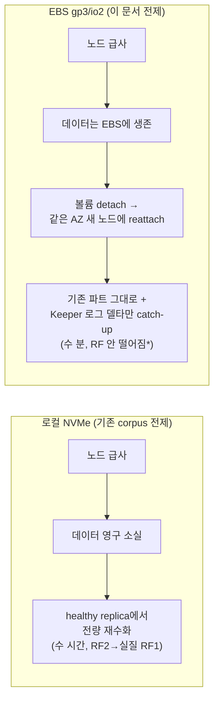
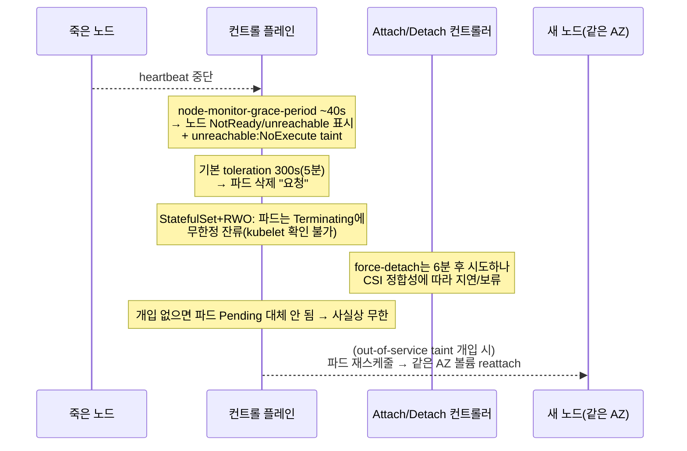

# operator 토폴로지·다운타임 — EBS 재부착이 바꾸는 복구 모델

[operator 선택]()이 "어느 operator를 쓸지"를, [배포 플레이북]()이 CHI/CHK 매니페스트 필드·RF 선택 확률·`insert_quorum` 주입 위치를, [operator 운영]()이 스케일 in/out 함정·롤링 업그레이드 순서·CRD 삭제 금지를 이미 깊게 다뤘다. 이 페이지는 그것들을 반복하지 않고, **전제 스토리지를 EBS(gp3/io2)로 바꿨을 때 다운타임 프로파일이 어떻게 근본적으로 뒤집히는가** 한 축에만 집중한다. 필드 전수·스케일·업그레이드는 위 세 페이지로 위임하고, 여기서는 EBS 재부착 역학·시나리오별 다운타임·EBS 특유 함정만 본문으로 쓴다.


**한눈에**

- 표준 ClickStack Helm(2차트)은 [ClickHouse Inc. 공식 operator]()(`ClickHouseCluster`/`KeeperCluster` CRD)를 쓴다. 우리는 그걸 그대로 안 쓰고 `clickhouse.enabled: false`(자체(self-hosted) ClickHouse에 연결하는 'HyperDX Only')로 CH/Keeper를 **Altinity CHI/CHK로 분리 운영**한다 — 아래 매니페스트는 전부 Altinity CRD 기준이다.
- **EBS-first면 "노드=데이터" 결합이 끊긴다**: 노드가 죽어도 데이터는 EBS 볼륨에 살아남아 detach→(같은 AZ) 새 노드에 reattach된다. 로컬 NVMe의 "노드 유실=전량 재수화(수 시간, RF2→실질 RF1)"가 EBS에선 "reattach+델타 catch-up(수 분, RF 온전)"이 된다.
- 기본 토폴로지: **1 shard × RF2(2 AZ)** + CHK 3노드(3 AZ). 0.7TB/월 규모에서 shard는 부채다.
- EBS 함정 둘: ① **AZ-bound** — 볼륨은 다른 AZ로 못 옮긴다. AZ 장애는 reattach로 못 풀고 cross-AZ replica만이 방어한다. ② **ungraceful node death의 무한 Terminating** — StatefulSet+RWO는 자동 복구 안 됨, `out-of-service` taint 개입이 정석.
- multi-attach로 replica를 대체할 수 없다(CH의 XFS/ext4는 동시 마운트 시 손상).


## 전제 뒤집기 — EBS면 "노드=데이터" 결합이 끊긴다

기존 corpus 전체([스토리지·로컬 NVMe](), 배포·운영 페이지)는 로컬 NVMe(i7i/i8g) 전제 위에서 **"노드 유실 = 데이터 유실 = 재수화(전량 재전송) 이벤트"**를 반복한다. 재수화 시간 ≈ 노드당 데이터량 / 재복제 대역이고, RF2는 그 창 동안 실질 RF1로 떨어진다는 게 핵심 위험이었다(근거는 clickhouse/02·04) `✓`.

**EBS-first는 이 인과 사슬의 첫 고리를 끊는다.** EBS 볼륨은 EC2 인스턴스와 독립된 네트워크 블록 스토리지라, 노드(인스턴스)가 사라져도 볼륨과 그 안의 데이터는 그대로 남는다 `✓`. Kubernetes/EBS CSI 관점에서 노드 유실은 "데이터 소실"이 아니라 **"볼륨을 죽은 노드에서 떼어(detach) 새 노드에 다시 붙이는(reattach) 작업"**이 된다 `✓`.



`*` 정확히는 reattach가 끝날 때까지 그 replica가 **일시 offline**이지 유실이 아니다. 데이터가 온전하므로 RF는 "감소"가 아니라 "일시 미가용"이고, catch-up은 Keeper 로그가 가리키는 밀린 파트(델타)만 fetch한다 — RMT가 로컬 파트 존재를 확인하고 누락분만 받는 표준 동작이라는 clickhouse/04 §무손실 지점의 EBS 귀결이다 `≈`. 다만 **reattach + CH startup(part-load) 실소요 시간은 hot 데이터량·파트 수에 좌우되며 아직 실측 전이다** `?`.

| 축 | 로컬 NVMe | EBS gp3/io2 |
|---|---|---|
| 노드 유실 시 데이터 | 소실 | **생존(볼륨에 잔존)** |
| 복구 동작 | 다른 replica에서 **전량 재fetch** | **볼륨 reattach + 델타 catch-up** |
| 복구 시간 지배 요인 | 노드당 데이터량 / 복제 대역 (수 시간) | detach/attach latency + CH startup (수 분) `≈` |
| 복구 중 redundancy | RF2 → 실질 RF1 (창 = 수 시간) | RF 온전(데이터 안 잃음), 그 replica만 수 분 offline |
| 2차 장애 노출 | 재수화 창 내내 (길다) | reattach 창만 (짧다) |
| AZ 이동 | 데이터 없으니 어느 AZ든 새로 채움 | **같은 AZ만 reattach 가능(볼륨이 AZ-bound)** |

**결론 `≈`**: 로컬 NVMe에서 "RF3·shard 수평 확장·On-Demand 강제"를 밀어붙인 이유의 상당 부분이 재수화 위험 창을 줄이려는 것이었다. EBS-first에서는 그 창이 애초에 짧으므로, 중소 규모(우리 RUM 0.7TB/월)에서는 **1 shard × RF2**가 훨씬 방어 가능한 기본값이 된다. 대신 EBS 고유의 새 위험 두 개 — **AZ-bound**와 **ungraceful death의 무한 Terminating** — 이 전면에 온다.

## EBS는 AZ에 묶인다 — reattach의 숨은 전제

EBS 볼륨은 **생성된 AZ에 물리적으로 고정**된다(zonal resource) `✓`. Kubernetes에서 이 볼륨을 감싼 PV는 `nodeAffinity`로 `topology.ebs.csi.aws.com/zone: <az>` 라벨을 달고, 이 제약은 **영구적**이다 `✓`.

- **정상 바인딩은 `WaitForFirstConsumer`로** `✓`: 파드가 스케줄된 뒤 그 노드의 AZ에 볼륨을 프로비저닝해 topology mismatch를 피한다. `Immediate` 바인딩은 "compute는 az-b, storage는 az-a" 데드락(`1 node(s) had volume node affinity conflict`)을 유발한다. StorageClass 예제와 gp3/io2 스펙은 [hot 스토리지·EBS]()로 위임한다.
- **reattach의 숨은 전제**: 죽은 노드의 파드를 재스케줄할 때, 그 PVC에 묶인 EBS 볼륨은 **같은 AZ의 노드로만** 붙을 수 있다 `✓`. 같은 AZ에 여유 노드가 없으면(또는 그 AZ가 통째로 죽었으면) 파드는 **Pending에 무한정 걸린다**. 즉 reattach는 "같은 AZ에 새 노드를 띄울 수 있다"는 전제 위에서만 자동 복구다.
- **그래서 AZ 장애는 여전히 replica로만 방어된다**: EBS는 다른 AZ로 못 옮기므로, AZ 하나가 죽으면 그 AZ의 모든 replica·볼륨이 접근 불가가 되고, **다른 AZ에 걸친 replica(cross-AZ RF)**만이 클러스터를 살린다. 이 지점에서 EBS와 로컬 NVMe의 처방이 수렴한다 — "replica를 서로 다른 AZ에" 강제하는 anti-affinity + `topologySpreadConstraints`는 둘 다 필수다.


**정정 — "EBS면 replica 없이도 내구성 99.999%면 충분"은 기각** `✓`. io2 Block Express 99.999% durability는 **단일 볼륨의 데이터 소실 확률**일 뿐이다. replica가 방어하는 것은 그게 아니라 (a) **AZ 장애**(볼륨이 AZ에 묶여 못 옮김), (b) **노드/AZ 유지보수·급사 중 가용성**(볼륨은 살아도 그 replica는 수 분~무한 offline), (c) 볼륨 자체 장애(gp3 AFR ≤0.2% = 1,000볼륨당 연 2건 안팎) `✓`. RF는 EBS에서도 필수이되 **이유가 내구성에서 가용성·AZ 방어로 옮겨간다**.


### EBS multi-attach로 replica를 대체할 수 없다

**통념 기각 `✓`**: "io2 multi-attach로 한 볼륨을 여러 노드가 공유하면 replica가 필요 없다"는 CH에 성립하지 않는다.

- multi-attach는 **io1/io2만**, **같은 AZ**, Nitro 최대 16 인스턴스.
- **cluster-aware 파일시스템(GFS2/OCFS2)이나 자체 락킹(Oracle RAC류)**에서만 안전하다. CH가 쓰는 표준 XFS/ext4를 multi-attach로 동시 마운트하면 **데이터 손상**이 발생한다.
- 부팅 볼륨 불가, 부착 중 on/off 불가.
- 결론: ClickHouse의 shared-nothing RMT 복제와 근본적으로 안 맞는다. multi-attach는 이 설계에서 **고려 대상이 아니다** `≈`.

## EBS 기반 replication & sharding — 우리 스케일의 토폴로지

### 왜 1 shard × RF2 (또는 RF3)인가

우리 워크로드는 RUM-only, prod 세션 샘플링 100% = **월 0.7TB**(사이징은 [용량 산정]()으로 위임). 이 규모에서 shard는 용량·병렬성 문제가 아니라 **불필요한 복잡성**이다 `≈`.

- **shard는 데이터 수평 분할** → 용량·쓰기 처리량·스캔 병렬성. 0.7TB/월이면 hot 티어를 EBS 단일 볼륨(gp3·io2 BE 모두 최대 64 TiB `✓`)에 몇 년치를 담고도 남는다. shard를 늘리면 [자동 rebalance 없음·수동 리샤딩]()이라는 운영 부채만 생긴다.
- **replica는 내구성·가용성** → 로컬 NVMe에선 "노드=데이터 유실 방어"였지만, EBS에선 위 §대로 **AZ 방어 + 가용성**이 목적. RF2(2 AZ)면 AZ 1개 소실에도 다른 AZ replica가 서빙한다.

**→ 기본 토폴로지: `shardsCount: 1`, `replicasCount: 2`, 2 AZ 분산. CHK 3노드는 3 AZ 분산.**

### replication 메커니즘 (EBS 관점 재해석)

`layout`을 선언하면 operator가 `remote_servers`와 per-host `macros`(`{shard}`/`{replica}`/`{cluster}`)를 자동 렌더한다 — 수동 `config.d` 불필요하다(필드 상세는 clickhouse/04로 위임) `✓`. self-host는 `ReplicatedMergeTree`(SharedMergeTree는 Cloud 전용) 강제 `✓`.

- **RMT 쓰기 경로(기본 async)**: Keeper 로그에 파트 등록 ack만 나면 클라이언트에 성공 반환, 나머지 replica는 뒤따라 fetch `✓`. EBS에서도 동일. 차이는 **한 replica가 offline(노드 교체)됐다 돌아왔을 때** — 로컬 NVMe면 볼륨이 비어 전량 fetch, EBS면 볼륨에 이전 파트가 그대로라 **Keeper 로그가 가리키는 누락 파트(델타)만** fetch한다 `≈`.
- **1 shard이므로 Distributed 테이블·sharding key가 사실상 불필요** `≈`: 단일 shard면 모든 데이터가 한 shard에 있고 replica는 그 사본이다. HyperDX/ClickStack이 만드는 테이블도 단일 클러스터/단일 shard에서 그대로 동작한다. Distributed 테이블·`remote_servers` weight·`INSERT INTO SELECT` 리샤딩은 shard가 2+일 때만 의미가 있고, 그 절차는 [operator 운영]()으로 위임한다.

### RF2 vs RF3 — EBS에서 판단이 어떻게 달라지나

[배포 플레이북]()의 조합 산술(RF2 × 다중 shard에서 임의 2대 유실 시 손실 노출)·`insert_quorum` 주입 함정은 **로컬 NVMe에서 "2대 유실 = 2 데이터 소실"**을 전제한다. EBS에선 노드 유실이 데이터 소실이 아니므로 그 산술이 그대로 적용되지 않는다 `≈`. 확률·비용의 정량은 위 페이지로 위임하고, 여기선 EBS 관점의 재해석만 정리한다.

| | RF2 (2 AZ) — EBS 기본 | RF3 (3 AZ) — 승급 |
|---|---|---|
| shard당 사본 | 2 | 3 |
| 노드 급사 1대 | 데이터 생존(reattach), 그 replica 수 분 offline | 동일, 여유 큼 |
| AZ 1개 소실 | 다른 AZ 1 replica가 서빙(그동안 그 shard 실질 RF1, 데이터는 살아있는 AZ에 온전) | 다른 2 AZ에 2 replica 잔존 → 무손실·무저하 |
| 볼륨 자체 장애(AFR ≤0.2%) | 다른 replica가 방어 | 2 replica 방어 |
| 비용 배수(산정은 06) | ×2 (EBS $/GB + cross-AZ 복제 트래픽) `≈` | ×3 |

**EBS에서 RF3 승급 트리거 `≈`**:

1. **"AZ 1개 소실 중에도 무저하"**가 요구일 때 — RF2 2AZ는 AZ 소실 시 그 shard가 단일 AZ 단일 사본으로 떨어진다(데이터는 안전하나 그 창 동안 그 AZ까지 죽으면 가용성 상실). RF3 3AZ는 AZ 하나 죽어도 2 사본.
2. **`insert_quorum: 2`를 상시 켜고 싶을 때** — RF2에서 한 replica가 reattach 중이면 확정 가능 replica가 1이라 `insert_quorum: 2`가 쓰기를 차단한다. RF3면 reattach 중에도 2 사본이라 쓰기·내구성 양립(quorum 프로파일 주입 함정은 clickhouse/04로 위임).
3. 규제/무손실 요구.

**우리 RUM 기본값 `≈`: RF2 2AZ.** 0.7TB/월·관측성 append-only·재부착 창이 수 분이라 RF2의 노출이 실무상 수용 가능하다. AZ 무저하 생존이 명시 요구가 되면 RF3로 승급한다.

### EBS 기반 CHI YAML 초안 (1 shard × RF2, gp3, 2 AZ)

> 필드 전수 설명은 [배포 플레이북]()으로 위임한다. 여기선 **EBS·다운타임 관련 필드만** 주석한다. 데이터 노드는 EBS 기반 Graviton **r7g**(메모리 최적화) 노드풀 기준이다(r8g/Graviton4는 상위 옵션 `≈`). 로컬 NVMe(i7i/i8g)는 이 카테고리 기본이 아니다 → [스토리지·로컬 NVMe](). **인스턴스별 EBS-optimized 대역폭 상한이 gp3 볼륨 스펙(2,000 MiB/s)보다 낮아 실효 병목이 될 수 있다** — 상세는 [hot 스토리지·EBS]().

```yaml
apiVersion: "clickhouse.altinity.com/v1"
kind: "ClickHouseInstallation"
metadata:
  name: hyperdx-ch
  namespace: clickhouse
spec:
  defaults:
    storageManagement:
      provisioner: StatefulSet     # EBS도 기본 StatefulSet. 온라인 확장이 필요하면 Operator provisioner(§노브 주의)
      reclaimPolicy: Retain        # CHI/STS 삭제·helm uninstall에도 EBS PVC 잔존(실수 삭제 방어)
    templates:
      podTemplate: ch-ebs
      dataVolumeClaimTemplate: data-gp3     # → /var/lib/clickhouse
      logVolumeClaimTemplate:  log-gp3      # → /var/log/clickhouse-server
      serviceTemplate: ch-svc
  configuration:
    zookeeper:
      keeper: { name: hyperdx-keeper }      # 아래 CHK를 이름으로 참조(0.27.0+). 고전 nodes 방식은 clickhouse/04
      session_timeout_ms: 30000
    clusters:
      - name: main
        pdbManaged: "yes"          # PDB 자동 생성(§PDB)
        pdbMaxUnavailable: 1       # 한 번에 replica 1개만 down → 자발적 중단 직렬화
        layout:
          shardsCount: 1           # 우리 스케일: 단일 shard로 충분(리샤딩 부채 회피)
          replicasCount: 2         # RF2. AZ 무저하 요구 시 3
    settings:
      max_concurrent_queries: 200
      logger/level: information
    users:
      app/k8s_secret_password: default/ch-secret/password_sha256   # 시크릿 참조(평문 금지)
      app/networks/ip: ["10.0.0.0/8"]
      app/profile: default
  templates:
    podTemplates:
      - name: ch-ebs
        podDistribution:
          - { type: ClickHouseAntiAffinity, topologyKey: "kubernetes.io/hostname" }   # replica를 서로 다른 노드에(1 shard라 ShardAntiAffinity와 동치)
        spec:
          # AZ 분산은 topologySpreadConstraints로 강제(EBS AZ-bound 방어의 핵심)
          topologySpreadConstraints:
            - maxSkew: 1
              topologyKey: "topology.kubernetes.io/zone"
              whenUnsatisfiable: DoNotSchedule
              labelSelector:
                matchLabels:
                  clickhouse.altinity.com/cluster: main   # [미확인] 정확한 라벨 키는 배포 후 kubectl get pod --show-labels로 확인
          nodeSelector: { workload: clickhouse }          # r7g 전용 노드풀
          tolerations:
            - { key: dedicated, operator: Equal, value: clickhouse, effect: NoSchedule }
          containers:
            - name: clickhouse
              image: clickhouse/clickhouse-server:24.8   # ClickStack 병용 요구: 24.8 LTS+. 차트 기본태그는 관찰값일 뿐
              resources:
                requests: { cpu: "4", memory: "32Gi" }
                limits:   { cpu: "4", memory: "32Gi" }
    volumeClaimTemplates:
      - name: data-gp3
        reclaimPolicy: Retain
        spec:
          accessModes: ["ReadWriteOnce"]           # EBS는 RWO(multi-attach 불가, §multi-attach)
          storageClassName: gp3                     # WaitForFirstConsumer gp3 SC(자매 02로 위임)
          resources: { requests: { storage: 1000Gi } }   # prod hot 티어 노드당 order ~1TB. staging은 훨씬 작게(10~100Gi). 실값은 06
      - name: log-gp3
        spec:
          accessModes: ["ReadWriteOnce"]
          storageClassName: gp3
          resources: { requests: { storage: 50Gi } }
    serviceTemplates:
      - name: ch-svc
        spec:
          type: ClusterIP
          ports:
            - { name: http, port: 8123 }
            - { name: tcp,  port: 9000 }
```

> **podDistribution enum(CRD 원문 확인) `✓`**: `ClickHouseAntiAffinity` / `ShardAntiAffinity` / `ReplicaAntiAffinity` / `MaxNumberPerNode` / `CircularReplication` 등. 우리는 1 shard라 `ClickHouseAntiAffinity`(hostname)로 replica 분리 + `topologySpreadConstraints`(zone)로 AZ 분산이면 충분하다. shard가 2+로 커지면 `ShardAntiAffinity`(hostname+zone 이중)로 전환한다(clickhouse/05로 위임).

### EBS 기반 CHK YAML 초안 (3노드, gp3, 3 AZ)

```yaml
apiVersion: "clickhouse-keeper.altinity.com/v1"
kind: "ClickHouseKeeperInstallation"
metadata:
  name: hyperdx-keeper
  namespace: clickhouse
  annotations: { prometheus.io/port: "7000", prometheus.io/scrape: "true" }
spec:
  configuration:
    clusters:
      - name: keeper
        layout: { replicasCount: 3 }      # 홀수 3노드 정족수(1 장애 허용). Raft 산술은 05-keeper로 위임
    settings:
      keeper_server/tcp_port: "2181"
      listen_host: "0.0.0.0"
      keeper_server/four_letter_word_white_list: "*"   # ruok/imok 라이브니스(0.27.0+)
      prometheus/endpoint: "/metrics"
      prometheus/port: "7000"
      prometheus/metrics: "true"
  defaults:
    templates: { podTemplate: keeper-pod, dataVolumeClaimTemplate: keeper-data }
  templates:
    podTemplates:
      - name: keeper-pod
        spec:
          affinity:
            podAntiAffinity:
              requiredDuringSchedulingIgnoredDuringExecution:
                - labelSelector:
                    matchExpressions:
                      - { key: "app", operator: In, values: ["clickhouse-keeper"] }
                  topologyKey: "kubernetes.io/hostname"      # 3 Keeper를 서로 다른 노드(가능하면 3 AZ)
          containers:
            - name: clickhouse-keeper
              image: "clickhouse/clickhouse-keeper:24.8"     # CH와 버전 정렬(24.8 LTS+)
              resources:
                requests: { memory: "256M", cpu: "1" }
                limits:   { memory: "4Gi",  cpu: "2" }
    volumeClaimTemplates:
      - name: keeper-data
        spec:
          accessModes: ["ReadWriteOnce"]
          storageClassName: gp3      # Keeper는 gp3(영속) — 로컬 NVMe에 두면 노드 급사 시 Raft 메타 소실. 저지연 fdatasync가 관건, 20Gi급 충분(05-keeper로 위임)
          resources: { requests: { storage: 20Gi } }
```

> **EBS 관점의 Keeper 이점 `≈`**: Keeper 데이터를 gp3에 두면 노드가 급사해도 Raft 로그/스냅샷이 볼륨에 살아남아, 데이터 경로 CH와 마찬가지로 **reattach로 정족수를 되살린다**. 로컬 NVMe였다면 Keeper 노드 급사가 곧 메타데이터 소실이라 앙상블 재구성이 훨씬 번거롭다. EBS-first는 데이터 경로와 조정 경로의 복구 모델을 통일한다.

## 다운타임 상세 — 시나리오별 (EBS 관점)

> 복제·멀티마스터 관점의 failover 의미론(왜 "승격" 절차가 없는지·split-brain 방지·정족수 상실 시 read-only)은 [복제·멀티마스터·failover]()가 기준 문서다. 이 절은 그 위에서 **EBS 물리 역학·복구 절차**만 다룬다.

전제: 위 **1 shard × RF2(2 AZ)** + CHK 3노드(3 AZ), operator PDB 자동(`pdbMaxUnavailable: 1`), 쓰기는 기본 async(`insert_quorum` 미설정).

| # | 시나리오 | 무슨 일 | 읽기 | 쓰기 | 대략 소요 | EBS 특유 포인트 |
|---|---|---|---|---|---|---|
| S1 | **설정 변경 reconcile**(config.d) | ConfigMap 갱신 → 각 host 파드 순차 in-place 재시작 | 무중단(다른 replica 서빙) | 무중단(async) | 전파 대기 + replica 수 × 파드 재시작 | **볼륨 detach 안 함** — 같은 노드에서 파드만 재생성, EBS 그대로 유지 |
| S2 | **CH 이미지 롤링 업그레이드** | replica 1개씩 restart, 분산쿼리에서 low-priority 제외 | 무중단 | 무중단(async) | replica 수 × (종료+startup+catch-up) | in-place restart, reattach 없음. 절차·혼합버전 창은 [clickhouse/05]() |
| S3 | **operator 업그레이드** | operator Deployment 교체, 대개 CH 파드 불변 | 무중단 | 무중단 | 분 단위 | 데이터 경로 무영향. minor 스킵·CRD 삭제 금지는 [clickhouse/05]() |
| S4 | **계획된 노드 교체**(drain / Karpenter voluntary) | cordon→drain(PDB 준수)→볼륨 detach→같은 AZ 새 노드 attach→startup→catch-up | 무중단(`pdbMaxUnavailable:1`) | 무중단 | detach+attach+startup ≈ **수 분** `≈` | **재수화 없음**. Karpenter ≥ v1.0은 VolumeAttachment 삭제까지 대기 후 노드 종료 `✓` |
| S5 | **노드 재부팅**(같은 노드 복귀) | 파드 잠깐 down → 같은 노드에서 복귀, 볼륨 유지 | 그 replica만 잠깐 offline | 무중단(async) | 재부팅+CH startup | 볼륨 detach조차 없음 — 가장 가벼운 케이스 |
| S6 | **파드 재스케줄**(graceful, `kubectl delete pod`) | 파드 정상 종료 → 볼륨 detach → 같은 AZ 노드에 reattach | 그 replica만 수 분 offline | 무중단(async) | detach+attach+startup ≈ 수 분 `≈` | graceful이라 CSI가 NodeUnstage를 정상 수행 → 자동 reattach 성공 |
| S7 | **노드 급사**(hardware/OS hang, **ungraceful**) | 파드 Terminating에 걸림; 6분 force-detach; out-of-service taint로 즉시화 | 그 replica offline, 나머지 서빙 → **읽기 무중단** | **async면 무중단**(다른 replica로) | **무개입 시 무한/6분+**, taint 개입 시 수 분 `✓` | 아래 상세. **자동 복구 안 됨 — 개입 필요** |
| S8 | **AZ 장애** | 그 AZ의 replica·EBS 접근 불가, **다른 AZ로 볼륨 못 옮김** | 다른 AZ replica가 서빙(cross-AZ RF 전제) | 다른 AZ replica로 무중단 | AZ 복구까지 그 replica 미가용 | **EBS AZ-bound** → reattach 불가. **RF(cross-AZ)만이 방어**. RF2 2AZ면 그 shard 실질 RF1 |
| S9 | **Keeper 정족수 상실**(3노드 중 2 소실) | 조정 계층 정지 | 로컬 파트 read OK | **INSERT/DDL 정지(read-only 전락)** | 정족수 복구까지 | CHK gp3라 노드 급사해도 Raft 메타 생존 → reattach로 복구. 상세는 [05-keeper]() |

**핵심 대비**: S4~S6에서 로컬 NVMe였다면 "재수화 이벤트"(수 시간, RF2→실질 RF1)였을 것이 EBS에선 "reattach + 델타 catch-up"(수 분, RF 온전)이 된다. 반면 S8(AZ 장애)은 EBS·로컬 NVMe 모두 cross-AZ RF가 유일 방어라는 점에서 동일하다.

### S7 상세 — ungraceful node death의 진짜 다운타임 (EBS 최대 함정)


**"EBS면 노드가 죽어도 자동으로 새 노드에 붙어 복구된다"는 절반만 맞다** `✓`. **graceful**(drain, `kubectl delete pod`, Karpenter voluntary)이면 맞다. 하지만 **ungraceful**(하드웨어 급사, OS hang, 네트워크 단절)이면 StatefulSet + RWO(EBS) 조합은 **자동 복구되지 않고 파드가 Terminating에 무한정 걸린다**. 운영자 개입이 필요하다.


{}
**왜 무한 Terminating인가** `✓`: Kubernetes는 죽은 노드의 파드가 정말 멈췄는지 확인할 수 없다(kubelet 응답 없음). RWO 볼륨을 새 노드에 붙였는데 옛 노드에서 파드가 아직 살아 쓰고 있으면 **더블 마운트=데이터 손상**이므로, 컨트롤 플레인은 안전하게 "확인 불가"를 택하고 파드를 Terminating으로 남긴다. StatefulSet은 at-most-one 보장 때문에 옛 파드가 완전히 사라지기 전엔 대체 파드를 만들지 않는다.



- **node-monitor-grace-period ≈ 40s**: 노드 NotReady 표시 `✓`. 단 EKS 관리형 컨트롤 플레인의 실제 기본값은 사용자가 못 바꾸는 값이라 배포 시 재확인 권장 `≈`.
- **기본 toleration `node.kubernetes.io/unreachable:NoExecute` tolerationSeconds=300(5분)**: 이후 파드 삭제 요청 `✓`.
- **Attach/Detach 컨트롤러 force-detach: 6분 대기** `✓`. 단 CSI 정합성(옛 노드에서 NodeUnstage/Unpublish 미확인) 때문에 실제로는 보류될 수 있고, 그 사이 새 노드 attach 시도는 `Multi-Attach error for volume ... already exclusively attached to one node` 이벤트를 낸다 `✓`.
- **결과**: 개입 없으면 StatefulSet 대체 파드가 안 뜨고 그 replica는 무한 미가용. (읽기·쓰기 자체는 RF2의 다른 replica가 계속 서빙하므로 **클러스터 다운은 아니다** — 저하 상태.)

**복구(개입)** `✓`:

```bash
# 1. 노드가 정말 죽었음을 확인(재부팅 중이 아님) — 오판하면 더블 마운트 위험
# 2. out-of-service taint로 강제 정리(K8s 1.28 GA, NodeOutOfServiceVolumeDetach)
kubectl taint nodes <dead-node> node.kubernetes.io/out-of-service=nodeshutdown:NoExecute
#    → 파드 강제 삭제 + EBS 즉시 detach → 같은 AZ 새 노드에 reattach → CH startup → 델타 catch-up
# 3. 노드 복구 후 taint 제거
kubectl taint nodes <dead-node> node.kubernetes.io/out-of-service=nodeshutdown:NoExecute-
```

- taint 없이 `kubectl delete pod --force`도 파드는 지우지만, force-detach 6분과 CSI 정합성 문제를 우회하지 못할 수 있어 **out-of-service taint가 정석** `✓`.
- **자동화 고려 `≈`**: 프로덕션은 node-problem-detector + 자동 taint 부여(예: Medik8s NHC류)로 이 개입을 자동화한다. 단 "정말 죽었나" 오판 시 더블 마운트 위험이 있어 도구·타이밍은 별도 검증이 필요하다 `?`.

**EBS vs 로컬 NVMe의 역설 `≈`**: 로컬 NVMe는 노드 급사 시 데이터가 어차피 사라지므로 "새 노드에서 빈 볼륨으로 재수화"가 자연스러워 무한 Terminating이 상대적으로 덜 아프다(어차피 재구축). EBS는 데이터가 살아있어 reattach만 하면 되는데, **바로 그 RWO 안전장치 때문에 자동 reattach가 막혀** 개입이 필요하다. EBS의 강점(데이터 생존)이 이 시나리오에선 운영 개입 요구로 되돌아온다.
{}

## 배치 강제 — 노드/AZ 1개 소실이 shard 전멸이 되지 않게

replica를 2벌 두는 것만으로는 부족하고, **서로 다른 고장 도메인**에 놓여야 한다. EBS-first에서 이 규칙은 로컬 NVMe와 같되 **"AZ 분산"의 무게가 더 크다** — EBS가 AZ-bound라 AZ 방어가 유일하게 reattach로 못 푸는 축이기 때문이다.

| 기제 | 필드 | 막는 것 | EBS 관점 |
|---|---|---|---|
| hostname anti-affinity | `podDistribution: ClickHouseAntiAffinity`(hostname) | 같은 shard replica의 노드 co-location | 한 노드 죽어도 shard 생존 |
| AZ topology spread | `topologySpreadConstraints`(`whenUnsatisfiable: DoNotSchedule`) — 다중 shard면 `ShardAntiAffinity`(zone) 병용 | 같은 shard replica의 AZ 몰림 | **EBS 핵심** — AZ 장애 시 reattach 불가라 cross-AZ replica가 유일 방어 |
| PDB | `pdbManaged: yes` + `pdbMaxUnavailable: 1` | 자발적 중단이 같은 shard 2대 동시 down | drain/롤링/consolidation 직렬화 |

- **RF2를 2 AZ에 펴면 AZ 1개 소실 시 그 shard가 단일 AZ 단일 사본으로 하락** `≈`. 데이터는 살아있는 AZ에 온전하나, 그 창 동안 그 AZ까지 흔들리면 가용성 상실. "AZ 무저하"가 요구면 RF3 3AZ.
- **PDB는 자발적 중단만 막는다** `✓`. S7(급사) 같은 비자발적 시간차 장애는 PDB로 못 막고, 그 방어는 RF(+빠른 out-of-service 복구)다.

## PDB·probe·reconcile 노브가 롤링 다운타임에 미치는 영향

> 롤링 업그레이드의 **버전 호환 매트릭스·`compatibility` 설정·다운그레이드 비지원·EBS 스냅샷 롤백**은 [버전 호환·업그레이드]()가 기준 문서다. 이 절은 그 아래의 다운타임 물리 역학(PDB·probe·reconcile)만 다룬다.

롤링·reconcile 중 "한 번에 얼마나 오래, 몇 개가 down되나"를 정하는 operator 노브들. CRD 원문(`clickhouse-operator-install-bundle.yaml`)으로 확인 `✓`.

이 노브들이 실제로 걸리는 자리는 operator 내부 reconcile 루프다. 이벤트는 ListenQueue → Add/DeleteCHI 핸들러로 들어와 WalkTillError로 CHI→Cluster→Shard→Host 단위까지 순차 reconcile되는데, host 단계의 마지막이 `waitStatefulSetGeneration`이다 — 이름 그대로 **operator가 reconcile 전체 시간의 대부분을 이 대기 구간에서 소모한다**. 아래 `reconcile.host.wait.probes`(readiness 게이팅)·`reconcile.host.wait.replicas`(catch-up 게이팅)가 바로 이 대기를 얼마나 길게·엄격하게 만들지 조절하는 노브다.


*clickhouse-operator의 reconcile 이벤트 처리 흐름: ListenQueue가 CHI Add/Update/Delete 이벤트를 받아 WalkTillError로 CHI → Cluster → Shard → Host 단위를 순차 reconcile하고, host 단계 마지막의 waitStatefulSetGeneration에서 새 StatefulSet generation이 준비될 때까지 대기한다("Waiting HERE most of the time"). 출처: [Altinity/clickhouse-operator](https://github.com/Altinity/clickhouse-operator) — © Altinity Ltd, Apache License 2.0*

- **PDB(자동 생성)**: `pdbManaged`(기본 enabled)로 operator가 cluster 단위 PDB를 자동 생성·reconcile한다. `pdbMaxUnavailable: 1`이 표준 — drain/consolidation/롤링이 같은 shard 2대를 동시에 못 내리게 직렬화한다. `0`이면 자발적 eviction 전면 차단.
- **probe와 host launch 대기(`reconcile.host.wait.probes`)**: `startup`은 **기본 대기 안 함**, `readiness`는 **기본 대기**. 즉 롤링에서 operator는 readiness 통과를 기본으로 게이팅한다. **EBS reattach 후 CH가 파트를 로드해 readiness에 도달하는 시간이 곧 그 host의 "다음으로 넘어가기까지 지연"이다.** hot 데이터가 크면 part-load가 길어져 롤링 총 시간이 늘 수 있다(part-load 실측 필요) `≈`. liveness/readiness는 CH `/ping`(HTTP 8123)에 GET하며, `suspend: true`면 probe가 비활성화된다 `✓`.
- **catch-up 게이팅(`reconcile.host.wait.replicas`)**: `.new`/`.all`/`.delay`로 reattach·scale-out 후 "따라잡을 때까지 다음 단계 보류"를 강제. EBS 델타 catch-up은 로컬 NVMe 전량 재수화보다 짧으므로 이 대기도 짧게 끝날 가능성이 높다 `≈`.
- **STS 업데이트 실패 안전장치(`reconcile.statefulSet.update`)**: `timeout`(0–3600s, Ready 대기 상한)·`pollInterval`(1–600s)·`onFailure`(`abort`|`rollback`|`ignore`). EBS reattach가 지연돼 timeout을 넘기면 이 정책이 발동하므로, hot 데이터가 큰 노드는 `timeout`을 넉넉히 잡는다 `≈`.
- **볼륨 소실 처리(`reconcile.host.drop.replicas`)**: `onDelete`/`onLostVolume`/`active`. EBS에선 볼륨이 잘 안 사라지므로(reattach) 이 경로는 로컬 NVMe만큼 자주 타지 않지만, 볼륨 자체 장애(AFR ≤0.2%)로 새 볼륨을 세울 땐 `onLostVolume: yes` + `active: no`(살아있는 replica는 절대 drop 안 함)로 Keeper 등록을 정리한다 `≈`.
- shard 병렬 reconcile(`reconcileShardsThreadsNumber` 1 / `reconcileShardsMaxConcurrencyPercent` 50%)은 우리 1 shard에선 무의미하고, 다중 shard로 커질 때의 조기 경보 역할은 [clickhouse/05]()로 위임한다.

## 우리 케이스에서는

- **토폴로지 기본값**: `shardsCount: 1` × `replicasCount: 2`(RF2, 2 AZ) + CHK 3노드(3 AZ). 0.7TB/월 규모에선 shard가 부채이므로 단일 shard로 시작하고, replica는 AZ 방어·가용성 목적으로 2 AZ에 흩뿌린다. 데이터 노드는 r7g(메모리 최적화) 노드풀, hot PVC는 prod 노드당 order ~1TB(스테이징은 훨씬 작게).
- **RF2로 시작, RF3는 트리거 기반 승급**: "AZ 1개 소실 중에도 무저하" 또는 "`insert_quorum: 2` 상시"가 요구가 되는 순간에만 RF3. EBS는 노드 급사가 데이터 소실이 아니라 reattach라, 로컬 NVMe만큼 공격적으로 RF3를 강제할 이유가 약하다.
- **다운타임 룰 3가지를 팀 룰로 못박는다**:
  1. **급사 노드 복구는 out-of-service taint가 정석** — 무개입 시 파드가 무한 Terminating. node-problem-detector 기반 자동 taint를 staging에서 먼저 검증한다.
  2. **AZ 분산은 타협 불가** — EBS는 AZ-bound라 AZ 장애는 reattach로 못 푼다. `ClickHouseAntiAffinity(hostname)` + `topologySpreadConstraints(DoNotSchedule, zone)` 병용.
  3. **Karpenter는 데이터 노드에 `do-not-disrupt` + `consolidationPolicy: WhenEmpty`** — voluntary consolidation이 불필요한 detach/reattach를 유발하지 않게. Karpenter ≥ v1.0은 VolumeAttachment 삭제까지 대기하므로 graceful 경로는 안전하나, churn을 줄이는 게 낫다 `≈`.
- **staging에서 반드시 리허설할 것**: (a) 노드 drain → reattach 시간 실측, (b) 노드 강제 종료(ungraceful) → out-of-service taint 복구 리허설, (c) AZ 1개 시뮬레이션 종료 → RF2 서빙 확인, (d) reattach 후 CH readiness(part-load) 소요 실측 → `reconcile.statefulSet.update.timeout` 튜닝. reattach+part-load 실소요와 델타 catch-up 실 fetch량은 아직 `?`이라 이 리허설이 그 공백을 메운다.
- 시점 기준 2026-07.
