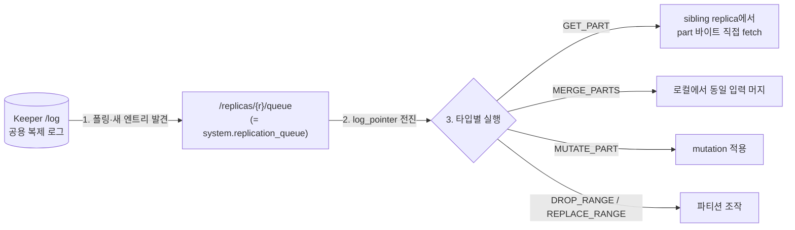
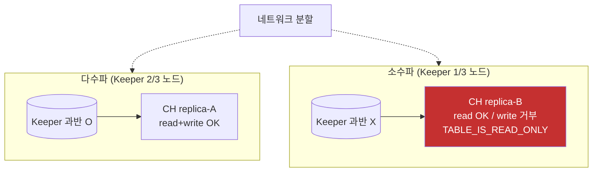

# 복제·멀티마스터·failover — 승격 없는 다중 마스터 복구 모델

HyperDX 스택의 self-host ClickHouse는 `ReplicatedMergeTree`(RMT)가 강제되고, 그 복제 모델은 PostgreSQL·MySQL의 primary-replica와 근본적으로 다르다 — **멀티마스터**다. 이 차이가 우리 운영에서 실제로 무엇을 바꾸는지, 특히 "노드 하나가 죽으면 무슨 일이 벌어지나"와 "RF2에서 노드 작업이 안전한가"에 답하는 것이 이 페이지의 목적이다.

이 페이지는 이미 다른 문서가 깊게 다룬 것을 반복하지 않는다. 다운타임 시나리오의 물리 역학·EBS 재부착 절차는 [operator 토폴로지·다운타임]()(S1~S9)이, Keeper 자체(NuRaft·정족수 산술·"큐가 아니다"·async_insert)는 [Keeper]()가, 재수화 위험 창·zero-copy 금지는 [스토리지·로컬 NVMe]()가, `insert_quorum` 주입 위치·RF2/RF3 산술은 [배포 플레이북]()이, 스케일·롤링 업그레이드는 [operator 운영]()이 정본이다. 여기서는 그것들을 링크로 위임하고, **복제 메커니즘 자체 + 멀티마스터 데이터 모델 + 승격 없는 failover 의미론** 한 축만 본문으로 쓴다.


**한눈에**

- **멀티마스터**다: 모든 replica가 INSERT를 수용하고 단일 primary/leader가 없다. 그래서 replica 하나가 죽어도 **"승격(promotion) failover" 절차가 존재하지 않는다** — 살아있는 replica가 read+write를 그대로 계속한다 `✓`.
- **Keeper는 복제를 조율할 뿐 데이터를 저장하지 않는다**: 복제 로그·part 참조·블록 dedup 체크섬만 담고, part 바이트는 replica끼리 직접 fetch한다. SELECT은 Keeper를 아예 타지 않는다 `✓`.
- **Keeper 정족수를 잃으면 테이블이 read-only로 전락**한다(INSERT/DDL 거부, SELECT은 계속). 데이터 노드가 전부 멀쩡해도 조정 계층 과반 상실만으로 쓰기가 멈추는 것 — 이 아키텍처의 진짜 SPOF다 `✓`.
- **RF2 + anti-affinity(hostname) + topologySpread(AZ) + PDB(maxUnavailable 1)면 consolidation·노드 작업이 안전**하다. 한 번에 한 replica만 내려가고, EBS라 재수화(로컬 NVMe면 수 시간)가 아니라 reattach라 실질 RF1 창이 수 분이다. 2차 하드웨어 장애까지 견디려면 RF3, 창 발생 빈도를 줄이려면 LTS 고정이다.


## ReplicatedMergeTree 복제 구조

### 각 replica = 완전한 사본, part 단위 복제

RMT 복제의 단위는 shard 안의 **replica**이고, 같은 shard의 replica들은 각자 **완전한 데이터 사본**을 자기 로컬 디스크(우리 전제로는 EBS 볼륨)에 보유한다 — shared-nothing이다 `✓`. 공유 스토리지가 아니라 replica마다 물리적으로 독립된 사본이므로, S3 cold 티어에서도 데이터가 RF만큼 중복 저장된다(티어링≠내구성의 근거는 [스토리지·로컬 NVMe]()로 위임).

복제는 **테이블(엔진) 레벨**에서 선언한다. 첫 인자가 shard별로 유일한 Keeper znode 경로, 둘째가 replica 식별자다 `✓`.

```sql
CREATE TABLE otel_logs (...)
ENGINE = ReplicatedMergeTree('/clickhouse/tables/{shard}/{table}', '{replica}')
ORDER BY (...);
-- {shard}/{replica}는 operator가 host별 macros로 자동 렌더 → 수동 config.d 불필요
```

핵심 정정 하나: RMT 복제는 PostgreSQL WAL·MySQL binlog처럼 **row/statement 스트림을 흘리는 게 아니라 data part 단위**로 동작한다 `✓`. INSERT는 로컬에서 즉시 하나의 part로 굳고, 그 part의 존재·이름·블록번호·체크섬만 Keeper 로그에 등록되며, 다른 replica가 그 로그를 보고 **part 바이트를 sibling에서 직접 당겨온다**. 공식 복제 문서 원문 `✓`:

> *"During replication, only the source data to insert is transferred over the network. Further data transformation (merging) is coordinated and performed on all the replicas in the same way."*

즉 INSERT로 들어온 원천 데이터만 네트워크로 오가고, **머지(part 재조합)는 각 replica가 동일한 방식으로 독립 수행**한다 — 머지 결과 part를 통째로 다시 복제하지 않는다.

### 동기화 메커니즘 — /log → replication_queue → 실행 (pull 모델)

각 replica는 **스스로** 다음 루프를 돈다. 쓰기를 받은 replica가 다른 replica에 push하는 게 아니라, 각 replica가 공용 `/log`를 보고 스스로 당겨오는 **pull 모델**이다 `✓`. 그래서 잠깐 offline이던 replica가 돌아오면 자기 `log_pointer` 이후 밀린 엔트리만 이어 소비하면 된다(catch-up).



`system.replication_queue.type`의 주요 enum `✓`:

| type | 의미 |
|---|---|
| `GET_PART` | 다른 replica에서 part를 가져와라(INSERT 복제의 기본) |
| `MERGE_PARTS` | 지정 part들을 머지해 새 part 생성 |
| `MUTATE_PART` | part에 mutation(ALTER UPDATE/DELETE) 적용 |
| `DROP_RANGE` / `REPLACE_RANGE` | 파티션/범위 삭제·교체 |
| `ATTACH_PART` / `CLEAR_COLUMN` / `CLEAR_INDEX` / `ALTER_METADATA` | attach·컬럼/인덱스 제거·스키마 변경 |

### 진단 — system.replicas / system.replication_queue

lag과 이상 징후는 이 두 테이블로 본다 `✓`. 멀티마스터라 "primary lag" 개념이 없고, replica별 로그 소비 진행도(`log_pointer` vs `log_max_index`)와 `absolute_delay`(초)로 뒤처짐을 잰다.

| 컬럼(`system.replicas`) | 의미 |
|---|---|
| `is_readonly` | **read-only 여부** — Keeper 연결·정족수 문제 시 켜짐(§중단과 failover) |
| `absolute_delay`(정밀 정의는 버전 확인 권장) | 복제 지연(초) — 가장 앞선 replica 대비 이 replica가 얼마나 뒤졌나 `✓` |
| `log_max_index` / `log_pointer` | `/log` 최대 엔트리 번호 / 이 replica가 소비한 위치. `log_pointer` ≪ `log_max_index`면 못 따라가는 중 |
| `queue_size` / `inserts_in_queue` / `merges_in_queue` | 대기 작업 총수·유형별 |
| `total_replicas` / `active_replicas` | 전체 / Keeper 세션 보유(활성) replica 수 |
| `is_leader` / `can_become_leader` | 머지 할당자 여부(primary 아님, §멀티마스터) |

```sql
-- 지연·read-only·큐 적체 한눈에
SELECT database, table, is_readonly, absolute_delay,
       queue_size, log_pointer, log_max_index,
       (log_max_index - log_pointer) AS behind
FROM system.replicas
WHERE absolute_delay > 60 OR is_readonly OR (log_max_index - log_pointer) > 100;

-- 막힌 큐 엔트리(num_tries↑·오래된 create_time = 적체)
SELECT database, table, replica_name, type, num_tries, num_postponed,
       postpone_reason, last_exception, create_time
FROM system.replication_queue
WHERE num_tries > 10 OR create_time < now() - INTERVAL 1 HOUR
ORDER BY create_time;
```

복구 명령 `✓`: `SYSTEM SYNC REPLICA db.table`(현재 `/log`의 모든 엔트리를 소비할 때까지 블록), `SYSTEM RESTART REPLICA`(Keeper 상태 재초기화 — 큐 이상 시 Altinity KB가 *"simplest approach"*로 제시), `SYSTEM RESTORE REPLICA`(Keeper 메타 소실 시 로컬 part로 복구), `SYSTEM DROP REPLICA 'name'`(죽은 replica의 stale 등록 정리 — 활성 replica엔 금지). (`SYSTEM SYNC REPLICA`의 LIGHTWEIGHT/STRICT/PULL 모드는 버전 의존이라 도입 CH 버전 문서로 재확인 `?`. operator scale-in의 DROP REPLICA 리드는 [operator 운영]()로 위임.)

## 멀티마스터 — 단일 리더가 없다

### 모든 replica가 INSERT를 수용한다

공식 복제 문서 원문 `✓`:

> *"Replication is asynchronous and multi-master. `INSERT` queries (as well as `ALTER`) can be sent to any available server."*

RMT는 **비동기·멀티마스터**다. INSERT도 ALTER도 아무 살아있는 서버(replica)로나 보낼 수 있다. 어느 replica가 받든 ① 자기 로컬 디스크에 part로 쓰고, ② Keeper `/log`에 `GET_PART` 엔트리 + 블록번호 + dedup 체크섬을 등록하고, ③ 다른 replica들이 그 로그를 보고 fetch한다. **"어느 노드가 primary인가"라는 질문 자체가 없다** — 이것이 failover가 단순한 근본 이유다.

### "leader"는 20.6에서 제거된 레거시 개념

가장 흔한 오해: "replica 중 하나가 leader이고, 걔가 죽으면 leader election으로 새 leader를 뽑는다." **틀렸다.** `system.replicas`에 `is_leader`/`can_become_leader` 컬럼이 남아 오해를 부르지만, 그 의미는 primary가 아니라 **"머지/뮤테이션 할당자"**이며, 20.6부터 **여러 replica가 동시에 leader**가 될 수 있다 `✓`.

{}
- **issue #10367** — *"Get rid of leader election in ReplicatedMergeTree tables"*.
- **PR #11639** — *"Remove leader election, step 2: allow multiple leaders"*. 원문 취지: 과거 단일 leader만 하던 **merge/mutation/partition drop·move·replace 할당을 여러 replica가 동시에** 하도록 변경(20.6부터 multiple leaders).
- **PR #11795** — *"...step 3: remove yielding of leadership; remove sending queries to leader"*(leader에게 쿼리를 몰아주던 잔재까지 제거).

leader가 (과거에) 하던 일은 **머지·뮤테이션·파티션 조작 할당**뿐이고, 데이터 쓰기는 원래부터 아무 replica나 받았다. `can_become_leader`는 `replicated_can_become_leader` 설정으로 특정 replica(예: 사양 낮은 노드)를 머지 할당에서 빼는 용도로 여전히 유효하다 `✓`. 함정 하나: 모든 replica가 `is_leader=0`이면 머지 스케줄링이 정지하는데, 이건 failover 이슈가 아니라 조정 이상 징후다 `✓`.
{}


**정정**: ClickHouse RMT에는 "쓰기를 받는 primary"가 없다. `is_leader`는 primary 표시가 아니라 **머지/뮤테이션 할당 참여 여부**이고, 20.6+부터 여러 replica가 동시에 leader다. 따라서 **leader가 죽어도 "승격" 절차가 필요 없다** — 살아있는 다른 replica가 이미 leader이거나 leader가 될 수 있고, 어차피 INSERT는 아무 replica나 받는다. 우리 배포(24.8 LTS)에서 `SELECT is_leader FROM system.replicas`로 여러 개가 1인지 배포 후 1회 실측 확인은 권장 `?`.


### 3자 비교 — 쓰기 토폴로지와 자동 failover

이 표의 축은 [Keeper]()의 "durable queue인가"(Kafka vs ZK vs Keeper) 축과 다르다. 여기선 **"쓰기 수용 노드·자동 failover 필요 여부·조율 주체"**만 본다.

| 축 | **전통 primary-replica**(PostgreSQL / MySQL) | **Kafka**(파티션 리더) | **ClickHouse RMT** |
|---|---|---|---|
| 쓰기 수용 노드 | **primary 1개만** | 파티션당 **leader 1개** | **모든 replica**(멀티마스터) `✓` |
| 복제 방향·단위 | primary→standby, **row/statement**(WAL/binlog) | leader→follower(ISR) | **양방향 pull**, 각 replica가 `/log` 소비 — **part 단위** `✓` |
| 자동 failover 필요? | **필요** — standby를 primary로 promote | **필요** — 새 파티션 leader election | **불필요** — 승격 개념 자체가 없음 `✓` |
| failover 오케스트레이터 | Patroni·repmgr·Orchestrator 등 **외부** | 브로커 내장 | **없음**(살아있는 replica가 계속) `✓` |
| 조율 주체 | 없음(또는 외부 합의) | KRaft/ZooKeeper | **Keeper**(복제 로그·dedup) — 파티션식 쓰기-leader election은 없음 `✓` |
| split-brain 방지 | fencing/STONITH·외부 합의 | 컨트롤러 합의 | **Keeper Raft 정족수 = 단일 진실원**, 소수파 쓰기 불가 `✓` |
| 쓰기 라우팅 | 클라이언트가 **primary 주소**를 알아야 | 프로듀서가 파티션 leader로 | **아무 살아있는 replica**(라우터가 dead만 회피) `✓` |

**핵심 명제** `✓`: RMT가 "자동 failover 컨트롤러가 필요 없다"는 맞지만, 그 이유는 "장애를 자동 감지해 승격하기 때문"이 아니라 **애초에 승격할 primary가 없어서** 살아있는 replica가 그냥 계속 일하기 때문이다. ClickHouse의 failover는 "승격"이 아니라 "라우팅 회피" 문제로 축소된다.

## ZooKeeper/Keeper의 복제 역할

Keeper znode **전체 인벤토리**와 "Keeper는 durable queue가 아니다"(CH가 죽어도 in-flight INSERT는 큐잉되지 않는다)는 정정은 [Keeper]()가 정본이다. 여기서는 그 경로들이 **복제를 어떻게 구동하는가**(role)만 짚는다(경로는 06-keeper 표와 정합) `✓`.

| znode(shard별 `/clickhouse/tables/{shard}/{table}/…`) | 복제에서의 역할 |
|---|---|
| `/log` | **복제 로그(공용)** — 모든 replica가 공유하는 "무슨 일이 일어났나"의 단일 순서열. 복제의 심장 |
| `/replicas/{r}/queue` | replica별 실행 큐 — `/log`에서 복사해 온, 아직 실행 안 한 작업 |
| `/replicas/{r}` | replica 등록·liveness(ephemeral `is_active`)·`log_pointer` |
| `/blocks/<hash>` | **INSERT 블록 dedup 체크섬** — 재시도 멱등의 근거(아래) |
| `/block_numbers`, `/parts` | 블록번호 배정·존재하는 part 목록 |
| `/mutations/<id>` | mutation 지시(ALTER UPDATE/DELETE) — replica들이 `MUTATE_PART`로 소비 |

두 가지를 못박는다 `✓`:

- **데이터(part 바이트)는 Keeper에 없다** — Keeper는 "누가 무엇을 가졌나"의 포인터·지시만 갖고, 실제 바이트는 replica끼리 직접 fetch한다. insert_quorum 조율도 Keeper의 quorum znode를 통하지만, 여기 흐르는 것도 조정 상태지 사용자 데이터가 아니다.
- **SELECT은 Keeper를 타지 않는다**(*"ZooKeeper is not used in SELECT queries"*). Keeper는 쓰기·조정 경로의 SPOF지 읽기 병목이 아니다 — 그래서 정족수를 잃어도 읽기는 산다(§중단과 failover).

**dedup의 복제 역할** `✓`: 각 INSERT 블록의 해시가 `/blocks/<hash>`(파티션별)에 저장돼, 같은 크기·같은 행·같은 순서의 블록이 다시 오면 한 번만 쓴다. 이 체크섬이 **공용 Keeper에 있으므로 INSERT를 어느 replica로 재시도해도 dedup이 성립**한다 — primary가 없어도 재시도 안전성(at-least-once → 사실상 exactly-once)이 유지되는 이유다. dedup window 기본값(1000블록/7일)·`async_insert_deduplicate`·`insert_deduplication_token`은 [Keeper]()가 정본.

## 중단과 failover

### 승격 절차가 없다

멀티마스터라 replica 하나가 죽어도 **primary 승격·클러스터 재구성이 없다** `✓`. 살아있는 replica가 read와 write를 모두 그대로 계속하고, 죽은 replica가 복구되면 자기 `log_pointer` 이후 밀린 엔트리를 catch-up으로 소비한다. EBS 전제에선 볼륨이 reattach돼 기존 part가 남아 **델타만** catch-up한다 — 재수화 아님·reattach 역학 상세는 [operator 토폴로지·다운타임]() S1~S9(reattach+part-load 실소요와 델타 catch-up 실 fetch량은 아직 `?`, staging 실측).

"failover 절차 없음"이 "아무것도 안 해도 된다"는 뜻은 아니다. 세 단서가 붙는다 `✓`: ① 클라이언트 라우팅은 누군가 해야 하고(아래), ② 쓰기는 Keeper 정족수에 묶이며(아래), ③ 기본 async 쓰기는 ack 직후 그 replica가 죽으면 미복제 part를 잃을 수 있다(insert_quorum으로 좁힘).

### 클라이언트 라우팅 — 죽은 replica 회피

failover가 "승격 없음"이어도, 클라이언트가 죽은 replica를 안 때리게 하는 라우팅은 필요하다.

- **ClickHouse Distributed 테이블 / `remote_servers`**: `load_balancing`(`random`(기본)·`nearest_hostname`·`in_order`·`first_or_random`·`round_robin`)으로 살아있는 replica를 고르고, 연결 실패 시 짧은 타임아웃으로 다음 replica를 시도하는 native connection failover를 제공한다 `✓`. 단 우리는 **1 shard**라 데이터 분산용 Distributed는 사실상 불필요하다 `≈`.
- **외부 프록시**: HTTP(8123)는 chproxy·HAProxy·nginx 모두 가능(chproxy가 CH 특화). **native TCP(9000)는 프록시가 프로토콜을 몰라** 한 연결을 여러 서버로 못 쪼개므로, 연결 회전·`idle_connection_timeout`·Distributed 프록시 중 하나가 필요하다 `✓`.
- **Kubernetes Service / HyperDX CH endpoint(우리 기본)**: HyperDX는 operator가 만든 cluster Service(ClusterIP, http 8123 / tcp 9000)로 붙고, readiness probe(`/ping`)가 죽은 replica를 엔드포인트에서 뺀다 `≈`. 이게 사실상 K8s 레벨 failover 라우팅이다. Service readiness 기반 replica 제거 타이밍·native 연결 지속성과의 상호작용은 배포 후 `kubectl get endpoints`로 실측 `?`.

### 시나리오별 가용성 (failover 라우팅 관점)

다운타임의 물리 역학·복구 절차는 [operator 토폴로지·다운타임]()(S1~S9)가 정본이다. 여기선 **read/write 가용성과 라우팅 관점**만 압축한다. 전제: 1 shard × RF2(2 AZ) + CHK 3노드(3 AZ), 기본 async 쓰기.

| 시나리오 | 읽기 | 쓰기 | failover 라우팅 | 상세 |
|---|---|---|---|---|
| **replica 1대 소실** | 무중단(남은 replica) | 무중단(async, 남은 replica가 수용) | LB/Service가 죽은 replica 제거 | [04]() S4~S7 |
| **EBS reattach 복귀** | 복귀 replica는 startup 후 재합류 | 무중단 | 복귀까지 그 replica만 offline | [04]() §EBS 재부착, [../clickhouse/02]() |
| **AZ 1개 장애** | 다른 AZ replica가 서빙 | 다른 AZ replica로 무중단 | topologySpread 전제로 cross-AZ replica 존재 | [04]() S8 |
| **Keeper 정족수 상실**(3중 2 소실) | **로컬 part read OK** | **INSERT/DDL 거부(read-only 전락)** | 라우팅 무관 — 쓰기 경로 자체 정지 | [06-keeper](), [../clickhouse/04]() |

**EBS 함의**(상세 04) `✓`: replica 소실은 EBS에선 전량 재수화가 아니라 reattach + 델타 catch-up이다(수 분 vs 수 시간 대비는 위 한눈에·상세 04). 반면 **AZ 장애는 EBS가 AZ-bound라 볼륨을 다른 AZ로 못 옮기므로 cross-AZ replica(복제)만이 유일 방어**다 — 이 지점에선 EBS·로컬 NVMe 처방이 수렴한다.

### Keeper 정족수 상실 = 진짜 SPOF (read-only 전락)

이것이 "자동 failover 불필요"가 유일하게 깨지는 지점이다 `✓`. Keeper 과반을 잃으면(3노드 중 2) 데이터 replica가 전부 멀쩡해도:

- **SELECT은 계속** — 로컬 part 읽기에 Keeper가 필요 없다.
- **INSERT/DDL/머지/뮤테이션 정지** — `TABLE_IS_READ_ONLY`(에러 코드 242, *"Table is in readonly mode (zookeeper path: …)"*). part 등록·블록번호 배정·복제 로그 기록이 전부 Keeper 쓰기를 요구하므로 쓰기 경로가 통째로 멈춘다. `system.replicas.is_readonly=1`로 드러난다.
- 이는 **보호 장치**다 — 정족수 없이 쓰기를 허용하면 일관성을 보장할 수 없으므로 일부러 막는다.

정족수 산술·gp3 영속으로 Raft 메타 생존·복구 런북은 [Keeper]()·[operator 토폴로지·다운타임]()(S9)·[배포 플레이북]()으로 위임한다.

### split-brain 방지 — Raft 정족수가 단일 진실원

"멀티마스터인데 네트워크 분할 시 양쪽이 각자 쓰면 split-brain 아니냐"는 자연스러운 물음이고, 답은 **구조적으로 방지된다**이다 `✓`. part를 커밋하려면 Keeper 로그에 등록해야 하고, Keeper 쓰기는 Raft 과반 승인을 요구한다. 네트워크 분할이 나면 Keeper 앙상블이 다수파/소수파로 갈리고, **과반을 가진 쪽만** 로그에 쓸 수 있다. 소수파에 붙은 CH replica는 Keeper 쓰기가 안 돼 read-only로 전락한다 → 두 파가 각자 쓰는 divergence가 원천 차단된다.



전통 primary-replica는 승격 오판으로 두 primary가 생기는 split-brain을 펜싱(STONITH)으로 별도 방어해야 하지만, RMT는 쓰기 자격 자체가 Raft 정족수에 종속돼 이 문제를 원천 차단한다 `✓`. 대가는 위 §정족수 상실이다 — 정족수를 잃은 쪽은 그냥 못 쓴다(가용성보다 일관성 우선, CP 성향).

### insert_quorum ↔ failover 일관성

기본 INSERT는 **1개 replica 확정 후 즉시 ack**(async, 멀티마스터의 최고 가용성)이라, ack 직후 그 replica가 죽고 아직 복제 전이면 미복제 part 유실이 가능하다 `✓`. `insert_quorum: N`을 켜면 N개 replica 확정 후 ack라 failover 시 손실 확률이 낮아지되, 확정 가능 replica가 N 미만이면 쓰기가 **차단**된다(내구성↔가용성). 개념 축만: **insert_quorum은 "failover 시 얼마나 데이터를 보장하나"를 가용성과 맞바꾸는 노브**다. 주입 위치(profiles/users.xml)·RF3와 왜 짝인가·재수화 창 중 쓰기 차단 트레이드오프는 [배포 플레이북]()이 정본이다. 관측성 RUM은 append-only·소량 손실 허용이라 기본 async로 시작하고, 신뢰가 더 필요한 경로만 quorum(+RF3)을 선택 적용한다 `≈`.

## RF2에서 consolidation·노드 작업은 안전한가

**질문에 대한 직접 답: 안전하다 — 단 "한 번에 한 replica만" 내리는 것이 강제될 때.**

- **왜 안전한가** `✓`: RF2에서 replica A를 consolidation/재부팅/드레인하는 동안 replica B가 read+write를 그대로 서빙한다 — 멀티마스터라 B로의 승격 절차조차 없이 그냥 계속 쓴다. consolidation·노드 작업은 **자발적(voluntary) 중단**이고, operator 자동 **PDB `pdbMaxUnavailable: 1`**이 같은 클러스터에서 동시에 1개 초과 replica가 내려가는 것을 막아 drain·롤링·Karpenter consolidation을 직렬화한다. Karpenter(≥v1.0)는 PDB를 준수하고 VolumeAttachment 삭제까지 대기한 뒤 노드를 종료해 EBS graceful detach를 보장한다.
- **그 창 동안 그 shard는 실질 RF1**이다 `✓`. 사본이 하나뿐이라 이 창 안에 B까지 시간차 독립 하드웨어 장애로 죽으면 위험 — PDB·anti-affinity로는 못 막는 2차 타격이다. 창을 짧게, 2차 장애를 막는 게 핵심.
- **EBS라 이 창이 짧다**(상세 04) `✓`: consolidation으로 노드가 바뀌어도 데이터는 EBS 볼륨에 남아 재수화가 아니라 reattach다(상세 04) → 실질 RF1 창이 수 분으로 줄어 **RF2가 방어 가능한 기본값**이 된다.
- **동시 disruption 방지**: [operator 토폴로지·다운타임]()의 **배치 강제 3종(anti-affinity/topologySpread/PDB)**이 같은 클러스터의 동시 하락을 직렬화한다 → 상세 04. 06의 자기 축은 **멀티마스터라 그 직렬화된 창 동안 승격 없이 잔여 replica가 read+write를 서빙**한다는 것 `✓`. 단 EBS-first에선 AZ 분산의 무게가 특히 크다 — AZ 장애는 reattach로 못 풀고 cross-AZ replica만이 방어하기 때문. 데이터 노드는 Karpenter `do-not-disrupt` + `consolidationPolicy: WhenEmpty`로 불필요한 churn을 막는다(상세 04).
- **RF3가 답이 되는 경우** `✓/≈`: consolidation 창 중에도 2사본을 유지해 2차 장애를 견디거나, `insert_quorum: 2`를 상시 켜거나(RF2면 reattach 중 확정 가능 replica가 1이라 quorum:2가 쓰기를 막는다), AZ 무저하가 요구일 때. **LTS(24.8) 고정이면 CH minor 롤링 빈도가 줄어** consolidation/롤링 이벤트 자체가 감소해 실질 RF1 창 노출 횟수가 준다 `≈`(one-year/2 LTS 호환 창·minor 스킵 금지는 [operator 운영]()).

**한 줄**: 멀티마스터라 RF2 consolidation은 "1개씩 내리면 승격 없이 안전"하되, 그 창 동안 실질 RF1이므로 anti-affinity+topologySpread+PDB로 동시성만 막으면 된다. EBS면 창이 수 분이라 RF2로 충분하고, 2차 하드웨어 장애 무손실이 요구면 RF3, 창 발생 빈도를 줄이려면 LTS 고정이다.

## 우리 케이스에서는

- **failover 절차는 "없음"이 기본값**: RMT 멀티마스터라 승격이 없고, replica 하나가 죽어도 남은 replica가 read+write를 계속 받는다. 우리가 할 일은 라우팅 계층이 살아있는 replica를 고르게 하는 것뿐 — 1 shard × RF2에서는 **HyperDX → cluster Service(readiness 기반 replica 제거) + HTTP 8123**로 시작하고, chproxy/Distributed 프록시는 사용자별 쿼터나 shard 2+ 같은 실제 요구가 생길 때 얹는다 `≈`.
- **토폴로지**: `shardsCount: 1` × `replicasCount: 2`(RF2) + **anti-affinity(hostname)** + **topologySpread(AZ, DoNotSchedule)** + **PDB(maxUnavailable 1)**. 데이터 노드는 EBS 기반 Graviton **r7g**(로컬 NVMe i7i/i8g는 이 카테고리 기본 아님). CHK **3노드 3 AZ**로 정족수를 사수한다 — 이 조정 계층이 전체 쓰기 가용성의 SPOF이므로 gp3 영속·CH와 분리 배치가 방어의 전부다.
- **split-brain은 구조적으로 없다**: Raft 정족수가 단일 진실원이라 소수파는 쓰기 불가 — 펜싱 장치가 필요 없다. 대가는 정족수를 잃은 쪽이 그냥 못 쓴다는 것(일관성 우선).
- **RF2로 시작, RF3는 트리거 기반 승급**: "AZ 1개 소실 중에도 무저하" 또는 "`insert_quorum: 2` 상시"가 요구가 되는 순간에만 RF3. EBS는 노드 급사가 데이터 소실이 아니라 reattach라 RF3를 공격적으로 강제할 이유가 약하다.
- **insert_quorum은 선택 적용**: 관측성 append-only라 기본 async로 시작, 신뢰 필요 경로만 quorum(+RF3).
- **LTS(24.8) 고정**: 롤링 업그레이드 빈도를 낮춰 RF2의 실질 RF1 노출 창 발생 횟수 자체를 줄인다.
- **staging에서 실측할 것** `?`: reattach + CH startup(part-load) 실소요, 델타 catch-up 실 fetch량, `is_leader` 다중 여부, Service readiness 기반 replica 제거 타이밍. 이 공백을 리허설로 메운다.
- 시점 기준 2026-07.
