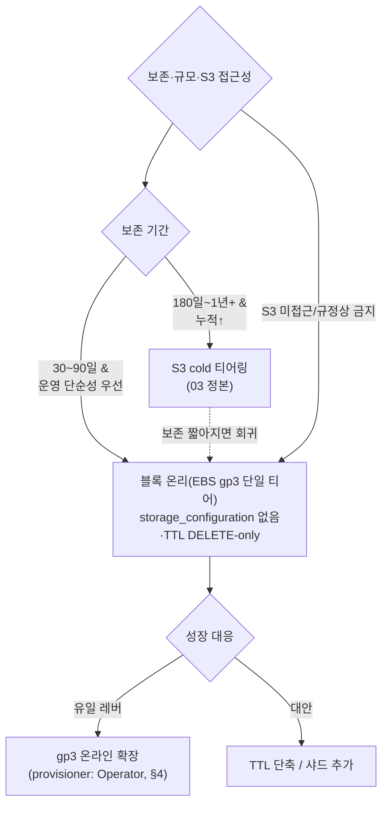

# 블록 스토리지 온리 — S3 없이 EBS 단일 티어 튜닝

이 카테고리의 나머지 문서는 전부 **S3 cold 티어링을 쓰는 전제**로 쓰였다. [hot 스토리지·EBS]()가 gp3/io2 스펙·요금·StorageClass·단일 vs 다중을, [S3 콜드 티어링]()이 `storage_configuration`·TTL MOVE·IRSA·`move_factor`·cache·금지 3종을, [용량 산정]()이 0.7TB/월 워크드 모델을, [operator·다운타임]()이 `storageManagement`·다운타임 프로파일을 이미 정본으로 다뤘다. 이 페이지는 그 전제를 뒤집어 **"블록 온리(EBS only, S3 티어링 없음)"** 만의 델타를 판다 — 무엇이 사라지고(storage XML·IRSA·cache·`move_factor`), 무엇을 새로 짊어지나(전량 EBS 상주 → 사이징 배수↑·온라인 확장이 유일 성장 레버·머지/백그라운드 풀 튜닝). 겹치는 것은 통째로 복붙하지 않고 relref로 넘긴다.


**한눈에**

- **블록 온리 = `storage_policy`를 내장 `default` 하나로만.** cold(S3) 볼륨이 없으니 03이 통째로 주입하던 `config.d/storage_configuration.xml`을 **아예 넣지 않는다**. 테이블은 기본 `default` 정책·`default` 디스크(=`/var/lib/clickhouse`=gp3 PVC)에 쓴다.
- **S3와의 관계는 배타가 아니라 "선택"이다.** 우리 기본 권고는 03(S3 티어링) 유지. 블록 온리는 **짧은 보존(≤90일)·staging·운영 단순성·S3 미접근/규정** 경로에서 고르는 선택지다.
- **TTL은 DELETE-only** — `TO VOLUME 'cold'` MOVE가 사라지고 `... DELETE` 하나만. `ttl_only_drop_parts=1`로 만료 part 통째 드롭(머지 유발 없는 값싼 연산)이라 gp3 대역을 아낀다.
- **사이징 델타**: 03에서 S3로 내리던 logs/traces/metrics가 전부 gp3에 상주 → gp3 상주가 [07]() hot 대비 **1.6x(3개월)~3.7x(12개월)**. 짧은 보존이면 S3 티어링과 비용 근접, 길어지면 발산(gp3 $0.08 vs S3 $0.023, ~3.5x/GB).
- **성장 레버는 gp3 온라인 확장 하나** → `storageManagement.provisioner: Operator` + SC `allowVolumeExpansion`으로 무중단 확장. EBS 6h 쿨다운은 **2026-01-15 폐지**(24h당 4회). **#1385 데이터 손실 회귀** 주의.
- **커지는 상주 데이터**는 머지가 gp3 대역을 지속 점유 → provisioned throughput 상향·`background_pool_size`/ratio·머지 크기 노브·**헤드룸 30~40%**(머지가 여유를 2배 booking). `move_factor`는 이동 볼륨이 없어 죽는 노브.


## 1. 무 S3 단일 티어 — 무엇이 사라지나

블록 온리의 본질은 **`storage_policy`를 내장 `default` 하나로만** 두는 것이다. `default` 디스크는 `/var/lib/clickhouse`(= gp3/io2 PVC)에 매핑되는 내장 디스크라 **별도 선언이 필요 없다**. 즉 [03]()이 CHI `files`로 통째로 주입하던 `config.d/storage_configuration.xml`을 **아예 넣지 않아도 된다** — 테이블은 기본 `default` 정책·`default` 디스크에 쓴다 `✓`.

03(S3 티어링) 대비 사라지는 것들:

| 03에서 필요했던 것 | 블록 온리에서 | 이유 |
|---|---|---|
| `<s3_disk>` disk 정의(endpoint·region·metadata_type) | **불필요** | S3 디스크 없음 |
| `<s3_cache>` cache 디스크(`max_size` 150Gi, LRU) | **불필요** | cold 볼륨 없음 → 캐시 대상 없음. **EBS의 cache 소비항(150Gi)이 통째로 사라져 사이징이 단순해진다** |
| IRSA(ServiceAccount·IAM 정책·`use_environment_credentials`·`region`) | **불필요** | CH가 S3에 붙지 않음. IRSA 함정(region 서명 등)이 전부 소거 |
| `{replica}` S3 경로 분리(shared-nothing) | **불필요** | S3 blob 없음 |
| `storage_policy = 'rum_hot_cold'` 테이블 SETTING | **불필요**(또는 명시 `default`) | 기본 정책 그대로 |
| `move_factor`(여유 공간 임계 안전판) | **무의미** | 이동할 다음 볼륨(cold)이 없어 `move_factor`가 개입할 대상이 아예 없음 `≈` |
| `prefer_not_to_merge` 고려 | **무관** | S3 위 작은 part 폭증 이슈가 없음(전부 gp3에서 머지) |
| 금지 3종(S3 lifecycle→Glacier·zero-copy·`prefer_not_to_merge=true`) | **2종 소거** | S3 lifecycle·zero-copy 걱정 없음. `prefer_not_to_merge` 함정만 여전(default false 유지) |
| 캐시 미스 지연·cold full-scan이 hot 쿼리 잠식 | **소거** | 모든 데이터가 로컬 gp3 → 균일 저지연 |

**핵심**: 블록 온리는 **운영 표면적이 03보다 현저히 작다**. storage XML·IRSA·S3 버킷·lifecycle·cache 튜닝·이동 모니터링이 통째로 빠진다. 이게 "짧은 보존·소규모·운영 단순성"에서 블록 온리를 고르는 이유다(§6). `≈`

> `move_factor`가 "여유 공간이 `move_factor × 볼륨크기` 아래로 떨어지면 다음 볼륨으로 이동 시작"(기본 0.1)이라는 정의와 그 정정은 [03 §1.3]()이 정본이다. 블록 온리에선 이동 대상 볼륨 자체가 없어 이 노브가 죽는다. `✓`

### 1.1 CHI storage — `default` only (예제)

03의 CHI는 `files`에 `config.d/storage_configuration.xml`을 주입하고 테이블에 `storage_policy='rum_hot_cold'`를 걸었다. 블록 온리는 **그 블록을 통째로 지운다** — 남는 것은 gp3 volumeClaimTemplate뿐이다. gp3 StorageClass·`reclaimPolicy: Retain`·`WaitForFirstConsumer` 정본은 [02 §6]().

```yaml
apiVersion: "clickhouse.altinity.com/v1"
kind: "ClickHouseInstallation"
metadata:
  name: hyperdx-ch
  namespace: clickhouse
spec:
  defaults:
    storageManagement:
      provisioner: Operator     # ★ 블록 온리 권장: STS 재생성/재시작 없이 온라인 확장(§4.1)
      reclaimPolicy: Retain     # operator 레벨 — CHI 삭제에도 gp3 PVC 잔존
  configuration:
    # files: config.d/storage_configuration.xml  → 블록 온리에선 없음(03에서 삭제)
    clusters:
      - name: main
        layout:
          shardsCount: 1
          replicasCount: 2      # RF2 (2 AZ). 판단·다운타임은 04로 위임
  templates:
    volumeClaimTemplates:
      - name: data-gp3
        reclaimPolicy: Retain
        spec:
          accessModes: ["ReadWriteOnce"]
          storageClassName: clickhouse-gp3   # allowVolumeExpansion: true SC (02 §6 정본)
          resources:
            requests:
              storage: 1500Gi   # 블록 온리는 전량 상주 → 07 hot(~1TB)보다 크게 잡는다(§3)
    # 테이블에 storage_policy 미지정 → 기본 'default' 정책/'default' 디스크 사용
```

## 2. TTL DELETE-only — MOVE 없는 보존

S3가 없으니 TTL은 `TO VOLUME 'cold'` MOVE 절이 사라지고 **DELETE만** 남는다. 03이 구분하던 "TTL 창(hot 며칠) vs DELETE 지평"의 두 층이 하나로 접혀 **보존일 = DELETE일** 하나로 단순화된다. 지평별 값(90/180/30)은 [03 §4]()·[07 §6]()이 정본이고, 여기선 **MOVE가 빠진 형태**만 보인다.

```sql
-- 블록 온리: MOVE 없음, DELETE-only. 보존일 하나로 끝.
-- (아래는 3개월 지평 예시; 지평별 값은 03/07이 정본)
ALTER TABLE default.otel_logs   MODIFY TTL toDateTime(Timestamp) + INTERVAL 90  DAY DELETE;
ALTER TABLE default.otel_traces MODIFY TTL toDateTime(Timestamp) + INTERVAL 90  DAY DELETE;
ALTER TABLE default.otel_metrics_gauge     MODIFY TTL toDateTime(TimeUnix) + INTERVAL 180 DAY DELETE;
ALTER TABLE default.otel_metrics_sum       MODIFY TTL toDateTime(TimeUnix) + INTERVAL 180 DAY DELETE;
ALTER TABLE default.otel_metrics_histogram MODIFY TTL toDateTime(TimeUnix) + INTERVAL 180 DAY DELETE;
ALTER TABLE default.otel_metrics_summary   MODIFY TTL toDateTime(TimeUnix) + INTERVAL 180 DAY DELETE;
ALTER TABLE default.hyperdx_sessions       MODIFY TTL TimestampTime + INTERVAL 30 DAY DELETE;  -- sessions는 03에서도 S3 안 감(hot only)
```

- **`ttl_only_drop_parts=1`**(ClickStack 관리 테이블 기본): 만료 행을 골라 지우는 대신 **part 전체가 만료돼야 통째 드롭**한다. 파티션이 `toDate`(일 단위)라 정합적이고, part-drop은 **머지를 유발하지 않는 값싼 연산**이다 `✓`. → 블록 온리에서 특히 유리: 삭제가 머지 I/O를 안 먹어 gp3 대역을 아낀다.
- **`merge_with_ttl_timeout`** 기본 **14400초(4시간)** — "delete TTL 머지를 반복하기 전 최소 지연" `✓`. `ttl_only_drop_parts=1`이면 whole-part drop이라 이 값을 **하향해도 부하가 낮다**(만료 part 드롭 지연을 줄이려면 하향; 트레이드는 TTL 머지 스캔 빈도↑) `✓`.
- `MODIFY TTL`은 이후 머지에서 점진 적용되므로, 이미 쌓인 과거 파티션을 즉시 정리하려면 `MATERIALIZE TTL`(또는 `materialize_ttl_after_modify`)을 저트래픽 창에 돌린다(정본 절차는 03·07) `✓`.


**정정 재확인** `✓`: ClickStack OSS 기본 TTL은 `${TABLES_TTL}` 단일값(문서상 3일)이며, 위 90/180/30은 우리 권장 오버라이드다. 배포 후 `SHOW CREATE TABLE`로 실 스키마를 확인한다 — 정본은 [03 §4.1]().


## 3. 전량 EBS 보존 사이징 델타 (07 대비)

**사이징 정본은 [07]()다.** 여기선 "S3로 내리던 분이 전부 gp3에 상주할 때의 델타"만 산출한다. 07은 on-disk 해석 B(단일사본, 블렌디드 압축 ~6x)를 1차 모델로 삼는다.

### 3.1 무엇이 gp3로 넘어오나

- **리플레이(`hyperdx_sessions`, on-disk를 지배)는 원래 S3에 안 간다**(hot 30일 DELETE). → 블록 온리 전환의 **델타 대상이 아니다.** steady-state 단일 그대로.
- 델타는 **logs/traces(hot 창 이후)·metrics(hot 창 이후)** — 03에서 S3 cold로 내리던 분이 전부 gp3에 상주한다.
- 결과: **블록 온리 gp3 상주(단일) = 07의 "누적 on-disk(단일)"** 그 자체. 07이 hot(고정) + cold(S3, 증가)로 쪼개던 것을 블록 온리는 한 덩어리로 gp3에 이고 간다.

### 3.2 사이징 표 — 07 hot 고정 vs 블록 온리 gp3 상주 `≈⁽계산 예시⁾`

| 지평 | 07 hot gp3(단일, 고정) | 07 cold S3(단일) | **블록 온리 gp3 상주(단일)** | 07 hot 대비 배수 |
|---|---|---|---|---|
| 3개월(90일) | 0.63 TB | 0.37 TB | **~1.0 TB** | **~1.6x** |
| 6개월(180일) | 0.63 TB | 0.82 TB | **~1.45 TB** | **~2.3x** |
| 12개월(365일) | 0.63 TB | 1.72 TB | **~2.35 TB** | **~3.7x** |

*(블록 온리 gp3 = 07 hot + 07 cold = 누적 단일. 리플레이 고정분은 양쪽 공통.)*

### 3.3 물리 gp3(×RF2, +40% 머지 헤드룸) — 07은 고정, 블록 온리는 증가 `≈⁽계산 예시⁾`

| 지평 | 07 hot gp3 물리(고정) | **블록 온리 gp3 물리(×RF2,+40%)** | gp3 요금($0.08/GB, RF2) | (참고) 07 hot gp3+S3 요금 |
|---|---|---|---|---|
| 3개월 | ~2.0 TB | 1.0×2×1.4 ≈ **2.8 TB** | ~$224/mo | hot ~$160 + S3 ~$17 ≈ **$177** |
| 6개월 | ~2.0 TB | 1.45×2×1.4 ≈ **4.06 TB** | ~$325/mo | hot ~$160 + S3 ~$38 ≈ **$198** |
| 12개월 | ~2.0 TB | 2.35×2×1.4 ≈ **6.58 TB** | ~$526/mo | hot ~$160 + S3 ~$79 ≈ **$239** |

- **비용 개형**: gp3 $0.08/GB vs S3 Standard $0.023/GB = **~3.5배/GB**. 블록 온리는 짧은 보존(3개월)에선 S3 티어링과 **근접**(스토리지 델타 +~$47/mo)하지만, 보존이 길어질수록 **발산**(12개월 스토리지 델타 +~$290/mo). 컴퓨트·Keeper·Mongo 고정분은 양쪽 동일. `≈⁽계산 예시⁾`
- **단일 gp3 상한 64 TiB에 한참 여유**: 6.58TB(노드당 ~3.3TB, RF2 2노드)는 gp3 단일 볼륨 상한 아래라 스트라이핑 불필요 — 판정은 [02 §3]() 정본. `✓`
- **머지 헤드룸이 더 중요해진다**: 블록 온리는 데이터가 계속 쌓여 볼륨이 차기 쉽다. 머지는 여유 공간을 예약(§5)하므로 **30~40% 여유**를 항상 남긴다([07 §8.1]()의 헤드룸/경보 기준 계승). S3 탈출구가 없어 **여유 소진 시 대응이 온라인 확장뿐**(§4). `✓/≈`
- **백업 개형**: cold가 없으니 백업 대상이 gp3 전량. `clickhouse-backup → S3`(별도 버킷)은 여전(리플레이 제외 정책은 07 그대로). `≈`

## 4. operator 볼륨 튜닝 — 온라인 확장이 "유일한 성장 레버"

S3 cold라는 탈출구가 없으니, 블록 온리에서 데이터가 늘 때 **대응은 gp3 온라인 확장 하나**다(그 외엔 TTL 단축·샤드 추가). 그래서 03에선 부수적이던 온라인 확장이 블록 온리에선 **1순위 운영 축**이 된다.

### 4.1 storageManagement.provisioner — StatefulSet vs Operator (핵심)

operator 0.20+의 `spec.defaults.storageManagement.provisioner`가 "PVC를 누가 만들고 수정하나"를 정한다 `✓`:

| 값 | 확장 동작 | pod 재시작 | 블록 온리 적합 |
|---|---|---|---|
| **`StatefulSet`**(기본) | STS의 `volumeClaimTemplates`는 불변 → 확장하려면 **STS 재생성 → CH 재시작** | **있음**(비쌈) | △ 확장 잦으면 재시작 비용 |
| **`Operator`** | STS에서 VCT를 제거하고 operator가 PVC를 직접 수정 → **STS 재생성/pod 재시작 없이** 온라인 확장(CSI `allowVolumeExpansion` 전제) | **없음** | **✅ 블록 온리 권장** — 성장 대응이 잦아 무중단 확장 이점이 큼 |

- **전환 주의**: 기존 CHI에서 `StatefulSet`→`Operator`로 바꾸면 operator가 기존 STS-생성 PVC를 넘겨받는데 **이 전환 자체가 1회 재시작을 요구**한다(그래서 기본값이 아님). 처음부터 `Operator`로 시작하는 게 깔끔. `✓`
- SC에 **`allowVolumeExpansion: true`** 필수. `reclaimPolicy: Retain`(operator 레벨 + SC 레벨 이중)으로 실수 삭제 방어 — 정본 예제는 [02 §6](). `✓`

### 4.2 EBS Elastic Volumes — 2026-01-15 6시간 쿨다운 폐지 `✓`

블록 온리의 성장 레버가 온라인 확장인 만큼, EBS 쪽 제약이 중요하다. **2026-01-15부로 AWS가 Elastic Volumes의 종전 6시간 쿨다운을 폐지**했다:

- **이전**: 볼륨 1회 수정 후 **6시간 대기** 필요.
- **현행(2026-07)**: **롤링 24시간 창당 최대 4회 수정**, 단 직전 수정이 완료돼야 다음 시작 가능 `✓`.
- **OPTIMIZING 상태 제약은 유지**: 수정 직후 볼륨이 `OPTIMIZING`으로 들어가고, 그 동안엔 다시 수정 불가(`cannot be modified in modification state OPTIMIZING`). 대형 볼륨은 OPTIMIZING이 수 시간 걸리고 그동안 성능 영향 가능 `✓`.
- 4회 초과 시 `You've reached the maximum modification rate per volume limit`. gp2/gp3 모두 적용, 리전 제약 명시 없음(도쿄 검증; 서울 `ap-northeast-2`도 동일 가정) `✓/≈`.

→ 실무 함의: 블록 온리에서 볼륨을 **여유 있게(예: 목표의 1.3~1.5배) 잡거나, 확장을 하루 4회 이내로 계획**한다. 잦은 소폭 확장보다 **드문 큰 확장**이 쿨다운·OPTIMIZING 리스크를 줄인다. `≈`

### 4.3 확장 절차 & 데이터 손실 함정

```yaml
# 온라인 확장: PVC의 requests.storage만 키운다 (provisioner: Operator + allowVolumeExpansion SC 전제)
# kubectl patch pvc <pvc-name> -n clickhouse --type merge \
#   -p '{"spec":{"resources":{"requests":{"storage":"2000Gi"}}}}'
# → EBS ModifyVolume → OPTIMIZING → 파일시스템 온라인 확장(재시작 없음)
```


**운영 함정** `✓`

1. **issue #1385 — volumeClaimTemplate storage 변경 시 PVC delete/recreate → 데이터 손실.** operator가 템플릿의 storage를 키우면 리사이즈가 아니라 **PVC를 지웠다 다시 만드는** 경로를 타는 회귀가 보고됐다(0.22.2 확인). `storageManagement` 미설정 시엔 **무한 delete/recreate 루프**까지 발생. → **안전 경로**: (a) `provisioner: Operator`로 in-place 리사이즈, 또는 (b) **PVC를 직접 편집**(`kubectl patch pvc`)해 템플릿 확장 경로를 우회. 확장 전 **백업 필수 + 스테이징 리허설**. 0.27.1에서의 수정 여부는 릴리스 노트로 확인 `?` — 확인 전까진 무조건 백업/리허설.
2. **issue #1263** — CHI 재생성 후 PVC 리사이즈 실패, **#457** — AKS 스토리지 rescale 미동작 `✓`.
3. **issue #1619** — CHI/CHK에 `reclaimPolicy: Retain`을 걸어도 클러스터 삭제 시 볼륨이 지워진 사례. SC 레벨 Retain 이중 방어 — 정본 경고는 [02 §6.3]() `✓`.


### 4.4 단일 대형 gp3 vs 다중 gp3 (위임)

블록 온리라 데이터가 커져도 **단일 gp3(최대 64 TiB)로 충분**하고, 인스턴스 EBS 파이프가 총 throughput 천장이라 볼륨을 여러 개 붙여도 이득이 없다 — 단일 vs 다중 판정·인스턴스 파이프 상세는 [02 §3]() 정본. 블록 온리에서도 결론은 동일: **노드당 단일 gp3**. `✓`

## 5. 커지는 상주 데이터 튜닝 — merge / background pool

블록 온리는 07 대비 gp3 상주 데이터가 1.6~3.7배(§3)라 **머지 부하·part 수·gp3 대역 압박이 더 크다.** 여기서 손볼 노브들 — 이 카테고리 어디에도 없던 새 각도다.

### 5.1 gp3 provisioned IOPS / throughput 상향 시점

- gp3 baseline = **3,000 IOPS / 125 MiB/s(무료)**. ClickHouse는 throughput-bound라 **먼저 오르는 건 throughput**이다 `✓`(스펙·요금·인스턴스 파이프 천장은 [02]() 정본).
- 블록 온리 트리거 `≈`: 상주 데이터↑ → 백그라운드 머지가 대형 순차 read+write로 gp3 대역을 지속 점유 → `system.asynchronous_metrics`·EBS 대역 지표에서 baseline 125 MiB/s를 지속 초과하면 **provisioned throughput을 인스턴스 baseline까지** 상향(예: r7g.2xlarge baseline 312 MB/s에 맞춰 ~300 MiB/s). IOPS는 대개 baseline 3,000으로 충분(인스턴스 EBS IOPS 자체가 먼저 천장).
- **인스턴스 파이프가 볼륨보다 먼저 천장**이라, 볼륨 provisioning보다 **노드 사이즈업(r7g→더 큰 크기/r8g)**이 먼저 효과를 낼 수 있다 — 순서는 [02 §1.4]() 정본.

### 5.2 background / merge 풀 노브 `✓`

| 설정 | 기본값 | 의미 | 블록 온리 튜닝 |
|---|---|---|---|
| `background_pool_size` | **16** | 백그라운드 머지·뮤테이션 스레드 수 | 상주 데이터·머지 백로그↑ 시 상향(beefy 노드는 코어 수에 맞춰 예: 32~36) |
| `background_merges_mutations_concurrency_ratio` | **2** | 동시 머지 = pool_size × ratio (기본 16×2=**32**) | 백로그 청산엔 **1로 낮춰** 큰 머지에 스레드 몰아줌. **런타임 상향만 가능, 하향은 재시작** |
| `max_bytes_to_merge_at_max_space_in_pool` | **~150 GB** | 자원 충분 시 한 머지로 합칠 최대 part 합 | 큰 part 위주 백로그면 조정. 너무 크면 단일 머지가 gp3 대역 독점 |
| `number_of_free_entries_in_pool_to_lower_max_size_of_merge` | **8** | 여유 풀 슬롯 < 이 값이면 **최대 머지 크기를 지수적으로 낮춤**(작은 머지 우선) | aggressive는 pool_size의 90~95%(예 pool 36→32). 작은 part 적체 방어 |
| `max_bytes_to_merge_at_min_space_in_pool` | (양수) | 디스크 여유 부족해도 허용하는 최대 머지 크기 | `TOO_MANY_PARTS` 방어용. 블록 온리는 여유가 빠듯해질 수 있어 관련성↑ |

- **머지는 디스크 여유를 예약한다 — 합쳐질 part 합의 약 2배**를 booking `✓`. 즉 "여유 공간은 있는데 진행 중 대형 머지가 예약해버려 다른 머지가 못 시작 → 작은 part 누적 → `TOO_MANY_PARTS`" 상황이 블록 온리(꽉 찬 gp3)에서 특히 잘 난다. → **헤드룸 30~40%는 성능이 아니라 안정성 문제**다.
- **aggressive 튜닝 주의**: "저지연 read/write를 상시 유지해야 하거나 이미 디스크 대역이 병목이면 aggressive 머지는 역효과" `Ⓥ`. 블록 온리 gp3 대역이 빠듯하면 오히려 머지 동시성을 낮춘다.
- `move_factor`는 **무의미**(cold 볼륨 없음, §1). 튜닝 대상에서 제외.

{}
- `max_bytes_to_merge_at_max_space_in_pool`은 ClickHouse docs가 `0`(=컴파일 기본)으로 표기하나 실효 기본은 **~150 GB(161061273600 바이트)**다. 정확 상수는 `SELECT * FROM system.merge_tree_settings WHERE name LIKE 'max_bytes_to_merge%'`로 확인 `?`.
- `parts_to_throw_insert`(파티션당)는 관례 기본 **300**이나 최신 버전에서 상향된 정황 → 배포 버전 `system.merge_tree_settings`로 확정 `?`.
{}

### 5.3 part 적체 방어 (INSERT 스로틀) `✓/?`

- `parts_to_delay_insert` 초과 시 INSERT 인위 지연, `parts_to_throw_insert`(파티션당, 관례 기본 **300**) 초과 시 `TOO_MANY_PARTS` 예외, `max_parts_in_total` 초과 시 INSERT 중단 `✓`.
- 블록 온리에서 데이터·파티션이 많아지면 배치/`async_insert` 튜닝으로 part 생성 빈도를 낮춘다(정본 경보표는 [07 §8.2](): 파티션당 active parts >300 조치).

### 5.4 모니터링 (block-only 관점) `✓`

```sql
-- 디스크 여유(머지 헤드룸): 블록 온리는 default 하나만 나온다 (s3_disk/s3_cache 없음)
SELECT name, type, path,
       formatReadableSize(free_space) AS free, formatReadableSize(total_space) AS total,
       round(100*(total_space-free_space)/total_space,1) AS used_pct
FROM system.disks;

-- 진행 중 머지(예약 공간·소요) — 대형 머지가 여유를 booking 중인지
SELECT database, table, elapsed, progress,
       formatReadableSize(memory_usage) AS mem,
       formatReadableSize(bytes_read_uncompressed) AS read_u,
       num_parts
FROM system.merges ORDER BY elapsed DESC;

-- 테이블·파티션별 part 수·크기 (전부 disk_name='default' 여야 정상 — cold 없음)
SELECT table, partition, disk_name, count() AS parts,
       formatReadableSize(sum(bytes_on_disk)) AS size
FROM system.parts WHERE database='default' AND active
GROUP BY table, partition, disk_name ORDER BY parts DESC;
```

- 블록 온리 헬스 지표 `≈`: (a) `system.disks.used_pct` < 80%, (b) 파티션당 active parts < 300, (c) `system.merges`에 장시간 정체 머지 없음, (d) EBS 대역(baseline 125 MiB/s 지속 초과 시 §5.1). `system.disks`에 `default` 외 디스크가 보이면 블록 온리 전제가 깨진 것(어딘가 storage_configuration이 살아있음).

## 6. 언제 블록 온리 vs S3 티어링 (결정)

블록 온리와 S3 티어링은 **배타가 아니라 선택**이다. 실제로 03도 sessions는 S3에 안 내리므로 "부분 블록 온리 + 부분 티어링"이고, 전량 블록 온리는 그 티어링 대상(logs/traces/metrics)까지 gp3에 두는 극단이다 `≈`.

| 축 | **블록 온리(EBS only)** | **S3 티어링(03)** |
|---|---|---|
| 보존 기간 | **짧음(30~90일)** | 김(180일~1년+) |
| 운영 단순성 | **최상**(storage XML·IRSA·S3·lifecycle·cache·이동감시 전부 없음) | 복잡(§1 전부 관리) |
| S3 접근성 | **S3 미접근/규정상 오브젝트 금지** 환경 | S3 사용 가능 |
| 규모 | 소규모(누적 gp3가 부담 없는 수준)·staging | 누적↑로 gp3 비용이 커질 때 |
| 스토리지 비용 | 짧은 보존에서 근접, 긴 보존에서 발산(gp3 3.5x/GB, §3) | 긴 보존에서 우위(cold $0.023/GB) |
| 크로스오버 | ~3개월까지 블록 온리가 단순하고 비용 근접 | ~6개월+부터 S3 티어링이 명확히 저렴 |



- **io2 전환 트리거**(>2,000 MiB/s 지속·>80,000 IOPS/vol·볼륨 99.999% 규제)는 [02]() 정본 — 블록 온리든 티어링이든 RUM 0.7TB/월엔 도달하지 않는다. `≈`
- **staging 경로**: staging은 데이터가 작고 보존도 짧아 블록 온리가 자연스럽다 — storage XML·IRSA 없이 gp3 하나로 띄우고, prod만 S3 티어링을 얹는 조합도 유효하다. `≈`

## 우리 케이스에서는

- **기본 권고는 [S3 티어링(03)]() 유지** — 우리 지평이 3~12개월로 열려 있고 보존이 길수록 블록 온리가 발산하기 때문. 단 **"짧은 보존(≤90일) + S3 미접근/규정 + 운영 단순성"** 조건이 겹치면(대표적으로 **staging**) 블록 온리가 정답이다(§6).
- 블록 온리로 가면 **`storage_configuration`·IRSA·S3 버킷·cache가 통째로 사라져** 운영 표면적이 03보다 훨씬 작다. CHI에는 gp3 volumeClaimTemplate만 남고 테이블은 `default` 정책. TTL은 DELETE-only(`ttl_only_drop_parts=1`로 값싼 whole-part drop), `move_factor`·`prefer_not_to_merge`는 죽는 노브.
- **비용 트레이드는 명확하다**: 리플레이는 어차피 S3 안 가므로 델타 대상은 logs/traces/metrics뿐. 이들이 gp3에 상주하면 gp3 상주가 [07]() hot 대비 **1.6x(3개월)~3.7x(12개월)**, 스토리지 비용 델타 +$47~$290/mo. 3개월이면 S3 티어링과 근접, 1년이면 명백히 비싸다.
- **성장 레버는 gp3 온라인 확장 하나** → `provisioner: Operator` + `allowVolumeExpansion` SC로 무중단 확장. EBS 6h 쿨다운은 2026-01-15 폐지(24h당 4회, OPTIMIZING 중 불가)라 **여유 있게/드물게 크게** 확장한다. **#1385 데이터 손실 회귀**(템플릿 확장 시 PVC 재생성)는 Operator in-place 리사이즈 또는 PVC 직접 편집으로 우회 + 백업/스테이징 리허설 필수.
- **커지는 상주 데이터**는 머지가 gp3 대역을 지속 점유하니 (a) throughput 먼저 provision(baseline 125 초과 시), (b) `background_pool_size`/ratio·`max_bytes_to_merge_at_max_space_in_pool`·`number_of_free_entries...`로 머지 동시성·크기 조율, (c) 머지가 여유를 2배 booking하므로 **헤드룸 30~40%를 안정성 요건으로** 지킨다. `system.disks`/`system.parts`/`system.merges`로 모니터링.
- **업그레이드 관점** — 블록 온리는 S3 티어 정합 걱정이 없어 업그레이드가 단순하다(EBS 스냅샷 롤백·`allowVolumeExpansion`↔업그레이드 상호작용). 상세는 [버전·업그레이드 호환성]()으로 이어진다. 시점 기준 2026-07.
