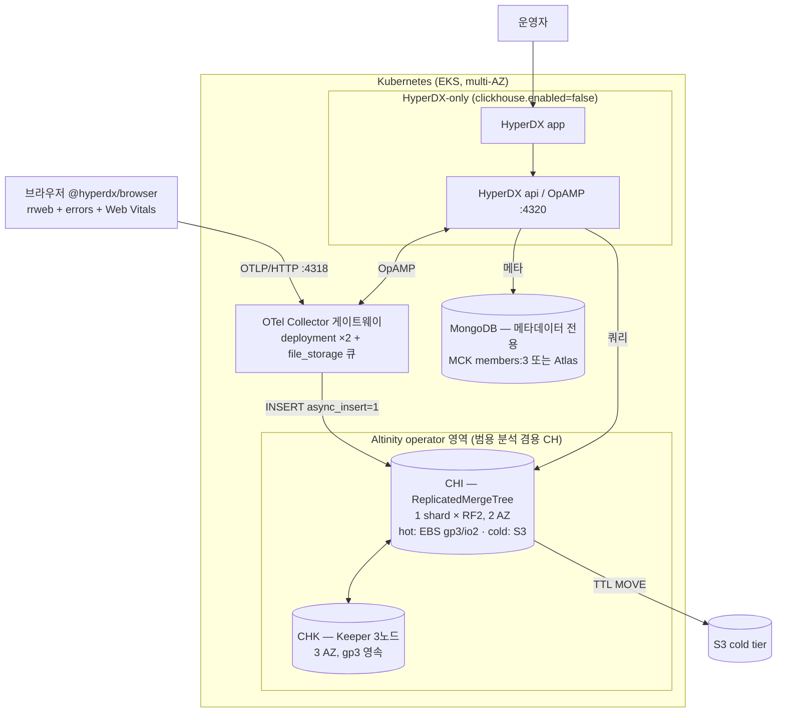

# HyperDX 내재화 — 실전 배포 청사진

[RUM 내재화]()가 "왜·무엇으로 Datadog RUM에서 빠져나오나"를, [ClickHouse 운영]()이 "ClickHouse를 채택했다면 범용으로 어떻게 운영하나(how)"를 다뤘다면, 이 챕터는 그 사이를 잇는 **실전 운용 케이스**다 — HyperDX ClickStack을 **우리의 실제 RUM 워크로드**로 K8s(EKS)에 실제로 얹고, 실제 장애를 견디게 하고, 실제 용량을 산정하는 청사진. 전제를 아주 구체적으로 못박는다: **RUM-only**(세션 리플레이·로그·트레이스·Web Vitals), **staging→prod 승급**, **EBS(gp3/io2)-first** 스토리지(로컬 NVMe는 옵셔널), 그리고 **prod 세션 샘플링 100% = 월 0.7TB** 규모다. 이론·의사결정이 아니라 매니페스트·DDL·다운타임 타임라인·달러 산식을 노출하는 것이 이 챕터의 결이다.


**한눈에** — 핵심 결정 한 장.

- **스택 조립**: ClickStack 표준 2-Helm 차트를 그대로 쓰지 않고 `clickhouse.enabled: false`(**BYO**)로 붙인다. ClickHouse/Keeper는 **Altinity operator(CHI/CHK)**로 분리 운영, HyperDX·OTel Collector·MongoDB만 차트/operator로 남긴다. `✓`
- **hot 스토리지**: 기본 **gp3 단일 볼륨**(ClickHouse는 throughput-bound라 IOPS를 살 이유가 거의 없음), io2 Block Express는 **필요 시**(극한 IOPS·sub-ms·볼륨 99.999% 요구)만, 로컬 NVMe는 **옵셔널 업그레이드 경로**. `✓/≈`
- **cold 티어링**: **S3 Standard + cache disk**, 이동은 **시간 기반 TTL `TO VOLUME 'cold'`**(`move_factor`는 안전판) `✓`. 인증은 IRSA — CH 서버 disk가 web-identity 자격증명을 런타임에 실제로 집어드는지는 배포 후 확인 `?`().
- **조정 계층**: **Keeper 3노드**(gp3 영속, 3 AZ). Keeper는 **Kafka식 durable queue가 아니다** — CH가 죽으면 in-flight INSERT는 큐잉되지 않는다. `✓`
- **MongoDB**: 메타데이터 전용이라 **아주 작게**(단일 멤버 실효 ~0.4 vCPU / 0.75~1.25Gi / gp3 10Gi) 가능하나, prod는 `members:3` 또는 Atlas가 값싼 보험. `≈`
- **용량/비용**: **월 0.7TB(on-disk 해석)** 기준 **1 shard × RF2** 로 1년+ 충분. hot·컴퓨트는 지평 무관 고정, 3→12개월 증분은 대부분 싼 S3 cold. prod 월 **~$1.0~1.4K** `≈`(us-east-1 기준, 서울 ~10~15%↑).


## 이 챕터의 위치 — 전제 차이

study-hugo에는 이미 겹치는 주제의 깊은 문서가 있다. 이 챕터가 기존 문서와 **모순처럼 보이면 안 된다** — 특히 "로컬 NVMe vs EBS"는 어느 쪽이 옳은 논쟁이 아니라 **규모·목표가 다른 별개 시나리오**다. 아래 축으로 읽는다.

| 축 | 기존 `clickhouse/` 운영 | 기존 `rum/` 내재화 | **이 챕터 `hyperdx/`** |
|---|---|---|---|
| 질문 | ClickHouse를 채택했다면 어떻게 운영하나(범용 how) | RUM을 왜·무엇으로 내재화하나(도입 실사) | HyperDX 스택을 **실제로 어떻게 배포·운영하나**(실전 케이스) |
| 전제 스토리지 | **로컬 NVMe(i7i/i8g) 1차** + S3 cold | — | **EBS(gp3/io2) 1차** + S3 cold. 로컬 NVMe는 옵셔널 |
| 규모 전제 | 20TB+·성능 극대화·상시 가동·인력 보유 | — | **RUM-only, 월 0.7TB**(세션 샘플링 100%), staging→prod |
| 결(톤) | 이론·의사결정·"채택했다면" | 비교·매트릭스·마이그레이션 | **실전 운용** — 실제 배포·실제 장애·실제 산정 |


**두 스토리지 전략은 충돌이 아니다.** [로컬 NVMe 문서]()는 20TB+·성능 극대화 전제에서 출발한다. 이 챕터는 0.7TB/월·운영 단순성·내구성 우선 전제에서 EBS를 1차로 둔다. EBS-first의 값어치는 성능이 아니라 **노드 재부팅·재스케줄·인스턴스 교체(같은 AZ)에서 볼륨 detach/attach로 재수화가 불필요**하다는 운영 프로파일이다 — 로컬 NVMe의 "노드 유실 = 재수화 위험 창"이 근본적으로 짧아진다. 상세는 ·.


**operator 분기(중요)** — 이 챕터 전체가 이 전제 위에 있다. ClickStack **표준 Helm 2-차트**(`clickstack-operators` → `clickstack`)가 딸려오는 ClickHouse operator는 Altinity가 아니라 **ClickHouse Inc.의 공식 operator**(`ClickHouseCluster`/`KeeperCluster` CRD)다 `✓`. 우리는 그것을 그대로 쓰지 않고 `clickhouse.enabled: false`(BYO)로 ClickHouse를 차트 밖으로 빼, **Altinity operator의 CHI(`ClickHouseInstallation`)/CHK(`ClickHouseKeeperInstallation`)** 로 분리 운영한다(범용 분석 일원화·7년+ 트랙레코드, [operator 선택]()). 이 분기를 흐리면 뒤 페이지의 CHI 매니페스트(·)가 표준 install과 모순으로 읽힌다.

## 핵심 결정 요약

| 축 | 결정 | 근거·조건 |
|---|---|---|
| 스택 조립 | HyperDX-only(BYO) + Altinity CHI/CHK + MongoDB(MCK 또는 Atlas) | 표준 차트=공식 operator를 회피, CH를 범용 분석과 일원화 `✓` →  |
| hot 스토리지 | 단일 gp3(baseline IOPS + 인스턴스 baseline에 맞춘 소량 throughput) | ClickHouse는 throughput-bound, 인스턴스 EBS 파이프가 볼륨보다 먼저 천장 `✓/≈` →  |
| io2 / 로컬 NVMe | io2는 필요 시 각주, 로컬 NVMe는 업그레이드 경로 | gp3 99.9% + RF 복제로 충분, io2 99.999%는 이 스케일 과잉 `≈` |
| cold 티어링 | S3 Standard + cache disk, 시간 기반 TTL MOVE, IRSA | Glacier 전환 금지, `{replica}` 경로 분리(shared-nothing) `✓` →  |
| 토폴로지 | **1 shard × RF2**(2 AZ), RF3는 트리거 승급 | 0.7TB/월엔 shard가 부채, EBS는 노드 급사가 데이터 소실 아님 `≈` →  |
| 조정 계층 | Keeper 3노드(gp3 영속, 3 AZ) | 정족수 3(1 장애 허용), Keeper는 큐가 아님 `✓` →  |
| ingest 신뢰성 | OTel Collector persistent queue + `async_insert=1, wait=1` + dedup | in-flight 유실은 Keeper가 아니라 앞단 큐·클라 재시도로 방어 `✓` →  |
| MongoDB | 메타데이터 전용 최소 규모, prod는 `members:3`/Atlas + SCRAM + mongodump | 부하는 데이터량 아닌 사용자·설정 수 비례, 인제스트 경로 밖 `≈` →  |
| CH 버전 | 예제는 **24.8 LTS**(ClickStack 24.8+ 요구) | 차트 기본 태그는 관찰값으로만 `✓` |
| 용량·비용 | on-disk 해석 1차, 지평별(3/6/12개월) 워크드 모델 | hot·컴퓨트 고정 + 증분은 S3 cold `≈` →  |

## 우리 케이스 청사진 (한 장 토폴로지)

RUM 인제스트 경로에 **MongoDB는 없다** — 브라우저 SDK는 HyperDX api가 아니라 OTel Collector(4318)로 직접 텔레메트리를 보내고, 세션 리플레이는 `hyperdx_sessions` 테이블(ClickHouse)로 적재된다. MongoDB는 사용자가 UI에서 대시보드·알럿·소스를 만들 때만 쓰인다. 이것이 MongoDB를 아주 작게 돌려도 되는 구조적 근거이자, "MongoDB 다운 = 관측 정지"가 아니라 "**설정·알럿·UI 정지**"인 이유다 `✓`.

## 이 챕터 구성 (블록 지도)

| 페이지 | 다루는 것 (새로 쓰는 것) | 주로 위임하는 것 |
|---|---|---|
| [HyperDX 직접 운영하기]() | **운영 트랙(6부 하위 섹션)** — 아래 정본 문서들 위에서 "직접 운영하려면 어떤 순서로 무엇을 판단해야 하나"를 ①아키텍처 ②티어링 ③가용성 ④operator 패턴 ⑤규모 산정 ⑥의사결정 가이드로 실체화 | 남김없는 세부·근거는 아래 정본 01~09·출처 10 |
|  | ClickStack 4컴포넌트 배포 토폴로지·데이터 흐름, OTel Collector 배치/사이징, **MongoDB 최소 규모 배포·운영** | 4컴포넌트/배포 6모드 → , MongoDB 부하 프로파일 →  |
|  | **gp3 vs io2 vs io2 Block Express** 실전 상세, ClickHouse I/O 적합성, 왜 EBS-first, operator StorageClass/VolumeClaimTemplate | 로컬 NVMe 상세·EBS 대역 한계 →  |
|  | **S3 cold worked example**: storage_configuration 전문·TTL MOVE DDL·IRSA·우리 RUM 테이블 튜닝 | 티어링≠내구성·zero-copy 금지 →  |
|  | EBS 기반 replication/sharding + **다운타임 상세 시나리오**(재부착·rolling·PDB·AZ 장애·ungraceful death) | CHI/CHK 필드·스케일 함정·롤링 업그레이드 → · |
|  | Keeper 상세: Raft·저장/비저장, **"큐가 아니다" 정정**, async_insert 세만틱, 유실 방지 설계 | 정족수 산술·CHK 매니페스트·쓰기 내구성 노브 →  |
|  | **복제 구조·멀티마스터·중단/failover**: RMT pull 복제, 승격 없는 failover, ZooKeeper/Keeper 복제 역할, split-brain 방지, RF2+consolidation 안전성 | 다운타임 물리 역학 → , Keeper 자체 →  |
|  | **월 0.7TB RUM 워크드 모델**: 압축비·raw vs on-disk·3/6/12개월·hot/cold·RF·gp3 vs io2·TTL·비용 | RF 선택 확률·insert_quorum →  |
|  | **블록 스토리지 온리(무 S3)**: 단일 `default` 정책·TTL DELETE-only·gp3 온라인 확장·merge/background 풀 튜닝·블록온리 vs S3 선택 | hot gp3 스펙 → , S3 티어링 → , 사이징 →  |
|  | **버전 호환·업그레이드**: 6구성요소 호환 매트릭스·`compatibility` 설정·다운그레이드 비지원·EBS 스냅샷 롤백·ClickStack v1→v2 | 일반 CH/operator/Keeper 업그레이드 런북 →  |
|  | 출처 URL 모음(분류 표) | — |

## 자매 챕터

- [ClickHouse 운영]() — ClickHouse 범용 운영 how(operator 선택·로컬 NVMe·배포 플레이북·스케일/롤링). 이 챕터가 relref로 위임하는 대부분의 배경이 여기 있다.
- [RUM 내재화]() — Datadog RUM에서 빠져나오는 why/what(비교·매트릭스·마이그레이션). 이 챕터의 상류.
- [HyperDX/ClickStack 심층]() — HyperDX 4컴포넌트·배포 6모드·BYO 의존성의 정본.
- [HyperDX(ClickStack) — 로깅 관점]() — 로그 내재화 후보로서의 ClickStack 요약 판단.

## 우리 케이스에서는

**HyperDX-only(BYO) + Altinity CHI/CHK + MongoDB(MCK 또는 Atlas)** 로 조립하고, hot은 **단일 gp3**, cold는 **S3 + TTL MOVE**, 조정은 **Keeper 3노드**, 토폴로지는 **1 shard × RF2(2 AZ)** 로 시작한다. io2·로컬 NVMe·RF3·샤딩은 전부 **트리거 기반 승급**으로 미뤄두는 것이 0.7TB/월 규모의 정답이다 — 이 규모에서 조기 수평 확장·고성능 스토리지는 비용과 운영 부채만 남긴다.

두 가지를 배포 전에 반드시 못박는다. 첫째, **"월 0.7TB"가 raw ingest인지 on-disk(압축 후)인지** — 이 해석에 따라 배포 규모·비용이 2~3배 갈린다. 본 챕터는 on-disk 해석을 1차 모델로 삼되, 배포 후 `system.parts`로 **1회 실측**해 확정한다(). 둘째, **세션 리플레이 압축비(모델 기본 5x)·구성비·ClickStack 기본 TTL** 은 공개 실측이 없거나 문서 간 상충이 있어 전부 `≈`·`?`이다 — staging에서 압축비를 실측하고 `SHOW CREATE TABLE`로 TTL을 확인해 `✓`으로 승격하는 것이 staging을 두는 캐파상 이유다. 시점 기준 2026-07.

> **근거 표기 범례**: `✓` 확인됨(1차 출처 검증) · `≈` 추정 · `Ⓥ` 벤더 주장 · `?` 미확인 · `Ⓑ` 퍼블릭 벤치마크 · `Σ` 종합 판단. `⁽ ⁾`는 부가 설명, `✓/≈`처럼 병기하면 혼재를 뜻한다.
