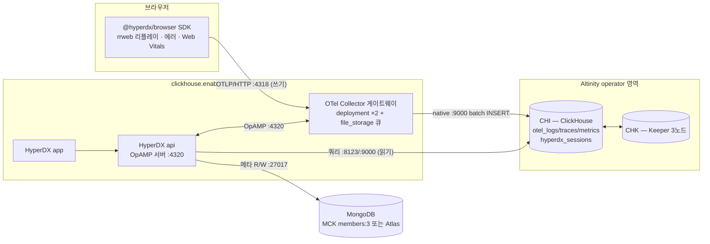

# 솔루션 아키텍처 — 4컴포넌트 조립과 BYO 분기


**한눈에**

- ClickStack 표준 배포는 **2개 Helm 차트**(`clickstack-operators` → `clickstack`)로 4컴포넌트를 얹지만, 우리는 `clickhouse.enabled: false`(**BYO**)로 ClickHouse/Keeper를 차트 밖으로 빼 **Altinity CHI/CHK**로 분리 운영한다 — 표준 경로를 그대로 쓰면 클러스터에 **CH operator 2종(공식 + Altinity)이 공존**하기 때문이다.
- 브라우저 RUM SDK는 HyperDX api가 아니라 **OTel Collector(`:4318`)로 직접** 텔레메트리를 보내고, 세션 리플레이는 ClickHouse `hyperdx_sessions`로 적재된다 — **RUM 인제스트 경로에 MongoDB는 없다.**
- 컴포넌트별 배치는 OTel Collector **deployment ×2 + `file_storage` 큐**, HyperDX app/api **무상태 deployment**, ClickHouse는 **Altinity CHI(1 shard×RF2)**, Keeper는 **CHK 3노드**, MongoDB는 **MCK `members:3`(prod) 또는 Atlas**.
- **OpAMP(`:4320`)**: HyperDX api가 OpAMP 서버로 동작해 Collector 파이프라인 설정을 원격 관리한다.


이 페이지는 [운영 로드맵]() 1부(솔루션 아키텍처)를 실체화한 것이다. 4컴포넌트의 정체성·배포 6모드·BYO("HyperDX Only") 개념 자체의 정본은 [HyperDX / ClickStack 심층 분석]()이고, 포트·의존 방향·MongoDB 최소 배포 CR 전문은 [스택 토폴로지]()가 정본이다. 이 페이지는 그 위에서 **"왜 표준 경로를 안 쓰고 무엇을 어떻게 조립하나"** — 즉 조립 순서와 BYO 분기의 실무 판단만 압축해서 다룬다. 세부 매니페스트·다운타임 시나리오는 재서술하지 않고 relref로 위임한다.

## 1. 왜 표준 2-Helm 경로를 그대로 안 쓰나 — operator 2종 공존 회피

표준 경로의 첫 차트 `clickstack-operators`는 **MongoDB Kubernetes Operator(MCK)** 와 **ClickHouse Inc.의 신규 공식 operator**(`ClickHouseCluster`/`KeeperCluster` CRD)를 함께 설치한다 `✓`. 이 공식 operator는 Altinity operator(`ClickHouseInstallation`/CHI)가 **아니다** `✓`. 우리는 이미 범용분석 CH를 Altinity operator로 운영 중이므로, 표준 경로를 그대로 따르면 같은 클러스터에 **CH operator가 2종(공식 + Altinity) 공존**하게 된다.


**"표준 install = Altinity"는 흔한 오해다.** 표준 ClickStack Helm 경로가 배포하는 CH operator는 Altinity가 아니라 ClickHouse Inc. 공식 operator다. 이 분기를 흐리면 뒤따르는 CHI/CHK 매니페스트()가 "표준 설치와 어긋난다"는 착시를 만든다.


| 축 | 표준 2-Helm 경로 | 우리 채택 경로(BYO) |
|---|---|---|
| CH/Keeper 프로비저닝 주체 | `clickstack` 차트 → 공식 operator가 CR 생성 | Altinity operator가 별도 CHI/CHK CR로 생성 |
| CH operator 종류 | ClickHouse Inc. 공식(`ClickHouseCluster`/`KeeperCluster`) `✓` | Altinity(`ClickHouseInstallation`/CHI, Keeper는 CHK) |
| `clickhouse.enabled` 값 | `true`(기본) | **`false`** |
| CH 클러스터 정체성 | ClickStack 전용 신규 클러스터 | 범용분석 CH와 **동일 클러스터로 일원화** |
| 클러스터 내 CH operator 총수 | 범용분석 CH가 이미 Altinity라면 **2종 공존** | **1종**(Altinity로 일원화) |
| HyperDX↔CH 연결 방식 | 차트가 CR로 CH를 프로비저닝 후 자동 연결 | `CLICKHOUSE_*` 시크릿으로 **외부 CH를 참조**만 |

```yaml
# clickstack 차트 values — BYO 분기의 핵심 스위치
clickhouse:
  enabled: false      # ★ 공식 operator를 쓰지 않음. CH/Keeper는 Altinity CHI/CHK로 외부 운영
otel-collector:
  enabled: true        # 게이트웨이는 차트로 유지
```

`enabled: false`로 두면 HyperDX api는 `CLICKHOUSE_*`·`MONGO_URI` 시크릿으로 외부 CH/Mongo를 참조만 하고, ClickHouse/Keeper 자체는 Altinity CHI/CHK가 별도로 운영한다 `✓`. operator 선택 자체의 근거(7년+ 트랙레코드·범용분석 일원화)는 [ClickHouse operator 선택]()이 정본이다.

## 2. 컴포넌트별 배치 — 4논리 컴포넌트, 6개 실행 단위

"4컴포넌트"는 논리 단위이고 실제 배치 단위는 6개다(HyperDX가 app/api 2프로세스, CH가 CHI/CHK 2 스테이트풀로 갈리므로).

| 컴포넌트 | 배포 형태 | 규모(우리 케이스) | 스토리지 | 상태 | 리슨 포트 |
|---|---|---|---|---|---|
| HyperDX app | Deployment | replica 2+ | 없음 | 무상태 | 3000(내부) |
| HyperDX api | Deployment | replica 2+ | 없음 | 무상태(OpAMP 서버 겸임) | 8000, **4320**(OpAMP) |
| OTel Collector | Deployment(게이트웨이) | **×2** + `file_storage` 퍼시스턴트 큐(gp3 소량) | 큐만 소량 | 준무상태 | 4317/4318, 13133, 8888 |
| ClickHouse(CHI) | Altinity CHI | **1 shard × RF2**(2 AZ) | EBS gp3(hot) + S3(cold) | 스테이트풀 | 8123, 9000, 9009 |
| Keeper(CHK) | Altinity CHK | **3노드**(3 AZ) | gp3 | 스테이트풀(메타·소량) | 9181, 9234 |
| MongoDB | MCK 또는 Atlas | **`members:3`**(prod) / `members:1`(staging) | gp3 10Gi | 스테이트풀(소량) | 27017 |

배치 판단의 요지:

- **OTel Collector는 daemonset이 아니라 게이트웨이 deployment만으로 성립한다.** RUM-only 워크로드는 브라우저 SDK가 게이트웨이 Service로 직접 OTLP를 쏘는 구조라 노드 로그를 긁는 daemonset agent가 필수가 아니다 `≈`. 서버측 앱 트레이스/로그를 내재화하는 시점에 daemonset을 추가하면 된다.
- **CH/Keeper 토폴로지는 0.7TB/월 규모의 트리거 기반 결정**이다 — 1 shard×RF2(2 AZ)는 이 스케일에서 shard가 부채이기 때문이고, Keeper 3노드는 정족수 1장애 허용의 최소치다 `≈`.
- **MongoDB `members:1`은 차트 기본값이지 prod 권고가 아니다.** MCK 기본은 단일 멤버(PoC용)이고, prod는 `members:3`(≈1.2 vCPU/3Gi, 값싼 보험)으로 수동 승급한다 `✓`(기본) / `≈`(prod 권고).

{}
공식 문서는 2역할 패턴을 규정한다 `✓`. **Agent**(daemonset)는 노드·호스트에서 로그/메트릭을 긁고, **Gateway**(deployment, 클러스터/리전당 1)는 단일 OTLP 엔드포인트로 수신해 변환·배치한다. ClickStack 배포판 기본은 게이트웨이 역할(`mode: deployment`)이다. 우리 워크로드는 브라우저 → 게이트웨이 직접 전송이라 agent 역할이 필요 없고, 게이트웨이 2 replica만으로 인제스트가 성립한다. 사이징·큐·백프레셔 상세는 [스택 토폴로지 §5]()로 위임한다.
{}

## 3. 데이터 흐름 — RUM 인제스트 경로에 MongoDB는 없다



- 브라우저 RUM SDK는 **HyperDX api가 아니라 OTel Collector(4318)로 직접** 텔레메트리를 보낸다 `✓`. 세션 리플레이(rrweb)는 ClickHouse `hyperdx_sessions` 테이블로 적재되며, "MongoDB에 세션이 저장된다"는 통념은 이미 기각됐다 `✓`.
- 즉 **RUM 인제스트 경로에 MongoDB는 전혀 없다.** MongoDB는 사용자가 UI에서 대시보드/알럿/소스를 만들 때만 쓰인다 — 이것이 MongoDB를 아주 작게 돌려도 되는 구조적 근거다.
- 이 구조적 사실의 실무 함의는 **MongoDB 다운은 관측(인제스트) 정지가 아니라 설정·알럿 평가·UI 정지**라는 것이다. 컴포넌트별 blast radius·무손실 2트랙 종합은 [가용성]()으로 위임한다.
- **쓰기 경로(Collector → CH)와 읽기 경로(api → CH)는 분리**돼 있지만 같은 CH 클러스터를 공유한다. 대시보드 쿼리 폭주가 인제스트를 밀어낼 수 있다는 캐파 이슈는 아키텍처 밖 주제라 [스택 토폴로지]()·[규모 산정]()으로 넘긴다.

## 4. OpAMP(`:4320`) — Collector 설정 원격 관리

**HyperDX api가 OpAMP 서버로 동작**해 Collector 파이프라인 설정을 원격 관리한다 `✓`. Collector는 `OPAMP_SERVER_URL` 환경변수로 api의 `/v1/opamp` 엔드포인트에 붙어 설정을 받는다. 이 경로가 있기 때문에 §3 다이어그램에서 api↔Collector 사이에 별도 화살표(OpAMP)가 존재한다 — 데이터가 흐르는 방향(Collector→CH)과 **제어가 흐르는 방향(api→Collector)이 반대**라는 점이 이 아키텍처의 특징이다.

커스텀 Collector config는 `CUSTOM_OTELCOL_CONFIG_FILE`로 지정하면 **베이스 config에 병합**된다 `✓`. 단 이 병합은 **신규 receiver/processor 추가에 한정**되고 **기존 컴포넌트를 오버라이드하지는 못한다** `✓`. 실무 함의: 베이스 파이프라인 자체(예: 기본 `batch`/`memory_limiter` 파라미터)를 바꾸려면 OpAMP 병합 경로가 아니라 Helm values 레벨에서 손을 대야 한다.

## 5. 컴포넌트별 Helm values 핵심 스위치

BYO 조립을 실제 values로 옮기면 아래 세 축으로 정리된다 — CH/Keeper 끄기, Collector 게이트웨이 사이징, HyperDX가 외부 CH/Mongo를 참조하는 시크릿 배선.

```yaml
# clickstack 차트 — BYO 조립 values 요지
clickhouse:
  enabled: false                 # §1 — Altinity CHI/CHK로 외부 운영

otel-collector:
  enabled: true
  replicaCount: 2                 # 게이트웨이 HA (§2)
  # exporter 연결문자열에 async_insert=1(+wait_for_async_insert=1) 권장 (저볼륨)
  # file_storage extension으로 퍼시스턴트 큐 구성 — 상세: 스택 토폴로지 §5

hyperdx:
  api:
    envFrom:
      - secretRef: { name: clickhouse-creds }   # CLICKHOUSE_HOST/USER/PASSWORD 등
      - secretRef: { name: mongo-creds }        # MONGO_URI
```

CH/Keeper 자체(CHI/CHK CR)는 이 차트 values가 아니라 **별도 매니페스트**로 관리한다 — 필드·다운타임 시나리오는 [operator 토폴로지·다운타임]()·[Altinity 운영]()이 정본이다. MongoDB `MongoDBCommunity` CR(members:3·SCRAM·WiredTiger 캐시 고정 전문)은 [스택 토폴로지 §6.3]()으로 위임한다. 정확한 values 키 경로(예: `otel-collector.replicaCount` vs 중첩된 `deployment.replicas`)는 차트 버전마다 달라질 수 있어 배포 시 `helm show values clickstack/clickstack`로 재확인한다 `?`.

## 우리 케이스에서는

**조립**: 표준 2-차트를 그대로 쓰지 않는다. `clickhouse.enabled: false`로 ClickHouse/Keeper를 차트 밖 **Altinity CHI/CHK**로 분리해 범용분석 CH와 운영 체계를 일원화하고, HyperDX app/api·OTel Collector·MongoDB만 차트/operator 경로에 남긴다. 이 분기 하나가 뒤따르는 모든 매니페스트·다운타임 판단의 전제다.

**배치**: OTel Collector는 daemonset 없이 **게이트웨이 deployment ×2 + `file_storage` 큐**, HyperDX app/api는 **무상태 2+ replica**, CH는 **1 shard×RF2(2 AZ)**, Keeper는 **3노드(3 AZ)**, MongoDB는 **`members:3`(prod) 또는 Atlas**로 시작한다. RUM 인제스트 경로에 MongoDB가 없다는 구조적 사실이 MongoDB를 최소 규모로 유지해도 되는 근거이자, MongoDB 장애를 "관측 정지"가 아니라 "설정·알럿·UI 정지"로 격리해 판단하게 한다. 시점 기준 2026-07.
