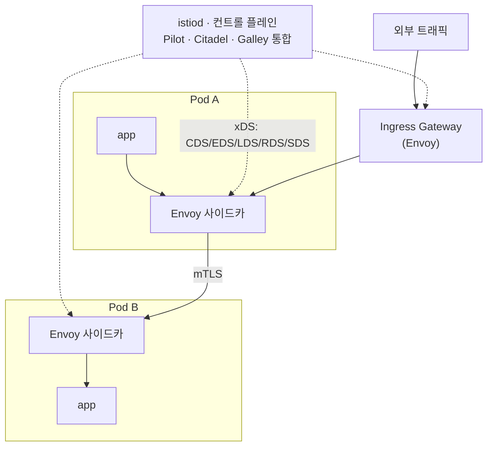

# 01 · 서비스 메시와 Istio 기초 — 왜 EKS에 메시를 얹나

메시를 운영하며 겪은 사건들(02~05)을 이해하려면, 먼저 **메시가 구조적으로 무엇이고 그 대가가 무엇인지**를 잡아야 한다. 이 블록은 서비스 메시의 두 축(데이터 플레인·컨트롤 플레인)과, 메시가 해주는 것 그리고 그 비용을 정리한다.

> 관련 블록: [02 컨트롤 플레인]() · [03 데이터 플레인과 게이트웨이]()

## 시작은 "공통 관심사의 중복"이다

서비스가 몇 개 안 될 때는 서비스 간 통신에서 필요한 것들 — 재시도, 타임아웃, TLS, 호출 지표 수집, 인증 — 을 각 애플리케이션 코드나 공용 라이브러리로 처리한다. 그런데 서비스가 수십 개로 늘고, 언어·프레임워크가 제각각이 되면 이 방식이 무너진다.

- **언어마다 다시 짠다.** Java 서비스의 재시도 라이브러리와 Go 서비스의 그것이 동작이 다르다.
- **버전이 안 맞는다.** mTLS 정책을 바꾸려면 수십 개 서비스를 재빌드·재배포해야 한다.
- **관측이 제각각이다.** 어떤 서비스는 호출 지표를 내보내고 어떤 서비스는 안 낸다.

이 **공통 관심사(cross-cutting concerns)를 애플리케이션에서 떼어 인프라 레이어로 내리는 것**이 서비스 메시의 출발점이다. 애플리케이션은 비즈니스 로직만 남기고, 통신의 공통 규칙은 메시가 일괄로 책임진다.

## 두 개의 플레인

Istio(그리고 대부분의 메시)는 두 부분으로 나뉜다.

- **데이터 플레인** — 실제 트래픽이 흐르는 길. 파드마다 **Envoy 프록시**가 사이드카로 붙어, 그 파드가 주고받는 **모든 트래픽을 가로챈다**. mTLS 암호화, 라우팅, 재시도, 지표 수집이 전부 이 Envoy에서 일어난다. 외부에서 들어오는 트래픽을 받는 **Gateway**도 결국 독립적으로 뜬 Envoy다.
- **컨트롤 플레인** — 트래픽이 직접 흐르지는 않는 곳. **istiod** 하나가 "이 프록시는 어디로 어떻게 보내야 한다"는 설정을 계산해 각 Envoy에 내려보낸다. 초기 Istio의 Pilot·Citadel·Galley 세 컴포넌트가 지금은 istiod 하나로 통합됐다.

이 분리가 이 챕터 전체의 뼈대다. **02는 컨트롤 플레인(istiod)이 규모에서 왜 터지는지**, **03은 데이터 플레인(Envoy·Gateway)을 어떻게 격리하는지**를 다룬다.

## 사이드카는 어떻게 트래픽을 가로채나

핵심 트릭은 **애플리케이션이 눈치채지 못하게** 트래픽을 Envoy로 우회시키는 것이다. 파드가 뜰 때 `istio-init`(또는 Istio CNI 플러그인)이 파드 네트워크 네임스페이스에 iptables 규칙을 심어, 애플리케이션 컨테이너의 인바운드·아웃바운드 패킷을 전부 사이드카 Envoy(15006/15001 포트)로 리다이렉트한다.

그래서 애플리케이션은 `http://other-service`로 평범하게 호출했다고 믿지만, 실제로는:

이 우회 덕분에 **애플리케이션 코드 한 줄 안 고치고** mTLS·재시도·트래픽 분할을 얹을 수 있다. 대신 모든 요청이 프록시를 두 번(발신 측·수신 측) 통과하므로 **지연과 자원이 추가된다** — 이게 뒤에 나오는 "메시의 비용"이다.

## 메시가 실제로 해주는 것

| 범주 | 메시가 하는 일 | 관련 리소스(CRD) |
|---|---|---|
| **트래픽 관리** | L7 라우팅, 카나리/가중치 분할, 미러링, 재시도·타임아웃·서킷브레이킹, fault injection | VirtualService, DestinationRule |
| **보안** | 워크로드 간 자동 mTLS, 인증서 발급·회전, L7 인가 정책 | PeerAuthentication, AuthorizationPolicy |
| **관측성** | 요청 단위 메트릭(RED: Rate·Error·Duration), 액세스 로그, 분산 트레이스 스팬 자동 생성 | Telemetry |
| **연결 관리** | 인그레스/이그레스 게이트웨이, 외부 서비스 등록 | Gateway, ServiceEntry |

여기서 실무적으로 가장 크게 체감하는 둘:

- **자동 mTLS** — 애플리케이션이 평문으로 부른 호출을 Envoy가 알아서 상호 TLS로 암호화한다. 서비스 간 통신 암호화를 코드 변경 없이 클러스터 전체에 강제할 수 있다.
- **카나리 배포** — `VirtualService`에서 "v2로 5%만" 같은 규칙 한 줄로 트래픽을 쪼갠다. 배포와 트래픽 이동을 분리해, 점진 전환의 리스크를 낮춘다.

## 메시의 비용 — 이게 이 챕터의 진짜 주제다

메시는 강력하지만 **공짜가 아니다.** 뒤 블록의 사건들은 전부 이 비용을 관리한 기록이므로, 여기서 못을 박아둔다.

1. **데이터 플레인 오버헤드.** 파드마다 Envoy가 붙으니 파드 수만큼 프록시가 뜬다. 각 프록시가 CPU·메모리를 먹고, 요청마다 프록시 홉이 2번 늘어 **꼬리 지연(tail latency)**이 커진다. → 그래서 [02]()에서 사이드카 리소스를 최적화하고, [03]()에서 게이트웨이를 격리한다.
2. **컨트롤 플레인 부하.** 프록시가 많아지고 설정이 자주 바뀌면 istiod가 각 프록시에 설정을 밀어내는(push) 계산량이 폭증한다. → [02]()의 핵심.
3. **설정 복잡도.** VirtualService·DestinationRule·AuthorizationPolicy가 수백 개로 늘면 손으로 관리가 불가능해진다. → [04]()에서 GitOps로 다스린다.
4. **디버깅 난이도.** 요청 경로에 프록시가 껴 있어, 장애가 앱인지·프록시인지·컨트롤 플레인인지 층을 갈라 봐야 한다. → [05]()의 트러블슈팅.

## (참고) 사이드카 vs Ambient

지금까지 설명한 건 **사이드카 모드** — 파드마다 Envoy를 주입하는 전통적 방식이다. Istio는 이후 **Ambient 모드**(사이드카리스)를 내놨다. 노드마다 도는 경량 L4 프록시 `ztunnel`이 mTLS·기본 라우팅을 맡고, L7 기능이 필요할 때만 `waypoint` 프록시를 별도로 띄운다.

- **동기**: 파드마다 붙는 사이드카의 자원 오버헤드와 주입·업그레이드 부담을 줄이려는 것. 이 챕터에서 다루는 비용 문제의 상당 부분이 Ambient의 존재 이유다.
- **현실**: 성숙도·마이그레이션 비용 때문에, 이미 사이드카로 안정 운영 중인 클러스터는 당장 갈아탈 이유가 크지 않다. 이 챕터의 사건들은 모두 **사이드카 모드 운영**을 전제로 한다.

## 이 블록에서 가져갈 것

- 메시 = **데이터 플레인(파드마다 Envoy)** + **컨트롤 플레인(istiod)**. 이 분리를 머릿속에 새겨야 나머지 블록이 읽힌다.
- 사이드카는 iptables로 트래픽을 가로채 **앱 무수정**으로 mTLS·트래픽 관리·관측성을 얹는다.
- 그 대가는 **프록시 오버헤드 + 컨트롤 플레인 부하 + 설정 복잡도 + 디버깅 난이도**. 다음 블록들은 이 네 비용을 하나씩 다스리는 이야기다.
