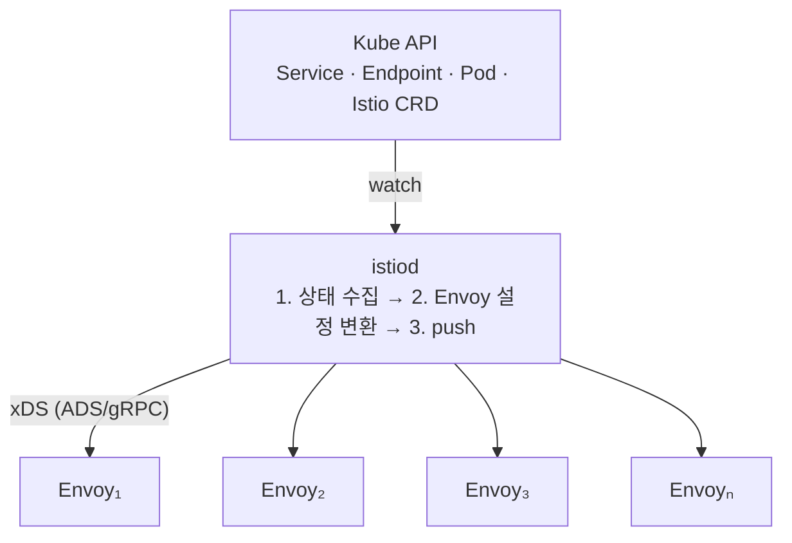

# 02 · 컨트롤 플레인 해부 — istiod는 왜 CPU를 먹는가


**한눈에**
- istiod 부하 = **프록시 수 × 변경 빈도 × 설정 범위**의 곱. 셋 다 커지면 CPU가 벽을 친다.
- 증설 판단은 감이 아니라 지표로: 1순위 `pilot_proxy_convergence_time`(수렴 시간), 그다음 연결 프록시 수·push 폭주·CPU.
- **CPU 증설은 응급 처치일 뿐** — 진짜 해법은 `Sidecar` 리소스로 각 프록시가 보는 설정 범위를 좁히는 것.
- 그다음 레버는 디바운스·discoverySelectors 튜닝, 마지막이 수평 스케일(istiod는 stateless).


> **그때 무슨 일이 있었나.** 클러스터 규모가 커지고 배포가 잦아지자, 컨트롤 플레인 istiod의 CPU가 주기적으로 치솟았다. 급한 불은 **CPU를 증설**해서 껐지만, 그건 응급 처치였다. 같은 맥락에서 "istio node/pod 리소스 최적화" 과제가 이어졌다 — 프록시 쪽 자원과 istiod가 다루는 설정 범위를 함께 손봐야 근본이 잡히기 때문이다. 이 블록은 **istiod가 CPU를 먹는 메커니즘**, **언제 증설해야 하는지를 알려주는 지표**, 그리고 **증설 말고 진짜 해법**을 정리한다.

> 관련 블록: [01 메시 기초]() · [03 데이터 플레인과 게이트웨이]() · [05 장애 이야기]()

## istiod가 실제로 하는 일

istiod는 트래픽이 지나가는 곳이 아니다. 하는 일은 하나로 요약된다: **클러스터 상태를 감시해서, 각 Envoy 프록시가 알아야 할 설정을 계산해 내려보낸다.**



프록시에 내려가는 설정은 **xDS**라는 프로토콜 묶음으로 전달된다. 종류별로:

| xDS | 이름 | 무엇을 알려주나 |
|---|---|---|
| **CDS** | Cluster Discovery | 어떤 상위 서비스(cluster)들이 있는가 |
| **EDS** | Endpoint Discovery | 각 서비스의 실제 엔드포인트(파드 IP) 목록 |
| **LDS** | Listener Discovery | 어떤 포트/프로토콜을 받는가 |
| **RDS** | Route Discovery | 요청을 어떤 규칙으로 라우팅하는가 |
| **SDS** | Secret Discovery | mTLS 인증서·키 |

Istio는 이들을 **ADS**(Aggregated Discovery Service) — 프록시당 하나의 gRPC 스트림 — 로 묶어 보낸다.

## CPU를 먹는 지점: push

istiod의 부하는 대부분 **push** 과정에서 나온다. 클러스터에 변화가 생기면 istiod는 영향받는 프록시들에 새 설정을 밀어내야 한다. 문제는 **무엇이 "변화"이고, 그게 몇 개의 프록시를 건드리느냐**다.

변화를 유발하는 것들:

- **엔드포인트 변경** — 파드가 뜨고 지는 것. 배포 한 번, HPA 스케일 한 번마다 EDS가 갱신된다. **가장 잦은 변화**다.
- **설정 변경** — VirtualService·DestinationRule 등 CRD 수정. CDS/LDS/RDS 재계산.
- **인증서 회전** — SDS.

push 한 번의 비용은 대략 이렇게 곱해진다:

```
push 비용 ≈ (영향받는 프록시 수) × (프록시당 설정 크기) × (직렬화·계산)
```

여기서 규모의 함정이 드러난다. **기본 설정에서 각 프록시는 메시 전체를 알 수 있는 설정을 받는다.** 즉 서비스가 500개면 프록시 하나가 500개 서비스 전부의 cluster/endpoint를 들고 있는다. 그래서:

- 파드 하나가 뜨고 질 때마다 → **그 변경과 무관한 프록시까지** 갱신 대상이 될 수 있고,
- 프록시 수 N이 커지면 → 변경 1건의 fan-out이 N에 비례해 커지며,
- 배포가 잦으면(잦은 endpoint churn) → push가 초당 수십·수백 건씩 쏟아진다.

**프록시 수 × 변경 빈도 × 설정 범위** — 이 세 항의 곱이 istiod CPU다. 클러스터가 크고 배포가 잦아질수록 세 항이 동시에 커지므로, 어느 순간 CPU가 벽을 친다. 우리가 겪은 "주기적 CPU 급등"의 정체가 이것이다.

istiod는 폭주를 막으려 **디바운스(debounce)**를 둔다. 변경이 몰아치면 짧은 시간(`PILOT_DEBOUNCE_AFTER`) 동안 모아서 한 번에 처리하고, 그래도 밀리면 push 큐에 쌓인다. 큐가 길어지면 **설정이 프록시에 반영되기까지 지연**이 생기는데, 이 지연이 다음 절의 핵심 지표다.

## 언제 증설하나 — istiod scaling 지표

증설은 감이 아니라 지표로 판단한다. istiod가 `:15014/metrics`로 노출하는 Prometheus 지표 중, **컨트롤 플레인 건강을 보는 신호**는 다음과 같다.

| 지표 | 무엇을 말하나 | 위험 신호 |
|---|---|---|
| **`pilot_proxy_convergence_time`** | 설정 변경 → 모든 프록시에 반영 완료까지 걸린 시간(히스토그램) | **가장 중요.** p99가 수 초로 늘면 컨트롤 플레인이 밀리는 것 |
| **`pilot_proxy_queue_time`** | 변경이 push 큐에서 대기한 시간 | 상승 = istiod가 처리 속도를 못 따라감 |
| **`pilot_xds`** | 이 istiod에 연결된 프록시(XDS 클라이언트) 수 | 인스턴스당 과다 = 수평 확장(replica↑) 신호 |
| **`pilot_xds_pushes`** | 타입별(cds/eds/lds/rds) push 발생 수 | 급증 = endpoint churn·설정 변경 폭주 |
| **`pilot_xds_push_time`** | push 생성·전송에 걸린 시간 | 상승 = 설정이 크거나 프록시가 많음 |
| **`pilot_xds_push_context_errors` / `pilot_total_xds_rejects`** | push 생성 오류·프록시의 설정 거부 | 0이 아니면 설정 문제 조사 |
| **`container_cpu_usage` (istiod)** | istiod 파드의 실제 CPU | limit 근처 지속 = 증설/스케일 대상 |
| **`process_virtual_memory` / `container_memory_working_set`** | istiod 메모리 | 설정·프록시 수에 비례해 증가 |

읽는 순서는 이렇다. **먼저 `pilot_proxy_convergence_time`(수렴 시간)을 SLO로 본다.** 이게 안정적으로 낮으면 CPU가 좀 높아도 컨트롤 플레인은 건강한 것이다. 수렴 시간이 늘기 시작하면 원인을 가른다 — `pilot_xds`(연결 프록시 수)가 크면 **수평 확장**(istiod replica 추가) 신호, `pilot_xds_pushes`가 폭주하면 **churn·설정 범위 문제**, istiod CPU가 limit에 붙어 있으면 **수직 증설**이 급한 불이다.


**참고 수치(버전 의존).** Istio 공식 Performance & Scalability 문서는 대략적인 기준으로 "잦은 변경이 있는 부하에서 istiod가 프록시 1,000개당 약 1 vCPU와 1.5GB 메모리 규모를 쓴다"는 크기를 제시한다. 버전·설정에 따라 크게 달라지므로 **절대 수치가 아니라 규모 감각**으로만 쓰고, 실제 배포 버전의 지표로 검증한다. → [소스](#소스)


## 증설은 응급 처치다 — 진짜 해법

CPU 증설(수직)이나 replica 추가(수평)는 **부하를 감당**할 뿐, **부하 자체를 줄이지 않는다.** 세 항의 곱을 기억하면 진짜 레버가 보인다.

### 1) 설정 범위를 좁힌다 — `Sidecar` 리소스 (가장 큰 레버)

기본값에선 프록시가 메시 전체 설정을 받는다. 대부분의 서비스는 **소수의 상대와만 통신**하는데도 전부를 들고 있으니, istiod는 불필요하게 큰 설정을 계산·push하고 프록시는 불필요한 메모리를 쓴다. `Sidecar` 리소스로 각 워크로드가 **보는 네임스페이스·서비스를 명시적으로 제한**하면:

```yaml
apiVersion: networking.istio.io/v1
kind: Sidecar
metadata:
  name: default
  namespace: team-a
spec:
  egress:
  - hosts:
    - "team-a/*"        # 같은 네임스페이스
    - "istio-system/*"  # 컨트롤 플레인·게이트웨이
    - "shared/*"        # 실제로 부르는 공용 서비스만
```

효과가 곱셈의 세 항 중 **설정 범위**를 직접 줄인다 → istiod의 push 계산량↓, 프록시 메모리↓, 무관한 변경의 fan-out↓. "istio node/pod 리소스 최적화" 과제의 본질이 여기다: **CPU를 키우는 게 아니라, 프록시가 보는 세상을 좁혀 컨트롤 플레인과 데이터 플레인의 부하를 동시에 낮춘 것.**

### 2) 변경 빈도·범위를 다스린다 — 디바운스와 discoverySelector

- **디바운스 튜닝** — `PILOT_DEBOUNCE_AFTER`, `PILOT_DEBOUNCE_MAX`로 변경을 더 모아 처리하면 push 횟수가 준다. 단, 수렴이 늦어지는 트레이드오프가 있으니 수렴 시간 지표를 보며 조정한다.
- **`discoverySelectors`** — istiod가 아예 감시할 네임스페이스를 제한해, 메시 밖 네임스페이스의 변화가 push를 유발하지 않게 한다.
- **네임스페이스 격리** — 팀·도메인 단위로 설정 경계를 나눠 fan-out을 국소화한다.

### 3) 그다음에 스케일한다

범위를 좁힌 뒤에도 부하가 크면 그때 스케일한다. istiod는 **stateless**라 수평 확장이 쉽다 — replica를 늘리면 프록시 연결이 분산된다. HPA를 CPU 또는 `pilot_xds`(연결 수) 기준으로 걸어 배포·트래픽 피크에 대응하고, 파드 스펙의 CPU/메모리 request·limit은 앞의 참고 수치와 실측으로 잡는다.

## 이 블록에서 가져갈 것

- istiod의 부하는 **push**에서 나오고, 그 비용은 **프록시 수 × 변경 빈도 × 설정 범위**의 곱이다.
- 증설 판단은 감이 아니라 지표로 한다. **1순위는 `pilot_proxy_convergence_time`(수렴 시간)**, 그다음 연결 프록시 수·push 폭주·istiod CPU 순으로 원인을 가른다.
- **CPU 증설은 응급 처치.** 진짜 해법은 `Sidecar` 리소스로 설정 범위를 좁혀 곱의 한 항을 직접 줄이는 것이고, 그다음이 디바운스 튜닝, 마지막이 스케일이다.

## 소스

- Istio 공식 문서 — **Performance and Scalability** (istiod 자원 사용, 벤치마크 기준 수치, `Sidecar` 스코핑 권장): <https://istio.io/latest/docs/ops/deployment/performance-and-scalability/>
- Istio 공식 문서 — **Configuration scoping / Sidecar** (`Sidecar` 리소스로 프록시 설정 범위 제한): <https://istio.io/latest/docs/reference/config/networking/sidecar/>
- Istio 공식 문서 — **Observing / Debugging the control plane** (istiod `:15014` 메트릭, `pilot_*` 지표): <https://istio.io/latest/docs/ops/diagnostic-tools/>
- 배포 버전의 istiod `:15014/metrics`를 직접 스크랩해 위 지표들의 실제 값을 확인할 것 — 문서의 수치는 버전·설정에 따라 달라진다.
