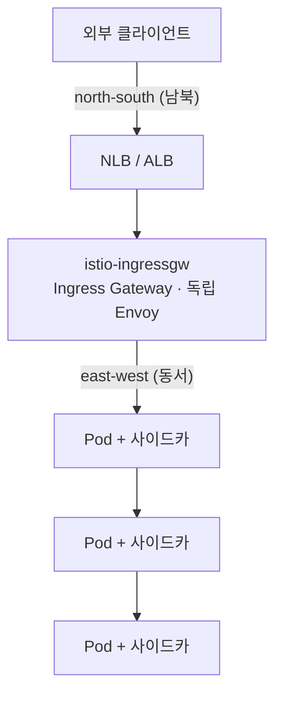

# 03 · 데이터 플레인과 Ingress Gateway — 게이트웨이를 왜 노드로 격리하나


**한눈에**
- 데이터 플레인 트래픽은 **남북(Ingress Gateway)**과 **동서(사이드카)**로 갈린다. Ingress Gateway는 독립적으로 뜬 Envoy로, 모든 외부 트래픽이 지나는 단일 통로다.
- 관문은 성능 크리티컬한 전역 급소 — noisy neighbor·자원 경쟁·보안 희석을 피하려 **전용 노드로 격리**한다.
- 방법: **taint/toleration + nodeSelector**로 격리, **AZ 분산·안티어피니티·PDB**로 가용성, **HPA·전용 LB**로 독립 스케일.
- 대가는 노드 활용률↓·운영 대상↑이지만, 관문의 성능·가용성·보안 값어치가 그 비용보다 크다.


> **그때 무슨 일이 있었나.** 외부 트래픽을 받는 Ingress Gateway가 일반 워크로드 파드들과 **같은 노드에서 자원을 다투고** 있었다. 트래픽이 몰리면 게이트웨이가 옆 파드에 CPU·네트워크를 뺏기거나, 반대로 게이트웨이가 노드를 잡아먹어 이웃이 흔들렸다 — 전형적인 noisy neighbor다. 해법은 **게이트웨이를 전용 노드로 분리**하는 것이었다. 이 블록은 데이터 플레인 트래픽의 두 방향, 게이트웨이의 정체, 그리고 왜·어떻게 노드로 격리하는지를 정리한다.

> 관련 블록: [01 메시 기초]() · [02 컨트롤 플레인]() · [05 장애 이야기]()

## 데이터 플레인 트래픽의 두 방향

메시 안에서 트래픽은 두 방향으로 흐르고, 이 둘은 통과하는 프록시가 다르다.



- **North-south(남북)** — 클러스터 **바깥**과 주고받는 트래픽. 외부 → 서비스 진입은 **Ingress Gateway**를, 서비스 → 외부는 Egress Gateway(쓸 경우)를 지난다.
- **East-west(동서)** — 클러스터 **안**의 서비스 간 트래픽. 각 파드의 **사이드카 Envoy**가 처리한다([01]()의 그 사이드카).

이 블록의 주인공은 남북의 관문인 **Ingress Gateway**다.

## Ingress Gateway의 정체 — 그냥 독립적으로 뜬 Envoy

Ingress Gateway는 특별한 컴포넌트가 아니다. **사이드카와 똑같은 Envoy를, 파드에 붙이지 않고 독립 Deployment로 띄운 것**이다. istiod로부터 xDS 설정을 받는 것도 똑같다. 다만 역할이 다르다:

- 클라우드 로드밸런서(NLB/ALB)가 이 게이트웨이 파드로 외부 트래픽을 넣는다.
- `Gateway` 리소스가 "어떤 포트·호스트·TLS로 받을지"를, `VirtualService`가 "받은 걸 어느 내부 서비스로 라우팅할지"를 정한다.

```yaml
apiVersion: networking.istio.io/v1
kind: Gateway
metadata:
  name: web-gateway
spec:
  selector:
    istio: ingressgateway     # 이 셀렉터에 맞는 게이트웨이 파드가 설정을 받는다
  servers:
  - port: { number: 443, name: https, protocol: HTTPS }
    tls: { mode: SIMPLE, credentialName: web-cert }
    hosts: [ "www.example.com" ]
```

**여기가 구조적 급소다.** 모든 외부 트래픽이 이 한 계층을 통과한다. 게이트웨이가 느리면 전 서비스가 느리고, 게이트웨이가 죽으면 외부 진입이 통째로 막힌다. east-west 사이드카는 장애가 해당 파드로 국소화되지만, **게이트웨이 장애는 전역**이다.

## 왜 전용 노드로 분리하나

게이트웨이가 일반 워크로드와 노드를 공유하면 생기는 문제들:

| 문제 | 내용 |
|---|---|
| **Noisy neighbor** | 트래픽 피크에 게이트웨이가 CPU·네트워크 대역을 두고 이웃 파드와 경쟁. 서로가 서로를 흔든다 |
| **자원 보장 실패** | 관문은 항상 여유 자원이 있어야 하는데, 옆 파드의 스파이크에 밀린다 |
| **스케일 독립성 부재** | 게이트웨이는 트래픽에, 워크로드는 처리량에 맞춰 각각 스케일해야 하는데 노드가 얽히면 따로 못 움직인다 |
| **네트워크 경로 비효율** | LB 타깃이 워크로드 노드 곳곳에 흩어져, 트래픽 경로·SG·모니터링이 지저분해진다 |
| **보안 경계 희석** | 외부에 노출된 관문과 내부 워크로드가 같은 노드에 있으면 공격면·폭발 반경이 커진다 |

핵심 원리 하나: **관문은 데이터 경로의 성능 크리티컬 지점이자 단일 통로이므로, 자원과 장애를 워크로드와 공유하면 안 된다.** 이게 분리의 이유 전부다.

## 어떻게 분리하나

### 1) 전용 노드풀 + taint/toleration

게이트웨이 전용 노드풀을 만들고 **taint**를 걸어 일반 파드가 못 들어오게 막은 뒤, 게이트웨이에만 **toleration + nodeSelector**를 줘서 그 노드에만 뜨게 한다.

```yaml
# 노드풀: taint = dedicated=ingress-gateway:NoSchedule
# 게이트웨이 Deployment
spec:
  template:
    spec:
      nodeSelector:
        dedicated: ingress-gateway
      tolerations:
      - key: dedicated
        operator: Equal
        value: ingress-gateway
        effect: NoSchedule
```

일반 워크로드는 toleration이 없으니 이 노드에 못 오고, 게이트웨이는 nodeSelector 때문에 다른 노드에 안 간다. → **완전 격리.**

### 2) 가용성: AZ 분산과 안티어피니티

관문이 전역 급소인 만큼 가용성이 중요하다.

- **여러 AZ**에 노드풀을 걸치고, `topologySpreadConstraints`(또는 `podAntiAffinity`)로 게이트웨이 파드를 AZ·노드에 고르게 흩뿌린다. 노드/AZ 하나가 빠져도 관문이 산다.
- 게이트웨이 파드는 최소 2개 이상, `PodDisruptionBudget`으로 동시 축출을 제한한다.

### 3) 스케일·네트워크 독립

- 게이트웨이에 **HPA**를 트래픽 지표(CPU 또는 커넥션·RPS)로 걸어 워크로드와 무관하게 스케일한다.
- 전용 노드풀 앞에 **전용 NLB/ALB**를 두면 LB 타깃이 이 노드들로 정돈되어, 트래픽 경로·보안그룹·모니터링이 단순해진다.

## 트레이드오프

공짜 격리는 없다.

- **노드 활용률↓** — 전용 노드는 게이트웨이만 쓰므로 남는 자원이 놀 수 있다. 가용성(AZ별 최소 노드) 요구와 겹쳐 **최소 노드 수·비용이 늘 수 있다.**
- **운영 대상↑** — 관리할 노드풀이 하나 더 생긴다.

그럼에도 분리하는 이유는, **관문의 성능·가용성·보안이 노드 몇 대의 비용보다 훨씬 비싸기 때문**이다. 전역 급소에는 자원을 보장하는 쪽이 옳다.

## 이 블록에서 가져갈 것

- 데이터 플레인 트래픽은 **남북(게이트웨이)** 과 **동서(사이드카)** 로 갈리고, Ingress Gateway는 **독립적으로 뜬 Envoy**로 모든 외부 트래픽의 단일 통로다.
- 관문은 성능 크리티컬·전역 급소라, **noisy neighbor·자원 경쟁·보안 희석**을 피하려 전용 노드로 격리한다.
- 방법은 **taint/toleration + nodeSelector**로 격리하고, **AZ 분산·안티어피니티·PDB**로 가용성을, **HPA·전용 LB**로 독립 스케일을 확보하는 것. 대가는 노드 활용률·비용이며, 관문의 값어치가 그보다 크다.
