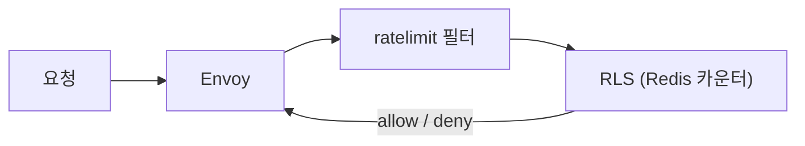

# 08 · EnvoyFilter — 표준 CRD로 안 되는 것들의 탈출구


**한눈에**
- EnvoyFilter는 istiod가 만든 **Envoy 설정을 직접 패치**하는 저수준 탈출구다 — `applyTo × context × operation`으로 읽는다.
- **업그레이드 취약·폭발 반경·리뷰 난이도** 때문에 최후의 수단: 표준 CRD → 상위 API(Telemetry/WasmPlugin) → EnvoyFilter 순.
- 레이트 리밋은 **local**(인스턴스별·무의존)과 **global**(전역정확·RLS 비용)로 성격이 다르다.
- 쓴다면 `workloadSelector`로 좁게, 버전 핀·GitOps 리뷰·관측이 필수다.


> **왜 이 이야기.** [07]()의 표준 CRD로 대부분은 해결된다. 하지만 정교한 레이트 리밋, 특정 Envoy HTTP 필터 삽입, 커스텀 요청 조작처럼 **VirtualService·AuthorizationPolicy의 어휘로는 표현 안 되는** 요구가 남는다. 그때 열리는 마지막 문이 **EnvoyFilter** — istiod가 생성한 Envoy 설정을 직접 패치하는 저수준 탈출구다. 강력한 만큼 위험하므로, 이 문서는 **무엇을 할 수 있는지**만큼 **왜 최후의 수단인지**를 함께 다룬다.

> 관련 문서: [07 표준 CRD 매핑]()(먼저 여기로) · [04 GitOps 리뷰]() · [02 istiod가 만든 설정]()

## EnvoyFilter가 하는 일 — Envoy 설정 직접 패치

[02]()에서 봤듯, istiod는 각 프록시에 완성된 Envoy 설정(listener·filter chain·cluster·route)을 xDS로 내려준다. EnvoyFilter는 그 **최종 설정에 패치를 얹는다.**

```yaml
apiVersion: networking.istio.io/v1alpha3
kind: EnvoyFilter
metadata: { name: my-patch, namespace: prod }
spec:
  workloadSelector: { labels: { app: api } }   # 반드시 좁게 건다
  configPatches:
  - applyTo: HTTP_FILTER                # 무엇을: listener/filter/route/cluster…
    match:
      context: SIDECAR_INBOUND          # 어디서: 인바운드/아웃바운드/게이트웨이
      listener:
        filterChain:
          filter: { name: envoy.filters.network.http_connection_manager }
    patch:
      operation: INSERT_BEFORE          # 어떻게: ADD/MERGE/REMOVE/INSERT_BEFORE…
      value: { ... }                    # 날것의 Envoy 설정
```

세 축으로 읽는다: **applyTo**(무엇을 건드리나) × **match.context**(어느 경로의 프록시인가) × **patch.operation**(어떻게 바꾸나). `value`에는 Envoy가 이해하는 **날것의 설정**이 그대로 들어간다 — 여기가 위험의 근원이다.

## 왜 최후의 수단인가 (먼저 못 박기)

EnvoyFilter는 **Envoy 내부 구조에 직접 결합**한다. 그래서:

- **업그레이드에 깨진다.** 필터 이름·설정 스키마가 Envoy/Istio 버전에 묶여 있어, 컨트롤 플레인을 올리면([04]()의 revision 업그레이드) 조용히 무효화되거나 프록시가 설정을 거부한다.
- **폭발 반경이 크다.** 잘못된 patch 하나가 `workloadSelector`에 걸린 **모든 프록시의 데이터 플레인을 통째로 망가뜨릴** 수 있다. 검증 장치가 표준 CRD보다 약하다.
- **관측·리뷰가 어렵다.** 날것의 Envoy 설정이라 무슨 뜻인지 리뷰어가 읽기 힘들다.

그래서 원칙은 **선택 사다리**다:

```
1. 표준 CRD로 되나?        → VirtualService/AuthorizationPolicy/Gateway  (07)
2. 상위 확장 API로 되나?    → Telemetry API / WasmPlugin
3. 그래도 안 되면          → EnvoyFilter  (최후, 좁게)
```

## 플래그십 사례 — 레이트 리밋

nginx `limit_req`의 대응이 여기다. Istio는 레이트 리밋을 표준 CRD로 노출하지 않으므로 EnvoyFilter(또는 그 위 도구)로 Envoy의 rate limit 필터를 붙인다. 두 방식이 있고 **성격이 다르다.**

### Local rate limit — 프록시 로컬 토큰 버킷

각 프록시가 **자기 안의 토큰 버킷**으로 제한한다. `envoy.filters.http.local_ratelimit` 필터를 HTTP 필터 체인에 삽입한다.

- **장점**: 외부 의존 없음, 지연 없음, 구성 단순.
- **한계**: **인스턴스별**이다. 프록시 10개면 실제 허용량은 설정치 × 10. 파드 수가 변하면 전체 한도가 흔들린다.
- **쓸 때**: 인스턴스 단위 보호(과부하 방어), 대략적 상한이면 충분할 때.

### Global rate limit — 외부 RLS로 클러스터 일관성

클러스터 전역에서 **하나의 일관된 한도**가 필요하면, Envoy의 `envoy.filters.http.ratelimit` 필터가 매 요청을 **외부 Rate Limit Service(RLS)**(보통 Envoy ratelimit + Redis)에 물어본다.



- **장점**: 프록시 수와 무관하게 전역 정확도. 사용자·API키·경로별 descriptor로 세밀한 정책.
- **비용**: RLS·Redis라는 **운영 대상과 요청당 왕복 지연**이 추가된다.
- **쓸 때**: "사용자당 초당 N회" 같은 전역 계약을 정확히 지켜야 할 때.

| | Local | Global |
|---|---|---|
| 상태 | 프록시 로컬 | 외부 RLS+Redis |
| 정확도 | 인스턴스별(근사) | 클러스터 전역(정확) |
| 지연/의존 | 없음 | RLS 왕복 |
| 용도 | 과부하 방어 | 정확한 쿼터 계약 |

실무에선 **둘을 겹쳐** 쓰기도 한다: global로 공정 쿼터를, local로 인스턴스 과부하 방어를.

## 커스텀 로직 — Lua와 WASM

요청/응답에 **프로그래밍 가능한 조작**이 필요할 때.

### Lua — 간단한 인라인 스크립트

`envoy.filters.http.lua` 필터로 짧은 Lua를 인라인으로 박는다. 헤더 몇 개 가공, 조건부 분기 같은 **가벼운 로직**에 적합하다.

```yaml
    patch:
      operation: INSERT_BEFORE
      value:
        name: envoy.filters.http.lua
        typed_config:
          "@type": type.googleapis.com/envoy.extensions.filters.http.lua.v3.Lua
          inline_code: |
            function envoy_on_request(handle)
              handle:headers():add("x-mesh-touched", "1")
            end
```

간단하지만 요청 경로에서 도는 코드이므로 무거운 연산·외부 호출은 피한다.

### WASM — 진짜 커스텀 필터, 단 상위 API로

복잡하거나 성능이 중요한 커스텀 필터는 언어로 짜서 **WASM**으로 로드한다. 이때 EnvoyFilter로 날것을 붙이기보다 **`WasmPlugin` API**를 쓰는 게 권장이다 — 배포·버전·대상 선택을 다루는 **더 안전한 상위 추상화**라서, EnvoyFilter의 업그레이드 취약성을 상당히 덜어준다.

원칙은 같다: **Telemetry API·WasmPlugin 같은 상위 API로 되는 일을 굳이 EnvoyFilter 날것으로 하지 않는다.**

## 운영 수칙

EnvoyFilter를 쓸 수밖에 없다면 최소한 이것들을 지킨다.

- **좁게 건다.** `workloadSelector`를 반드시 지정해 폭발 반경을 한 워크로드로 가둔다. 전역 EnvoyFilter는 금물.
- **버전에 핀·테스트.** Istio/Envoy 업그레이드 전 스테이징에서 patch가 여전히 붙는지 검증한다. revision 카나리([04]())로 먼저 소수에만 태운다.
- **GitOps 리뷰 필수.** 날것의 Envoy 설정일수록 리뷰·감사가 중요하다. 손 apply 절대 금지([04]()).
- **관측을 붙인다.** 레이트 리밋 필터도 자체 메트릭(제한된 요청 수 등)을 내므로, [06]()의 대시보드에 걸어 실제로 얼마나 막히는지 본다.

## 이 문서에서 가져갈 것

- EnvoyFilter는 istiod가 만든 **Envoy 설정을 직접 패치**하는 저수준 탈출구다. `applyTo × context × operation`으로 읽는다.
- **업그레이드 취약·폭발 반경·리뷰 난이도** 때문에 최후의 수단이다. 선택 사다리 = 표준 CRD → 상위 API(Telemetry/WasmPlugin) → EnvoyFilter.
- 대표 용도는 **레이트 리밋**(local=인스턴스별·무의존, global=전역정확·RLS비용)과 **커스텀 로직**(Lua=가벼움, WASM=WasmPlugin으로). 쓴다면 좁게·버전핀·GitOps·관측이 필수다.
