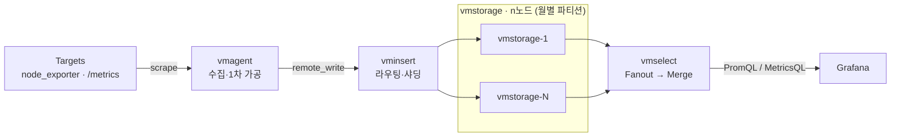

# 02 · 아키텍처 — 4개 컴포넌트와 저장 원리

VM 클러스터가 어떤 컴포넌트로 이루어지고 데이터가 어떻게 흐르는지, 그리고 그 밑을 떠받치는 두 가지 핵심 아이디어 — **LSM 트리**와 **IndexDB/DataDB 분리** — 를 정리한다. 각 컴포넌트의 내부 동작은 뒤 블록에서 하나씩 깊게 파고든다.

> 관련 블록: [01 시계열과 VM]() · [03 수집]() · [04 저장과 압축]() · [05 쿼리·운영 컴포넌트]() · [07 대규모 운영]()

## 4개 컴포넌트의 데이터 흐름



VM 클러스터 버전은 4개의 핵심 컴포넌트로 구성된다. 대규모·고가용성(HA) 환경에서는 SingleNode가 아닌 클러스터 버전을 쓴다. 데이터가 **들어가는 길**(왼쪽 → 오른쪽)과 **빠지는 길**(오른쪽 → 왼쪽)을 하나의 흐름으로 보면 다음과 같다.

```
     수집·1차가공        라우팅/샤딩          저장                쿼리 팬아웃
 ┌──────────┐      ┌──────────┐      ┌──────────────┐      ┌──────────┐
 │ Targets  │      │          │      │  vmstorage   │      │          │
 │ node_    │ ───▶ │ vmagent  │ ───▶ │  vminsert    │ ───▶ │  #1 #2   │ ◀─── │ vmselect │ ◀─── Grafana
 │ exporter │      │          │      │              │      │  #3 … #n │      │          │
 │ /metrics │      └──────────┘      └──────────────┘      │ 월별파티션 │      └──────────┘
 └──────────┘                                              └──────────────┘
                                                        Fanout → Merge → 응답
```

한 줄 역할 요약:

- **vmagent** — 타깃에서 지표를 스크랩하고 1차 가공(릴레이블, 드랍 등)을 담당하는 수집 컴포넌트다. → [03 수집]()
- **vminsert** — 받은 데이터를 여러 vmstorage 노드로 라우팅·샤딩하는 수집 게이트웨이다. → [03 수집]()
- **vmstorage** — 실제 저장을 책임진다. 월별 파티션 단위로 저장하고 vmselect의 쿼리에 응답한다. → [04 저장과 압축]()
- **vmselect** — 쿼리 엔진. 쿼리를 받아 모든 vmstorage에 던지고(Fanout), 돌아온 결과를 모아(Merge) 클라이언트에 반환한다. → [05 쿼리·운영 컴포넌트]()

여기에 운영용 컴포넌트인 **vmalert**(지표 선계산)와 **vmauth**(라우팅/인증 게이트웨이)가 더해진다. 이 둘은 [05 쿼리·운영 컴포넌트]()에서 다룬다.

## SingleNode vs Cluster

VM에는 두 가지 배포 모드가 있다. 네이버 검색 SRE도 처음엔 SingleNode로 시작했다가 클러스터로 옮겨 갔다.

| | SingleNode | Cluster |
|---|---|---|
| **구성** | 바이너리 파일 하나로 모든 기능 제공 | write/read/storage 3역할을 vminsert·vmselect·vmstorage로 분리 |
| **장점** | 구축·사용이 간편. VM 자체 최적화로 Prometheus보다 빠른 성능 체감 | 데이터 규모에 따라 컴포넌트만 추가하면 **손쉬운 수평 확장(scale out)**. Prometheus의 최대 약점인 scale out 한계를 극복. `replicationFactor`로 유실 방지 |
| **단점** | 수천만 개 이상으로 늘면 단일 장비로 감당 불가. 단일 장비가 **SPOF**(단일 장애점) | 구조가 복잡하고 운영이 어려움. 의존성은 Thanos·Cortex보다 적은 편 |

운영 방식은 컴포넌트 성격에 따라 갈린다. **Stateless** 컴포넌트인 vminsert(write)·vmselect(read)는 Kubernetes에 올려 유연하게 scale out하고, **Stateful** 컴포넌트인 vmstorage는 물리 장비에서 운영하는 편이 이점이 있다. 이 구성이 초대규모에서 어떻게 확장되는지는 [07 대규모 운영]()에서 다룬다.

## 왜 대용량 write/read가 어려운가 — LSM 트리

수천만 개의 시계열을 처리한다고 가정해 보자. 모니터링 시스템은 15초·30초·1분처럼 짧은 주기로 지표를 수집한다. 그러면 **매 주기마다 수천만 개의 새 데이터가 한꺼번에 유입**되고, 이걸 그때그때 다 써야 하므로 **빠른 대용량 write 성능**이 필요하다. 동시에 모든 지표를 계속 감시하다 이상이 보이면 즉시 경보해야 하므로, 새로 들어온 데이터를 매번 다시 읽는 **빠른 대용량 read 성능**도 필요하다.

두 요구는 소박하게 접근하면 서로 충돌한다.

- **write를 edit(수정) 방식으로 접근하면** 대용량 처리가 어렵다. → 그래서 **append 위주 연산**으로 써서 **상수 시간(O(1))** 안에 처리되게 만든다.
- **read를 랜덤 액세스로 찾으면** 너무 느리다. → 그래서 **항상 정렬된 상태를 유지**해 **서브리니어 타임**에 조회되게 만든다.

이 두 특성을 동시에 만족시키는 자료구조가 **LSM 트리**(Log-Structured Merge Tree)다. HBase, Cassandra 같은 NoSQL DB도 쓰는 구조다. 동작은 다음과 같다.

```
[write]  스트림 유입 ─▶ 메모리에서 작은 조각 단위로 빠르게 정렬
                     ─▶ 주기적으로 파일로 flush (여기서 write는 끝)
                     ─▶ 백그라운드에서 정렬된 조각들을 merge → 점점 큰 파일로

[read]   이미 정렬돼 있으므로 이진 탐색으로 조회
         흩어진 여러 파일을 열어야 하는 단점 → Bloom filter로 완화
```

핵심은 **정렬을 작은 조각에서 미리 해 두고**, 조각을 합치는 **merge를 백그라운드로 미룬다**는 점이다. 이미 정렬된 조각들을 합치는 것이라 merge 비용도 높지 않고, 각 조각은 불변(immutable) 상태를 유지한다. 이렇게 append 위주 write와 정렬 유지 read를 동시에 고성능으로 얻는다. VM의 파티션 구조(인메모리 → Small → Big 머지)가 바로 이 LSM 트리의 구체화다(→ [04 저장과 압축]()).

## IndexDB / DataDB 분리 — 정규화 관점

모니터링 데이터는 크게 세 값이 유입된다: **Time Series name**, **Unix timestamp**, **value**. 이걸 그대로 한 테이블에 저장할 수도 있지만, VM은 두 저장 공간으로 **분리**한다.

| 저장 공간 | 담는 것 | 성질 |
|---|---|---|
| **IndexDB** | Time Series name(지표 이름 + 레이블 집합) | **거의 변하지 않는다** |
| **DataDB** | timestamp + value | **계속 쌓인다** |

이 분리는 일종의 **DB 정규화**다. 서로 다른 특성을 가진 데이터를 갈라 두면 각각에 맞는 압축이 가능해 **압축 효율이 극단적으로 좋아진다.** 변하지 않는 이름을 매 샘플마다 반복 저장하지 않고, timestamp+value는 [01]()에서 예고한 Gorilla 계열 차분 압축으로 눌러 담는다.

동작을 좀 더 보면:

- **DataDB 쪽** — Time Series name마다 **TSID**(Time Series ID)를 하나 발급하고, timestamp+value는 그 TSID에 매칭되는 공간에 차곡차곡 append한다.
- **IndexDB 쪽** — Time Series name을 레이블 단위로 뜯어 **역색인**(inverted index)을 만든다. 어떤 레이블 값으로 검색하든 원하는 시계열을 빠르게 찾기 위해서다. 처음 보는 시계열이 들어올 때는 역색인을 새로 만드는 **slow insert**가 일어나고, 같은 시계열의 추가 데이터는 TSID만 확인하는 **fast insert**로 처리된다.

TSID 변환·캐시, 역색인의 상세, New TSID로 인한 카디널리티 폭발은 각각 [04 저장과 압축]()과 [06 카디널리티]()에서 다룬다.

## "거대하고 빠른 키-밸류 스토어"라는 추상화

한 발 물러서서 보면 IndexDB와 DataDB는 결국 둘 다 **엄청나게 거대하고 빠른, LSM 트리 형태의 키-밸류 스토어**다. IndexDB는 "레이블 → 시계열" 매핑을, DataDB는 "TSID → (timestamp, value) 시퀀스"를 담는다. VM의 저장 계층 전체를 이 한 문장으로 요약할 수 있다 — **append로 빠르게 쓰고 정렬로 빠르게 읽는, 두 개의 거대한 키-밸류 스토어.** 이 추상화를 쥐고 있으면 뒤 블록의 압축·파티션·쿼리 이야기가 전부 "이 키-밸류 스토어를 어떻게 더 잘게 눌러 담고 더 빠르게 뒤지느냐"의 변주로 읽힌다.

## 출처

- **Inside VictoriaMetrics** (강민구, NAVER · 40:37) — `00:55~05:58` 아키텍처 오버뷰, 4컴포넌트 데이터 흐름, 클러스터/HA. `16:46~17:58` Time Series/Sample 분리와 IndexDB/DataDB 근거. https://d2.naver.com/helloworld/9290861
- **VictoriaMetrics: 시계열 데이터 대혼돈의 멀티버스** (DEVIEW 2023, 손주식·이선규 · 33:50) — `06:11~14:52` IndexDB/DataDB 분리(정규화·역색인·TSID), 대용량 write/read 요구, LSM 트리(append 상수시간·정렬 서브리니어·merge·Bloom filter), "거대하고 빠른 키-밸류 스토어" 추상화. `20:40~22:06` SingleNode vs Cluster, Stateless/Stateful 운영. https://youtu.be/OUyXPgVcdw4
- 골격: `chapter9/victoriametrics.md` §2 · §4.1.
