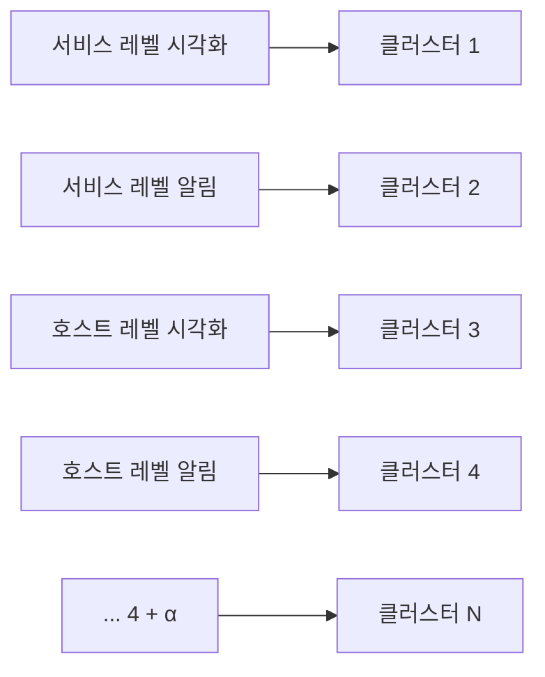
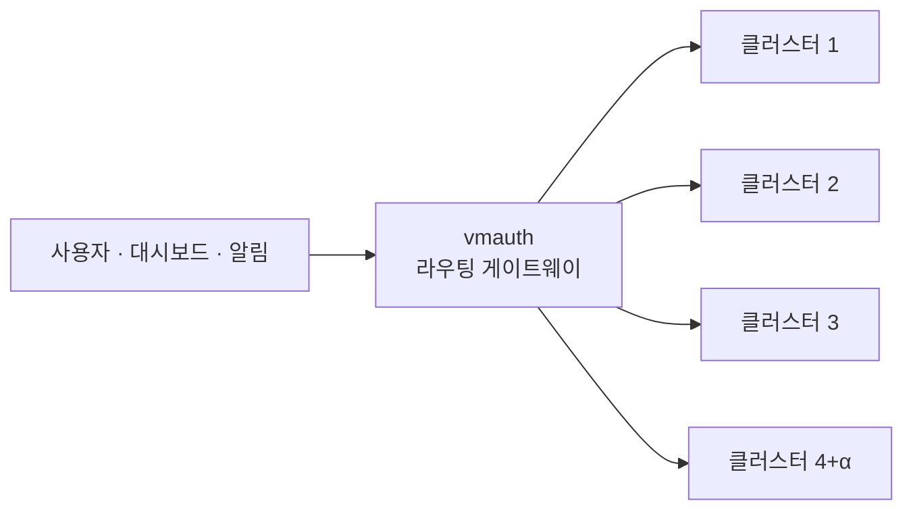

# 01 · 네이버 검색 SRE의 시계열 데이터베이스 운영기 (2024-02)


**참조한 내용정리** · 이 문서는 아래 네이버 D2 원문을 읽고 우리 지식베이스 형식으로 재구성한 요약이다. 원문 자체가 아니며, 정확한 워딩·전체 맥락·그림은 원문에서 확인한다.
- **원문**: [네이버 검색 SRE의 시계열 데이터베이스 운영기 — VictoriaMetrics로 수천만 개의 시계열 데이터 다루기](https://d2.naver.com/helloworld/6867189)
- **매체 · 게시일**: D2 기사 (DEVIEW 2023 발표 기반) · 2024-02-07
- **저자**: 이선규



**한눈에**
- SingleNode는 SPOF, Cluster는 단독으로도 여전히 부족하다 — 서비스/호스트 레벨 시각화·알림 4가지 접근 패턴이 하나의 클러스터를 캐시 미스와 과부하로 몰아넣었다.
- 해결책은 두 가지: ① 접근 패턴별로 클러스터를 나눈 **멀티 클러스터 운영**(4+α개), ② `vmalert` 기반 **지표 선계산**(recording rules)으로 heavy query를 완화.
- 지표 선계산 예시: 장비 5,000대 × 1분 간격 하루치 조회는 7,200,000개 데이터 포인트지만, 미리 합산해 1개 시계열로 압축하면 1,440개 조회로 끝난다.
- 클러스터를 여러 개로 나누면 운영 이슈(업그레이드·장비교체·IDC 장애)마다 사용자가 엔드포인트를 직접 바꿔야 하는 커뮤니케이션 비용이 생긴다 — `vmauth`를 래핑한 라우팅 게이트웨이로 이를 해결했다.


네이버 검색 SRE가 [DEVIEW 2023](https://deview.kr/2023/sessions/558)에서 발표한 VictoriaMetrics 도입·운영 이야기를 텍스트로 정리한 글이다. 이 문서는 그 D2 기사를 다시 우리 지식베이스 형식으로 재구성한 것으로, SingleNode/Cluster 선택 과정부터 단일 클러스터가 무너진 이유, 멀티 클러스터와 지표 선계산으로 이를 해결한 과정, 그리고 여러 클러스터를 다시 하나의 진입점처럼 쓰게 해준 라우팅 게이트웨이까지 원문의 흐름을 그대로 따라간다.

## 시계열 데이터란

시계열 데이터란 시간 순서대로 나열된 숫자 데이터다. 네이버 검색 SRE는 모니터링을 위해 장비 지표와 서비스 지표를 일정 주기로 수집·저장·분석하며, 이를 위해 Prometheus 호환 시계열 데이터베이스인 VictoriaMetrics를 사용해 저장·분석·대시보드(시각화)·알림 시스템에 데이터를 제공한다. 시계열 데이터와 지표 타입의 기본 개념은 에서 더 자세히 다룬다.

## 시계열 데이터(지표) 저장 — SingleNode vs Cluster

VictoriaMetrics는 `SingleNode` 버전과 `Cluster` 버전을 제공한다.

### SingleNode 버전

| 구분 | 내용 |
| --- | --- |
| 장점 | 단일 바이너리로 손쉽게 실행 · Prometheus 대비 2~10배 가량 빠르고 리소스를 적게 사용 |
| 단점 | 수집 데이터가 수천만 개 이상으로 늘면 단일 장비로 감당이 안 될 수 있음 · 단일 장비가 SPOF(single point of failure)로 작용 |
| 결론 | 네이버 검색 SRE에서는 SingleNode 버전만으로는 시계열 데이터 저장과 제공이 불가능하다고 결론 |

### Cluster 버전

| 구분 | 내용 |
| --- | --- |
| 장점 | 저장되는 시계열 스케일에 맞춰 read·write·storage 컴포넌트의 scale out이 선형적으로 가능(Prometheus의 가장 큰 한계를 해소) · replication factor 적용으로 일정 부분 시계열 데이터 유실 방지 |
| 단점 | SingleNode 버전에 비해 구조가 복잡하고 운영이 어려움 |
| 결론 | stateless 컴포넌트인 `vminsert`(write)·`vmselect`(read)는 Kubernetes에, stateful 컴포넌트인 `vmstorage`는 물리 장비를 사용한 클러스터로 구성해 운영 |

Cluster 버전의 컴포넌트 구성과 stateless/stateful 배치 이유는 에서 더 깊이 다룬다.

## 단일 클러스터 과부하

Cluster 버전을 쓰기로 했지만, 단일 클러스터만으로는 여전히 풀리지 않는 문제가 있었다. 네이버 검색 SRE는 안정적인 검색 서비스를 위해 수십만 대의 장비와 수백 개의 서비스에 대해 대시보드(시각화)와 경보·알림을 제공하는데, 하나의 클러스터로는 다음 4가지 서로 다른 데이터 접근 패턴의 부하를 감당할 수 없었다.

- 서비스 레벨의 시각화: 특정 지표를 넓은 범위로 조회
- 서비스 레벨의 알림: 특정 지표를 최신 범위로 조회
- 호스트 레벨의 시각화: 모든 지표를 일부 범위에서 조회
- 호스트 레벨의 알림: 모든 지표를 최신 범위로 조회

이렇게 서로 다른 데이터 접근 패턴의 컴포넌트가 존재해 VictoriaMetrics의 캐시 미스와 과부하가 자주 발생했다. 예를 들어 경보가 발생해 대시보드에 접속하면 지표 조회 중 타임아웃이 발생하거나, 대시보드에서 실수로 heavy query를 요청하면 경보 시스템의 지표 조회가 실패해 오경보를 수십 명에게 발송하는 경우도 있었다. 또한 지표 백테스트를 위해 과거 데이터를 대량 조회하는 경우에도 하나의 클러스터를 쓰기에는 부담이 컸다.

## 해결책

장애 관제 및 모니터링 시스템은 비상구와 같아서 지표 유실과 중단 시간의 최소화가 필요하다. 네이버 검색 SRE는 단일 클러스터 과부하를 해결하기 위해 다음 2가지 방법을 사용했다.

### 1. 멀티 클러스터 운영

앞서 나열한 추상화 레벨과 시각화/알림의 접근 패턴별로 클러스터를 분리했다. 그 결과 사용자 컴포넌트가 서로에게 영향을 주고받는 부분을 제거해 클러스터 장애 상황 시 영향을 최소화할 수 있었다. 현재 시계열 데이터 수천만 개 규모의 클러스터를 **4+α개** 운영하고 있다.

접근 패턴별로 클러스터를 나눠 초대규모(180대 · 12.5억 시계열)까지 확장한 사례는 에서 이어서 다룬다.

### 2. 지표 선계산

시각화 대시보드에서 서비스 지표를 하루 혹은 그 이상의 범위로 조회하는 요청은 부하가 크다. 예를 들어 장비 5,000대를 사용하는 특정 서비스에서 매 분 발생하는 검색 요청 수의 합을 하루 혹은 그 이상의 범위로 시각화 대시보드에 표시한다면, 조회해야 하는 데이터 포인트 수는 다음과 같다.

- 데이터 수집 간격: 1분
- 매 분 장비별 검색 요청 수 시계열 데이터: 5,000개
- 1일 데이터 포인트 수: 데이터 5,000개/분 × 60분/시간 × 24시간/일 = **7,200,000개/일**

수백만 개의 데이터 포인트를 반환해야 하는 상황인데, 검색 요청 수의 합을 미리 계산하면 시계열 데이터를 1개로 압축해 7,200,000개 대신 **1,440개** 데이터 포인트 조회만으로 시각화가 가능하다. 네이버 검색 SRE는 지표 선계산을 위해 Prometheus의 [Recording rules](https://prometheus.io/docs/prometheus/latest/configuration/recording_rules/) 호환 툴인 VictoriaMetrics의 컴포넌트 `vmalert`를 사용하고 있다. `vmalert`의 동작 방식은 에서 더 자세히 다룬다.

## 멀티 클러스터 운영의 어려움

단일 클러스터 과부하를 해결하기 위해 도입한 멀티 클러스터 운영에도 어려움이 있다. 시계열 데이터베이스 사용자는 시계열 데이터베이스에 운영 이슈(버전 업그레이드, 장비 교체, 배포, IDC 장애 등)가 생기면 엔드포인트를 변경해 대체 클러스터를 써야 한다.

즉, 내부 운영 이슈를 처리하기 위해 사용자와의 커뮤니케이션 비용이 발생한다. 사용자에게 이슈 상황마다 배포 혹은 대체 클러스터로의 엔드포인트 변경을 요청해야 하고, 사용자는 그때마다 변경 배포가 필요하다. 최악의 경우 특정 IDC 인프라 장애로 네이버 검색의 장애 관제 및 모니터링 자체가 중단되면, 사용자 배포 전까지 복구가 지연될 수 있다.

### 해결책: 라우팅 게이트웨이 적용

사용자가 직접 엔드포인트를 바꾸는 대신, 시계열 데이터베이스 클러스터 운영자가 사용자를 적절한 클러스터로 라우팅하는 게이트웨이를 적용했다. 라우팅 게이트웨이로는 VictoriaMetrics의 `vmauth`를 래핑해 사용하고 있다.

`vmauth` 라우팅 게이트웨이의 장점은 다음과 같다.

- 사용자별 데이터 접근 패턴 및 부하 발생량에 맞춰 라우팅 및 로드밸런싱 제공
- 인증된 사용자만 클러스터에 접근할 수 있으므로(`vmauth`의 basic auth 기능 사용) 예상되지 않은 부하에 대처 가능
- 사용자별 부하 발생 및 요청 수 모니터링 가능
- 버전 업그레이드, 장비 교체 등 운영 이슈 발생 시 내부 라우팅 설정 변경만으로 대체 클러스터로 라우팅 제공
- 특정 IDC 인프라 장애 등 비상 상황 시 사용자의 배포 없이 빠르게 라우팅 포인트 변경 가능

이렇게 게이트웨이를 적용함으로써 여러 개의 클러스터를 운영하더라도 사용자와의 커뮤니케이션 비용을 줄이고 내부 유지 보수 작업을 용이하게 할 수 있었다. `vmauth`를 포함한 쿼리·운영 컴포넌트의 역할은 에서 이어진다.

## 마치며

네이버 검색 SRE가 시계열 데이터베이스를 운영하면서 겪은 어려움과 해결책을 다시 정리하면 다음과 같다.

- 지표 유실 및 중단 시간 최소화
- 시계열 데이터베이스 클러스터 과부하를 막기 위해 멀티 클러스터 운영
- 컴포넌트별 데이터 접근 패턴에 맞춰 클러스터 제공
- 선계산을 활용해 heavy query 완화
- 라우팅 게이트웨이를 적용해 멀티 클러스터 운영 난도 낮춤

## 출처

- **원문**: [네이버 검색 SRE의 시계열 데이터베이스 운영기 — VictoriaMetrics로 수천만 개의 시계열 데이터 다루기](https://d2.naver.com/helloworld/6867189) (D2, DEVIEW 2023 발표 기반, 2024-02-07, 이선규)
- 작업 저장소 원본: `04_기사_6867189_SRE시계열운영기.md`
- 반영 범위: 원문 전체 — 시계열 데이터 정의, SingleNode/Cluster 장단점과 결론, 단일 클러스터 과부하(4가지 접근 패턴), 해결책(멀티 클러스터 운영·`vmalert` 지표 선계산), 멀티 클러스터 운영의 어려움과 `vmauth` 라우팅 게이트웨이, 마치며 요약까지 빠짐없이 정리했다.
