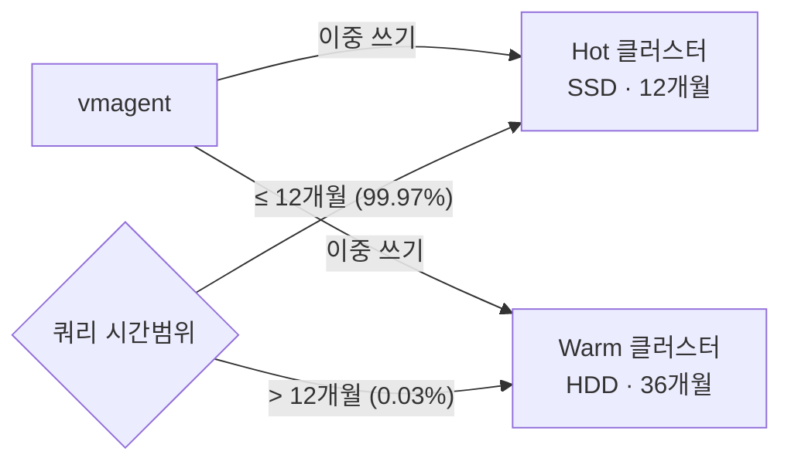

# 02 · 네이버 검색의 대규모 메트릭 저장소, VictoriaMetrics 운영기 1편 (2026-04)


**참조한 내용정리** · 이 문서는 아래 네이버 D2 원문을 읽고 우리 지식베이스 형식으로 재구성한 요약이다. 원문 자체가 아니며, 정확한 워딩·전체 맥락·그림은 원문에서 확인한다.
- **원문**: [네이버 검색의 대규모 메트릭 저장소, VictoriaMetrics 운영기](https://d2.naver.com/helloworld/6475419)
- **매체 · 게시일**: D2 기사 (운영기 시리즈 1편) · 2026-04-22
- **저자**: 강지훈 · 이윤석 (NAVER Metric&Monitoring)



**한눈에**
- 5년 운영 결과 네이버 검색 VictoriaMetrics 클러스터는 **12.5억 개 활성 시계열 · 555조 개 데이터포인트 · 180대 노드**(Hot 120·Warm 60) 규모에 도달했다 — 공개 사례 중 최상위권.
- 2022~2026년 쿠버네티스 전환으로 컨테이너가 **약 58배** 늘며 메트릭 카디널리티가 폭증했다.
- **Hot(SSD·12개월)/Warm(HDD·36개월) 2계층**으로 성능과 비용의 균형을 잡는다.
- 카디널리티 증가로 `vmstorage` 메모리를 **128GB→512GB**로 올려야 했는데, Hot은 **랑데부 해싱 역순 추가**로, Warm은 **`vmbackup`/`vmrestore`**로 각각 무중단 전환했다.
- 결과는 **서비스 중단 0분 · 메트릭 유실 0건**.


네이버 검색 인프라는 수만 대의 물리 서버와 수백만 개의 컨테이너에서 발생하는 메트릭을 실시간으로 수집·저장·조회해야 한다. 이 요구를 충족하기 위해 선택한 오픈소스 TSDB가 VictoriaMetrics다 — 배경과 컴포넌트 구조는 에서 다룬다. 이 문서는 5년간 이 클러스터를 운영하며 마주친 인프라 성장, 메모리 한계, 그리고 180대 규모의 무중단 장비 전환 경험을 담은 D2 원문 1편을 정리한 것이다. 같은 팀이 이어서 공유한 **2편**(2026-07, 3단계 최적화)은 에서 다룬다.

## 인프라 규모와 아키텍처

### 쿠버네티스 전환과 메트릭 폭증

2022년부터 2026년까지 네이버 검색 인프라는 급격히 성장했다.

| 항목 | 2022년 1월 | 2024년 1월 | 2026년 1월 | 4년간 증가율 |
| --- | --- | --- | --- | --- |
| 물리 서버 | 수만 대 | 수만 대 | 수만 대 | 약 1.9배 |
| 컨테이너 | 수만 개 | 수만 개 | 수백만 개 | 약 58배 |

컨테이너가 4년 만에 **약 58배** 증가한 것은 쿠버네티스 전환이 본격 가속화된 결과다. 하나의 물리 서버에 수십 개의 컨테이너가 배치되고 각 컨테이너가 독립적으로 메트릭을 생성하면서 수집 대상 시계열도 기하급수적으로 늘었다. 문제는 수집량 증가에 그치지 않았다. 컨테이너 ID, 파드 이름, 네임스페이스 같은 레이블 조합에 따라 같은 메트릭도 서로 다른 시계열로 저장되므로, 컨테이너 증가는 곧 메트릭 카디널리티 증가로 이어져 검색용 인덱스 크기와 디스크 사용량까지 함께 밀어 올렸다.

### 현재 클러스터 규모

2026년 3월 1일부터 7일까지의 주간 평균 기준이다. 먼저 클러스터 구성과 할당 리소스다.

| 구분 | `vmstorage` | `vminsert` · `vmselect` | 비고 |
| --- | --- | --- | --- |
| 규모 | 180대 (Hot 120대, Warm 60대) | 256개 컨테이너 | - |
| CPU | 8,640코어 | 2,048코어 | 전체 코어 수 |
| 메모리 | 약 88TB | 약 3.75TB | 전체 가용 메모리 |
| 디스크 | 약 2.77PB | 약 2TB (임시 스토리지) | 전체 할당 스토리지 |

이어서 실제 시계열 규모와 처리량이다.

| 항목 | 값 | 설명 |
| --- | --- | --- |
| 실제 디스크 사용량 | 약 510TB | 실제 데이터 저장량 |
| 활성 시계열 | 12.5억 개 | 최근 1시간 안에 수신 중인 시계열 |
| 시계열 교체율(churn rate) | 초당 약 8,700개 | 초당 새로 생기는 시계열 수 |
| 24시간 신규 시계열 | 약 7.4억 개 | 24시간 동안 생성된 신규 시계열 총합 |
| 전체 데이터포인트 | 555조 개 | Hot과 Warm을 합친 전체 저장량 |
| 수집 처리량 | 초당 약 2,000만 개 | 클러스터 전체 수집 처리량 |
| 데이터포인트당 저장 크기 | 0.92바이트 | 압축 후 평균 저장 크기 |

가장 눈에 띄는 점은 555조 개의 데이터포인트가 약 510TB에 저장된다는 사실, 즉 데이터포인트당 0.92바이트라는 압축 성능이다 — 이 압축이 어떤 원리로 가능한지는 에서 다룬다. 또한 하루에 약 7.4억 개의 신규 시계열이 생긴다는 점은 쿠버네티스 환경에서 컨테이너가 얼마나 자주 생성되고 사라지는지를 보여 준다.

{}
VictoriaMetrics 공식 사례에 공개된 다른 운영 사례와 비교한 결과다.

| 기업 | 스토리지 노드 | 활성 시계열 | 수집 처리량 | 전체 데이터포인트 |
| --- | --- | --- | --- | --- |
| Roblox | 200 | 50억 개 | 초당 1.2억 개 | - |
| Xiaohongshu | 30개 이상의 클러스터 | - | 초당 약 1.6억 개 | - |
| **네이버** | **180** | **12.5억 개** | **초당 약 2,000만 개** | **555조 개** |
| Wix.com | - | 5,000만 개 | 초당 110만 개 | 8.5조 개 |
| Wedos.com | - | 3,200만 개 | 초당 160만 개 | 5.3조 개 |
| RELEX Solutions | - | 2,500만 개 | 초당 100만 개 | 20조 개 |
| zhihu | - | 2,500만 개 | 초당 180만 개 | 20조 개 |
| Groove X | - | 1,400만 개 | 초당 23.5만 개 | 3.2조 개 |

네이버는 180대 노드로 구성된 멀티 클러스터에서 12.5억 개의 활성 시계열과 555조 개의 데이터포인트를 처리하며, 공개된 사례 중 최상위권 수준의 VictoriaMetrics 클러스터를 운영하고 있다.
{}

### Hot/Warm 2계층 아키텍처

이 규모에서 가장 먼저 부딪히는 문제는 성능과 비용의 균형이다. 모든 데이터를 SSD에 두면 조회는 빠르지만 비용이 빠르게 불어나고, HDD만 쓰면 장기 보관 비용은 줄어도 실시간 모니터링에 필요한 쿼리 성능을 보장할 수 없다. 그래서 Hot과 Warm을 각각 독립된 VictoriaMetrics 클러스터로 구성하고, 쓰기 경로에서는 두 클러스터에 같은 데이터를 동시에 넣고, 읽기 경로에서는 조회 기간에 따라 적절한 계층으로 분기한다.



- **vmagent의 이중 쓰기(dual write)**: 수집한 메트릭을 Hot과 Warm 두 클러스터의 `vminsert`로 동시에 전송한다. 각 원격 쓰기(remote write) 대상마다 큐를 따로 유지하므로, 한쪽에 장애가 생겨도 다른 쪽 전송에는 영향이 없다.
- **시간 범위 기반 분기**: 클라이언트 API가 요청 시간 범위를 보고 최근 12개월 이내 쿼리는 Hot으로, 그 이전 기간의 쿼리는 Warm으로 보낸다. 사용자는 단일 쿼리 인터페이스를 사용하므로 이 분기를 의식할 필요가 없다.

| 구분 | Hot Tier | Warm Tier |
| --- | --- | --- |
| 저장 매체 | SSD | HDD |
| 주요 용도 | 최근 데이터의 빠른 조회 | 장기 보관과 이력 분석 |
| 보관 기간 | 12개월 | 36개월 |
| 조회 비중 | 99.97% (평균 초당 약 484건) | 0.03% (평균 초당 약 0.12건) |
| 운영 목적 | 실시간 대시보드와 알람 쿼리 최적화 | 낮은 비용으로 장기 데이터 유지 |

두 개의 독립 클러스터로 완전히 분리한 구조는 Hot과 Warm 간의 장애 전파를 방지하고, 각 계층의 리소스를 독립적으로 관리·확장할 수 있다는 운영상의 이점도 준다. 이 설계를 더 깊이 살펴보고 싶다면 의 멀티버스·2계층 논의를 참고한다.

## 메모리 한계와 무중단 장비 전환

`vmstorage`는 활성 시계열 정보를 메모리에 캐시해 빠른 검색을 지원한다. 하지만 카디널리티가 급격히 증가하면서 기존 장비로는 이를 안정적으로 감당하기 어려워졌다. 드러난 문제는 세 가지였다.

- **OOM 위험 증가**: `indexdb` 메모리 사용량이 늘어나면서 OOM(Out of Memory) 위험이 높아졌다.
- **캐시 효율 저하**: 메모리 여유가 줄면서 캐시 효율이 떨어졌고, 그만큼 디스크 I/O 부담이 커졌다.
- **쿼리 지연 증가**: 메모리 압박과 디스크 I/O 증가는 결국 쿼리 지연으로 이어졌다.

세 문제는 서로 연결돼 있어, 단순히 메모리가 부족한 데서 끝나지 않고 수집 안정성과 조회 성능을 함께 흔들 수 있는 상태였다. VictoriaMetrics 공식 문서는 이런 상황을 피하기 위해 전체 노드 RAM의 50%를 여유 공간으로 남겨 둘 것을 권장한다.

> "50% of free RAM across all the node types for reducing the probability of OOM crashes and slowdowns during temporary spikes in workload."

메인테이너의 추가 설명에 따르면 이 기준은 RSS anonymous 메모리를 기준으로 한 보수적인 권장값이다.

> "The 50% recommendation is for RSS anonymous. It is conservative, but it is very likely you'd see no problems with stability if you'll get 50% RSS anon usage."

기존 장비에서는 카디널리티 증가에 따라 RSS anonymous 메모리 사용률이 꾸준히 상승했고, 권장 수준의 여유를 안정적으로 유지하기 어려웠다. 결국 `vmstorage` 장비 메모리를 128GB에서 512GB로 늘리기로 결정했다. 하지만 진짜 과제는 무중단 전환이었다. VictoriaMetrics 클러스터는 네이버 검색 전체의 핵심 모니터링 인프라이므로, 장비 교체 중 메트릭이 누락되거나 알림이 멈추면 곧바로 서비스 안정성에 영향을 준다. 180대 노드에 걸친 대규모 장비 교체를 서비스 영향 없이 완료하는 것이 최우선 요구사항이었고, 계층별 특성에 맞춰 서로 다른 전환 전략을 설계했다.

### Hot Tier: 랑데부 해싱을 고려한 무중단 장비 추가

Hot Tier는 보관 기간이 12개월로 상대적으로 짧았다. 그래서 기존 128GB 장비군을 유지한 채 512GB 신규 장비군을 추가하고, 이후 기존 장비의 데이터가 만료되면 순차적으로 걷어내는 방식을 택했다. 절차는 3단계다.

1. `vmselect`가 기존 장비와 신규 장비를 모두 읽도록 설정
2. `vminsert`는 신규 장비에만 새 데이터를 쓰도록 수정
3. 12개월이 지나 기존 장비 데이터가 모두 만료된 시점에 `vmselect`에서도 기존 장비 제거

절차는 단순해 보이지만 2단계에 함정이 있다. `vminsert`가 시계열을 배치하는 방식(랑데부 해싱으로 저장 노드를 정하고, `-replicationFactor=N` 설정으로 복제본 위치를 정하는 방식)을 이해하지 못한 채 `-storageNode` 설정 목록만 바꾸면 전환 과정 자체가 장애를 일으킬 수 있다 — 이 샤딩·복제 메커니즘의 원리는 에서 자세히 다룬다.

{}
신규 장비군에는 기존 시계열 정보가 전혀 없다. 이 상태에서 `-storageNode` 설정 목록을 전면 교체하면 모든 시계열이 새 위치로 다시 계산되어, 들어오는 거의 모든 시계열이 새 시계열로 등록된다. `vmstorage`에서 새 시계열을 등록하는 작업은 `indexdb`에 대한 쓰기 연산을 수반하며, 이는 단순한 데이터포인트 추가보다 훨씬 많은 CPU와 메모리를 요구한다.

```
# 변경 전
-storageNode=old-A, old-B, ..., old-E

# 변경 후 (한 번에 교체) — 위험
-storageNode=new-A, new-B, ..., new-E
```

이때 특히 주의해야 할 지표는 두 가지다.

| 지표 | 의미 | 운영상의 위험 |
| --- | --- | --- |
| 시계열 교체율 | 24시간 안에 새로 생성된 시계열의 수와 비율 | 값이 커질수록 `indexdb` 부하가 증가하고, OOM과 쿼리 성능 저하 가능성이 커진다. |
| 지연 삽입 비율(slow insert rate) | 최근 5분 동안 전체 수집량 대비 지연된 삽입의 비율 | 지속적으로 10%를 넘으면 현재 활성 시계열 수에 비해 메모리가 부족하다고 판단해야 한다. |

클러스터 전체의 `vmstorage`에서 이 현상이 동시에 일어나면, 수집 파이프라인 전체가 정체되어 메트릭 유실과 모니터링 공백으로 이어질 수 있다.
{}

이 문제를 피하기 위해 기존 `-storageNode` 목록에 신규 장비를 점진적으로, 그것도 **역순으로** 추가하는 방식을 택했다. 랑데부 해싱의 특성상 노드를 1대씩 추가하면 일부 시계열만 새 장비로 이동해 시계열 교체율 증가를 제한할 수 있는데, 복제본이 전달되는 순서 때문에 신규 장비를 붙이는 순서에 따라 기존 장비에 추가 부하가 집중될 수 있었기 때문이다.

{}
`-replicationFactor=3`인 환경에서 목록 끝에 있는 노드의 복제본은 목록의 앞쪽으로 순환한다.

```
# 순방향 추가 — new-A가 primary가 되면 복제는 old-A, old-B로 향한다
Step 1  -storageNode=old-A, old-B, ..., old-E, new-A
Step 2  -storageNode=old-A, old-B, ..., old-E, new-A, new-B
Step 3  -storageNode=old-A, old-B, ..., old-E, new-A, new-B, new-C
```

new-A가 primary가 되면 복제는 old-A, old-B로 향하고, new-B가 추가돼도 다시 old-A, old-B가 복제 부하를 받는다. 즉 신규 장비를 붙일 때마다 목록 앞쪽의 기존 장비에 반복해서 새 시계열 등록 부하가 누적된다. 이미 메모리 한계에 가까운 128GB 장비에서 이 추가 부하는 OOM으로 이어질 수 있으며, 실제로 과거 장비 증설 과정에서 비슷한 장애를 겪기도 했다.

```
# 역순 추가 — 신규 장비를 목록 뒤에서부터 한 대씩 붙인다
Step 1  -storageNode=old-A, old-B, ..., old-E, new-E
Step 2  -storageNode=old-A, old-B, ..., old-E, new-D, new-E
Step 3  -storageNode=old-A, old-B, ..., old-E, new-C, new-D, new-E
# 이후 신규 장비 추가 반복
```

첫 번째와 두 번째 단계에서는 일부 복제본이 기존 장비로 향하지만, 한 대씩만 추가하므로 기존 장비에 미치는 영향을 최소한으로 통제할 수 있다. 전략의 핵심은 세 번째 단계부터 드러난다. `-replicationFactor=3`이라면 목록 끝에 신규 장비가 두 대 이상 확보된 순간부터, 그 앞에 추가되는 신규 장비의 복제본은 기존 장비가 아니라 뒤쪽의 신규 장비로 향한다. 예를 들어 new-C가 추가되면 복제본은 new-D, new-E로 향하고, 이후 new-B, new-A의 경우에도 같은 방식으로 복제 부하가 신규 장비에 발생한다. 초기 두 단계만 조심스럽게 진행하면, 그 이후부터는 기존 장비에 가는 추가 부하를 거의 만들지 않으면서 전환 속도를 점차 높일 수 있다.
{}

### Warm Tier: vmbackup과 vmrestore를 이용한 무중단 마이그레이션

Warm Tier는 성격이 달랐다. 보관 기간이 36개월이라 Hot Tier처럼 기존 장비와 신규 장비를 함께 두고 데이터가 만료되길 기다리면 두 장비군이 3년 동안 공존해야 한다. 장비당 수십 TB, 전체로는 수백 TB가 넘는 데이터를 보유하고 있어, 단순 순차 교체만으로는 전체 마이그레이션에 30일 이상 걸릴 것으로 예상됐다.

VictoriaMetrics가 제공하는 세 가지 공식 마이그레이션 도구를 비교하면 다음과 같다.

| 도구 | 방식 | 장점 | 제약 |
| --- | --- | --- | --- |
| `vmbackup` | `vmstorage` 스냅샷을 백업 저장소로 복사 | 운영 중인 `vmstorage`에 낮은 부하로 스냅샷을 만들 수 있고, 증분 백업을 지원한다. | - |
| `vmrestore` | 백업 저장소의 스냅샷을 대상 `vmstorage`에 복원 | 대용량 데이터를 파일 시스템 수준에서 빠르게 복원할 수 있다. | 복원 중에는 대상 `vmstorage`를 중지해야 한다. |
| `vmctl` | `vmselect` → `vminsert` API 호출 | `vmstorage`를 중지하지 않고 데이터를 옮길 수 있다. | API 부하가 높고, 대규모 환경에서는 속도 한계가 뚜렷하다. |

처음에는 `vmbackup`과 `vmrestore`로 대부분의 데이터를 옮기고, 전환 과정에서 발생하는 데이터 공백을 `vmctl`로 채우는 방식을 검토했다. 그러나 555조 개의 데이터포인트를 API 기반으로 다시 읽는 작업은 운영 클러스터에 지나치게 큰 부하를 준다. 여기에 `-search.maxPointsPerTimeseries` 제한까지 있어서, 전체 메트릭을 대상으로 1분의 시간 범위조차 조회할 수 없었다. 결국 `vmctl`을 배제하고, `vmbackup`과 `vmrestore`만으로 무중단 전환을 완성하는 방식을 택했다. 이 선택이 가능했던 이유는 `vmbackup`의 다음 특성 덕분이다.

- **Instant Snapshot**: 운영 중인 `vmstorage` 성능에 큰 영향을 주지 않으면서, 불변 상태의 파일 청크를 직접 복사한다.
- **Incremental Sync**: 이미 복사된 데이터가 있으면 변경분만 전송하므로, 며칠 동안 쌓인 데이터 공백도 전환 당일에 빠르게 따라잡을 수 있다.
- **Resumable Transfer**: 전송 중 오류가 발생해도 중단된 지점부터 다시 시작할 수 있어, 장비당 수십 TB 단위의 장시간 작업도 안정적으로 이어 갈 수 있다.

전체 작업은 안정성을 위해 두 단계로 나눴다.

1. **사전 데이터 복제**: 전환 당일에 옮겨야 할 데이터 양을 최소화하기 위해, 기존 장비 전체에서 `vmbackup`을 병렬로 실행해 스냅샷을 만들고 신규 장비에서는 `vmrestore`로 이를 미리 복원했다. 운영 서비스에 영향을 주지 않도록 네트워크 팀과 협의해 장비당 전송 대역폭을 1Gbps로 엄격히 제한했고, 자동화된 검증 스크립트로 2021년부터 2024년까지 해마다 임의 시점을 골라 쿼리 결과를 대조해 복원 상태를 검증했다.
2. **세트 단위 점진 전환**: 사전 복제 후 남은 데이터 공백만 증분 `vmbackup`으로 채우면서, 전체 장비를 한 번에 바꾸지 않고 세트 단위로 진행했다. 세트 하나를 전환할 때는 (1) `vminsert`에서 해당 세트의 기존 장비를 제외해 새 데이터 유입을 중단하고, (2) 누적된 데이터 공백을 증분 `vmbackup`/`vmrestore`로 채우고, (3) `vmselect`에서 기존 장비를 제거하고 신규 장비를 투입하고, (4) `vminsert`에 신규 장비를 투입해 실시간 수집을 재개하는 네 단계를 거쳤다. `-replicationFactor`를 고려해 서비스에 영향을 주지 않는 범위에서 이 과정을 세트 단위로 반복하며 Warm Tier 전체를 순차적으로 교체했다.

## 전환 결과

Hot Tier는 역순 추가 전략을 모두 마친 뒤 `vminsert`에서 기존 장비군을 제거하는 방식으로, Warm Tier는 세트 단위 점진 전환을 반복하는 방식으로 각각 교체를 마쳤다. 두 전략은 방식이 달랐지만 목표는 같았다 — 수집 누락과 조회 실패 없이 장비를 바꾸는 것.

두 계층 모두 **서비스 중단 시간 0분, 메트릭 수집 누락 0건**으로 교체를 완료했다. 교체 기간 동안 알림 공백은 없었고, 대시보드 조회 실패도 발생하지 않았다. 현재 클러스터는 Hot Tier 120대(SSD, 512GB), Warm Tier 60대(HDD, 512GB)로 안정적으로 운영되고 있으며, RSS anonymous 메모리 사용률도 권장 기준보다 충분히 낮아 앞으로 수년간 이어질 카디널리티 증가에도 대응할 수 있는 상태다. 성능도 안정적이어서 Hot Tier의 `vmselect` 기준으로 초당 500건 이상의 레인지 쿼리(range query)를 처리하면서도 p99 응답 시간 약 300ms 이내를 유지하고 있다.

이 정도 규모에 이르면 공식 문서나 커뮤니티에서 바로 참고할 사례를 찾기 어렵다. 결국 소스 코드를 직접 읽고, 운영 메트릭으로 가설을 세우고, 실제 환경에서 검증하는 과정을 반복할 수밖에 없다. 랑데부 해싱과 복제 계수의 내부 동작을 정확히 이해해야만, 단순한 장비 증설이 아니라 장애를 만들지 않는 전환 전략을 설계할 수 있다. 이 클러스터가 이후 어떤 방향으로 더 최적화됐는지는 후속편인 에서 이어진다.

## 출처

- **원문**: [네이버 검색의 대규모 메트릭 저장소, VictoriaMetrics 운영기](https://d2.naver.com/helloworld/6475419) (네이버 D2, 2026-04-22, 저자: 강지훈·이윤석 / NAVER Metric&Monitoring)
- 원본 저장 파일: `03_기사_6475419_대규모메트릭저장소.md`
- 이 문서는 원문 전체(도입의 규모 수치, 쿠버네티스 전환과 카디널리티 폭증, 현재 클러스터 규모·글로벌 사례 비교, Hot/Warm 2계층 아키텍처, 메모리 한계와 128→512GB 전환 배경, Hot Tier 랑데부 해싱 역순 추가, Warm Tier vmbackup/vmrestore 2단계 마이그레이션, 전환 결과)를 반영했다.
