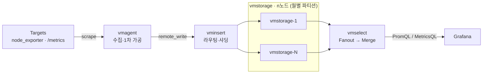

# 03 · Inside VictoriaMetrics — 내부 동작 정독 (2026-06)


**참조한 내용정리** · 이 문서는 아래 네이버 D2 원문을 읽고 우리 지식베이스 형식으로 재구성한 요약이다. 원문 자체가 아니며, 정확한 워딩·전체 맥락·그림은 원문에서 확인한다.
- **원문**: [Inside VictoriaMetrics](https://d2.naver.com/helloworld/9290861)
- **매체 · 게시일**: D2 발표영상 (40분 37초) · 2026-06-02
- **저자**: 강민구 (NAVER Container Platform)



**한눈에**
- 이 발표는 데이터가 **들어와서 저장되고 다시 쿼리로 나가기까지의 전 과정**을 6섹션으로 분해한다: ① 아키텍처 오버뷰 ② `vmagent` ③ `vminsert` ④ `vmstorage` ⑤ `vmselect` ⑥ best/worst case.
- 각 컴포넌트를 한 문장으로 요약하면 — `vmagent`는 무엇이든 받아 정제하는 만능 어댑터, `vminsert`는 저장 없이 라우팅하는 수집 게이트웨이, `vmstorage`는 월별 파티션에 저장하는 컴포넌트, `vmselect`는 Fanout으로 던지고 Merge하는 쿼리 엔진이다.
- 효율의 두 축: 이름·레이블(거의 불변)과 timestamp+value(계속 쌓임)를 **IndexDB/DataDB로 분리**하고, **Gorilla 계열 차분 인코딩**(Gauge→Delta, Counter→Delta-of-Delta)으로 눌러 담는다.
- 운영에서 반복해서 등장하는 이름들: 랑데부 해싱, `replicationFactor`, `TSID`, Merge Multiplier, IndexDB 3단계 로테이션, Rollup Result Cache, `search.latencyOffset` — 그리고 마지막으로 **카디널리티**.


이 문서는 40분짜리 발표영상을 컴포넌트별로 훑는 **지도** 역할을 한다. 발표가 데이터의 흐름을 따라 6개 박스를 하나씩 까 보는 구성이므로, 여기서도 그 순서대로 각 박스가 무엇을 하는지 짚되, 내부 동작의 깊은 세부는 이미 그 주제를 전담하는 concepts 문서로 넘긴다. "전체 지도는 여기서, 확대는 concepts에서"라는 포지셔닝이다.

> 관련 문서: [개념 01 시계열과 VM]() · [개념 02 아키텍처]() · [개념 03 수집]() · [개념 04 저장·압축]() · [개념 05 쿼리·운영 컴포넌트]() · [실전 01 카디널리티]()

## ① 아키텍처 오버뷰

발표는 "TSDB란 무엇인가"부터 짚는다. TSDB(시계열 데이터베이스)는 한 줄로 줄이면 **시간 순서대로 기록된 숫자 값들의 연속**이다. 9시에 36.5도, 10시에 36.7도처럼 시간축을 따라 숫자가 하나씩 찍히는 데이터이며, CPU 사용률·요청 수·응답 시간 같은 모니터링 지표도 전부 "어떤 시점에 어떤 숫자가 찍혔는가"로 환원된다. 그 숫자가 찍히는 방식에 따라 지표는 **Counter / Histogram / Gauge / Summary** 4타입으로 나뉜다(Prometheus 진영의 표준 분류). 여기서 **단조 증가하는 Counter가 압축이 극단적으로 잘 된다**는 점만 미리 붙잡아 두면 뒤의 압축 이야기가 쉽게 풀린다. → [개념 01 시계열과 VM]()

핵심 문제 제기는 이렇다. 1초에 한 번만 찍어도 하루 8만 6천 개고 지표가 수만 개면 하루치만 해도 어마어마하다. 그래서 **TSDB의 핵심 과제는 제한된 자원으로 얼마나 잘 압축하느냐**가 되고, 그걸 잘하는 솔루션 중 하나가 VictoriaMetrics다. VM은 **Apache 2.0 라이선스의 오픈소스 TSDB**로 Prometheus와 호환된다(`PromQL` 사용 가능, `remote_write` 프로토콜 그대로 수용). 자체 벤치마크 기준 **메모리 5배·스토리지 7배** 더 효율적이라고 주장한다.

발표자는 대규모·고가용성(HA) 환경이라 **클러스터 버전**을 쓴다고 밝히며 전체 그림을 제시한다. 데이터가 왼쪽 타깃에서 오른쪽으로 흐르며 4개 컴포넌트를 거친다.



- **`vmagent`** — 타깃에서 지표를 스크랩하고 리레이블·드랍 같은 1차 가공을 한다.
- **`vminsert`** — 받은 데이터를 N개의 `vmstorage` 노드로 라우팅·샤딩한다.
- **`vmstorage`** — 실제 저장을 담당한다. 저장은 이 단에서만 일어난다.
- **`vmselect`** — 쿼리 엔진. 쿼리를 받아 `vmstorage`에서 데이터를 select해 와 merge한 뒤 클라이언트에 응답을 반환한다.

이 4컴포넌트 구조·SingleNode vs Cluster·LSM 트리·IndexDB/DataDB 분리의 배경은 [개념 02 아키텍처]()가 전담한다.

## ② vmagent — 수집과 1차 가공

`vmagent`는 지표 수집과 1차 가공을 책임진다. 내부에는 deduplicator, relabeling, streaming aggregation, scraper, queue 같은 모듈이 들어 있다. 입력이 대단히 넓어 OpenTelemetry, InfluxDB, Datadog, Graphite, Prometheus(agent), NewRelic, JSON, CSV 등 모니터링 진영의 거의 모든 프로토콜을 받고, `node_exporter`나 `/metrics` 엔드포인트에서 직접 스크랩도 한다. 출력은 `remote_write` 하나로 VM 본체나 다른 Prometheus 호환 스토리지로 보낸다. 한마디로 **무엇이든 받아 정제하고 `remote_write`로 내보내는 만능 어댑터**다.

수집 방식은 **Pull(스크랩/폴링)** 과 **Push** 를 모두 지원한다. Pull은 Prometheus와 동일하게 `scrape.config`에 대상을 두고 주기적으로 익스포터를 찔러 가져오며, 보통 이쪽이 메인이다. Push는 외부에서 `vmagent`로 직접 밀어 넣는 방식으로(예: InfluxDB 라인 프로토콜을 `/write`에 POST), 폐쇄망·푸시만 가능한 환경·배치 잡 같은 단발성 지표에 쓰인다.

내부에서 데이터가 거치는 경로는 **7단계 파이프라인**이다.

```
1. 스크랩 & API 수신
2. 글로벌 리레이블링
3. dedup + 스트리밍 어그리게이션
4. 샤딩 + 리플리케이션
5. 퍼-리모트 튜닝 (리모트별 별도 리레이블/드랍/dedup)
6. Fast Queue(메모리) → 가득 차면 Persistent Queue(디스크)
7. 리모트 플러시 (실제 전송)
```

발표자가 강조한 두 가지. **리레이블링이 두 번 걸린다** — 전 트래픽 공통 룰은 글로벌 단계에서, 특정 리모트에만 걸 룰은 퍼-리모트 단계에서 처리해 티어별로 나눌 수 있다. 그리고 **인메모리 큐가 가득 차면 자동으로 Persistent Queue(디스크)로 떨어진다** — 덕분에 `vminsert`와의 네트워크 장애나 지연으로 잠시 전송하지 못해도 `vmagent`는 지표를 잃지 않는다. 운영 관점에서 데이터 유실을 막는 핵심 안전장치다. 입력 프로토콜·pull/push 예시·7단계·큐 버퍼링의 상세는 [개념 03 수집]()에서 다룬다.

## ③ vminsert — 라우팅하는 수집 게이트웨이

`vminsert`는 인제스천 파이프라인이자, 저장은 하지 않고 **`vmstorage` 노드로 라우팅하는 수집 게이트웨이**에 가깝다. `vmstorage`에 붙을 때는 TCP 커넥션을 맺은 뒤 **압축 방식을 협의**한다(예: zstd로 합의). 여기서 `rpc.disableCompression` 옵션이 흥미로운데, 켜면 압축을 안 한다 — **CPU는 절약되지만 대역폭이 늘어난다.** 네트워크 밴드위스가 충분하고 CPU를 아끼고 싶으면 이 트레이드오프를 택할 수 있다.

수많은 `vmstorage` 중 어디로 보낼지는 **랑데부 해싱**으로 정한다. 단순 모듈로/해시를 쓰면 노드 추가·삭제 시 거의 모든 시계열이 다른 노드로 옮겨 가 리밸런싱 폭풍이 인다. 랑데부 해싱은 지표가 들어오면 모든 노드에 대해 `hash(지표 이름 + 노드 이름)`으로 점수를 매기고 **가장 높은 노드에만** 보낸다.

```
점수 예: node A 0.82 · node B 0.45 · node C 0.91  → 최고점 C로 전송
노드 D 추가 후: 같은 지표의 D 점수 0.68 < C의 0.91 → 그대로 C
              다른 지표의 D 점수 0.95 > 기존 최고  → D로 이동
```

기존 노드들 사이의 상대 점수는 변하지 않으므로, **통계적으로 노드 추가 시 전체 중 약 1/4만 리밸런싱**돼 새 노드 D로 옮겨 간다. 여기에 **페일오버**(다운 노드로 갈 지표를 살아있는 노드에 균등 재분배)와 **`replicationFactor`**(예: 2면 같은 지표 A가 Copy 1·Copy 2로 두 노드에 저장)가 더해진다. 복제된 중복은 나중에 `vmselect`가 쿼리할 때 dedup으로 제거되므로, **쓰기 시점의 복제(안정성)** 와 **읽기 시점의 dedup(정확성)** 이 짝을 이룬다. 랑데부 해싱의 1/(N+1) 재배치·연결 시퀀스·페일오버·복제의 상세는 [개념 03 수집]()에서 다룬다.

## ④ vmstorage — 저장을 책임지는 컴포넌트

`vmstorage`는 `vminsert`로부터 지표를 받아 **월별 파티션 단위로 저장**하고, `vmselect`의 쿼리에 블록 단위로 응답한다. 저장 이야기 전에 지표 하나의 내부 표현부터 본다. 지표는 **Time Series**(지표 이름 + 레이블, 예: `request_total{path="/", code="200"}`)와 **Sample**(Unix timestamp + value, 예: `value=120`)로 나뉜다. Time Series는 거의 변하지 않고 Sample만 계속 쌓이므로, 이 둘을 따로 관리하면 압축 효율이 극단적으로 좋아진다. 이것이 뒤의 **IndexDB / DataDB 분리**의 근거다.

데이터가 들어와 눕기까지의 경로는 이렇다. 블록 단위로 받은 로우 바이트를 **최대 1만 행** 단위의 구조화된 로우로 파싱하고(metric name / value / timestamp), 각 로우를 **`TSID`**(64bit 정수, 시계열의 내부 ID)로 변환한 뒤, 샤드로 나눠 큐에 쌓았다가 플러시하며 인메모리 파트로 저장한다. 이때 Delta / Delta-of-Delta 차분 인코딩이 진행된다.

`TSID` 변환은 두 단계다. 로우를 **Canonical Name으로 정규화**(레이블 순서가 달라도 같은 시계열이면 같은 형태로 정렬)한 뒤 64bit `TSID`로 바꾸고, 매번 정규화하면 비싸므로 **`TSID` 캐시**(인메모리 매핑)를 둔다. 동일 이름이 다시 오면 캐시에서 바로 꺼내는 **빠른 경로**다. 캐시 미스면 디스크 인덱스인 IndexDB(prefix별 엔트리)를 조회하고, 거기에도 없으면 **처음 보는 시계열로 판단해 New `TSID`를 발급**한다. New `TSID`가 마구 발급되는 상황이 곧 **시계열 카디널리티 폭발**이다(6섹션·[실전 01 카디널리티]()에서 재등장).

압축은 VM 효율의 비결이다. **Gauge → Delta 인코딩**은 위아래로 변동하는 값의 첫 값만 남기고 차분만 저장한다(원본 `110, 105, 98, 110, 103` → `110, -5, -7, +12, -7`). **Counter → Delta-of-Delta 인코딩**은 단조 증가값의 1차 차분이 거의 일정하고 그 **차분의 차분이 0에 수렴**한다는 성질을 이용해, 뒤에 100개·1000개를 이어 붙여도 크기가 거의 늘지 않는다. 그래서 Counter가 압축에 극단적으로 유리하다. 어떤 블록이 Counter인지 Gauge인지는 **값의 패턴으로 판별**하는데, 단조 증가면 Counter, 오르내리면 Gauge다. 단 **Counter도 리셋이 너무 잦으면 Gauge로 분류**돼 Delta-of-Delta의 이점을 잃는다.

{}
차분 압축은 `-5, -7, -13` 같은 음수를 낳는데, 음수는 이진 표현상 상위 비트가 켜져 공간을 많이 먹는다. 그래서 두 단계로 다듬는다.

- **ZigZag 인코딩**: 부호를 없애고 절댓값이 작은 순서대로 양수에 매핑한다(`0, -1, 1, -2, ...` → `0, 1, 2, 3, ...`). 예로 `-5`는 왼쪽 시프트(-10) XOR 산술 우시프트(-1) = **9**로 바뀐다 — 큰 음수가 작은 양수가 된다.
- **Varint 인코딩**: 얻은 양수를 **7비트씩** 쪼개 저장한다. 각 바이트의 하위 7비트는 값, 최상위 1비트는 "다음 바이트가 이어진다"는 연속 플래그다. `9`는 한 바이트로 끝나고, `300`처럼 큰 값은 여러 바이트로 이어진다.

정리하면 `-5`는 최종적으로 `9`로 저장된다. 실운영 실측으로 데이터포인트당 **0.92바이트**까지 줄어드는 수치는 [개념 04 저장·압축]()에서 다룬다.
{}

파티션은 **인메모리 파트 → Small 파티션 → Big 파티션**으로 굳어간다. 인메모리에서 플러시되면 Small로 이동해 머지되고, Small들이 모여 Big으로 머지된다(인메모리에 아주 큰 블록이 뭉텅이로 들어오면 곧바로 Big으로 가기도 한다). 머지에는 **Merge Multiplier** 알고리즘을 쓰는데, `(합쳐질 파트들의 총 출력 크기) / (가장 큰 입력 파트 크기)` 값이 클수록 좋다 — 즉 **비슷한 크기끼리 합칠수록 가성비가 좋다.**

```
1MB×4 + 10MB  → 합 14 / 최대 10 = 1.4   (큰 놈에 억지로 끼움, 비효율)
1+2+3+3+3     → 합 14 / 최대  3 = 4.67  (비슷한 것끼리 잘 합침, 효율적)
```

이 밖에 **Deduplication**(`dedup.minScrapeInterval`을 10초로 두면 그 구간 중복 값 중 하나만 남김, Deduplication Watcher가 매시간 지터를 두고 확인 후 필요 시 파티션 전체 머지 트리거), **Retention**(기본 1개월, 최소 하루 ~ 최대 100년, Retention Watcher 매분 실행, 단 파티션 내 보존 기간 내 샘플이 하나라도 있으면 파트 전체 유지 — Big 파티션은 경계에 걸치면 통째로 들고 있어야 함)이 있다.

발표에서 가장 흥미로운 운영 메커니즘은 **IndexDB 3단계 로테이션**이다. IndexDB에는 삭제되거나 더 이상 수집되지 않는 시계열 엔트리가 누적되는데, 인덱스 자료구조 특성상 단건 삭제 비용이 매우 크다. 그래서 IndexDB 자체를 통째로 굴려버린다. **버전 1.133.0부터 3단계 로테이션**이 정착됐다.

| 단계 | 역할 |
|------|------|
| **Current** | 새 데이터를 실시간 수신하며 활성화된 IndexDB |
| **Previous** | 보존 기간 내 오래된 데이터를 가져 쿼리가 가능한 IndexDB |
| **Next** | 다음 로테이션을 위해 미리 준비하는 IndexDB |

Retention 기간에 도달하면 **Next → Current, Current → Previous, Previous → 통째로 드롭**된다. 예로 retention이 `365d`이고 2026년 1월 1일에 시작했다면 2026년 12월 31일 UTC 04시에 로테이션이 일어난다. **단건 삭제 비용을 회피하면서 서비스 단절 없이 IndexDB를 깨끗이 비우는** 우아한 설계다. Time Series/Sample 분리, TSID 캐시미스 흐름, Gorilla 압축, 파티션·retention·로테이션의 상세와 값 수준 예시는 [개념 04 저장·압축]()에서 다룬다.

## ⑤ vmselect — Fanout 쿼리 엔진

`vmselect`는 쿼리를 받아 **모든 `vmstorage`에 Fanout으로 던지고 결과를 모으는** 컴포넌트다. Grafana가 PromQL 등의 쿼리를 던지면 레이블 필터로 쿼리를 형성하고, 모든 `vmstorage` 노드에 요청을 보내 블록 단위로 수신한 뒤, 메모리 버퍼에 모아 Merge·Sort해 JSON 응답을 만들어 돌려준다(엔드포인트 예: `/select/0/prometheus/api/v1/query_range`).

내부에서 PromQL 한 줄은 **3-Prefix 검색**으로 풀린다. 먼저 쿼리 문자열을 구조화된 데이터로 파싱하고(함수·필터·시간 윈도, 이 파싱 결과도 캐싱), 이어 3단계로 되짚는다.

| 단계 | 변환 | 하는 일 |
|------|------|---------|
| **Prefix 1** | 태그 → Metric ID | 태그 필터를 IndexDB에 전달, `name`·`method`·`status` 등 여러 조건의 **교집합** Metric ID를 모음(인메모리 캐시 먼저 확인) |
| **Prefix 2** | Metric ID → TSID | 모인 Metric ID를 `TSID`로 변환 (예: Metric ID 49가 어떤 `TSID`인지 조회) |
| **Prefix 3** | TSID → 값·이름 복원 | `TSID`로 value·timestamp를 가져오고 응답에 넣을 지표 이름·레이블을 역으로 복원 |

쓰기 시점에 이름 → `TSID`로 정규화했던 것을 읽기 시점에 `TSID` → 이름으로 되돌리는 대칭 구조다.

발표자가 신경 쓰는 **메모리 관리 3포인트**는 이렇다.

1. **쿼리 시점 Deduplication** — `vmstorage`에서 이미 dedup했지만 `vmselect`에서 한 번 더 한다. `dedup.minScrapeInterval=10s` 같은 옵션으로 동일 timestamp 구간에서 최신 값만 살린다.
2. **Rollup Result Cache** — 한 번 처리한 쿼리 결과를 캐싱하되 **`vmselect` 허용 메모리의 12.5%만** 쓴다. 그리고 **현재 시각 기준 최근 5분 구간은 캐싱에서 제외**한다 — 최근 5분 데이터는 아직 `vmstorage`에 다 도착하지 않았을 수 있어, 불안정한 결과를 캐시에 넣으면 잘못된 값을 계속 돌려주기 때문이다.
3. **Query Latency Offset** — `search.latencyOffset` 설정값, **기본 30초**. 쿼리 시 가장 최근 30초 데이터를 일부러 뒤로 밀어 검색한다. 수집 지연으로 인한 불안정 데이터를 피하려는 것으로, 실시간성이 중요하면 0초로 줄일 수 있으나 **같은 그래프가 새로고침마다 다르게 보이는** 것을 감수해야 한다.

3-Prefix 검색의 상세는 [개념 05 쿼리·운영 컴포넌트]()에서 다룬다. 운영 컴포넌트 `vmalert`(Recording rules 선계산)·`vmauth`(멀티 클러스터 라우팅 게이트웨이)는 이 발표에는 등장하지 않으며, 같은 문서에서 다른 D2 자료를 근거로 별도로 다룬다.

## ⑥ Best / Worst Case — 카디널리티

마지막 섹션은 운영에서 마주치는 best/worst case, 즉 **카디널리티** 이야기다. 시계열은 그 자체로 하나의 정의이므로 **레이블이 단 하나만 달라져도 다른 시계열로 인식**된다. 발표자가 든 예에서 `pod_name`과 `session_id`는 하이 카디널리티를 유발할 수 있는 대표 레이블이다. 자주 변경돼 카디널리티를 유발하는 레이블은 **처음부터 설계에 없는 것이 가장 좋다.**

- **pod 이름** — 파드가 재시작될 때마다 이름이 바뀌면 New `TSID`가 쏟아진다. 앞에 서비스 네임이 있으니 `my-order` 같은 **자주 변하지 않는 서비스 네임**으로 대체하면, 파드가 재시작돼도 지표에 영향이 없다.
- **session ID** — 이런 자주 변경되는 값은 지표로 저장하지 말고 **로그나 트레이스로** 다루는 것이 더 낫다.

여기서 말하는 New `TSID` 남발이 곧 ④에서 예고한 카디널리티 폭발이다. 카디널리티의 원인·측정 지표(churn rate, slow insert rate)·설계 원칙은 [실전 01 카디널리티]()가 전담한다.

> 발표자는 자료 대부분을 공식 블로그에서 인용하고 본인 해석을 붙였다고 밝힌다. 정확한 워딩·그림·전체 맥락은 원문 영상과 D2 기사에서 확인한다.

## 출처

- **Inside VictoriaMetrics** (강민구, NAVER Container Platform · D2 발표영상 40:37 · 2026-06-02) — https://d2.naver.com/helloworld/9290861
- 작업 저장소 원본: `02_대사집_Inside_VictoriaMetrics.md` (whisper.cpp 자동 전사본).
- 이 문서는 발표영상 전체(00:00~40:37)의 6섹션 구성 — ① 아키텍처 오버뷰(00:55~05:58) ② `vmagent`(06:11~11:00) ③ `vminsert`(11:00~15:38) ④ `vmstorage`(15:58~33:30) ⑤ `vmselect`(33:46~38:50) ⑥ best/worst case(38:50~40:00) — 를 컴포넌트별 지도 형태로 요약하고, 각 컴포넌트의 깊은 세부는 concepts/01~05·practice/01 문서로 넘긴다.
