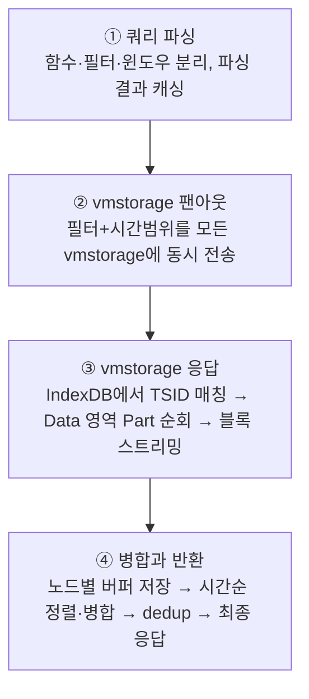

# 04 · VictoriaMetrics 운영기 2편 — 장비 증설 없이 리소스 위기를 해결한 3단계 최적화 (2026-07)


**참조한 내용정리** · 이 문서는 아래 네이버 D2 원문을 읽고 우리 지식베이스 형식으로 재구성한 요약이다. 원문 자체가 아니며, 정확한 워딩·전체 맥락·그림은 원문에서 확인한다.
- **원문**: [VictoriaMetrics 운영기 2편 — 장비 증설 없이 리소스 위기를 해결한 3단계 최적화 전략](https://d2.naver.com/helloworld/5788040)
- **매체 · 게시일**: D2 기사 (운영기 시리즈 2편, 최신) · 2026-07-21
- **저자**: 강지훈 · 이윤석 · 정솔 (NAVER Metric&Monitoring)



**한눈에**
- 쿠버네티스 전환이 계속 빨라지며 컨테이너 수가 수백만 개를 넘어섰고, 카디널리티 폭증이 조회·저장·수집 전 구간에서 동시에 문제를 터뜨렸다. 해법은 장비 증설이 아니라 **파이프라인 3개 레이어 각각의 소프트웨어적 최적화**였다.
- **조회 레이어**: `vmselect`의 Slow Query → OOM 구조를 `container` 레이블 접두사 기준 **36개 쿼리 분할**로 풀어, 쿼리 1건당 메모리 점유율 **45% → 12%**, API 응답 시간 **최대 40초 → 7초**.
- **저장 레이어**: IndexDB 3-슬롯(prev/current/next) 로테이션 메커니즘을 분석해 Hot Tier `RetentionPeriod`를 **12개월 → 6개월**로 축소, 실제 쿼리 로그(99.997%가 1개월 이내 조회)로 서비스 영향 없음을 검증하고 디스크 고갈 위기를 해소.
- **수집 레이어**: 전체 컨테이너의 90% 이상을 차지하던 **비서비스 컨테이너**를 수집 대상에서 제외해 수집 컨테이너 수 **-91.6%**, Active Time Series **-63.6%**, `vmstorage` Ingestion Rate **-64.4%**.


[VictoriaMetrics 운영기 1편]()에서는 네이버 검색의 대규모 메트릭 저장소 클러스터의 규모, 2계층 아키텍처, 180대 노드의 무중단 장비 교체와 증설 전략을 다뤘다. 2편은 장비를 더 늘리지 않고 리소스 위기를 해결하기 위해 진행한 소프트웨어적 최적화 과정이다.

메모리 문제를 해결한 뒤에도 쿠버네티스 전환은 계속 빨라졌고, 컨테이너 수는 수백만 개를 넘어섰다. 카디널리티가 급격히 증가하면서 조회 컴포넌트의 메모리 사용량이 치솟고, 저장소 디스크가 고갈되었다. 문제는 특정 컴포넌트 하나에 국한되지 않고 데이터 파이프라인 전반에서 발생했다.

장비 증설 대신 데이터 파이프라인의 각 구간을 나누어 분석한 결과, 다음 세 레이어에서 최적화를 진행했다.

| 최적화 영역 | 핵심 전략 |
| --- | --- |
| 조회(query) 레이어 | Slow Query가 `vmselect` OOM으로 이어지는 구조를 쿼리 분할 전략으로 개선 |
| 저장(storage) 레이어 | `vmstorage`의 저장 구조와 IndexDB 로테이션 메커니즘을 분석해 데이터 기반의 `RetentionPeriod` 정책 재설계 |
| 수집(collection) 레이어 | 수집 대상 대부분을 차지하던 비서비스 컨테이너를 제외해 과도한 메트릭 유입을 앞단에서 통제 |

이 글이 설명하는 `vmstorage`의 저장·조회 동작과 IndexDB 로테이션 메커니즘은 VictoriaMetrics 공식 엔지니어링 블로그의 [How vmstorage Handles Data Ingestion From vminsert](https://victoriametrics.com/blog/vmstorage-how-it-handles-data-ingestion/), [How vmstorage's IndexDB Works](https://victoriametrics.com/blog/vmstorage-how-indexdb-works/), [How vmstorage Handles Query Requests From vmselect](https://victoriametrics.com/blog/vmstorage-how-it-handles-query-requests/)를 참고했다. IndexDB/Data 분리 구조와 TSID·압축의 기본 개념은 [개념 04 저장과 압축]()에서, `vmselect`의 Fanout 쿼리 구조는 [개념 05 쿼리·운영 컴포넌트]()에서 이어 다룬다.

## 1. 조회 레이어 최적화: vmselect OOM 해결

카디널리티 폭증의 영향은 조회 컴포넌트인 `vmselect`에서 가장 먼저 드러났다. 컨테이너 수가 급증한 시점 이후 `vmselect`의 메모리 사용률 90% 초과 알람이 자주 발생했고, 심한 경우 OOM으로 Pod가 재시작되었다.

알람이 발생한 시점을 살펴보면 공통적으로 Slow Query가 확인되었다. 원인은 매분 실행되는 전체 컨테이너 집계 쿼리였다. 수백만 개의 시계열을 대상으로 한 쿼리 결과가 `vmselect` 한 대에서 병합되고 집계되면서, 단일 Pod의 메모리 한계를 초과했다.

### 배경: 리소스 제한 옵션으로는 부족했다

VictoriaMetrics는 이런 상황을 방어할 수 있도록 여러 [리소스 제한 옵션](https://docs.victoriametrics.com/victoriametrics/cluster-victoriametrics/#resource-usage-limits)을 제공한다.

| 플래그 | 역할 |
| --- | --- |
| `-search.maxUniqueTimeseries` | 단일 쿼리가 조회할 수 있는 최대 고유 시계열 수 제한 |
| `-search.maxQueryDuration` | 단일 쿼리의 최대 실행 시간 제한 |
| `-search.maxMemoryPerQuery` | 단일 쿼리가 사용할 수 있는 최대 메모리 제한 |
| `-search.maxPointsPerTimeseries` | 시계열 하나당 반환할 수 있는 최대 데이터포인트 수 제한 |
| `-memory.allowedPercent` | `vmselect` 프로세스 전체의 메모리 사용 상한 |

이 옵션들로 안전 장치를 설정했지만, 리소스 제한은 쿼리가 시스템을 과도하게 사용하는 일을 막을 뿐 쿼리 결과셋 자체를 줄이지는 못하며, 제한에 걸리면 쿼리는 오류로 실패할 뿐이다. 결국 OOM을 근본적으로 줄이려면 한 번의 쿼리가 처리하는 시계열 수를 줄여야 했다. 이를 위해 먼저 메트릭이 `vmstorage`에 저장되는 방식과 `vmselect`가 데이터를 조회하는 방식을 살펴봤다.

### 배경: IndexDB와 Data 영역을 분리해 저장하는 vmstorage 구조

`vminsert`가 전달한 메트릭은 `vmstorage` 안에서 두 영역으로 나뉘어 저장된다. IndexDB는 검색에 필요한 인덱스를 관리하고, Data 영역은 압축된 시계열 데이터를 보관한다. 두 영역을 분리하면 원하는 시계열을 찾는 과정과 실제 값을 읽는 과정을 각각 최적화할 수 있다(분리 구조와 압축 원리 자체는 [개념 04 저장과 압축]()가 자세히 다룬다).

`vmstorage`는 메트릭을 수신하면 메트릭 이름과 레이블의 조합을 알파벳순으로 정렬해 정규화(canonical)된 이름을 만들고, 이 이름에 대응하는 고유 식별자인 TSID(TimeSeries ID)를 부여한다. TSID 조회·생성 순서는 다음과 같다.

1. 메트릭 이름과 레이블의 조합을 기준으로 인메모리 캐시에서 시계열 존재 여부를 확인
2. 이미 존재하는 시계열이면 인메모리 캐시에서 TSID를 즉시 반환
3. 캐시에 없으면 디스크 기반의 IndexDB를 조회
4. 완전히 새로운 시계열이면 새 TSID를 생성하고 IndexDB에 등록

새로운 시계열을 생성할 때는 디스크 조회와 등록이 필요해 캐시 히트보다 시간이 더 걸린다. `vmstorage`는 이 과정을 [Slow Insert](https://docs.victoriametrics.com/victoriametrics/faq/#what-is-a-slow-insert)로 분류한다. Slow Insert가 많이 발생하면 [카디널리티 폭증(Churn Rate 폭증)]()을 의심해야 한다.

[IndexDB](https://docs.victoriametrics.com/victoriametrics/single-server-victoriametrics/#indexdb)는 수많은 레이블 사이에서 원하는 데이터를 빠르게 찾기 위해 역색인(Inverted Index) 구조를 유지한다. 예를 들어 `{container="search-api", status="200"}` 필터로 쿼리를 요청하면 `vmstorage`는 각 레이블에 매핑된 TSID 목록의 교집합을 계산한다. 교집합에 TSID 5와 TSID 9가 있다면 이 두 시계열이 최종 조회 대상이다.

TSID가 확정되면 해당 TSID의 타임스탬프-값 쌍은 인메모리 버퍼인 Raw-Row Shards에 모인다. 이후 데이터는 TSID와 타임스탬프 기준으로 정렬되고, 같은 TSID끼리 블록으로 묶인다. 여러 블록은 하나의 Part로 디스크에 저장된다. Part는 월별 파티션 아래에 저장되는 디스크 저장 단위이며, 포함된 데이터의 최소·최대 타임스탬프를 메타데이터로 가지고 있어 쿼리 시간 범위에 해당하지 않는 Part는 디스크 I/O 없이 건너뛸 수 있다. Part 내부의 블록은 TSID 단위로 구성되며, 같은 TSID의 타임스탬프-값 샘플이 시간순으로 저장되고 샘플 수가 많으면 여러 블록으로 나뉠 수 있다.

정리하면 IndexDB는 어떤 시계열이 존재하고 어디에 있는지를 찾는 역할을, Data 영역은 해당 시계열의 실제 값을 저장하는 역할을 한다.

### 배경: vmselect의 4단계 쿼리 처리 과정

`vmselect`는 사용자의 MetricsQL(PromQL 호환) 쿼리를 받아 최종 결과를 반환하는 조회 게이트웨이다. 쿼리가 들어오면 파싱, 팬아웃, 응답 수신, 병합 과정을 거친다.



1. **쿼리 파싱**: `vmselect`는 쿼리 문자열을 파싱해 함수, 필터, 윈도우를 분리한다. 예를 들어 `rate(http_requests_total{container="search-api"}[5m])`은 함수 `rate`, 필터 `{container="search-api"}`, 윈도우 `5m`으로 분해된다. 파싱 결과는 인메모리에 캐싱되어 동일한 쿼리의 반복 파싱 비용을 줄인다.
2. **vmstorage 팬아웃**: `vmselect`는 특정 TSID가 어느 `vmstorage`에 저장되어 있는지 알 수 없다. `vminsert`가 [랑데부 해싱]()으로 시계열을 분산 배치하지만, 조회 시점의 `vmselect`는 이 매핑 정보를 갖고 있지 않기 때문이다. 따라서 쿼리의 필터 조건과 시간 범위(`start`, `end`)를 클러스터의 모든 `vmstorage` 노드에 동시에 전송한다.
3. **vmstorage의 응답**: `vmstorage`는 IndexDB에서 필터 조건을 만족하는 TSID 집합을 찾아, 이 TSID와 시간 범위를 기준으로 Data 영역의 Part를 순회한다. 쿼리 범위 밖의 Part는 건너뛰고, 매칭되는 데이터 블록만 `vmselect`로 스트리밍한다.
4. **병합과 반환**: `vmselect`는 각 `vmstorage`에서 받은 데이터 블록을 노드별 인메모리 버퍼에 저장한다. 이후 모든 노드의 결과를 시간순으로 정렬해 병합하고, [Replication에 의해 중복된 데이터포인트가 있으면 제거(deduplication)](https://docs.victoriametrics.com/victoriametrics/cluster-victoriametrics/#replication-and-data-safety)한 뒤 최종 응답을 생성한다.

이 구조에서 중요한 점은 쿼리 하나의 결과셋 전체가 `vmselect` Pod 한 대의 메모리에 올라간다는 것이다. 매칭되는 시계열이 적을 때는 문제가 되지 않지만, 카디널리티가 커질수록 병합 과정에서 메모리 사용량이 급증한다. 겪은 OOM도 이 구조에서 비롯되었다.

### 대응: 레이블 접두사를 기준으로 쿼리 분할

하나의 큰 요청이 `vmselect` 한 대에 집중되지 않도록 쿼리를 여러 개로 나눴다. 기준은 `container` 레이블의 첫 글자였다. 알파벳 `a-z`와 숫자 `0-9`를 기준으로 쿼리를 **36개**로 분할해 요청하도록 수정했다.

| 구분 | 변경 전 | 변경 후 |
| --- | --- | --- |
| 쿼리 방식 | 단일 쿼리로 전량 집계 | `container` 접두사별 36개 쿼리로 분할 |
| 예시 | `max(http_requests_total) by (container)` | `max(http_requests_total{container=~"a.*"}) by (container)` ... `max(...{container=~"9.*"}) by (container)` |

### 결과: 메모리 사용량 감소와 응답 시간 단축

쿼리를 분할하자 단일 `vmselect` Pod에 집중되던 메모리 부하가 클러스터 전체로 분산되었다. 쿼리 1건당 메모리 점유율은 기존 **45%에서 12%** 수준으로 크게 낮아졌다.

기존에는 같은 Pod에서 여러 집계 쿼리가 동시에 실행될 때 메모리 점유량이 누적되어 임계치인 90%를 초과해 OOM으로 이어질 수 있었다. 최적화 이후에는 개별 쿼리의 메모리 사용량이 줄어 동시 실행 환경에서도 안정적으로 처리할 수 있다. API 응답 시간도 최대 **40초에서 7초**로 단축되었다.

대규모 환경에서는 단일 쿼리가 처리하는 시계열 수를 줄이는 것만으로도 효과가 컸다. 하나의 거대한 쿼리를 여러 작은 쿼리로 나누어 클러스터에 분산시키자 OOM 위험을 낮추고 응답 시간도 크게 개선할 수 있었다.

## 2. 저장 레이어 최적화: IndexDB 로테이션 분석과 RetentionPeriod 정책 재설계

조회 레이어의 병목을 해결한 뒤에는 저장소 디스크 사용량에 대응해야 했다. 수집 대상이 계속 늘면서 데이터포인트 유입량이 급증했고, 순차적으로 증설해 온 `vmstorage` 노드 중 초기에 투입된 장비의 디스크 가용량이 먼저 임계치에 도달하기 시작했다. 장비를 추가하더라도 기존 노드는 계속 데이터를 수신하기 때문에 단순 증설만으로는 문제를 근본적으로 해소할 수 없었다.

같은 시기에 서버 장비 단가까지 급등해, 기존 장비를 교체하거나 확장하는 방안도 현실적인 선택지가 아니었다. 그래서 Hot Tier의 `RetentionPeriod`를 12개월에서 6개월로 줄이는 방안을 검토했다.

다만 단순히 설정값을 낮추는 것이 아니라, 먼저 이 변경이 저장소의 각 영역에 어떤 메커니즘으로 영향을 주는지 정밀하게 예측하고자 했다. `vmstorage`의 IndexDB와 Data 영역은 물리적으로 분리되어 있고, `RetentionPeriod` 변경이 두 영역에 영향을 미치는 시점도 다르다. 이를 이해하기 위해 먼저 IndexDB의 3-슬롯 로테이션 구조를 살펴봤다.

### 배경: IndexDB의 3개 슬롯 순환 구조

VictoriaMetrics의 `vmstorage`는 로테이션 관리를 위해 IndexDB를 세 개의 타임 슬롯으로 나누어 운영한다.

| 슬롯 | 역할 |
| --- | --- |
| `prev` | 직전 주기를 조회하기 위한 과거 인덱스 |
| `current` | 현재 데이터의 쓰기와 읽기가 발생하는 메인 인덱스 |
| `next` | 향후 유입될 시계열을 미리 준비하기 위한 예비 인덱스 |


로테이션이 발생하면 가장 오래된 `prev` 슬롯이 삭제된다. 이후 `current`는 `prev`가 되고, `next`는 `current`가 되며, 새로운 빈 `next`가 생성된다. 이 3-슬롯 로테이션의 일반 메커니즘 자체는 [개념 04 저장과 압축]()에서도 다룬다.

여기서 중요한 점은 로테이션 시점이다. 로테이션은 프로세스 기동 시각을 기준으로 계산되지 않는다. UNIX 타임스탬프 0, 즉 1970-01-01을 기준으로 정확히 `RetentionPeriod` 주기마다 동작한다.

`vmstorage`는 다음 로테이션까지 남은 시간을 `vm_next_retention_seconds` 지표로 보여준다. 계산식은 다음과 같다.

```
NextRetention = (⌊CurrentTimestamp / RetentionPeriod⌋ + 1) × RetentionPeriod − CurrentTimestamp
```

`RetentionPeriod`를 R이라고 하면, 정확히 0, R, 2R, 3R, ... 지점에서 로테이션이 발생한다.

`RetentionPeriod`를 12개월로 설정한 경우를 예로 들면, `vmstorage`는 [1개월을 31일로 계산](https://docs.victoriametrics.com/victoriametrics/single-server-victoriametrics/#retention)하므로 12개월은 372일이다. 따라서 UNIX 타임스탬프 0을 기준으로 정확히 372일마다 로테이션이 발생한다.

실제로 가장 최근인 2026-01-07에 로테이션이 발생해 12개월 치 `prev` 슬롯이 삭제되는 과정을 모니터링했다. 이를 바탕으로 다음 로테이션 시점이 **2027-01-14**임을 확인했고, 해당 시점의 모니터링도 미리 준비할 수 있었다.

### 배경: RetentionPeriod 변경이 Data 영역과 IndexDB에 미치는 영향

인덱스 로테이션 시점을 정확히 파악함으로써, `RetentionPeriod` 변경이 디스크 가용량에 미치는 영향을 단기 효과와 장기 효과로 나누어 예측할 수 있었다.

**단기 효과는 Data 영역에서 나타난다.** `RetentionPeriod`를 12개월에서 6개월로 줄이면 Data 영역에서는 보관 범위를 벗어난 6개월분의 파티션이 즉시 삭제된다. Data 영역은 월별 파티션 디렉터리로 구성되어 있으며, `vmstorage`는 `RetentionPeriod` 범위를 벗어난 파티션을 주기적으로 감지해 자동으로 제거한다. 이 효과만으로도 상당한 디스크 여유를 확보할 수 있다.

**장기 효과는 IndexDB 영역에서 나타난다.** `RetentionPeriod`가 절반으로 줄면 로테이션 주기도 짧아진다. 다음 로테이션이 발생하면 기존 12개월 치 인덱스를 담고 있던 거대한 `prev` 슬롯이 삭제되고, 6개월 치만 담는 더 작은 슬롯으로 교체된다. 이 시점에 IndexDB의 디스크 및 메모리 점유율도 크게 낮아질 것으로 예상했다.

이 분석으로 장비를 증설하지 않고도 `RetentionPeriod` 조정만으로 디스크 위기를 해결할 수 있음을 확인했다.

### 배경: 실제 쿼리 패턴을 기반으로 보관 기간 축소 영향 검증

`RetentionPeriod`를 줄이는 작업 자체는 간단하지만, 보관 기간 축소가 사용자 경험에 어떤 영향을 주는지 정확히 파악해야 했다. API 서버의 쿼리 조회 로그를 전수 조사해 조회 기간별 비율을 계산했다.

| 조회 기간 | 비율 |
| --- | --- |
| 1개월 미만(현재 기준) | 99.997% |
| 1-6개월 | 0.002% |
| 6개월 이후 | 0.001% |

전체 쿼리의 **99.997%**가 최근 1개월 이내의 실시간 데이터를 대상으로 했다. 6개월 이전의 장기 데이터 조회는 하루 평균 3건 미만으로 매우 드물었으며, 이 정도는 Warm Tier(HDD)에서 충분히 수용할 수 있는 범위였다. 이 정량 분석 결과를 근거로 `RetentionPeriod`를 6개월로 줄여도 서비스 영향은 미미하다고 판단했다.

### 대응: Hot Tier의 RetentionPeriod를 6개월로 축소

IndexDB 내부 구조 분석과 실제 쿼리 패턴 분석을 근거로 Hot Tier의 `RetentionPeriod`를 **12개월에서 6개월**로 변경했다.

### 결과: 디스크 고갈 위기를 장비 증설 없이 해소

`RetentionPeriod` 축소 효과는 예측한 대로 두 시점에 걸쳐 나타났다. 배포 직후에는 보관 범위를 벗어난 Data 영역의 월별 파티션이 삭제되면서 디스크 사용률이 안정권으로 내려왔다.

장기적으로는 로테이션 주기 자체가 짧아졌기 때문에 다음 주기 전환 시점에 과거 12개월 치 인덱스 슬롯이 교체된다. 이때 IndexDB 영역이 차지하던 디스크 용량도 크게 줄어들 것으로 예상된다.

이렇게 설정값 하나를 조정해 장비 증설 없이 디스크 고갈 위기를 해소했다. 내부 로테이션 구조와 실제 쿼리 패턴을 함께 검토했기 때문에 서비스 영향 없이 안정적으로 운영을 이어 갈 수 있었다.

## 3. 수집 레이어 최적화: 수백만 컨테이너에서 주요 지표만 수집

앞선 두 최적화가 저장된 데이터를 더 효율적으로 다루는 작업이었다면, 세 번째 최적화는 저장되기 전의 데이터 유입량을 줄이는 작업이다.

저장 레이어의 디스크 여유를 확보하더라도 유입량 자체가 줄지 않으면 같은 문제는 반복된다. 카디널리티 폭증의 원인을 거슬러 올라가면 결국 수집 단계에 도달한다. `vmstorage`에 저장되는 시계열의 수와 형태는 수집 대상에 의해 결정되기 때문이다(카디널리티 폭증의 일반 원리는 [실전 01 카디널리티]() 참고).

### 배경: 모든 컨테이너 지표를 수집하던 기존 정책

기존 정책은 클러스터 안의 모든 컨테이너 지표를 수집하는 방식이었다. 이때 수집하는 지표는 크게 두 종류로 나뉜다.

| 지표 종류 | 설명 |
| --- | --- |
| 시스템 지표 | CPU 사용률, 메모리 사용량, 디스크 I/O, 네트워크 트래픽 등 인프라 수준의 지표 |
| 서비스 지표 | 처리율(rate), 응답 지연(latency), 오류(errors) 등 애플리케이션이 직접 노출하는 지표 |

이 정책에 따라 클러스터에서 실행 중인 모든 컨테이너의 지표를 수집했다. 어떤 Pod인지, 서비스 컨테이너인지, 보조 컨테이너인지 구분 없이 노드 위에서 실행되는 컨테이너라면 모두 수집 대상이었다.

### 배경: 쿠버네티스 전환에 따른 비서비스 컨테이너 급증

쿠버네티스 전환이 빨라지면서 클러스터 안의 컨테이너 수가 빠르게 늘었다. 그 결과 서비스 지표는 수집되지 않고 시스템 지표만 수집되는 컨테이너(이하 '비서비스 컨테이너')도 크게 증가했다.

전체 클러스터를 조사한 결과, 수집 중인 컨테이너 중 비서비스 컨테이너의 비율은 **90% 이상**이었다. 그동안 하드웨어 스케일업과 스케일아웃, `RetentionPeriod` 조정 같은 저장소 측 최적화를 진행해 왔지만, 이제는 저장소가 받아들이는 데이터 자체를 더 정교하게 관리해야 할 시점이라고 판단했다. 사내 메트릭 사용자들의 활용 패턴과 요구 사항을 검토한 결과 비서비스 컨테이너는 필수 수집 대상이 아니라는 결론을 내렸다.

### 대응: 비서비스 컨테이너를 수집 대상에서 제외

수집 대상 정책을 다음과 같이 변경했다.

| 구분 | 변경 전 | 변경 후 |
| --- | --- | --- |
| 수집 대상 | 클러스터 내 모든 컨테이너 | 서비스 컨테이너 |

### 결과: 수집량과 저장소 유입량의 동시 감소

배포 전후의 주요 지표와 각 컴포넌트 리소스 사용량은 다음과 같이 변했다.

| 지표 | 변화 |
| --- | --- |
| 수집 컨테이너 수 | -91.6% |
| Active Time Series | -63.6% |
| `vmstorage` Ingestion Rate | -64.4% |
| `vmagent` 및 수집 파이프라인 컴포넌트 부하 | -69.6% |

수집 대상 컨테이너 수는 **91.6%** 감소했다. 데이터 흐름의 가장 앞단인 수집 파이프라인이 먼저 영향을 받았고, `vmagent`를 비롯한 [수집 파이프라인]() 컴포넌트의 부하는 약 70% 감소했다.

줄어든 수집량은 그대로 저장소 유입량 감소로 이어졌다. `vmstorage`의 Ingestion Rate는 **64.4%**, Active Time Series는 **63.6%** 감소했다. 컨테이너 수 감소폭(91.6%)보다 Active Time Series 감소폭(63.6%)이 작은 이유는 Active Time Series에 컨테이너 지표뿐 아니라 노드 등 다른 수집 대상에서 생성되는 시계열도 포함되기 때문이다.

유입량 자체를 줄인 만큼, 수집 파이프라인부터 저장소까지 데이터 경로 전반에서 향후 증설 비용을 선제적으로 줄일 수 있게 되었다.

### 결과: Data 영역 디스크 사용량이 감소 추세로 진입

이번 최적화에서 가장 두드러진 효과는 디스크 사용량 추이에서 나타났다. 신규 데이터 유입과 `RetentionPeriod` 만료에 따른 데이터 삭제가 동시에 발생하는 Data 영역의 사용량 변화를 보면 효과가 더 명확하게 드러난다.

비서비스 컨테이너를 수집 대상에서 제외하자 신규 시계열 데이터 유입이 크게 감소했다. 그 결과, 만료되어 삭제되는 데이터의 양이 신규 유입량보다 많아졌고, 우상향하던 Data 영역의 디스크 사용량 그래프는 감소 추세로 전환되었다.

배포 후 약 1.5개월 동안 Data 영역의 디스크 사용량은 약 **8.7%** 감소했다. 수집 단계의 정책 변경만으로 인프라 증설의 주요 원인이었던 디스크 증가세를 완화했고, 향후 리소스 운영의 여유 기간도 확보했다.

이 8.7% 감소는 `RetentionPeriod` 만료 전, 배포 후 약 1.5개월 만에 확인한 단기 효과다. 보관 기간이 모두 지나 기존 데이터의 만료와 삭제가 완료되면 줄어든 유입량이 온전히 반영되어, 전체 영역의 디스크 사용량은 기존 대비 약 **58%**까지 감소할 것으로 예상된다.

## 마치며

1편에서는 아키텍처 설계와 하드웨어 스케일업 및 스케일아웃으로 구조를 개선한 과정을 다뤘다. 2편에서는 소프트웨어적 접근과 데이터 분석으로 비용 효율적인 운영 모델을 구축한 과정을 살펴봤다.

세 가지 최적화의 핵심과 성과를 정리하면 다음과 같다.

| 구분 | 최적화 계층 | 핵심 전략 | 주요 성과 |
| --- | --- | --- | --- |
| 쿼리 최적화 | 조회 | 카디널리티가 높은 레이블 기준으로 쿼리 분할 | 응답 속도 82% 개선 및 `vmselect` 메모리 점유율 안정화 |
| RetentionPeriod 최적화 | 저장 | IndexDB 로테이션 분석 및 데이터 기반 보관 정책 재수립 | 디스크 가용량 확보 및 장비 증설 비용 절감 |
| 수집 범위 최적화 | 수집 | 수집 대상 대부분을 차지하던 비서비스 컨테이너를 제외 | 컨테이너 수집 대상 90% 이상 감소, 과도한 메트릭 유입 통제, 디스크 일별 증가율 43% 감소 |

인프라 규모가 커질수록 물리 자원을 늘리는 것만으로는 문제를 해결하기 어려워진다. 시스템의 한계를 정확히 이해하고, 실제 데이터에서 해법을 찾는 엔지니어링 역량이 더 중요하다. 이 문서가 다룬 카디널리티·저장·수집의 세부 메커니즘은 [개념 03 수집](), [개념 04 저장과 압축](), [개념 05 쿼리·운영 컴포넌트](), [실전 01 카디널리티]()에서 이어 다룬다.

## 출처

- **원문**: [VictoriaMetrics 운영기 2편 — 장비 증설 없이 리소스 위기를 해결한 3단계 최적화 전략](https://d2.naver.com/helloworld/5788040) (네이버 D2, 강지훈·이윤석·정솔, NAVER Metric&Monitoring)
- 작업 저장소 원본 파일: `src_5788040_part2.md`
- 이 문서는 원문 전체 — 조회 레이어(`vmselect` OOM 해결·쿼리 36분할), 저장 레이어(IndexDB 3-슬롯 로테이션·`RetentionPeriod` 12개월→6개월), 수집 레이어(비서비스 컨테이너 제외) 3단계와 각 단계의 배경·대응·결과, 마치며의 종합 표 — 를 반영했다.
