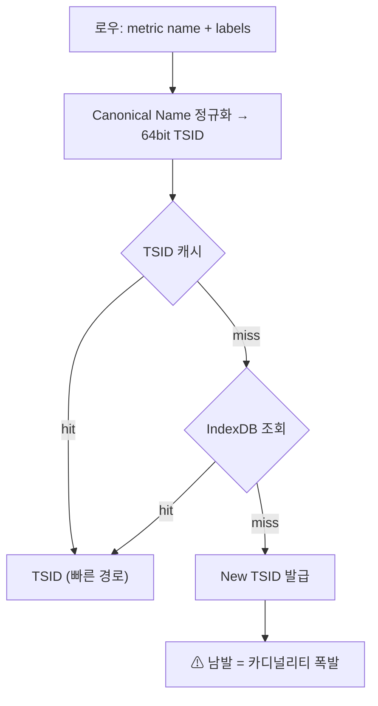
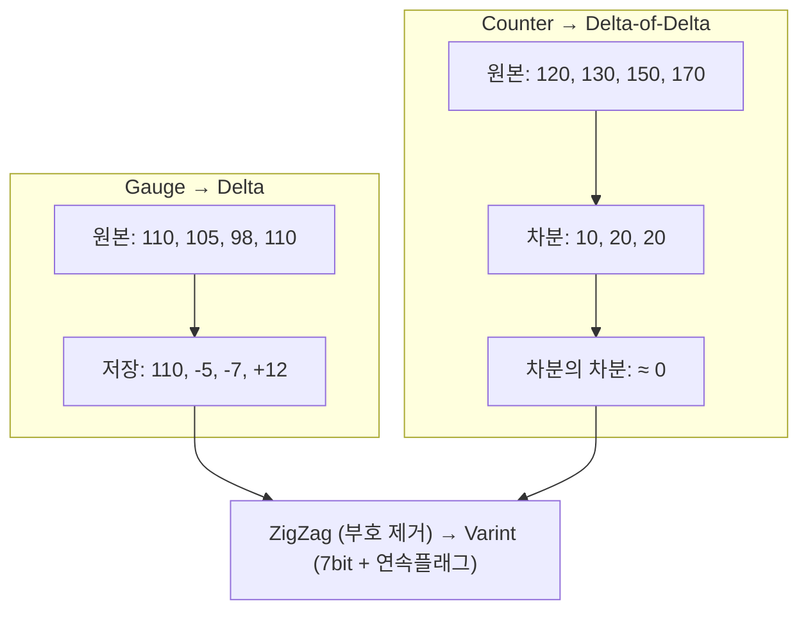

# 04 · 저장과 압축 — vmstorage와 Gorilla 계열 압축


**한눈에**
- 지표는 **Time Series**(이름+레이블, 거의 불변)와 **Sample**(timestamp+value, 계속 쌓임)로 분리 저장된다 — IndexDB/DataDB 정규화의 근거.
- 저장 경로: 로우 파싱 → Canonical Name 정규화 → **TSID 변환**(캐시 hit=빠른 경로, miss=New TSID 발급=카디널리티 폭발 원인) → 압축 → 파티션(인메모리→Small→Big, Merge Multiplier로 비슷한 크기끼리 합침).
- 압축 비결은 **Gorilla 계열 차분 인코딩**: Gauge→Delta, Counter→Delta-of-Delta(단조증가값이 압축에 극단적으로 유리) + ZigZag/Varint로 바이트 절약. 네이버 실운영 실측 **0.92바이트/데이터포인트**(원래 16바이트 대비 ~17배 압축).
- retention은 기본 1개월, IndexDB는 단건 삭제 비용을 피하려 **3단계(Current/Previous/Next) 로테이션**으로 통째로 드롭한다.


vminsert가 흩뿌린 데이터를 실제로 디스크에 눕히는 컴포넌트가 **vmstorage**다. 여기서는 지표 하나가 TSID로 변환되어 파티션에 저장되기까지의 경로와, VM의 메모리·스토리지 효율의 비결인 **Gorilla 계열 차분 압축**을 다룬다.

> 관련 블록: [02 아키텍처]() · [03 수집]() · [05 쿼리·운영 컴포넌트]() · [실전 01 카디널리티]()

## vmstorage — 저장을 책임지는 컴포넌트

vmstorage는 vminsert로부터 지표를 받아 **월별 파티션 단위로 저장**하고, vmselect의 쿼리에 블록 단위로 응답하는 상태 저장(stateful) 컴포넌트다.

### 지표 하나의 내부 표현: Time Series + Sample

지표는 두 부분으로 나뉜다.

| 부분 | 내용 | 특성 |
|------|------|------|
| **Time Series** | 지표 이름 + 레이블 (예: `request_total{path="/", code="200"}`) | **거의 변하지 않는다** |
| **Sample** | 타임스탬프(Unix time) + 값 (예: `value=120`) | **계속 쌓인다** |

이 분리가 핵심이다. 변하지 않는 부분과 계속 쌓이는 부분을 따로 관리하면 **압축 효율이 극단적으로 좋아진다.** 이것이 VM이 이름·레이블을 **IndexDB**에, 타임스탬프·값을 **DataDB**에 나눠 담는 근거다(일종의 DB 정규화). IndexDB/DataDB 분리 자체는 [02 아키텍처]()가 주로 설명한다.

### 저장 경로: 로우 파싱 → TSID 변환 → 압축 → 파티션

데이터가 들어와 눕기까지 네 단계를 거친다.

```
1. vminsert가 vmstorage에 블록 단위로 데이터 전송
2. 로우 바이트를 최대 1만 행 단위의 구조화된 로우
   (metric name / value / timestamp)로 파싱
3. 각 로우를 TSID로 변환
4. 샤드로 나눠 큐에 쌓고 → 플러시 → 인메모리 파트로 저장
   (이때 Delta / Delta-of-Delta 차분 압축 + 인코딩 압축)
```

### TSID 변환 — 정규화, 캐시, 캐시미스



저장 전 모든 로우는 **TSID(64bit 정수, 시계열의 내부 ID)** 로 바뀐다. 변환은 두 단계다.

1. 들어온 로우를 **Canonical Name으로 정규화**한다. 레이블 순서가 달라도 집합이 같으면 같은 형태가 되도록 정렬한 뒤, 그 정규화된 이름을 **64bit TSID**로 변환한다.
2. 매번 정규화하는 것은 비싸므로 **TSID 캐시**(인메모리 매핑)를 둔다. 동일한 이름이 다시 들어오면 캐시에서 곧바로 TSID를 꺼낸다 — **빠른 경로**.

캐시에 없으면(캐시미스) IndexDB(디스크 인덱스, prefix별로 엔트리 정리)를 조회하고, 거기에도 없으면 **처음 보는 시계열로 판단해 New TSID를 발급**한다 — 위 흐름의 miss 경로다.

IndexDB에도 없으면 그 시계열은 **처음 보는 시계열**이므로 새 **`New TSID`** 를 발급한다. 이것이 흔히 말하는 "새 시계열이 만들어지는" 순간이다. `New TSID`가 짧은 시간에 폭발적으로 발급되는 상황이 곧 **카디널리티 폭발**인데, 그 원인·지표·설계 원칙은 [실전 01 카디널리티]()가 주인이다. 여기서는 발급 지점까지만 짚는다.

### 값 수준 워크스루 — 샘플 1건이 저장되는 모습

앞의 개념들이 실제 값에서 어떻게 맞물리는지 예시 하나로 따라가 본다. 다음 스크레이프 한 줄이 들어왔다고 하자.

```text
node_cpu_seconds_total{mode="system", instance="10.0.0.7:9100"}  48291.5  @1735689600
```

**① Time Series와 Sample로 쪼갠다.** 이름·레이블(거의 불변)과 타임스탬프·값(계속 쌓임)이 분리된다.

| 부분 | 값 |
|------|-----|
| Time Series | `node_cpu_seconds_total{mode="system", instance="10.0.0.7:9100"}` |
| Sample | `(ts=1735689600, value=48291.5)` |

**② Canonical Name으로 정규화한 뒤 TSID를 발급한다.** 레이블을 키 기준으로 정렬해 순서 차이를 없앤다 — `instance`가 `mode`보다 앞으로 온다. 정규화된 이름이 캐시·IndexDB에 모두 없으면 처음 보는 시계열로 판단해 New TSID를 발급한다.

```text
정규화: node_cpu_seconds_total{instance="10.0.0.7:9100", mode="system"}
       → 캐시·IndexDB 미스 → New TSID 발급: 0x0A3F...C21  (64bit)
```

**③ IndexDB에는 prefix별 역색인 엔트리로, DataDB에는 TSID 열로 눕는다.** 이름·레이블은 IndexDB에 한 번만 적히고, 이후 쌓이는 값들은 DataDB에서 TSID를 키로 이어 붙는다. 이 샘플 하나로 IndexDB에는 이름 엔트리 1개 + 레이블 엔트리 2개가 생긴다.

| 저장소 | prefix / 키 | 값 |
|--------|------|-----|
| IndexDB | `MetricName → TSID` | 위 canonical 이름 → `0x0A3F...C21` |
| IndexDB | `Tag(instance="10.0.0.7:9100") →` | 이 레이블을 가진 시계열 역색인 |
| IndexDB | `Tag(mode="system") →` | 이 레이블을 가진 시계열 역색인 |
| DataDB | `0x0A3F...C21` (TSID) | `(1735689600, 48291.5), (1735689615, 48293.1), ...` |

다음 스크레이프에서 같은 시계열이 다시 오면 ②의 정규화·발급을 건너뛰고 캐시에서 TSID를 바로 얻어(빠른 경로), Sample만 DataDB의 같은 TSID 열 뒤에 붙는다. 값이 이렇게 한 열로 이어지기 때문에 아래의 Delta / Delta-of-Delta 압축이 극대화된다.

### 파티션 — 인메모리 → Small → Big


vmstorage 내부의 데이터는 **인메모리 파트 → Small 파티션 → Big 파티션** 으로 굳어간다.

- 인메모리에서 플러시가 일어나면 디스크의 **Small 파티션**으로 이동하며 머지된다.
- Small 파티션들이 모여 **Big 파티션**으로 머지된다. 인메모리에 아주 큰 블록이 뭉텅이로 들어오면 곧바로 Big 파티션으로 가기도 한다.
- 파티션 디렉토리는 월별로 `YYYYMM` 형태로 네이밍된다.

머지에는 **Merge Multiplier** 알고리즘을 쓴다. `(합쳐질 파트들의 총 출력 크기) / (가장 큰 입력 파트 크기)` 값이 **클수록 좋다.** 즉 **비슷한 크기의 파트끼리 합칠수록 가성비가 좋다.**

```
1MB×4 + 10MB  → 합 14 / 최대 10 = 1.4   (큰 놈에 억지로 끼움, 비효율)
1+2+3+3+3     → 합 14 / 최대  3 = 4.67  (비슷한 것끼리 잘 합침, 효율적)
```

### Deduplication — minScrapeInterval과 watcher

같은 시계열에 아주 짧은 간격으로 거의 같은 값이 여러 번 들어오면 전부 저장할 이유가 없다. **`dedup.minScrapeInterval`** 을 예컨대 10초로 두면, 그 구간 내 중복 값 중 하나만 남기고 제거한다.

**Deduplication Watcher**는 매시간(지터 포함)마다 확인하고 필요 시 **파티션 전체 머지**를 트리거한다. 예를 들어 3월에 dedup 설정을 새로 넣으면, 이미 dedup 없이 저장돼 머지가 끝난 1~2월 파티션에 대해서도 소급 머지를 걸 수 있다. (읽기 시점 vmselect에서도 한 번 더 dedup이 걸린다 — [05]().)

### Retention — 기본 1개월, watcher, Big 파티션 경계 문제

- 데이터 보존 기간. **기본값 1개월**, 최소 하루부터 최대 100년까지 설정 가능하다.
- **Retention Watcher**가 **매분** 실행되어 오래된 파티션·파트를 삭제한다.
- 주의: **파티션 내에 보존 기간 안에 든 샘플이 하나라도 있으면 그 파트 전체가 유지된다.** Small 파티션은 경계에 맞게 깔끔히 삭제되지만, **Big 파티션은 보존 경계에 걸치면 통째로 들고 있어야** 한다. 그래서 Big 파티션은 retention이 정확히 맞아떨어지지 않을 수 있다.

### IndexDB 3단계 로테이션 — 단건 삭제 회피


IndexDB에는 시간이 지날수록 **삭제되거나 더 이상 수집되지 않는 시계열의 엔트리**가 누적된다. 그렇다고 엔트리를 하나씩 지우면 인덱스 자료구조 특성상 **단건 삭제 비용이 매우 크다.** 그래서 VM은 **IndexDB 자체를 통째로 굴려버린다.**

버전 **1.133.0부터 3단계 로테이션**이 정착됐다.

| 단계 | 역할 |
|------|------|
| **Current** | 새 시계열 데이터를 실시간으로 수신하며 활성화된 IndexDB |
| **Previous** | 보존 기간 내 오래된 데이터를 가져 쿼리가 가능한 IndexDB |
| **Next** | 다음 로테이션을 위해 미리 준비하는 IndexDB |

Retention 기간에 도달하면 **Next → Current, Current → Previous, Previous → 통째로 드롭**된다. 예를 들어 retention이 `365d`이고 2026년 1월 1일에 시작했다면, 2026년 12월 31일 UTC 04시에 로테이션이 일어난다. **단건 삭제 비용을 회피하면서 서비스 단절 없이 IndexDB를 깨끗이 비우는** 우아한 설계다.

## 압축 — Gorilla 계열 차분 인코딩

VM의 메모리·스토리지 효율의 비결이 여기 있다. 원래 타임스탬프 8바이트 + 값 8바이트로 **데이터포인트 하나에 16바이트**가 필요하지만, VM은 Facebook이 2015년 발표한 **Gorilla 압축**의 계열 기법으로 이를 극단적으로 줄인다.

### Gauge → Delta, Counter → Delta-of-Delta



- **Gauge → Delta 인코딩**: 위아래로 변동하는 값. 첫 값만 남기고 나머지는 **차분(diff)** 만 저장한다. 원본 `110, 105, 98, 110, 103` → `110, -5, -7, +12, -7`. 8바이트짜리 값들이 1~2바이트로 줄어든다.
- **Counter → Delta-of-Delta 인코딩**: 단조 증가하는 값. 원본 `120, 130, 140, 150...`의 1차 차분은 `100, 100, 100...`(거의 일정), 그 **차분의 차분(Delta-of-Delta)** 은 `0, 0, 0...`에 수렴한다. 그래서 **첫 값 + 첫 차분 뒤로는 "변화 없음"만 저장**하면 되어 압축률이 극단적으로 좋다. 뒤에 100개, 1000개를 이어 붙여도 크기가 거의 늘지 않는다.

**단조 증가하는 Counter가 압축에 극단적으로 유리하다** — 이 점만 기억하면 된다.

같은 원리가 **타임스탬프 스트림**에서는 더 극적으로 작동한다. 스크레이프 주기가 일정하면 델타가 상수가 되고 델타의 델타는 0이 되므로, 아래처럼 8바이트 타임스탬프 4개(32B)가 개념상 11B 수준으로 눕는다.


### Counter / Gauge 블록 판별 — 잦은 리셋이면 Gauge

그럼 어떤 시계열이 Counter인지 Gauge인지 VM은 어떻게 아는가? **블록 단위로 값의 패턴을 보고 판별**한다. `120, 130, 140`이나 `500, 600, 700`처럼 단조 증가하면 Counter, 위아래로 오르내리면 Gauge로 매긴다.

단, **Counter도 언젠가 리셋된다.** 리셋이 **너무 잦으면** VM은 그 블록을 **Gauge로 분류**한다. 즉 Counter 지표라도 잦은 리셋이 있으면 Delta-of-Delta의 이점을 잃고 Gauge 압축으로 떨어질 수 있다는 점에 유의하자.

{}
차분 압축을 하면 `-5, -7, -13` 같은 **음수**가 생기는데, 음수는 2의 보수 표현상 상위 비트가 다 켜져 공간을 많이 차지한다. 그래서 두 단계로 다듬는다.

**ZigZag 인코딩** — 부호를 없애고 절댓값이 작은 순서대로 양수에 매핑한다.

```
원본:   0   -1   1   -2   2   -3 ...
ZigZag: 0    1   2    3   4    5 ...

예) -5 → 왼쪽 시프트(-10) XOR 산술우시프트(-1) = 9
    (부호 있는 작은 음수가 작은 양수 9로 바뀐다)
```

**Varint 인코딩** — ZigZag로 얻은 작은 양수를 **7비트씩** 쪼개 저장한다. 각 바이트의 하위 7비트는 값, 최상위 1비트는 **"다음 바이트가 이어진다"는 연속 플래그**다. `9`는 8비트 안에 들어가 **한 바이트로 끝나고**, `300`처럼 큰 값은 여러 바이트로 이어진다.

```
9   → 0000_1001                 (연속 플래그 0, 1바이트)
300 → 1010_1100 0000_0010       (첫 바이트 플래그 1 → 이어짐, 2바이트)
```
{}

{}
이 모든 기법이 실제로 얼마나 효과적인지는 운영 수치가 증명한다. 네이버 검색이 5년간 운영한 클러스터에서 **555조 개의 데이터포인트가 약 510TB에 저장**된다. 나눠 보면 **데이터포인트당 0.92바이트**다.

원래 16바이트가 필요한 데이터포인트를 **0.92바이트로 저장** — 약 17배 압축이다. 이 값은 벤치마크가 아니라 12.5억 활성 시계열 규모의 **실운영 환경 실측치**이며(D2 기사 6475419), Gorilla 계열 압축이 이론이 아니라 실전에서 통한다는 가장 강력한 증거다. 이 압축이 절약하는 것은 디스크만이 아니다. 더 많은 데이터가 메모리에 올라가므로 연산도 그만큼 빨라진다. 이 규모의 전체 그림은 [실전 02 초대규모 운영]()에서 다룬다.
{}

## 출처

- `02_대사집_Inside_VictoriaMetrics.md`(강민구, Inside VictoriaMetrics) — Time Series/Sample 분리·저장 경로·TSID 변환·캐시미스(16:00~21:30), Delta/Delta-of-Delta·Counter/Gauge 판별·ZigZag·Varint(21:30~27:00), 파티션·Merge Multiplier·dedup·retention·IndexDB 로테이션(27:00~33:30).
- `01_대사집_..._멀티버스.md`(손주식, DEVIEW 2023) — LSM 트리·TSID/역색인·Gorilla 압축의 역사적 맥락과 16바이트→차분 압축(15:00~20:00).
- `03_기사_6475419_대규모메트릭저장소.md` — 555조 데이터포인트 / 약 510TB / **0.92바이트/데이터포인트** 실측치.
- 골격: `chapter9/victoriametrics.md` §3.3.
