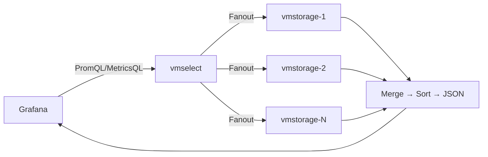

# 05 · 쿼리·운영 컴포넌트 — vmselect / vmalert / vmauth


**한눈에**
- **vmselect**는 저장하지 않는 stateless 쿼리 엔진 — 모든 vmstorage에 **Fanout**으로 던지고 결과를 Merge·Sort해 반환한다.
- 쿼리는 **3-Prefix**(태그→Metric ID→TSID→값·이름 복원)로 풀린다 — 쓰기 시점 정규화를 역방향으로 되짚는 대칭 구조다.
- 메모리 관리 3포인트: 쿼리 시점 **dedup**, **Rollup Result Cache**(허용 메모리 12.5%, 최근 5분 제외), **Query Latency Offset**(기본 30초, 정확성↔실시간성 트레이드오프).
- **vmalert**는 Recording rules로 무거운 집계를 미리 계산해 조회 부하를 쓰기 시점으로 옮기고, **vmauth**는 멀티 클러스터 앞단 라우팅 게이트웨이로 사용자 배포 없이 장애 전환을 가능케 한다.


데이터가 들어가는 길([03 수집]()·[04 저장]())을 다뤘으니, 이 블록은 **데이터가 빠지는 길**과 그 주변의 운영 컴포넌트를 본다. 쿼리 엔진 `vmselect`, 지표를 미리 계산해 두는 `vmalert`, 그리고 멀티 클러스터의 앞단을 지키는 라우팅 게이트웨이 `vmauth`다.

> 관련 블록: [02 아키텍처](), [03 수집](), [04 저장](), [실전 01 카디널리티](), [실전 02 대규모 운영]()

## vmselect — Fanout 쿼리 엔진



vmselect는 PromQL/MetricsQL 쿼리를 받아 **모든 vmstorage 노드에 던지고(Fanout)**, 돌아온 결과를 모아서 클라이언트에 반환하는 컴포넌트다. [02 아키텍처]()의 데이터 흐름에서 화살표가 반대로 향하는 쪽, 즉 읽기 경로의 진입점이다.

전체 흐름은 세 단계다.

```
1. Grafana → vmselect
   PromQL/MetricsQL 쿼리(레이블 필터 포함)를 던진다.
   엔드포인트 예: /select/0/prometheus/api/v1/query_range

2. vmselect → 모든 vmstorage (Fanout)
   전 노드에 요청을 전송하고 블록 단위로 수신한다.

3. vmselect → Grafana
   받은 블록을 메모리 버퍼에 모아 Merge → Sort → JSON 응답.
```

**핵심 직관: vmselect는 저장을 하지 않는다.** 어느 노드에 무엇이 있는지 모르므로 모든 vmstorage에 똑같이 뿌리고([03 수집]()의 랑데부 해싱은 쓰기 라우팅일 뿐 읽기는 위치를 모른다), 돌아온 조각을 하나로 합친다. 그래서 vmselect는 stateless하고, 부하에 맞춰 수평 확장하기 쉽다(→ [실전 02 대규모 운영]()에서 Kubernetes 위에 올리는 이유).

### 3-Prefix 검색 — PromQL 한 줄이 풀리는 과정

vmselect 내부에서 쿼리는 3단계 prefix로 풀린다. [04 저장]()에서 본 TSID·IndexDB 구조를 **역방향으로** 되짚는 과정이라고 보면 된다.

**파싱과 캐싱**: 먼저 PromQL 문자열을 구조화된 데이터로 파싱한다. 어떤 함수인지, 필터는 어떻게 걸렸는지, 시간 윈도는 얼마인지를 뽑아낸다. **이 파싱 결과 자체도 캐싱**해 같은 형태의 쿼리를 매번 다시 파싱하지 않는다.

| 단계 | 변환 | 하는 일 |
|------|------|---------|
| **Prefix 1** | 태그 → Metric ID | 태그 필터를 IndexDB에 전달해 매칭되는 Metric ID를 식별. 인메모리 캐시를 먼저 확인한다. `name`·`method`·`status` 등 **여러 레이블 조건의 교집합**에 해당하는 Metric ID를 모은다. |
| **Prefix 2** | Metric ID → TSID | 모인 Metric ID를 TSID로 변환한다. (예: Metric ID 49가 어떤 TSID인지 조회) |
| **Prefix 3** | TSID → 값·이름 복원 | TSID로 Value와 Timestamp를 가져오고, 응답에 넣을 **지표 이름과 레이블을 역으로 복원**한다. |

결과적으로 `http_requests_total{method="get", status="200"}` 같은 필터가 "그 시계열의 값이 몇이다"로 완성된다. 쓰기 시점에 이름 → TSID로 정규화했던 것을, 읽기 시점에 TSID → 이름으로 되돌리는 대칭 구조다.

### 메모리 관리 3포인트

vmselect가 신경 쓰는 것은 결국 메모리다. 세 가지 장치가 있다.

**1) 쿼리 시점 Deduplication**
[03 수집]()의 replicationFactor로 같은 시계열이 여러 노드에 중복 저장되고, vmstorage에서도 dedup을 한다. 그런데 vmselect에서 **한 번 더** 한다. `dedup.minScrapeInterval=10s` 같은 옵션을 두면 동일 타임스탬프 구간에서 최신 값만 살리고 나머지는 버린다. Fanout으로 여러 복제본이 동시에 돌아오므로, 최종 응답을 만들기 직전에 중복을 걷어내는 것이다.

**2) Rollup Result Cache — 왜 12.5%이고 왜 최근 5분을 제외하나**
한 번 처리한 쿼리 결과를 캐싱하되, **vmselect 허용 메모리의 12.5%만** 이 캐시에 쓴다. 쿼리 처리 자체에 필요한 메모리를 캐시가 잠식하지 않도록 한 상한이다.

그리고 **현재 시각 기준 최근 5분 구간은 캐싱에서 제외**한다. 이유가 중요하다 — 가장 최근 5분의 데이터는 아직 vmstorage에 다 도착하지 않았을 수 있다. 응답 지연이나 네트워크 지연 때문에 일부 데이터포인트가 빠진 **불안정한 결과**를 캐시에 넣어 버리면, 나중에 그 캐시가 잘못된 값을 계속 돌려주게 된다. 그래서 아직 확정되지 않은 최근 5분은 아예 캐싱 대상에서 뺀다.

**3) Query Latency Offset — 기본 30초, 실시간과의 트레이드오프**
`search.latencyOffset` 설정값으로, **기본 30초**다. 쿼리할 때 가장 최근 30초의 데이터를 **일부러 뒤로 밀어** 검색한다. Rollup Result Cache의 "최근 5분 제외"와 같은 문제의식이다 — 수집 지연으로 인한 불안정 데이터를 조회 결과에 넣지 않으려는 것이다.

**핵심 트레이드오프**: 실시간 대시보드처럼 recency가 중요한 케이스에서는 이 값을 0초로 줄일 수 있다. 대신 조회할 때마다 최신 데이터가 들쭉날쭉 채워지므로 **같은 그래프가 새로고침마다 다르게 보이는** 것을 감수해야 한다. 정확성(안정)과 실시간성 사이의 선택이다.

## vmalert — Recording Rules 선계산

vmselect가 아무리 빨라도, **애초에 읽어야 할 데이터포인트가 수백만 개면** 답이 없다. 시각화 대시보드에서 서비스 지표를 하루 이상 범위로 조회하는 요청이 그렇다.

예를 들어 장비 5,000대를 쓰는 서비스에서 "매 분 검색 요청 수의 합"을 하루 범위로 표시한다고 하자.

```
데이터 수집 간격: 1분
매 분 장비별 시계열: 5,000개
1일 데이터포인트: 5,000개/분 × 60분 × 24시간 = 7,200,000개/일
```

즉 하루치 그래프 한 장에 **720만 개**를 반환해야 한다. 그런데 정작 화면에 필요한 건 "합계" 시계열 하나다.

**해결: 미리 계산해 시계열 1개로 압축한다.** 검색 요청 수의 합을 사전에 계산해 저장해 두면, 조회 시엔 **1,440개**(하루 = 1,440분)만 읽으면 된다. 720만 개 → 1,440개, 약 5,000분의 1이다.

이 선계산을 담당하는 것이 Prometheus의 **Recording rules 호환** 툴인 `vmalert`다. Recording rule로 정의한 표현식을 주기적으로 평가해 그 결과를 새로운 시계열로 다시 저장한다. 읽기 부하가 쓰기 시점으로 옮겨 가므로, 무거운 대시보드 쿼리의 응답 시간과 클러스터 부하가 동시에 내려간다.

> vmalert가 실제 멀티 클러스터 운영에서 어떤 접근 패턴 부하를 덜어 주는지는 [실전 02 대규모 운영]()에서 다룬다.

## vmauth — 라우팅 게이트웨이

클러스터를 여러 개 운영하기 시작하면([실전 02 대규모 운영]()의 멀티 클러스터) 새로운 문제가 생긴다. 버전 업그레이드, 장비 교체, 배포, IDC 장애 같은 운영 이슈가 발생할 때마다 **사용자가 직접 엔드포인트를 바꿔** 대체 클러스터로 붙어야 한다. 이는 사용자와의 커뮤니케이션 비용을 낳고, 최악의 경우 IDC 인프라 장애 시 사용자가 설정을 배포하기 전까지 모니터링 복구가 지연된다.

**해결: 사용자 앞에 라우팅 게이트웨이를 둔다.** 사용자는 고정된 엔드포인트 하나만 바라보고, 운영자가 그 뒤에서 적절한 클러스터로 라우팅한다. VM은 이를 위해 `vmauth`를 제공하며(래핑해서 사용), 얻는 것은 다음과 같다.

- **사용자 엔드포인트 고정 + 내부 라우팅 전환**: 운영 이슈가 나면 **내부 라우팅 설정 변경만으로** 대체 클러스터로 넘긴다. IDC 장애 같은 비상 상황에서도 **사용자 배포 없이** 라우팅 포인트만 바꿔 빠르게 복구한다.
- **접근 패턴·부하량 기반 라우팅과 로드밸런싱**: 사용자별 조회 패턴과 부하량에 맞춰 어느 클러스터로 보낼지 정한다.
- **Basic auth**: 인증된 사용자만 접근할 수 있게 해, 예상치 못한 부하를 앞단에서 막는다.
- **부하 모니터링**: 사용자별 부하·요청 수를 모니터링해 과부하 유발 지점을 식별한다.

결과적으로 여러 클러스터를 운영해도 사용자와의 커뮤니케이션 비용을 줄이고 내부 유지보수를 용이하게 한다.

> vmauth를 통한 무중단 클러스터 전환·오경보 대응 등 상세 운영 맥락은 [실전 02 대규모 운영]()에서 이어진다.

## 출처

- **Inside VictoriaMetrics** (강민구, NAVER) — vmselect Fanout·3-Prefix 검색·메모리 관리 3포인트: 33:46~38:50 구간. (https://d2.naver.com/helloworld/9290861)
- **네이버 검색 SRE의 시계열 데이터베이스 운영기** (이선규) — vmalert 지표 선계산(선계산 시점): 32:18 구간. (https://d2.naver.com/helloworld/6867189)
- **VictoriaMetrics 시계열 데이터, 대혼돈의 멀티버스** (DEVIEW 2023) — 멀티 클러스터·데이터 마이그레이션 맥락. (https://d2.naver.com/helloworld/6867189)
- 합성 골격: `chapter9/victoriametrics.md` §3.4·§4.3·§4.4.
