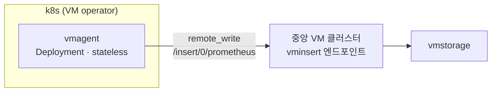

# 01 · 우리 스택 구성


**한눈에**
- k8s 위 **VM operator**가 vmagent를 **Deployment(stateless)** 로 띄우고, 중앙 VM 클러스터의 vminsert 엔드포인트로 `remote_write` 한다.
- 목적지 경로 `/insert/0/prometheus`는 **클러스터 모드 · tenant 0**을 뜻한다.
- stage/prod는 값이 다르다 — 리소스·`maxDiskUsagePerURL`이 환경별로 갈리고, **prod는 vmagent가 두 계열(용도별 분리)** 이라 `extraArgs`가 양쪽에 함께 걸린다.
- 공통 수집 설정은 `scrapeInterval 30s` · `promscrape.streamParse=true` · `promscrape.maxScrapeSize=24GiB`.


우리 환경에서 지표가 어디서 만들어져 어디로 흘러가는지, 그 구조와 stage/prod 값 차이를 정리한다. 전송 안정화를 위한 Phase 1 튜닝은 [02 vmagent 전송 튜닝]()에서, 장기보관 아키텍처는 [메트릭 장기보관]() 챕터에서 따로 다룬다.

> 관련 문서: [개념 03 수집]() · [02 vmagent 전송 튜닝]() · [메트릭 장기보관]() · [우리의 운영 허브]()

## 전체 구조



vmagent는 **k8s 위에서 VM operator가 관리하는 Deployment**다. 무상태(stateless)라 스크랩한 지표를 자체 보관하지 않고 곧바로 중앙 VM 클러스터의 vminsert로 흘려보낸다. vmagent의 7단계 수집 파이프라인과 유실 방지 큐 등 원리는 [개념 03 수집]()에서 다룬다 — 이 문서는 그 원리를 우리 값으로 옮긴 결과만 본다.

## 목적지 경로 — `/insert/0/prometheus`

remote_write 목적지 URL은 다음 형태다.

```
https://<vminsert-endpoint>/insert/0/prometheus/api/v1/write
```

경로 `/insert/<tenantID>/prometheus`는 VM **클러스터 모드**의 vminsert 규약이다. 여기서 `0`은 **tenant 0**을 뜻한다. 즉 우리는 단일 노드(vmsingle)가 아니라 클러스터 모드 vminsert를 tenant 0으로 쓰고 있다. TLS는 `insecureSkipVerify: true`로 붙는다.

## stage/prod 값 차이

같은 구조지만 환경별 값이 다르다.

| 항목 | stage | prod |
|------|-------|------|
| 배포 형태 | Deployment (stateless) | Deployment (stateless) |
| vmagent 계열 | 1 계열 | **2 계열** (용도별 분리) |
| requests | cpu `500m` / mem `500Mi` | cpu `100m` / mem `150Mi` |
| limits | mem `1500Mi` | cpu `2` / mem `1000Mi` |
| `scrapeInterval` | `30s` | `30s` |
| `maxDiskUsagePerURL` | `1000MiB` | `2000MiB` |

리소스 기준치의 근거와 "실측 후 조정" 항목은 [04 스케일링·용량 기준치]()에서 정리한다.

## 공통 수집 설정 (`extraArgs`)

두 환경 공통으로 다음을 건다.

| 설정 | 값 | 의미 |
|------|----|----|
| `scrapeInterval` | `30s` | 스크랩 주기 |
| `promscrape.streamParse` | `true` | 응답을 스트리밍 파싱해 대형 타깃의 메모리 급증을 억제 |
| `promscrape.maxScrapeSize` | `24GiB` | 단일 스크랩 응답 허용 상한 |

Phase 1에서 여기에 `remoteWrite.forceVMProto`가 추가됐다. 그 근거는 [02]()에서 다룬다.

## prod 주의 — 두 계열에 함께 걸린다

prod의 vmagent는 **용도에 따라 두 계열**로 운영한다. `extraArgs`는 base 설정이라 **양쪽 vmagent에 함께 적용된다.** [02]()에서 다룰 `remoteWrite.forceVMProto`도 base에 넣으면 두 계열 모두에 걸리는데, **둘 다 목적지가 VM이라 안전**하다. 한쪽이라도 VM이 아닌 목적지였다면 base가 아니라 계열별로 나눠 걸어야 한다.
