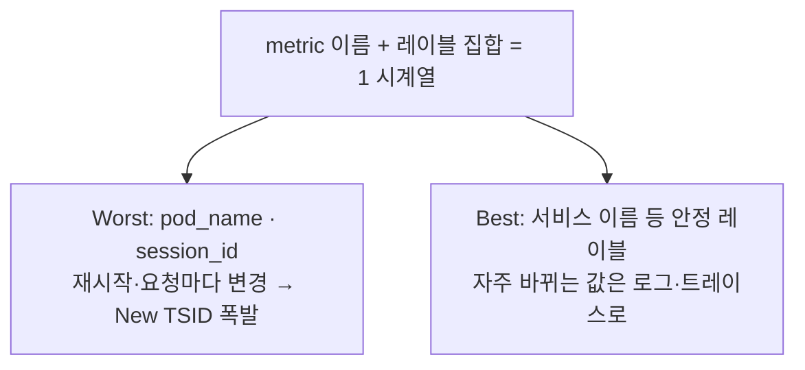

# 01 · 카디널리티 — 시계열 폭발의 원리와 설계 원칙


**한눈에**
- 시계열 = **지표 이름 + 레이블 집합**. 레이블 값 하나만 달라도 완전히 다른 시계열이 된다.
- **New TSID 발급(=처음 보는 시계열)이 곧 카디널리티 폭발** — 단순 데이터 추가가 아니라 IndexDB 인덱스 쓰기라 CPU·메모리를 훨씬 많이 먹는다.
- Worst case는 `pod_name`·`session_id`처럼 자주 바뀌는 값을 레이블로 쓰는 것. Best case는 **설계 단계에서 배제** — 서비스 이름 같은 안정 레이블만 쓰고, 자주 바뀌는 값은 로그·트레이스로 뺀다.
- 런타임 감시는 **churn rate**(신규 시계열 생성 속도)와 **slow insert rate**(지속 10% 초과 시 메모리 부족 경고) 두 지표가 핵심.


VM 운영에서 가장 자주 사고를 내는 개념이 **카디널리티**다. 이 블록은 "한 시계열이 무엇으로 정의되는가"에서 출발해, 카디널리티 폭발이 왜 곧 메모리·인덱스 폭발인지, 그리고 설계 단계에서 이를 어떻게 막는지를 본다.

> 관련 블록: [개념 04 저장](), [개념 05 쿼리·운영 컴포넌트](), [02 대규모 운영]()

## 한 시계열 = 지표 이름 + 레이블 집합



VM에서 **하나의 시계열은 "지표 이름 + 레이블 집합"으로 정의된다.** 여기서 핵심 직관 하나.

> **레이블이 단 하나만 달라져도 완전히 다른 시계열로 인식된다.**

예를 들어 아래 둘은 이름이 같아도 서로 다른 두 개의 시계열이다.

```
http_requests_total{service="my-order", pod="my-order-7f9c-abcde"}
http_requests_total{service="my-order", pod="my-order-7f9c-xyz12"}
                                            └─ pod 값 하나만 달라도 별개의 시계열
```

카디널리티란 이렇게 만들어지는 **서로 다른 시계열의 총 개수**다. 레이블 값의 조합이 늘어날수록 곱셈으로 불어난다.

## New TSID 폭발이 곧 카디널리티 폭발

[개념 04 저장]()에서 본 저장 경로를 떠올리자. vmstorage는 들어온 지표를 TSID로 변환하는데, 그 과정은 TSID 캐시 → IndexDB 순으로 조회하다가 **둘 다 없으면 처음 보는 시계열로 판단해 New TSID를 발급**한다.

```
TSID 캐시 조회 → miss
   → IndexDB(디스크 인덱스) 조회 → miss
        → 처음 보는 시계열 → New TSID 발급 (인덱스 쓰기)
```

여기서 결정적인 사실: **New TSID가 마구 발급되는 상황이 곧 카디널리티 폭발이다.** 레이블이 계속 새 값으로 바뀌면 매번 "처음 보는 시계열"이 되어 New TSID가 끝없이 찍힌다. 그리고 New TSID 발급은 단순히 데이터포인트 하나를 추가하는 것과 차원이 다르다 — **IndexDB에 새 엔트리를 쓰는 인덱스 연산**이라 CPU·메모리를 훨씬 많이 먹는다. 그래서 카디널리티 폭발은 곧바로 IndexDB 팽창과 메모리 압박, OOM 위험으로 이어진다(→ [02 대규모 운영]()에서 실제 vmstorage 메모리 한계로 나타난다).

## Worst Case — 자주 바뀌는 값을 레이블로

카디널리티를 터뜨리는 전형적인 실수는 **자주 변경되는 값을 레이블로 넣는 것**이다.

- **파드 이름(`pod`)**: 쿠버네티스에서 파드는 재시작·재배포마다 이름이 바뀐다. 파드가 한 번 재시작될 때마다 그 지표의 시계열이 통째로 새것이 되고, 이전 시계열은 죽은 채 인덱스에 남는다.
- **세션 ID(`session_id`)**: 요청·세션마다 유일한 값이라 사실상 무한대로 늘어난다. 이런 레이블 하나가 시계열 수를 폭발적으로 늘린다.

공통점은 **값의 가짓수가 시간이 지나며 계속 늘어난다**는 것이다. 이런 레이블은 시계열 교체율(뒤의 churn)을 끌어올려 인덱스를 부풀린다.

## Best Case — 설계에서 배제하는 것이 가장 싸다

가장 확실한 최적화는 쿼리 튜닝이 아니라 **설계 단계에서 고카디널리티 레이블을 아예 만들지 않는 것**이다.

- **자주 바뀌어 High Cardinality를 유발하는 레이블은 처음부터 설계에 없는 것이 최선이다.** 한 번 들어간 레이블을 나중에 걷어내기는 훨씬 어렵다.
- **파드 이름 대신 서비스 이름을 쓴다.** 파드 이름(`my-order-7f9c-abcde`)은 재시작마다 바뀌지만, 서비스 이름(`my-order`)은 잘 바뀌지 않는다. 서비스 이름을 레이블로 쓰면 파드가 재시작돼도 시계열이 그대로 유지된다.
- **자주 바뀌는 값은 지표가 아니라 로그·트레이스로 다룬다.** 세션 ID처럼 개별 요청을 추적해야 하는 값은 metric의 레이블이 아니라 로그나 트레이스에 담는 것이 옳다. 지표는 "집계"를 위한 것이고, 개별 식별자 추적은 로그·트레이스의 몫이다.

## 운영 감시 지표 — churn rate와 slow insert rate

카디널리티는 배포 이후에도 계속 변하므로 **런타임에 감시해야 한다.** 두 지표가 핵심이다.

| 지표 | 의미 | 운영상의 위험 |
|------|------|---------------|
| **시계열 교체율 (churn rate)** | 24시간 안에 새로 생성된 시계열의 수와 비율 (=New TSID 발급 속도) | 값이 커질수록 IndexDB 부하가 증가하고, OOM과 쿼리 성능 저하 가능성이 커진다. |
| **지연 삽입 비율 (slow insert rate)** | 최근 5분 동안 전체 수집량 대비 지연된 삽입의 비율 | **지속적으로 10%를 넘으면** 현재 활성 시계열 수에 비해 메모리가 부족하다는 신호다. |

**churn rate**는 앞서 본 New TSID 발급을 그대로 관측한 값이다. 자주 바뀌는 레이블이 들어오면 이 수치가 튄다. **slow insert rate**는 TSID 캐시가 메모리 부족으로 미스를 자주 내며 IndexDB 폴백이 잦아질 때 오른다 — 즉 활성 시계열이 메모리 캐시에 다 담기지 못하고 있다는 뜻이다. **지속적으로 10% 초과는 "메모리가 활성 시계열을 감당하지 못한다"는 명확한 경고**로 읽어야 한다.

> 이 두 지표는 [02 대규모 운영]()의 12.5억 시계열 규모 무중단 장비 전환에서, -storageNode 목록을 어떻게 바꿔야 안전한지를 판단하는 실전 계기판으로 쓰인다. 목록을 통째로 교체하면 신규 장비의 모든 시계열이 New TSID로 재등록돼 churn이 폭등하고 클러스터가 OOM에 빠질 수 있기 때문이다.

## 출처

- **Inside VictoriaMetrics** (강민구, NAVER) — 시계열 정의·New TSID 발급·Best/Worst Case: 20:52~21:38, 38:50~39:55 구간. (https://d2.naver.com/helloworld/9290861)
- **네이버 검색의 대규모 메트릭 저장소, VictoriaMetrics 운영기** (2026) — churn rate·slow insert rate 지표와 10% 임계. (https://d2.naver.com/helloworld/6475419)
- 합성 골격: `chapter9/victoriametrics.md` §6.
