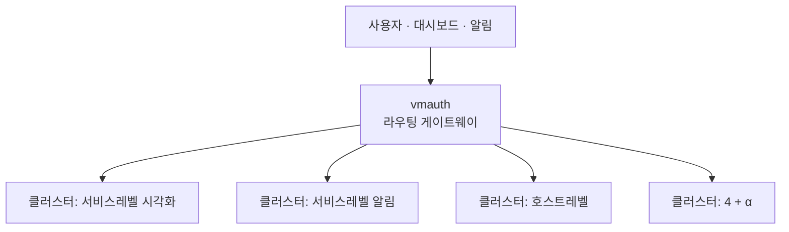
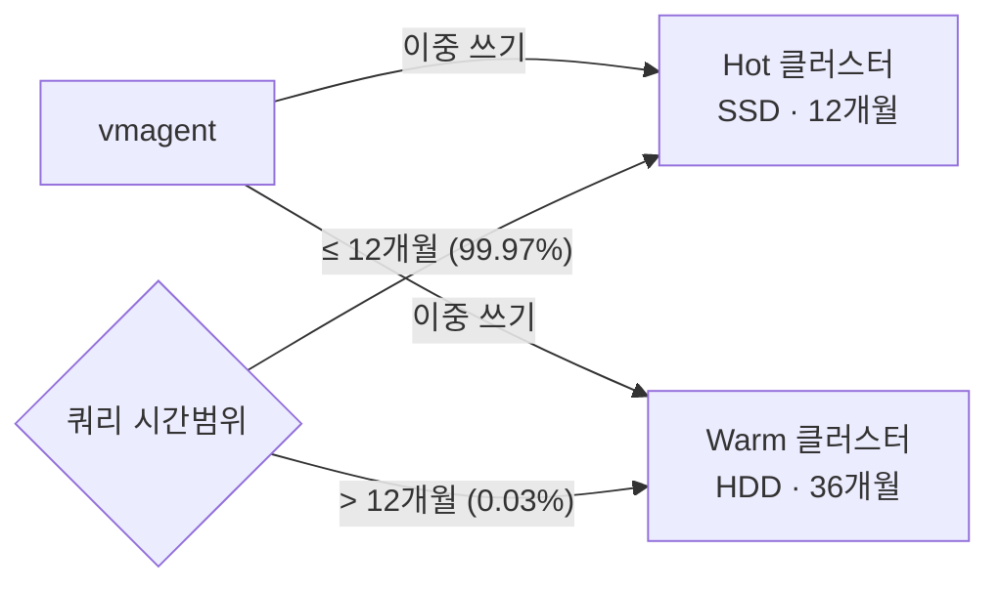

# 02 · 초대규모 운영기 — 멀티버스와 무중단 장비 전환


**한눈에**
- 진화 경로: **SingleNode(SPOF) → Cluster(이질적 접근 패턴이 한 클러스터를 과부하) → 멀티버스**(대시보드·알람별 클러스터 분리) + vmauth 라우팅.
- 현재 규모: **180노드(Hot 120·Warm 60)**, **12.5억 활성 시계열**, **555조 데이터포인트**(0.92바이트/DP) — 공개 사례 중 최상위권.
- **Hot/Warm 2계층**(SSD 12개월/HDD 36개월)으로 성능·비용 균형을 잡는다 — dual write + 쿼리 시간범위 기반 읽기 분기.
- 무중단 128GB→512GB 장비 전환: Hot은 **랑데부 해싱 역순 추가**(기존 장비 부하 최소화), Warm은 **vmbackup/vmrestore**(vmctl은 API 부하로 배제) — **서비스 중단 0분·메트릭 유실 0건**.


네이버 검색이 5년간 VictoriaMetrics를 운영하며 도달한 초대규모(12.5억 시계열·555조 데이터포인트·180노드) 현장의 이야기다. 단일 클러스터가 무너지는 지점, 여러 클러스터로 쪼갠 "멀티버스", Hot/Warm 2계층, 그리고 180대를 무중단으로 갈아 끼운 전환 설계를 다룬다.

> 관련 블록: [개념 02 아키텍처](), [개념 03 수집](), [개념 04 저장·압축](), [개념 05 쿼리·운영 컴포넌트](), [01 카디널리티]()

## 대혼돈의 멀티버스 — 멀티클러스터 운영기

### SingleNode에서 Cluster로

처음에는 VictoriaMetrics를 **SingleNode 모드**로 썼다. 바이너리 하나로 모든 기능을 제공하니 구축·사용이 간편했고 VM 특유의 최적화로 Prometheus보다 빠른 성능도 체감했다. 하지만 모든 데이터를 하나에 넣고 쓰다 보니 **이 SingleNode가 다운되면 네이버 검색 전체의 모니터링이 중단되는** 단일 장애점(SPOF)이 됐다. 이를 극복하려 **Cluster 모드**로 옮겼다. 저장(vmstorage)·읽기(vmselect)·쓰기(vminsert) 세 컴포넌트로 나뉘고, 다른 Prometheus 호환 스케일러블 DB보다 의존성이 적어 운영이 편했다. 컴포넌트만 추가하면 수평 확장이 가능해 Prometheus의 scale-out 한계도 풀렸다(구성·데이터 흐름은 [개념 02 아키텍처](), 랑데부 해싱·replicationFactor 복제는 [개념 03 수집]()).

배치 전략은 컴포넌트 성격에 맞췄다.

- **stateless(vminsert·vmselect)** → 쿠버네티스 위에 올려 scale-out을 편하게 한다.
- **stateful(vmstorage)** → 물리 장비에서 운영한다. 컨테이너에 올릴 수도 있으나 디스크 I/O가 큰 저장 계층은 물리 장비가 이점이 더 컸다. `-replicationFactor`로 여러 노드에 복제해 저장 노드 한두 대가 다운돼도 조회에 문제가 없게 했다.

### 하나의 클러스터가 감당 못 한 4가지 접근 패턴

만든 클러스터를 처음엔 **서비스 레벨 모니터링 대시보드**에서 유용하게 썼다. 잘 되니 알람 시스템에도 붙였고, 이어 **호스트 레벨 대시보드·호스트 레벨 알람**까지, 각각의 개발·테스트 환경까지 확장했다. 이렇게 많은 대시보드·시스템이 **하나의 클러스터**를 두드리자 과부하가 시작됐다. 근본 원인은 단순한 요청량이 아니라 **네 시스템의 데이터 접근 패턴이 서로 달랐다**는 데 있었다.

| 시스템 | 조회 대상 | 시간 범위 |
| --- | --- | --- |
| 서비스 레벨 대시보드 | 특정 지표 | 넓은 범위 (예: 일주일 트래픽) |
| 호스트 레벨 대시보드 | 모든 호스트의 모든 지표 | 일부 범위 |
| 서비스 레벨 알람 | 특정 지표 | 최신 범위 |
| 호스트 레벨 알람 | 모든 호스트의 지표 | 최신 범위 |

이렇게 제각각인 패턴이 한 클러스터를 공유하니 **캐시 미스가 잦아지고 메모리가 비효율적으로 쓰였다**(rollup result cache 동작은 [개념 05 쿼리]() 참고). 그 결과가 과부하였다.

### 캐시 미스가 오경보를 부른 사례

과부하는 서로가 서로를 해치는 방식으로 번졌다.

- 경보를 받고 대시보드에 접속했더니 **그래프가 느리거나 아예 안 그려지는** 문제.
- 누군가 실수로 너무 넓은 범위·너무 많은 지표를 조회하면 **클러스터의 쓰기 성능까지 영향**을 받아 지표가 지연 유입되고, 이 지연이 곧 **오경보**로 이어졌다.
- 대시보드를 개발하며 과거 지표를 대량 조회하면 메모리 사용이 치솟아 **클러스터가 OOM으로 다운**되기도 했다.

즉 heavy query를 던지는 대시보드가 경보 시스템의 조회를 흔들어, 실제 장애가 없는데도 경보가 나가는 상황이 벌어졌다. **비상등(모니터링·경보)은 불이 났을 때 반드시 켜져야 하고, 불이 없으면 울려선 안 된다** — 이 원칙이 깨진 것이다.

### 해결책: 멀티버스로 분리



극복책은 **멀티버스**였다. 대시보드·시스템별로 클러스터 자체를 분리하는 것이다.

- **쓰기 경로**: 데이터 파이프라인에서부터 각 클러스터로 따로 write 한다.
- **읽기 경로**: 각 모니터링·알람 시스템은 자기 전용 클러스터만 조회한다.

이로써 애플리케이션들이 서로 메모리·성능에 간섭하지 않게 됐다. 현재 스테이지 3(수백만 시계열)~스테이지 4(수천만 시계열) 규모의 클러스터를 **10개 내외**로 운영한다. 정리하면 SingleNode → (SPOF) → Cluster → (이질적 접근 패턴 과부하) → 멀티클러스터 분리라는 진화 경로다. 이 멀티버스를 실효적으로 굴리는 두 축의 운영 컴포넌트가 있다(상세 동작은 [개념 05 쿼리·운영 컴포넌트]()).

- **vmalert 선계산**: heavy query 결과를 미리 계산해 별도 시계열(recording rule)로 저장한다. 대시보드는 가벼운 쿼리만으로 요약 정보를 그려, read로 인한 OOM을 방지한다. 이후엔 write 시점에 요약을 만드는 스트리밍 어그리게이션도 도입 준비 중이다.
- **vmauth 라우팅 게이트웨이**: 여러 클러스터 앞단에서 요청을 알맞은 클러스터로 라우팅해, 멀티버스를 단일 진입점처럼 쓰게 한다.

## 초대규모 현황

### 쿠버네티스 전환과 카디널리티 폭증

2022~2026년 사이 검색 인프라는 급성장했다. 결정타는 쿠버네티스 전환이었다. 하나의 물리 서버에 수십 개 컨테이너가 배치되고 각자 메트릭을 생성하면서, 수집 대상 시계열이 기하급수적으로 늘었다.

| 항목 | 2022년 1월 | 2024년 1월 | 2026년 1월 | 4년간 증가율 |
| --- | --- | --- | --- | --- |
| 물리 서버 | 수만 대 | 수만 대 | 수만 대 | 약 1.9배 |
| 컨테이너 | 수만 개 | 수만 개 | 수백만 개 | 약 58배 |

컨테이너 **약 58배** 증가가 핵심이다. 쿠버네티스에서는 컨테이너 ID·파드 이름·네임스페이스 레이블 조합에 따라 같은 메트릭도 서로 다른 시계열로 저장되므로, 컨테이너 증가는 곧바로 **카디널리티 폭증**으로 이어졌다(원리는 [01 카디널리티]()).

### 현재 클러스터 규모

2026년 3월 1~7일 주간 평균 기준 규모다. 먼저 구성과 할당 리소스, 이어서 시계열 규모와 처리량이다.

| 구분 | vmstorage | vminsert · vmselect | 비고 |
| --- | --- | --- | --- |
| 규모 | 180대 (Hot 120대, Warm 60대) | 256개 컨테이너 | - |
| CPU | 8,640코어 | 2,048코어 | 전체 코어 수 |
| 메모리 | 약 88TB | 약 3.75TB | 전체 가용 메모리 |
| 디스크 | 약 2.77PB | 약 2TB (임시 스토리지) | 전체 할당 스토리지 |

| 항목 | 값 | 설명 |
| --- | --- | --- |
| 실제 디스크 사용량 | 약 510TB | 실제 데이터 저장량 |
| 활성 시계열 | 12.5억 개 | 최근 1시간 안에 수신 중인 시계열 |
| 시계열 교체율(churn rate) | 초당 약 8,700개 | 초당 새로 생기는 시계열 수 |
| 24시간 신규 시계열 | 약 7.4억 개 | 24시간 동안 생성된 신규 시계열 총합 |
| 전체 데이터포인트 | 555조 개 | Hot과 Warm을 합친 전체 저장량 |
| 수집 처리량 | 초당 약 2,000만 개 | 클러스터 전체 수집 처리량 |
| 데이터포인트당 저장 크기 | 0.92바이트 | 압축 후 평균 저장 크기 |

가장 눈에 띄는 건 **555조 개가 약 510TB에 담긴다**는 사실, 즉 데이터포인트당 0.92바이트다. VM 압축 성능이 실운영에서도 강력하다는 증거다(압축 원리는 [개념 04 저장·압축]()). 하루 약 7.4억 개의 신규 시계열은 쿠버네티스 환경에서 컨테이너가 얼마나 자주 나고 사라지는지를 보여 준다.

{}
VictoriaMetrics 공식 사례에 공개된 다른 운영 규모와 비교했다.

| 기업 | 스토리지 노드 | 활성 시계열 | 수집 처리량 | 전체 데이터포인트 |
| --- | --- | --- | --- | --- |
| Roblox | 200 | 50억 개 | 초당 1.2억 개 | - |
| Xiaohongshu | 30개 이상 클러스터 | - | 초당 약 1.6억 개 | - |
| **네이버** | **180** | **12.5억 개** | **초당 약 2,000만 개** | **555조 개** |
| Wix.com | - | 5,000만 개 | 초당 110만 개 | 8.5조 개 |
| Wedos.com | - | 3,200만 개 | 초당 160만 개 | 5.3조 개 |
| RELEX Solutions | - | 2,500만 개 | 초당 100만 개 | 20조 개 |
| zhihu | - | 2,500만 개 | 초당 180만 개 | 20조 개 |
| Groove X | - | 1,400만 개 | 초당 23.5만 개 | 3.2조 개 |

네이버는 180노드 멀티클러스터에서 12.5억 시계열·555조 데이터포인트를 처리하며, **공개된 사례 중 최상위권** VictoriaMetrics 클러스터를 운영한다.
{}

## Hot/Warm 2계층 아키텍처



이 규모에서 가장 먼저 부딪히는 건 **성능과 비용의 균형**이다. 전부 SSD면 조회는 빠르지만 비용이 폭증하고, 전부 HDD면 장기 보관은 싸지만 실시간 쿼리 성능을 보장할 수 없다. 그래서 Hot과 Warm을 각각 **독립된 VM 클러스터**로 구성했다.

- **쓰기(dual write)**: vmagent가 수집한 메트릭을 Hot·Warm 두 클러스터의 vminsert로 동시에 보낸다. **remote write 대상마다 큐를 따로 유지**하므로 한쪽에 장애가 나도 다른 쪽 전송은 무사하다(큐 동작은 [개념 03 수집]()). 두 클러스터는 같은 원본을 실시간 수신하고, 각자의 보관 정책으로 독립 관리한다.
- **읽기(시간 범위 분기)**: 클라이언트 API가 요청의 시간 범위를 보고 최근 12개월 이내는 Hot, 그 이전은 Warm으로 보낸다. 사용자는 단일 쿼리 인터페이스만 쓰므로 분기를 의식하지 않는다.

| 구분 | Hot Tier | Warm Tier |
| --- | --- | --- |
| 저장 매체 | SSD | HDD |
| 보관 기간 | 12개월 | 36개월 |
| 조회 비중 | 99.97% (평균 초당 약 484건) | 0.03% (평균 초당 약 0.12건) |
| 주요 용도 | 최근 데이터의 빠른 조회 | 장기 보관과 이력 분석 |
| 운영 목적 | 실시간 대시보드·알람 쿼리 최적화 | 낮은 비용으로 장기 데이터 유지 |

두 개의 독립 클러스터로 완전히 분리한 덕에 **계층 간 장애 전파를 막고** 각 계층 리소스를 따로 관리·확장할 수 있다.

## 메모리 한계와 무중단 장비 전환

### 세 가지가 연쇄한 메모리 위기

vmstorage는 활성 시계열 정보를 메모리에 캐시해 빠른 검색을 지원한다. 그런데 카디널리티가 급증하자 세 문제가 **사슬처럼 엮여** 터졌다.

```
카디널리티 ↑ → indexdb 메모리 ↑
        ├─ OOM 위험 증가
        └─ 캐시 효율 저하 → 디스크 I/O ↑ → 쿼리 지연 ↑
```

단순 메모리 부족을 넘어 **수집 안정성과 조회 성능을 동시에 흔드는** 상태였다. VM 공식 문서는 이런 상황을 피하려 전체 노드 RAM의 50%를 여유로 남기라 권장한다.

> "50% of free RAM across all the node types for reducing the probability of OOM crashes and slowdowns during temporary spikes in workload."

메인테이너는 이 기준이 **RSS anonymous** 메모리에 대한 보수적 권장값이며, 이를 지키면 안정성 문제가 사실상 없다고 부연한다("The 50% recommendation is for RSS anonymous ... very likely you'd see no problems with stability if you'll get 50% RSS anon usage."). 기존 장비는 카디널리티 증가로 RSS anonymous 사용률이 계속 올라 권장 여유를 지키기 어려웠다. 결국 vmstorage 메모리를 **128GB → 512GB**로 늘리기로 했다. 그러나 진짜 과제는 사양 업그레이드가 아니라 **무중단 전환**이었다. 이 클러스터는 네이버 검색 전체의 핵심 비상등이라, 교체 중 메트릭 누락이나 알림 정지가 곧 서비스 영향이다. 180노드 교체를 계층 특성에 맞춰 서로 다른 전략으로 풀었다.

### Hot Tier: 랑데부 역순 추가

Hot은 보관 12개월로 짧아, 기존 128GB 장비를 둔 채 512GB 신규 장비를 **추가**하고 기존 데이터가 만료되면 걷어내는 방식이 현실적이었다. 절차는 3단계다.

1. vmselect가 기존·신규 장비를 **모두 읽도록** 설정.
2. vminsert는 **신규 장비에만** 새 데이터를 쓰도록 수정.
3. 12개월 뒤 기존 장비 데이터가 모두 만료되면 vmselect에서도 기존 장비 제거.

함정은 2단계다. vminsert가 시계열을 어떻게 분산·복제하는지(랑데부 해싱·replicationFactor, 원리는 [개념 03 수집]()) 모른 채 `-storageNode` 목록만 바꾸면 전환 자체가 장애를 낸다. **왜 통째 교체가 위험한가.** 신규 장비군에는 기존 시계열 정보가 전혀 없다. 목록을 한 번에 갈아 끼우면 모든 시계열의 저장 위치가 재계산돼, 들어오는 거의 모든 시계열이 **New TSID로 재등록**된다. New TSID 등록은 indexdb 쓰기 연산이라 단순 데이터포인트 추가보다 CPU·메모리를 훨씬 많이 먹는다. 이게 클러스터 전 vmstorage에서 동시에 터지면 수집 파이프라인이 정체되고 메트릭 유실·모니터링 공백으로 이어진다.

```
# 변경 전
-storageNode=old-A, old-B, ..., old-E
# 변경 후 (한 번에 교체) — 위험
-storageNode=new-A, new-B, ..., new-E
```

이때 볼 지표는 두 가지다(정의는 [01 카디널리티]()).

| 지표 | 의미 | 운영상의 위험 |
| --- | --- | --- |
| 시계열 교체율(churn rate) | 24시간 안에 새로 생성된 시계열의 수와 비율 | 값이 커질수록 indexdb 부하 증가, OOM·쿼리 성능 저하 |
| 지연 삽입 비율(slow insert rate) | 최근 5분간 전체 수집량 대비 지연된 삽입 비율 | 지속적으로 10% 초과 시 활성 시계열 대비 메모리 부족 신호 |

{}
**복제의 순환 성질.** replicationFactor=3이면 primary가 인덱스 i일 때 vminsert는 목록에서 그 뒤 N-1개 노드(i+1, i+2)에도 같은 데이터를 쓰고, **목록 끝을 넘으면 앞으로 순환**한다.

```
# replicationFactor=3, -storageNode=[A, B, C, D, E]
시계열 X → primary C(2) → 복제 D(3), E(4)
시계열 Y → primary E(4) → 복제 A(0), B(1)   ← 끝에서 앞으로 순환
```

이 순환 성질 때문에 **붙이는 순서**가 기존 장비 부하를 좌우한다. *순방향*으로 목록 끝에 new-A→new-B→… 붙이면, 끝에 놓인 신규 노드의 복제본이 앞쪽 기존 장비로 향한다. new-A가 primary면 복제는 old-A, old-B로, new-B를 붙여도 다시 old-A, old-B가 부하를 받는다. 즉 **매 단계 앞쪽 기존 장비에 New TSID 등록 부하가 반복 누적**된다. 이미 메모리 한계인 128GB 장비엔 OOM으로 이어지고, 실제 과거 증설에서 유사 장애를 겪었다.

```
# 순방향 추가 (위험) — new-A primary의 복제가 매번 앞쪽 old-A, old-B로 향함
Step 1  -storageNode=old-A, ..., old-E, new-A
Step 2  -storageNode=old-A, ..., old-E, new-A, new-B
Step 3  -storageNode=old-A, ..., old-E, new-A, new-B, new-C
```

```
# 역순 추가 (안전) — 신규 장비를 목록 뒤에서부터 한 대씩 붙임
Step 1  -storageNode=old-A, ..., old-E, new-E
Step 2  -storageNode=old-A, ..., old-E, new-D, new-E
Step 3  -storageNode=old-A, ..., old-E, new-C, new-D, new-E
# 이후 new-B, new-A 반복
```

그래서 **역순 추가**를 택했다. 1·2단계에선 일부 복제본이 기존 장비로 가지만 한 대씩만 추가하니 영향이 최소다. 핵심은 3단계부터다. **목록 끝에 신규 장비가 두 대 이상 확보된 순간**부터, 그 앞에 붙는 신규 장비의 복제본은 기존 장비가 아니라 **뒤쪽 신규 장비**로 향한다. new-C를 붙이면 복제는 new-D, new-E로 가고, new-B·new-A도 마찬가지다. 즉 초기 두 단계만 조심하면 이후엔 신규 장비끼리 복제 부하를 흡수하며 전환 속도를 점차 높일 수 있다. 순방향이 매 단계 기존 장비를 때렸다면, 역순은 그 부담을 초기에만 가두고 이후엔 신규 장비가 스스로 받아낸다.
{}

### Warm Tier: vmbackup / vmrestore

Warm은 성격이 달랐다. 보관 36개월이라 Hot처럼 만료를 기다리면 두 장비군이 **3년간 공존**해야 한다. 장비당 수십 TB, 전체 수백 TB가 넘어 단순 순차 교체만으로도 마이그레이션에 **30일 이상** 걸릴 것으로 예상됐다. VM은 마이그레이션용 공식 도구 세 가지를 제공한다.

| 도구 | 방식 | 장점 | 제약 |
| --- | --- | --- | --- |
| vmbackup | vmstorage 스냅샷을 백업 저장소로 복사 | 운영 중 낮은 부하로 스냅샷 생성, 증분 백업 지원 | - |
| vmrestore | 백업 저장소 스냅샷을 대상 vmstorage에 복원 | 파일 시스템 수준의 빠른 복원 | 복원 중 대상 vmstorage 중지 필요 |
| vmctl | vmselect → vminsert API 호출 | vmstorage 중지 없이 데이터 이동 | API 부하 높음, 대규모 속도 한계 뚜렷 |

처음엔 vmbackup/vmrestore로 대부분 옮기고 공백을 **vmctl**로 채우려 했다. 그러나 555조 데이터포인트를 API로 다시 읽는 건 운영 클러스터에 지나친 부하다. 게다가 `search.maxPointsPerTimeseries` 제한 탓에 전체 메트릭 대상으론 **1분 범위조차 조회할 수 없었다**. 결국 vmctl을 배제하고 vmbackup/vmrestore만으로 무중단 전환을 완성했다. 가능했던 이유는 vmbackup의 세 특성이다.

- **Instant Snapshot**: 운영 vmstorage 성능에 큰 영향 없이 불변 상태의 파일 청크를 직접 복사한다.
- **Incremental Sync**: 이미 복사된 데이터가 있으면 변경분만 전송해, 며칠치 공백도 전환 당일에 빠르게 따라잡는다.
- **Resumable Transfer**: 전송 중 오류가 나도 중단 지점부터 재개해, 장비당 수십 TB 장시간 작업도 안정적으로 이어 간다.

API 기반 vmctl과 달리 파일 시스템 수준으로 동작해 운영 클러스터 부하가 거의 없다. 전체 작업은 안정성을 위해 두 단계로 나눴다.

- **1단계 — 사전 데이터 복제**: 전환 당일 옮길 양을 최소화한다. 기존 장비 전체에서 vmbackup을 병렬 실행해 스냅샷을 만들고, 신규 장비에서 vmrestore로 미리 복원한다. 운영 영향을 막으려 네트워크 팀과 협의해 **장비당 대역폭을 1Gbps로 엄격 제한**했고, 자동 검증 스크립트로 정합성을 확인하며 2021~2024년 각 해의 임의 시점 쿼리 결과를 대조해 복원을 검증했다.
- **2단계 — 세트 단위 점진 전환**: 대부분 데이터가 이미 신규 장비에 있으니 그 사이 쌓인 공백만 증분 vmbackup으로 채운다. 전체를 한 번에 바꾸지 않고 **세트 단위**로 (① vminsert에서 해당 세트 기존 장비 제외 → ② 증분 vmbackup/vmrestore로 공백 채움 → ③ vmselect에서 기존 제거·신규 투입 → ④ vminsert에 신규 투입으로 실시간 수집 재개) 진행해, 전환 중에도 클러스터 가용성을 유지했다. replicationFactor를 고려해 서비스 영향이 없는 범위에서 이 과정을 반복하며 Warm 전체를 순차 교체했다.

## 전환 결과

두 계층 모두 **서비스 중단 0분, 메트릭 수집 누락 0건**으로 교체를 마쳤다. 교체 기간 동안 알림 공백도, 대시보드 조회 실패도 없었다. 현재 클러스터는 **Hot Tier 120대(SSD, 512GB), Warm Tier 60대(HDD, 512GB)**로 안정 운영 중이다. RSS anonymous 사용률도 권장 기준보다 충분히 낮아 앞으로 수년의 카디널리티 증가도 감당할 여유가 있다. 성능도 안정적이어서 Hot의 vmselect 기준 **초당 500건 이상의 레인지 쿼리를 p99 약 300ms 이내**로 처리한다. 이 규모에 이르면 공식 문서나 커뮤니티에서 바로 참고할 사례가 없다. 결국 **소스 코드를 직접 읽고, 운영 메트릭으로 가설을 세우고, 실제 환경에서 검증하는** 과정을 반복할 수밖에 없다. 무중단 전환이 그 전형이었다 — 랑데부 해싱과 복제 계수의 내부 동작을 정확히 이해했기에, 단순 증설이 아니라 **장애를 만들지 않는 전환**을 설계할 수 있었다. 모니터링은 서비스 운영의 기반 인프라다. 그 자체의 안정성을 높이는 일이 곧 전체 서비스의 안정성을 높이는 일이다.

## 출처

- `01_대사집_VictoriaMetrics_시계열데이터_대혼돈의_멀티버스.md` (DEVIEW 2023, 이선규 파트 대략 20:30~33:50): SingleNode→Cluster 전환, stateless/stateful 배치, 단일 클러스터의 4가지 접근 패턴 과부하, 캐시 미스·오경보 사례, 멀티버스 분리, 쌍둥이 클러스터(멀티레벨), 백업·리스토어 vs 셀렉트·인서트 마이그레이션.
- `03_기사_6475419_대규모메트릭저장소.md` (네이버 D2, 2026-04-22): 쿠버네티스 전환과 카디널리티 폭증, 현재 규모·글로벌 비교, Hot/Warm 2계층, 메모리 한계·128→512GB, Hot 랑데부 역순 추가, Warm vmbackup/vmrestore 마이그레이션, 전환 결과.
